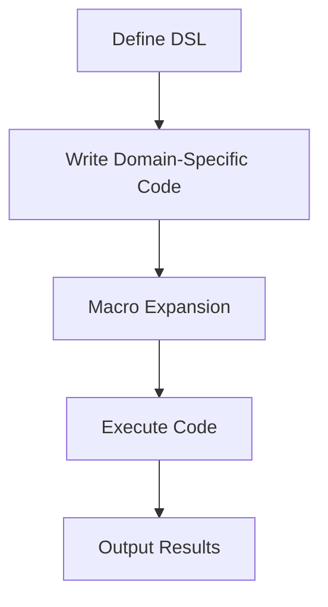

## 17.2.2 Advantages of Internal DSLs in Clojure

As experienced Java developers, you are likely familiar with the concept of Domain-Specific Languages (DSLs). These specialized languages are designed to solve problems within a specific domain, offering a more intuitive and expressive way to write code for particular tasks. In this section, we will explore the advantages of creating internal DSLs in Clojure, a language that excels in this area due to its flexible syntax and powerful macro system.

### Understanding Internal DSLs

Before diving into the advantages, let's clarify what an internal DSL is. An internal DSL is a domain-specific language that is embedded within a host language. Unlike external DSLs, which are standalone languages with their own syntax and parsers, internal DSLs leverage the syntax and semantics of the host language, allowing developers to write domain-specific code using familiar constructs.

### Why Clojure for Internal DSLs?

Clojure is particularly well-suited for creating internal DSLs for several reasons:

1. **Flexible Syntax**: Clojure's Lisp-based syntax is minimalistic and highly adaptable, making it easy to mold into domain-specific constructs.
2. **Powerful Macro System**: Clojure's macros allow developers to extend the language and create new syntactic constructs, enabling the creation of expressive DSLs.
3. **Homoiconicity**: In Clojure, code is data, and data is code. This property allows for seamless manipulation of code as data structures, facilitating the creation of DSLs.
4. **Functional Paradigm**: Clojure's functional programming model encourages immutability and composability, which are beneficial for designing clean and maintainable DSLs.

### Advantages of Internal DSLs in Clojure

#### 1. Enhanced Readability and Expressiveness

Internal DSLs in Clojure can significantly enhance the readability and expressiveness of code. By abstracting complex logic into domain-specific constructs, DSLs allow developers to write code that closely resembles the problem domain, making it easier to understand and maintain.

**Example: A Simple Testing DSL**

Consider a simple testing DSL in Clojure that allows developers to define tests in a more readable manner:

```clojure
(defmacro deftest [name & body]
  `(println "Running test:" ~name)
  (try
    ~@body
    (println "Test passed!")
    (catch Exception e
      (println "Test failed:" (.getMessage e)))))

(deftest "Addition Test"
  (assert (= (+ 1 1) 2)))
```

In this example, the `deftest` macro abstracts the boilerplate code for running tests, allowing developers to focus on the test logic itself. This enhances readability and makes the code more expressive.

#### 2. Simplified Syntax for Complex Operations

Clojure's macro system enables the creation of simplified syntax for complex operations. By defining domain-specific constructs, developers can reduce the cognitive load associated with understanding intricate logic.

**Example: A DSL for SQL Queries**

Let's create a simple DSL for constructing SQL queries:

```clojure
(defmacro select [fields table & conditions]
  `(str "SELECT " (clojure.string/join ", " ~fields)
        " FROM " ~table
        (when ~conditions
          (str " WHERE " (clojure.string/join " AND " ~conditions)))))

(select ["name" "age"] "users" ["age > 18" "active = true"])
;; Output: "SELECT name, age FROM users WHERE age > 18 AND active = true"
```

This DSL abstracts the complexity of SQL syntax, allowing developers to construct queries using a more intuitive and concise syntax.

#### 3. Code Reusability and Modularity

Internal DSLs promote code reusability and modularity by encapsulating domain-specific logic into reusable constructs. This reduces duplication and enhances maintainability.

**Example: A DSL for Workflow Automation**

Consider a DSL for defining workflows:

```clojure
(defmacro workflow [& steps]
  `(fn []
     (doseq [step ~steps]
       (println "Executing step:" step)
       (step))))

(defn step1 [] (println "Step 1"))
(defn step2 [] (println "Step 2"))

(def my-workflow (workflow step1 step2))

(my-workflow)
;; Output:
;; Executing step: step1
;; Step 1
;; Executing step: step2
;; Step 2
```

By encapsulating workflow logic into a DSL, developers can easily define and reuse workflows across different parts of an application.

#### 4. Seamless Integration with Existing Code

Internal DSLs in Clojure can seamlessly integrate with existing codebases, leveraging the host language's features and libraries. This allows developers to incrementally adopt DSLs without disrupting existing functionality.

**Example: Integrating a DSL with Java Code**

Clojure's interoperability with Java makes it easy to integrate DSLs with Java code. Consider a scenario where we use a Clojure DSL to configure a Java-based application:

```clojure
(defmacro configure [settings]
  `(doto (java.util.Properties.)
     ~@(map (fn [[k v]] `(setProperty ~k ~v)) settings)))

(def config (configure {"db.url" "jdbc:mysql://localhost:3306/mydb"
                        "db.user" "admin"
                        "db.password" "secret"}))

;; Use config in Java code
```

This DSL simplifies the configuration process, allowing developers to define settings in a more concise and readable manner.

#### 5. Encouraging Domain-Driven Design

Internal DSLs align well with domain-driven design principles, enabling developers to create abstractions that closely match the problem domain. This fosters a deeper understanding of the domain and encourages collaboration between developers and domain experts.

**Example: A DSL for Business Rules**

Consider a DSL for defining business rules:

```clojure
(defmacro rule [name & conditions]
  `(println "Evaluating rule:" ~name)
  (if (every? identity ~conditions)
    (println "Rule passed!")
    (println "Rule failed!")))

(rule "Eligibility Check"
  (> age 18)
  (= country "USA"))
```

This DSL allows domain experts to define business rules in a language that closely resembles the domain, facilitating collaboration and understanding.

### Comparing Clojure DSLs with Java

While Java is a powerful language, it lacks the flexibility and expressiveness of Clojure when it comes to creating internal DSLs. Let's compare the two approaches:

**Java Example: A Simple Testing Framework**

```java
public class TestFramework {
    public static void runTest(String name, Runnable test) {
        System.out.println("Running test: " + name);
        try {
            test.run();
            System.out.println("Test passed!");
        } catch (Exception e) {
            System.out.println("Test failed: " + e.getMessage());
        }
    }

    public static void main(String[] args) {
        runTest("Addition Test", () -> {
            assert (1 + 1) == 2;
        });
    }
}
```

While the Java example achieves the same functionality as the Clojure DSL, it requires more boilerplate code and lacks the expressiveness of Clojure's macro-based approach.

### Visualizing the Flow of Data in DSLs

Let's visualize how data flows through a Clojure DSL using a simple flowchart:



**Diagram Description**: This flowchart illustrates the process of defining a DSL in Clojure, writing domain-specific code, expanding macros, executing the code, and producing output results.

### Try It Yourself

To deepen your understanding of internal DSLs in Clojure, try modifying the examples provided:

- **Testing DSL**: Add more test cases and experiment with different assertions.
- **SQL DSL**: Extend the DSL to support additional SQL clauses, such as `ORDER BY` or `GROUP BY`.
- **Workflow DSL**: Create more complex workflows with conditional logic and branching.

### Exercises

1. **Create a DSL for Logging**: Design a simple DSL that allows developers to define logging levels and messages in a concise manner.
2. **Extend the SQL DSL**: Add support for `JOIN` operations and nested queries.
3. **Build a DSL for Data Validation**: Create a DSL that allows developers to define validation rules for data structures.

### Key Takeaways

- **Clojure's flexible syntax and powerful macro system make it ideal for creating internal DSLs**.
- **Internal DSLs enhance readability, expressiveness, and modularity**, making code easier to understand and maintain.
- **Clojure's interoperability with Java allows for seamless integration of DSLs with existing codebases**.
- **Internal DSLs align well with domain-driven design principles**, fostering collaboration between developers and domain experts.

By leveraging the advantages of internal DSLs in Clojure, you can create more intuitive and expressive code that closely aligns with the problem domain. Now that we've explored the benefits of internal DSLs, let's continue our journey into the world of metaprogramming and discover how Clojure's unique features can further enhance your development experience.

## Quiz: Mastering Internal DSLs in Clojure



### What is an internal DSL?

- [x] A domain-specific language embedded within a host language
- [ ] A standalone language with its own syntax and parser
- [ ] A language used exclusively for web development
- [ ] A language that cannot interact with other languages

> **Explanation:** An internal DSL is a domain-specific language embedded within a host language, leveraging its syntax and semantics.

### Which feature of Clojure makes it particularly well-suited for creating internal DSLs?

- [x] Powerful macro system
- [ ] Object-oriented programming
- [ ] Static typing
- [ ] Lack of concurrency support

> **Explanation:** Clojure's powerful macro system allows developers to extend the language and create new syntactic constructs, making it ideal for internal DSLs.

### How does Clojure's homoiconicity benefit internal DSL creation?

- [x] Allows seamless manipulation of code as data structures
- [ ] Enables static type checking
- [ ] Provides built-in support for object-oriented design
- [ ] Facilitates direct hardware access

> **Explanation:** Homoiconicity means code is data and data is code, allowing seamless manipulation of code as data structures, which is beneficial for DSL creation.

### What is a key advantage of using internal DSLs in Clojure?

- [x] Enhanced readability and expressiveness
- [ ] Increased code verbosity
- [ ] Reduced code reusability
- [ ] Limited integration with existing codebases

> **Explanation:** Internal DSLs enhance readability and expressiveness by abstracting complex logic into domain-specific constructs.

### How can internal DSLs promote code reusability?

- [x] By encapsulating domain-specific logic into reusable constructs
- [ ] By increasing code duplication
- [ ] By limiting the use of functions
- [ ] By enforcing strict typing

> **Explanation:** Internal DSLs encapsulate domain-specific logic into reusable constructs, reducing duplication and enhancing maintainability.

### What is a benefit of integrating Clojure DSLs with Java code?

- [x] Seamless integration with existing codebases
- [ ] Increased code complexity
- [ ] Limited access to Java libraries
- [ ] Reduced performance

> **Explanation:** Clojure's interoperability with Java allows for seamless integration of DSLs with existing codebases, leveraging Java's features and libraries.

### How do internal DSLs align with domain-driven design principles?

- [x] By creating abstractions that closely match the problem domain
- [ ] By enforcing strict type hierarchies
- [ ] By limiting the use of functional programming
- [ ] By focusing solely on performance optimization

> **Explanation:** Internal DSLs create abstractions that closely match the problem domain, fostering a deeper understanding and collaboration.

### What is a potential challenge when creating internal DSLs in Clojure?

- [x] Ensuring macro hygiene and avoiding variable capture
- [ ] Lack of support for functional programming
- [ ] Difficulty in integrating with Java
- [ ] Limited support for concurrency

> **Explanation:** Ensuring macro hygiene and avoiding variable capture can be a challenge when creating internal DSLs in Clojure.

### How can internal DSLs simplify complex operations?

- [x] By defining domain-specific constructs that reduce cognitive load
- [ ] By increasing the number of lines of code
- [ ] By enforcing strict typing
- [ ] By limiting the use of higher-order functions

> **Explanation:** Internal DSLs define domain-specific constructs that reduce the cognitive load associated with understanding intricate logic.

### True or False: Internal DSLs in Clojure can only be used for web development.

- [ ] True
- [x] False

> **Explanation:** Internal DSLs in Clojure can be used for a wide range of applications, not just web development.


