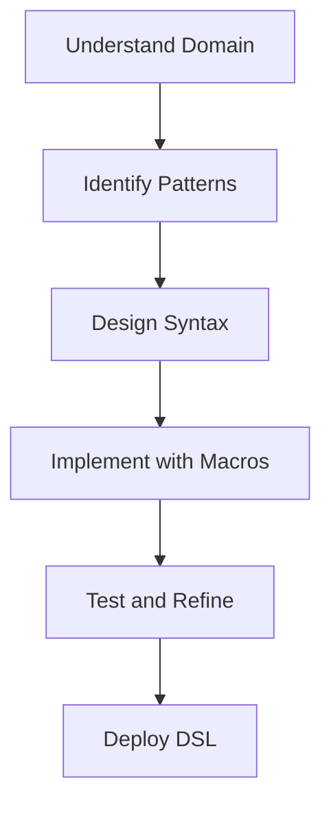

## 17.2.3 Designing an Internal DSL

Designing an internal Domain-Specific Language (DSL) in Clojure can be a powerful way to encapsulate complex logic and provide a more intuitive interface for specific problem domains. As experienced Java developers, you are already familiar with the concept of abstraction and encapsulation, which are crucial when designing DSLs. In this section, we will explore how to leverage Clojure's strengths to create expressive and efficient internal DSLs, drawing parallels to Java where applicable.

### Understanding the Domain

Before diving into the technical aspects of DSL design, it's essential to have a deep understanding of the domain you are targeting. A DSL should simplify the expression of domain-specific logic, making it more intuitive for domain experts to use.

#### Steps to Understand the Domain:

1. **Identify the Core Concepts**: Determine the key concepts and operations within the domain. For example, if you're designing a DSL for financial transactions, concepts might include accounts, transactions, and balances.

2. **Engage with Domain Experts**: Collaborate with domain experts to gather insights into the common tasks and challenges they face. This collaboration will help ensure that your DSL addresses real-world needs.

3. **Analyze Existing Solutions**: Look at existing solutions and tools within the domain to identify common patterns and shortcomings. This analysis can provide inspiration and highlight areas for improvement.

4. **Define the Scope**: Clearly define the scope of your DSL. Decide which aspects of the domain you want to cover and which you will leave out. A focused DSL is often more effective than a broad one.

### Identifying Common Patterns

Once you have a solid understanding of the domain, the next step is to identify common patterns that can be abstracted into your DSL. These patterns will form the building blocks of your language.

#### Common Patterns in DSL Design:

- **Repetitive Tasks**: Identify tasks that are performed frequently and can be abstracted into reusable components.
- **Complex Logic**: Simplify complex logic by encapsulating it within higher-level constructs.
- **Configuration and Setup**: Provide a concise way to configure and set up domain-specific components.

### Balancing Expressiveness and Complexity

A well-designed DSL strikes a balance between expressiveness and complexity. It should be expressive enough to capture the nuances of the domain while remaining simple enough for users to understand and use effectively.

#### Tips for Balancing Expressiveness and Complexity:

- **Use Clear Syntax**: Design the syntax of your DSL to be as clear and intuitive as possible. Avoid unnecessary complexity that can confuse users.
- **Provide Defaults**: Offer sensible defaults for common scenarios, allowing users to focus on the unique aspects of their tasks.
- **Encourage Composition**: Allow users to compose smaller components into larger, more complex operations. This approach promotes reuse and flexibility.

### Designing the DSL in Clojure

Clojure's strengths in metaprogramming and functional programming make it an excellent choice for designing internal DSLs. Let's explore how to leverage these features to create a powerful DSL.

#### Using Macros for DSL Design

Macros in Clojure allow you to extend the language by transforming code at compile time. This capability is particularly useful for DSL design, as it enables you to create new syntactic constructs that fit your domain.

```clojure
(defmacro deftransaction [name & body]
  `(defn ~name []
     (println "Starting transaction")
     ~@body
     (println "Ending transaction")))

;; Usage
(deftransaction my-transaction
  (println "Processing transaction")
  ;; Add domain-specific logic here
)
```

**Explanation**: The `deftransaction` macro defines a new transaction construct that prints messages before and after executing the transaction logic. This macro abstracts the boilerplate code, allowing users to focus on the transaction logic itself.

#### Leveraging Clojure's Functional Paradigm

Clojure's functional programming paradigm encourages the use of pure functions and immutable data structures. These features can enhance the reliability and maintainability of your DSL.

```clojure
(defn calculate-interest [balance rate]
  (* balance rate))

(defn apply-interest [account rate]
  (update account :balance calculate-interest rate))

;; Usage
(let [account {:balance 1000}]
  (apply-interest account 0.05))
```

**Explanation**: The `calculate-interest` function is a pure function that calculates interest based on a balance and rate. The `apply-interest` function uses `update` to apply this calculation to an account, demonstrating how functional programming can simplify domain logic.

### Comparing with Java

In Java, creating a DSL often involves using builder patterns or fluent interfaces. While these approaches can be effective, they can also lead to verbose and complex code. Clojure's macros and functional paradigm offer a more concise and expressive alternative.

#### Java Example: Fluent Interface

```java
public class TransactionBuilder {
    private StringBuilder log = new StringBuilder();

    public TransactionBuilder start() {
        log.append("Starting transaction\n");
        return this;
    }

    public TransactionBuilder process() {
        log.append("Processing transaction\n");
        return this;
    }

    public TransactionBuilder end() {
        log.append("Ending transaction\n");
        return this;
    }

    public String getLog() {
        return log.toString();
    }
}

// Usage
TransactionBuilder transaction = new TransactionBuilder();
transaction.start().process().end();
System.out.println(transaction.getLog());
```

**Comparison**: The Java example uses a fluent interface to build a transaction log. While effective, it requires more boilerplate code compared to the Clojure macro example, which achieves similar functionality with less code.

### Try It Yourself

Experiment with the Clojure examples provided by modifying the transaction logic or adding new domain-specific constructs. Consider how you might implement similar functionality in Java and compare the complexity and expressiveness of each approach.

### Diagrams and Visualizations

To further illustrate the flow of data and the structure of your DSL, consider using diagrams. Below is a simple flowchart representing the process of designing a DSL in Clojure.



**Diagram Description**: This flowchart outlines the steps involved in designing a DSL, from understanding the domain to deploying the final product.

### Exercises and Practice Problems

1. **Design a Simple DSL**: Choose a domain you are familiar with and design a simple DSL in Clojure. Focus on identifying key patterns and creating expressive syntax.

2. **Refactor Java Code**: Take a piece of Java code that uses a fluent interface or builder pattern and refactor it into a Clojure DSL. Compare the readability and expressiveness of both implementations.

3. **Extend the Transaction Macro**: Modify the `deftransaction` macro to include error handling or logging features. Consider how these additions impact the usability of the DSL.

### Key Takeaways

- Designing an internal DSL requires a deep understanding of the domain and the ability to identify common patterns.
- Clojure's macros and functional programming paradigm provide powerful tools for creating expressive and efficient DSLs.
- Balancing expressiveness and complexity is crucial to creating a DSL that is both powerful and easy to use.
- Comparing Clojure DSLs with Java's fluent interfaces highlights the advantages of Clojure's concise and expressive syntax.

By following these guidelines and leveraging Clojure's unique features, you can design internal DSLs that simplify complex domain logic and enhance the productivity of domain experts.

### Further Reading

- [Clojure Official Documentation](https://clojure.org/)
- [ClojureDocs](https://clojuredocs.org/)
- [DSL Design Patterns](https://martinfowler.com/books/dsl.html) by Martin Fowler

## Quiz: Designing an Internal DSL in Clojure



### What is the primary goal of designing an internal DSL?

- [x] To simplify the expression of domain-specific logic
- [ ] To replace all existing programming languages
- [ ] To make code more complex
- [ ] To eliminate the need for domain experts

> **Explanation:** The primary goal of an internal DSL is to simplify the expression of domain-specific logic, making it more intuitive for domain experts.

### Which Clojure feature is particularly useful for DSL design?

- [x] Macros
- [ ] Interfaces
- [ ] Inheritance
- [ ] Annotations

> **Explanation:** Macros in Clojure allow you to extend the language by transforming code at compile time, making them particularly useful for DSL design.

### What is a key advantage of using Clojure for DSL design compared to Java?

- [x] Concise and expressive syntax
- [ ] Strong typing
- [ ] Object-oriented design
- [ ] Extensive use of annotations

> **Explanation:** Clojure's concise and expressive syntax, enabled by its functional paradigm and macros, is a key advantage over Java for DSL design.

### What should be the first step in designing a DSL?

- [x] Understanding the domain
- [ ] Writing code
- [ ] Choosing a programming language
- [ ] Defining error handling

> **Explanation:** Understanding the domain is the first step in designing a DSL, as it ensures the language addresses real-world needs.

### How can Clojure's functional paradigm enhance DSL design?

- [x] By promoting the use of pure functions and immutable data structures
- [ ] By encouraging the use of global variables
- [ ] By requiring extensive use of loops
- [ ] By focusing on object-oriented principles

> **Explanation:** Clojure's functional paradigm enhances DSL design by promoting the use of pure functions and immutable data structures, leading to more reliable and maintainable code.

### What is a common pattern to abstract in a DSL?

- [x] Repetitive tasks
- [ ] Rarely used features
- [ ] Complex algorithms
- [ ] Low-level system calls

> **Explanation:** Repetitive tasks are common patterns to abstract in a DSL, as they can be encapsulated into reusable components.

### What is the role of macros in Clojure DSL design?

- [x] To create new syntactic constructs
- [ ] To manage memory allocation
- [ ] To enforce type safety
- [ ] To handle exceptions

> **Explanation:** Macros in Clojure are used to create new syntactic constructs, allowing for the extension of the language to fit specific domains.

### What is a benefit of providing defaults in a DSL?

- [x] It allows users to focus on unique aspects of their tasks
- [ ] It increases the complexity of the language
- [ ] It requires more boilerplate code
- [ ] It limits the flexibility of the language

> **Explanation:** Providing defaults in a DSL allows users to focus on the unique aspects of their tasks, simplifying the language's use.

### How does Clojure's macro system compare to Java's reflection API?

- [x] Macros allow compile-time code transformation, while reflection is runtime
- [ ] Both are used for runtime code modification
- [ ] Reflection is more efficient than macros
- [ ] Macros are less flexible than reflection

> **Explanation:** Clojure's macros allow for compile-time code transformation, providing a more efficient and flexible way to extend the language compared to Java's runtime reflection.

### True or False: A well-designed DSL should be as complex as possible to cover all potential use cases.

- [ ] True
- [x] False

> **Explanation:** A well-designed DSL should balance expressiveness and complexity, focusing on being powerful yet easy to use, rather than covering all potential use cases.


