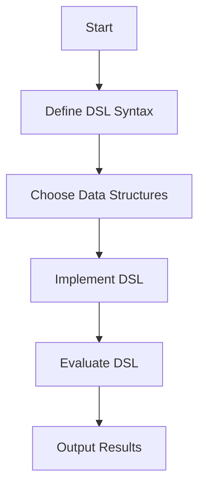

## 17.3.1 Representing DSL Syntax

In this section, we'll explore how to represent Domain-Specific Language (DSL) syntax using Clojure's powerful data structures. We'll delve into the design principles that make a DSL intuitive and effective for end-users, leveraging the unique features of Clojure to create expressive and concise syntax.

### Introduction to DSLs

Domain-Specific Languages (DSLs) are specialized mini-languages tailored to a specific application domain. Unlike general-purpose programming languages, DSLs are designed to express domain concepts in a way that is both natural and efficient for domain experts. In Clojure, DSLs can be represented using the language's inherent data structures, such as lists, vectors, and maps, which offer a flexible and expressive way to define syntax.

#### Why Use DSLs?

- **Expressiveness**: DSLs allow domain experts to express complex ideas succinctly.
- **Readability**: Well-designed DSLs are often more readable than general-purpose code.
- **Maintainability**: DSLs can simplify code maintenance by abstracting complex logic into higher-level constructs.

### Clojure Data Structures for DSL Syntax

Clojure's data structures are ideal for representing DSL syntax due to their simplicity and flexibility. Let's explore how each of these structures can be used to design intuitive DSLs.

#### Lists

Lists in Clojure are ordered collections that are often used to represent code and expressions. They are particularly useful for defining the syntax of DSLs that resemble traditional programming constructs.

```clojure
;; Example of a simple DSL for arithmetic operations
(def arithmetic-dsl
  '(add 1 2 (subtract 4 3)))

;; Evaluating the DSL
(eval arithmetic-dsl) ; => 4
```

**Key Points:**
- Lists are ideal for representing sequences of operations or commands.
- They naturally align with Clojure's Lisp heritage, where code is data.

#### Vectors

Vectors are ordered collections similar to lists but offer efficient random access. They are suitable for representing fixed-size collections or sequences where order matters but performance is a concern.

```clojure
;; Example of a DSL for defining a workflow
(def workflow-dsl
  [:start
   [:step "Initialize" :init]
   [:step "Process" :process]
   [:step "Finalize" :finalize]])

;; Processing the workflow
(map #(println "Executing step:" %) workflow-dsl)
```

**Key Points:**
- Vectors provide a clear, concise way to represent ordered data.
- They are often used in DSLs where performance and order are important.

#### Maps

Maps are key-value pairs that are perfect for representing structured data. They are particularly useful in DSLs that require configuration or settings.

```clojure
;; Example of a DSL for configuring a server
(def server-config-dsl
  {:host "localhost"
   :port 8080
   :routes ["/home" "/about" "/contact"]})

;; Accessing configuration
(get server-config-dsl :host) ; => "localhost"
```

**Key Points:**
- Maps are excellent for representing configurations and settings.
- They provide an intuitive way to access and modify data.

### Designing Intuitive DSL Syntax

Designing a DSL involves more than just choosing the right data structures. It's about creating a language that is intuitive and easy to use for the end-user. Here are some principles to consider:

#### Clarity and Simplicity

- **Use Descriptive Names**: Choose names that clearly convey the purpose of each element in the DSL.
- **Minimize Complexity**: Avoid unnecessary complexity by focusing on the core functionality.

#### Consistency

- **Consistent Syntax**: Ensure that similar operations have similar syntax to reduce cognitive load.
- **Predictable Behavior**: Users should be able to predict the outcome of using the DSL based on its syntax.

#### Flexibility

- **Extensible Design**: Allow users to extend the DSL with custom functionality.
- **Adaptability**: Design the DSL to accommodate changes in the domain.

### Code Examples and Exercises

Let's put these principles into practice with some code examples and exercises.

#### Example: A Simple DSL for Task Management

We'll create a DSL for managing tasks, using Clojure's data structures to represent tasks and their attributes.

```clojure
;; Define a task using a map
(def task-dsl
  {:title "Write DSL Guide"
   :due-date "2024-12-01"
   :priority :high
   :status :in-progress})

;; Function to display task details
(defn display-task [task]
  (println "Task:" (:title task))
  (println "Due Date:" (:due-date task))
  (println "Priority:" (:priority task))
  (println "Status:" (:status task)))

;; Display the task
(display-task task-dsl)
```

**Exercise:**
- Modify the `task-dsl` to include a list of subtasks.
- Add a function to update the status of a task.

#### Example: A DSL for Defining Mathematical Expressions

We'll create a DSL for defining and evaluating mathematical expressions using lists.

```clojure
;; Define a mathematical expression
(def math-dsl
  '(+ 1 (* 2 3) (- 4 2)))

;; Evaluate the expression
(eval math-dsl) ; => 7
```

**Exercise:**
- Extend the `math-dsl` to include division and exponentiation.
- Create a function to pretty-print the expression.

### Visualizing DSL Syntax with Diagrams

To better understand how DSLs are structured, let's use a diagram to represent the flow of data through a DSL.



**Diagram Description:**
This flowchart illustrates the process of designing and implementing a DSL in Clojure. It begins with defining the DSL syntax, choosing appropriate data structures, implementing the DSL, evaluating it, and finally outputting the results.

### Comparing Clojure DSLs with Java

In Java, creating a DSL often involves using classes and interfaces to define the language's syntax. This can lead to more verbose and less flexible code compared to Clojure's approach.

**Java Example:**

```java
// Java DSL for arithmetic operations
public interface ArithmeticOperation {
    int evaluate();
}

public class Add implements ArithmeticOperation {
    private final int a, b;

    public Add(int a, int b) {
        this.a = a;
        this.b = b;
    }

    @Override
    public int evaluate() {
        return a + b;
    }
}

// Usage
ArithmeticOperation operation = new Add(1, 2);
System.out.println(operation.evaluate()); // Output: 3
```

**Comparison:**
- **Clojure**: Uses data structures to represent syntax, leading to concise and flexible code.
- **Java**: Relies on classes and interfaces, which can be more verbose and rigid.

### Try It Yourself

Encourage experimentation by suggesting modifications to the code examples:

- **Modify the Task DSL**: Add new attributes such as `assignee` or `tags`.
- **Extend the Math DSL**: Implement support for trigonometric functions.
- **Create a New DSL**: Design a DSL for a different domain, such as a simple query language.

### Further Reading

For more information on DSLs and Clojure, consider exploring the following resources:

- [Official Clojure Documentation](https://clojure.org/)
- [ClojureDocs](https://clojuredocs.org/)
- [GitHub - Clojure DSL Examples](https://github.com/search?q=clojure+dsl)

### Summary and Key Takeaways

In this section, we've explored how to represent DSL syntax using Clojure's data structures. By leveraging lists, vectors, and maps, we can create intuitive and expressive DSLs that are easy to use and maintain. We've also compared Clojure's approach to Java, highlighting the benefits of using Clojure for DSL design.

**Key Takeaways:**
- Clojure's data structures provide a flexible foundation for DSL syntax.
- Designing intuitive DSLs involves clarity, consistency, and flexibility.
- Clojure's approach to DSLs is often more concise and expressive than Java's.

### Exercises and Practice Problems

1. **Create a DSL for a To-Do List Application**: Design a DSL that allows users to define tasks, set priorities, and mark tasks as complete.
2. **Implement a DSL for a Simple Game**: Create a DSL that defines game rules, player actions, and scoring.
3. **Design a DSL for Data Transformation**: Build a DSL that allows users to define data transformation pipelines.

By engaging with these exercises, you'll deepen your understanding of DSL design and Clojure's capabilities.

## Quiz: Mastering DSL Syntax Representation in Clojure



### What is a key advantage of using DSLs?

- [x] They allow domain experts to express complex ideas succinctly.
- [ ] They are always faster than general-purpose languages.
- [ ] They require less memory than other languages.
- [ ] They eliminate the need for testing.

> **Explanation:** DSLs are designed to express domain-specific concepts succinctly, making them accessible to domain experts.

### Which Clojure data structure is ideal for representing ordered collections?

- [ ] Maps
- [x] Vectors
- [ ] Sets
- [ ] Strings

> **Explanation:** Vectors are ordered collections that provide efficient random access, making them ideal for representing ordered data.

### What is a common use case for maps in DSLs?

- [ ] Representing sequences of operations
- [ ] Representing fixed-size collections
- [x] Representing configurations and settings
- [ ] Representing unordered collections

> **Explanation:** Maps are key-value pairs that are perfect for representing structured data, such as configurations and settings.

### How does Clojure's approach to DSLs compare to Java's?

- [x] Clojure uses data structures, leading to concise and flexible code.
- [ ] Clojure relies on classes and interfaces, which can be more verbose.
- [ ] Java uses data structures, leading to concise and flexible code.
- [ ] Java does not support DSLs.

> **Explanation:** Clojure's use of data structures allows for concise and flexible DSLs, whereas Java often relies on classes and interfaces.

### What principle is important when designing intuitive DSL syntax?

- [x] Clarity and simplicity
- [ ] Complexity and abstraction
- [ ] Inconsistency
- [ ] Verbosity

> **Explanation:** Clarity and simplicity are crucial for designing intuitive DSL syntax that is easy to understand and use.

### Which Clojure data structure is often used for representing code and expressions?

- [x] Lists
- [ ] Maps
- [ ] Vectors
- [ ] Sets

> **Explanation:** Lists in Clojure are ordered collections that are often used to represent code and expressions.

### What is a benefit of using Clojure's data structures for DSL syntax?

- [x] They provide a flexible and expressive way to define syntax.
- [ ] They are limited to small data sets.
- [ ] They require complex parsing algorithms.
- [ ] They are only suitable for mathematical operations.

> **Explanation:** Clojure's data structures offer flexibility and expressiveness, making them ideal for defining DSL syntax.

### What is an example of a DSL use case?

- [ ] Operating system development
- [x] Task management
- [ ] Low-level hardware programming
- [ ] Network protocol design

> **Explanation:** DSLs are often used in specific domains, such as task management, where they can simplify complex logic.

### How can you extend a DSL in Clojure?

- [x] By adding custom functionality
- [ ] By rewriting the entire language
- [ ] By using only built-in functions
- [ ] By avoiding changes

> **Explanation:** DSLs in Clojure can be extended by adding custom functionality, allowing them to adapt to changing domain needs.

### True or False: Clojure's DSLs are always more efficient than Java's.

- [ ] True
- [x] False

> **Explanation:** While Clojure's DSLs are often more concise and expressive, efficiency depends on the specific use case and implementation.


