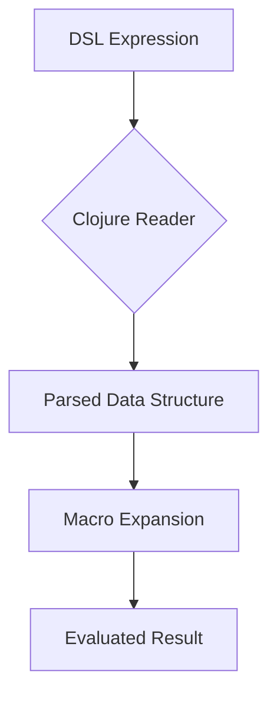

## 17.3.2 Parsing DSL Constructs

In this section, we delve into the art of parsing Domain-Specific Language (DSL) constructs using Clojure. As experienced Java developers, you might be familiar with the complexities of parsing in Java, often requiring external libraries or frameworks. In contrast, Clojure's Lisp heritage and homoiconicity make it particularly well-suited for creating and parsing internal DSLs with minimal overhead. Let's explore how Clojure's unique features simplify the parsing process and how you can leverage them to build powerful DSLs.

### Understanding DSLs in Clojure

A **Domain-Specific Language (DSL)** is a specialized language tailored to a specific application domain. In Clojure, DSLs often take advantage of the language's syntax and semantics, allowing developers to write expressive code that closely resembles natural language or domain concepts.

#### Internal vs. External DSLs

- **Internal DSLs**: These are embedded within a host language, utilizing its syntax and semantics. In Clojure, internal DSLs are common due to the language's flexibility and expressiveness.
- **External DSLs**: These are standalone languages that require separate parsing and interpretation. They are less common in Clojure due to the additional complexity involved.

### The Power of Homoiconicity

Clojure's **homoiconicity**—the property that code and data share the same representation—enables developers to treat code as data. This feature simplifies the creation and parsing of DSLs, as DSL constructs can be represented as Clojure data structures (e.g., lists, vectors, maps).

### Minimal Parsing with Clojure Syntax

In Clojure, parsing internal DSLs often involves minimal effort because the DSL is expressed using Clojure's syntax. This means that the Clojure reader can directly interpret DSL constructs, reducing the need for complex parsing logic.

#### Example: A Simple Arithmetic DSL

Let's consider a simple arithmetic DSL that allows users to express mathematical operations in a more readable format:

```clojure
(defn evaluate [expr]
  (cond
    (number? expr) expr
    (list? expr)
    (let [[op & args] expr]
      (case op
        '+ (apply + (map evaluate args))
        '- (apply - (map evaluate args))
        '* (apply * (map evaluate args))
        '/ (apply / (map evaluate args))
        (throw (IllegalArgumentException. "Unknown operation"))))
    :else (throw (IllegalArgumentException. "Invalid expression"))))

;; Example usage
(evaluate '(+ 1 2 (* 3 4))) ; => 15
```

**Explanation**: In this example, the DSL is expressed using Clojure's list syntax, and the `evaluate` function parses and evaluates the expression. The use of `cond` and `case` simplifies the parsing logic, leveraging Clojure's built-in capabilities.

### Parsing Techniques in Clojure

While internal DSLs require minimal parsing, there are scenarios where more complex parsing is necessary. Let's explore some techniques for parsing DSL constructs in Clojure.

#### Using Macros for Parsing

Macros in Clojure allow you to transform code at compile time, making them a powerful tool for parsing DSL constructs. By using macros, you can define custom syntax and transform it into standard Clojure code.

**Example: A Custom Control Structure**

```clojure
(defmacro unless [condition & body]
  `(if (not ~condition)
     (do ~@body)))

;; Example usage
(unless false
  (println "This will print because the condition is false."))
```

**Explanation**: The `unless` macro provides a custom control structure that executes the body if the condition is false. The macro transforms the `unless` syntax into an `if` expression, demonstrating how macros can parse and transform DSL constructs.

#### Parsing with Reader Macros

Reader macros extend the Clojure reader, allowing you to define custom syntax at the reader level. This technique is useful for creating DSLs with unique syntactic elements.

**Example: A Custom Literal**

```clojure
(defn parse-custom-literal [s]
  (str "Parsed: " s))

(defmacro custom-literal [s]
  `(parse-custom-literal ~s))

;; Example usage
(custom-literal "example") ; => "Parsed: example"
```

**Explanation**: The `custom-literal` macro parses a custom literal syntax, demonstrating how reader macros can be used to extend Clojure's syntax for DSLs.

### Comparing Parsing in Clojure and Java

In Java, parsing often involves using libraries like ANTLR or JavaCC to define grammars and generate parsers. This process can be complex and time-consuming. In contrast, Clojure's syntax and macros simplify parsing, allowing developers to focus on the DSL's semantics rather than its syntax.

#### Java Example: Parsing Arithmetic Expressions

```java
import java.util.Stack;

public class ArithmeticParser {
    public static int evaluate(String expr) {
        Stack<Integer> stack = new Stack<>();
        String[] tokens = expr.split(" ");
        for (String token : tokens) {
            switch (token) {
                case "+":
                    stack.push(stack.pop() + stack.pop());
                    break;
                case "-":
                    stack.push(-stack.pop() + stack.pop());
                    break;
                case "*":
                    stack.push(stack.pop() * stack.pop());
                    break;
                case "/":
                    int divisor = stack.pop();
                    stack.push(stack.pop() / divisor);
                    break;
                default:
                    stack.push(Integer.parseInt(token));
            }
        }
        return stack.pop();
    }

    public static void main(String[] args) {
        System.out.println(evaluate("3 4 + 2 *")); // => 14
    }
}
```

**Explanation**: This Java example uses a stack-based approach to parse and evaluate arithmetic expressions. The complexity of managing tokens and operations contrasts with Clojure's concise and expressive syntax.

### Try It Yourself

To deepen your understanding, try modifying the Clojure examples:

- **Extend the Arithmetic DSL**: Add support for additional operations, such as exponentiation or modulus.
- **Create a New DSL**: Design a DSL for a different domain, such as configuration management or data querying.
- **Experiment with Macros**: Write a macro that transforms a custom syntax into a Clojure data structure.

### Diagrams and Visualizations

To better understand the flow of data through DSL parsing in Clojure, consider the following diagram:



**Diagram Explanation**: This flowchart illustrates the process of parsing a DSL expression in Clojure. The expression is read by the Clojure reader, transformed into a data structure, expanded by macros, and finally evaluated to produce a result.

### Exercises

1. **Extend the Arithmetic DSL**: Implement additional operations and test them with various expressions.
2. **Create a Configuration DSL**: Design a DSL for managing application configurations and implement a parser for it.
3. **Macro Challenge**: Write a macro that transforms a custom syntax into a Clojure function call.

### Key Takeaways

- **Clojure's Syntax**: Leverage Clojure's syntax and homoiconicity to create expressive internal DSLs with minimal parsing.
- **Macros**: Use macros to transform custom DSL syntax into standard Clojure code.
- **Comparison with Java**: Appreciate the simplicity and expressiveness of Clojure's parsing capabilities compared to Java's more complex parsing processes.

By mastering these techniques, you'll be well-equipped to create powerful DSLs in Clojure, enhancing your applications' expressiveness and maintainability.

### Further Reading

- [Clojure Macros](https://clojure.org/reference/macros)
- [Clojure Reader](https://clojure.org/reference/reader)
- [JavaCC](https://javacc.github.io/javacc/)
- [ANTLR](https://www.antlr.org/)

## Quiz: Mastering DSL Parsing in Clojure



### What is a key advantage of using Clojure for internal DSLs?

- [x] Minimal parsing due to Clojure's syntax
- [ ] Requires external libraries for parsing
- [ ] Complex grammar definitions
- [ ] Limited expressiveness

> **Explanation:** Clojure's syntax allows for minimal parsing, making it ideal for internal DSLs.

### How does Clojure's homoiconicity benefit DSL creation?

- [x] Code and data share the same representation
- [ ] Requires complex parsing logic
- [ ] Limits the use of macros
- [ ] Increases code verbosity

> **Explanation:** Homoiconicity allows code to be treated as data, simplifying DSL creation.

### Which Clojure feature allows code transformation at compile time?

- [x] Macros
- [ ] Functions
- [ ] Atoms
- [ ] Agents

> **Explanation:** Macros enable code transformation at compile time, useful for DSLs.

### What is the role of reader macros in Clojure?

- [x] Extend the Clojure reader with custom syntax
- [ ] Execute code at runtime
- [ ] Manage state changes
- [ ] Handle concurrency

> **Explanation:** Reader macros allow custom syntax extensions at the reader level.

### In the arithmetic DSL example, what does the `evaluate` function do?

- [x] Parses and evaluates arithmetic expressions
- [ ] Compiles Clojure code
- [ ] Manages state transitions
- [ ] Handles concurrency

> **Explanation:** The `evaluate` function parses and evaluates arithmetic expressions in the DSL.

### How do macros simplify DSL parsing in Clojure?

- [x] Transform custom syntax into standard Clojure code
- [ ] Require external parsing libraries
- [ ] Increase code complexity
- [ ] Limit expressiveness

> **Explanation:** Macros transform custom syntax into standard Clojure code, simplifying parsing.

### What is a common approach to parsing DSLs in Java?

- [x] Using libraries like ANTLR or JavaCC
- [ ] Leveraging Java's native syntax
- [ ] Utilizing macros
- [ ] Employing reader macros

> **Explanation:** Java often uses libraries like ANTLR or JavaCC for parsing DSLs.

### What does the flowchart in the article illustrate?

- [x] The process of parsing a DSL expression in Clojure
- [ ] The lifecycle of a Java application
- [ ] The structure of a Clojure project
- [ ] The syntax of a Java class

> **Explanation:** The flowchart illustrates the process of parsing a DSL expression in Clojure.

### How can you extend the arithmetic DSL example?

- [x] Add support for additional operations
- [ ] Use Java libraries for parsing
- [ ] Remove macros
- [ ] Limit the number of operations

> **Explanation:** You can extend the DSL by adding support for additional operations.

### True or False: Clojure's macros can only be used for parsing DSLs.

- [ ] True
- [x] False

> **Explanation:** Clojure's macros can be used for various purposes, not just parsing DSLs.


