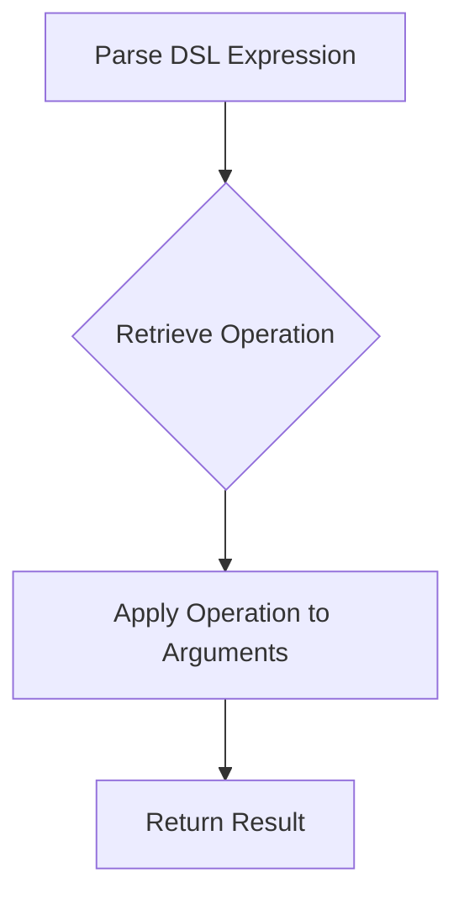

## 17.3.3 Interpreting and Executing DSL Code

In this section, we will explore how to interpret and execute Domain-Specific Language (DSL) code in Clojure. As experienced Java developers, you are likely familiar with the concept of DSLs, which are specialized mini-languages tailored to specific problem domains. Clojure, with its powerful metaprogramming capabilities, offers a unique and efficient way to create and execute DSLs. We will delve into the process of interpreting DSL structures and executing corresponding actions, providing you with practical examples and insights.

### Understanding DSLs in Clojure

DSLs are designed to express solutions in a language that is closer to the problem domain than general-purpose programming languages. In Clojure, DSLs can be implemented using macros, functions, and data structures. The language's homoiconicity—where code is represented as data—makes it particularly well-suited for DSL creation and execution.

#### Key Concepts

- **Homoiconicity**: Clojure code is data, which allows for seamless manipulation and transformation of code structures.
- **Macros**: These are powerful tools in Clojure that enable code generation and transformation at compile-time.
- **Data Structures**: Clojure's immutable data structures are used to represent DSL code, making it easy to parse and execute.

### Interpreting DSL Code

Interpreting DSL code involves parsing the DSL structures and mapping them to corresponding actions or functions. This process can be broken down into several steps:

1. **Parsing the DSL**: Convert the DSL code into a data structure that can be easily manipulated.
2. **Mapping to Functions**: Associate DSL constructs with corresponding Clojure functions or macros.
3. **Executing the Code**: Evaluate the parsed DSL data structure to perform the desired actions.

#### Example: A Simple Arithmetic DSL

Let's create a simple arithmetic DSL in Clojure that can interpret and execute basic arithmetic operations.

```clojure
;; Define a DSL for arithmetic operations
(def arithmetic-dsl
  {:add +, :subtract -, :multiply *, :divide /})

;; Function to interpret and execute the DSL
(defn execute-dsl [dsl-expr]
  (let [[op & args] dsl-expr
        operation (get arithmetic-dsl op)]
    (apply operation args)))

;; Example usage
(execute-dsl [:add 10 5])       ;; => 15
(execute-dsl [:subtract 10 5])  ;; => 5
(execute-dsl [:multiply 10 5])  ;; => 50
(execute-dsl [:divide 10 5])    ;; => 2
```

**Explanation**: In this example, we define a simple DSL for arithmetic operations using a map that associates keywords with Clojure's arithmetic functions. The `execute-dsl` function parses the DSL expression, retrieves the corresponding function, and applies it to the arguments.

### Executing DSL Code with Macros

Macros in Clojure allow us to transform DSL code at compile-time, providing a powerful mechanism for code generation and execution.

#### Example: A Conditional DSL with Macros

Let's extend our DSL to include conditional logic using macros.

```clojure
;; Define a macro for conditional execution
(defmacro if-dsl [condition then-expr else-expr]
  `(if ~condition
     ~then-expr
     ~else-expr))

;; Example usage
(if-dsl true
  (println "Condition is true")
  (println "Condition is false"))
```

**Explanation**: The `if-dsl` macro takes a condition and two expressions. It expands into a standard `if` expression, allowing us to incorporate conditional logic into our DSL.

### Comparing with Java

In Java, implementing a DSL typically involves creating a parser and an interpreter, often using libraries like ANTLR. Clojure's approach is more straightforward due to its homoiconicity and macro system.

#### Java Example: Arithmetic DSL

```java
import java.util.HashMap;
import java.util.Map;
import java.util.function.BiFunction;

public class ArithmeticDSL {
    private static final Map<String, BiFunction<Integer, Integer, Integer>> operations = new HashMap<>();

    static {
        operations.put("add", (a, b) -> a + b);
        operations.put("subtract", (a, b) -> a - b);
        operations.put("multiply", (a, b) -> a * b);
        operations.put("divide", (a, b) -> a / b);
    }

    public static int execute(String operation, int a, int b) {
        return operations.get(operation).apply(a, b);
    }

    public static void main(String[] args) {
        System.out.println(execute("add", 10, 5));       // 15
        System.out.println(execute("subtract", 10, 5));  // 5
        System.out.println(execute("multiply", 10, 5));  // 50
        System.out.println(execute("divide", 10, 5));    // 2
    }
}
```

**Comparison**: In Java, we use a `Map` to associate strings with lambda expressions for arithmetic operations. The Clojure version is more concise and leverages the language's strengths in handling code as data.

### Advanced DSL Execution Techniques

As we delve deeper into DSL execution, we can explore more advanced techniques such as:

- **Lazy Evaluation**: Delaying the execution of DSL expressions until their results are needed.
- **Error Handling**: Implementing robust error handling mechanisms to manage invalid DSL expressions.
- **State Management**: Managing state within DSL execution, particularly for stateful operations.

#### Lazy Evaluation Example

```clojure
;; Define a lazy arithmetic DSL
(defn lazy-execute-dsl [dsl-expr]
  (lazy-seq
   (let [[op & args] dsl-expr
         operation (get arithmetic-dsl op)]
     (apply operation args))))

;; Example usage
(first (lazy-execute-dsl [:add 10 5]))  ;; => 15
```

**Explanation**: The `lazy-execute-dsl` function uses `lazy-seq` to delay the execution of the DSL expression until its result is needed.

### Try It Yourself

Experiment with the following modifications to the DSL examples:

- Extend the arithmetic DSL to include more operations, such as modulus or exponentiation.
- Implement a DSL for string manipulation, including operations like concatenation and substring.
- Create a macro-based DSL for defining and executing simple workflows or state machines.

### Diagrams and Visualizations

To better understand the flow of data through our DSL execution, let's visualize the process using a flowchart.



**Diagram Explanation**: This flowchart illustrates the process of interpreting and executing a DSL expression in Clojure. We parse the expression, retrieve the corresponding operation, apply it to the arguments, and return the result.

### Further Reading

For more information on Clojure and DSLs, consider exploring the following resources:

- [Official Clojure Documentation](https://clojure.org/reference/documentation)
- [ClojureDocs](https://clojuredocs.org/)
- [GitHub: Clojure DSL Examples](https://github.com/search?q=clojure+dsl)

### Exercises

1. **Extend the Arithmetic DSL**: Add support for additional operations, such as power and modulus.
2. **Implement a String DSL**: Create a DSL for string operations, including concatenation, splitting, and trimming.
3. **Error Handling**: Enhance the DSL interpreter to handle invalid operations gracefully.

### Key Takeaways

- Clojure's homoiconicity and macro system make it an excellent choice for implementing and executing DSLs.
- Interpreting DSL code involves parsing the DSL structures and mapping them to corresponding actions.
- Macros provide a powerful mechanism for transforming and executing DSL code at compile-time.
- Clojure's approach to DSLs is more concise and expressive compared to traditional Java implementations.

By mastering the interpretation and execution of DSL code in Clojure, you can create powerful, domain-specific solutions that leverage the full potential of the language.

## Quiz: Mastering DSL Interpretation and Execution in Clojure



### What is a key advantage of using Clojure for DSL implementation?

- [x] Homoiconicity allows code to be represented as data.
- [ ] Clojure has built-in support for all possible DSLs.
- [ ] Clojure automatically optimizes DSL execution.
- [ ] Clojure requires no setup for DSLs.

> **Explanation:** Clojure's homoiconicity allows code to be represented as data, making it easier to manipulate and transform DSL code.

### How does Clojure's macro system benefit DSL execution?

- [x] It allows code transformation at compile-time.
- [ ] It provides runtime error handling for DSLs.
- [ ] It automatically generates DSL documentation.
- [ ] It simplifies the creation of user interfaces.

> **Explanation:** Clojure's macro system allows for code transformation at compile-time, enabling powerful DSL execution capabilities.

### In the provided arithmetic DSL example, what does the `execute-dsl` function do?

- [x] Parses the DSL expression and applies the corresponding operation.
- [ ] Compiles the DSL into Java bytecode.
- [ ] Automatically optimizes arithmetic operations.
- [ ] Translates the DSL into SQL queries.

> **Explanation:** The `execute-dsl` function parses the DSL expression and applies the corresponding operation to the arguments.

### What is the purpose of the `if-dsl` macro in the conditional DSL example?

- [x] To expand into a standard `if` expression.
- [ ] To compile DSL code into machine language.
- [ ] To handle exceptions in DSL execution.
- [ ] To generate user interface components.

> **Explanation:** The `if-dsl` macro expands into a standard `if` expression, allowing conditional logic in the DSL.

### How does lazy evaluation benefit DSL execution?

- [x] It delays execution until the result is needed.
- [ ] It automatically optimizes all DSL operations.
- [ ] It provides built-in error handling.
- [ ] It simplifies the DSL syntax.

> **Explanation:** Lazy evaluation delays execution until the result is needed, which can improve performance and efficiency.

### What is a common approach to error handling in DSL execution?

- [x] Implementing robust error handling mechanisms.
- [ ] Ignoring errors to simplify execution.
- [ ] Automatically retrying failed operations.
- [ ] Compiling DSL code into Java for error handling.

> **Explanation:** Implementing robust error handling mechanisms is a common approach to managing invalid DSL expressions.

### How does the Clojure approach to DSLs compare to Java?

- [x] Clojure is more concise and leverages code-as-data.
- [ ] Java provides more built-in DSL support.
- [ ] Java is more efficient for DSL execution.
- [ ] Clojure requires more boilerplate code.

> **Explanation:** Clojure's approach to DSLs is more concise and leverages the code-as-data paradigm, making it more expressive.

### What is the role of macros in Clojure DSLs?

- [x] To transform and execute DSL code at compile-time.
- [ ] To handle runtime exceptions in DSLs.
- [ ] To generate user interfaces for DSLs.
- [ ] To optimize DSL code for performance.

> **Explanation:** Macros transform and execute DSL code at compile-time, providing powerful capabilities for DSLs.

### What is a benefit of using Clojure's immutable data structures in DSLs?

- [x] They simplify parsing and execution.
- [ ] They automatically optimize DSL performance.
- [ ] They provide built-in error handling.
- [ ] They require no additional setup.

> **Explanation:** Clojure's immutable data structures simplify parsing and execution, making DSL implementation more straightforward.

### True or False: Clojure's DSL implementation is more complex than Java's.

- [ ] True
- [x] False

> **Explanation:** Clojure's DSL implementation is generally more concise and expressive than Java's, thanks to its homoiconicity and macro system.


