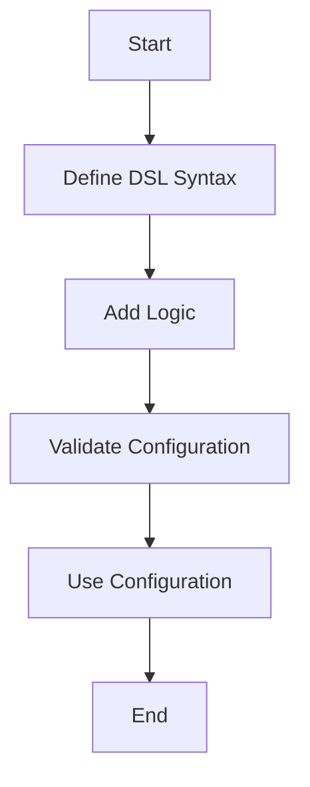

## 17.4.1 Configuration Languages

In the world of software development, configuration files play a crucial role in defining the behavior of applications without altering the source code. Traditionally, formats like XML and JSON have been used for configuration purposes. However, these formats can be verbose and lack the expressive power needed for more complex configurations. This is where Domain-Specific Languages (DSLs) in Clojure come into play, offering a more powerful and flexible alternative.

### Understanding Configuration Languages

Configuration languages are specialized languages designed to define settings and parameters for software applications. They allow developers to separate configuration from code, making applications more adaptable and easier to manage. While XML and JSON are widely used, they have limitations in terms of expressiveness and ease of use.

#### Limitations of Traditional Formats

- **Verbosity**: XML, in particular, is known for its verbosity, which can make configuration files cumbersome to read and write.
- **Lack of Logic**: Traditional formats are purely data-oriented and do not support logic or computation, limiting their flexibility.
- **Error-Prone**: The lack of validation and type safety can lead to errors that are difficult to diagnose.

### Advantages of Using Clojure DSLs for Configuration

Clojure, with its Lisp heritage, provides powerful metaprogramming capabilities that make it ideal for creating DSLs. Here are some advantages of using Clojure DSLs for configuration:

- **Expressiveness**: Clojure DSLs can include logic and computation, allowing for more dynamic configurations.
- **Conciseness**: The syntax of Clojure is concise, reducing the verbosity of configuration files.
- **Interoperability**: Clojure DSLs can seamlessly interoperate with Java, making them suitable for Java-based applications.
- **Immutability**: Clojure's immutable data structures ensure that configurations are stable and predictable.

### Building a Configuration DSL in Clojure

Let's explore how to build a simple configuration DSL in Clojure. We'll create a DSL for configuring a hypothetical web server.

#### Defining the DSL Syntax

First, we define the syntax of our DSL using Clojure's macro system. We'll create a macro called `defconfig` that allows us to define configuration settings.

```clojure
(defmacro defconfig [name & settings]
  `(def ~name (hash-map ~@settings)))

;; Example usage
(defconfig server-config
  :host "localhost"
  :port 8080
  :ssl-enabled true)
```

In this example, the `defconfig` macro takes a name and a series of key-value pairs, creating a map that represents the configuration.

#### Adding Logic to the DSL

One of the strengths of using a DSL is the ability to include logic. Let's extend our DSL to include conditional logic for enabling SSL only on specific environments.

```clojure
(defmacro defconfig [name & settings]
  `(def ~name (hash-map ~@settings)))

(defn ssl-enabled? [env]
  (contains? #{"production" "staging"} env))

;; Example usage with logic
(defconfig server-config
  :host "localhost"
  :port 8080
  :ssl-enabled (ssl-enabled? "production"))
```

Here, we define a function `ssl-enabled?` that checks if SSL should be enabled based on the environment. This logic is seamlessly integrated into the configuration.

#### Validating Configuration

Validation is crucial to ensure that configurations are correct and complete. We can add validation logic to our DSL using Clojure's `spec` library.

```clojure
(require '[clojure.spec.alpha :as s])

(s/def ::host string?)
(s/def ::port pos-int?)
(s/def ::ssl-enabled boolean?)

(s/def ::server-config (s/keys :req [::host ::port ::ssl-enabled]))

(defn validate-config [config]
  (if (s/valid? ::server-config config)
    (println "Configuration is valid.")
    (println "Configuration is invalid.")))

;; Validate the configuration
(validate-config server-config)
```

In this example, we define a spec for the server configuration and a function `validate-config` to check if the configuration is valid.

### Comparing with Java Configuration Approaches

Java developers often use XML or properties files for configuration. Let's compare these approaches with our Clojure DSL.

#### XML Configuration Example

```xml
<server>
  <host>localhost</host>
  <port>8080</port>
  <ssl-enabled>true</ssl-enabled>
</server>
```

While XML is structured, it lacks the ability to include logic or validation directly within the configuration.

#### Properties File Example

```
host=localhost
port=8080
ssl-enabled=true
```

Properties files are simple but lack structure and validation capabilities.

#### Clojure DSL vs. Java Configuration

| Feature           | XML/Properties | Clojure DSL        |
|-------------------|----------------|--------------------|
| Expressiveness    | Limited        | High               |
| Logic Integration | None           | Supported          |
| Validation        | External Tools | Built-in with Spec |
| Verbosity         | High           | Low                |

### Try It Yourself

Experiment with the Clojure DSL by adding new configuration options or logic. For example, try adding a setting for the maximum number of connections and include logic to set different limits based on the environment.

### Diagrams and Visualizations

To better understand the flow of data and logic in our Clojure DSL, let's visualize the process using a flowchart.



**Diagram Description**: This flowchart illustrates the process of creating and using a configuration DSL in Clojure, from defining the syntax to using the configuration in an application.

### Further Reading

For more information on Clojure DSLs and configuration languages, consider exploring the following resources:

- [Official Clojure Documentation](https://clojure.org/)
- [ClojureDocs](https://clojuredocs.org/)
- [GitHub Repositories for Clojure DSLs](https://github.com/search?q=clojure+DSL)

### Exercises

1. **Extend the DSL**: Add a new configuration option for logging levels and implement logic to set different levels based on the environment.
2. **Validation Challenge**: Enhance the validation logic to check for additional constraints, such as port number ranges.
3. **Interoperability Task**: Integrate the Clojure DSL with a Java application, demonstrating how configurations can be shared between the two languages.

### Key Takeaways

- Clojure DSLs offer a powerful and flexible alternative to traditional configuration formats like XML and JSON.
- The ability to include logic and validation within the configuration makes Clojure DSLs more expressive and robust.
- Clojure's interoperability with Java allows for seamless integration of configuration DSLs in Java-based applications.

Now that we've explored how Clojure DSLs can enhance configuration languages, let's continue to leverage these concepts to build more dynamic and adaptable applications.

## Quiz: Mastering Configuration Languages with Clojure DSLs



### What is a key advantage of using Clojure DSLs for configuration over traditional formats like XML?

- [x] Ability to include logic and computation
- [ ] More verbose syntax
- [ ] Lack of interoperability with Java
- [ ] Requires external validation tools

> **Explanation:** Clojure DSLs allow for logic and computation within configurations, making them more powerful than traditional formats like XML.

### Which Clojure feature ensures that configurations are stable and predictable?

- [x] Immutability
- [ ] Verbosity
- [ ] Reflection
- [ ] Dynamic typing

> **Explanation:** Clojure's immutable data structures ensure that configurations remain stable and predictable.

### How can validation be added to a Clojure configuration DSL?

- [x] Using Clojure's `spec` library
- [ ] By writing custom XML schemas
- [ ] Through Java annotations
- [ ] By using JSON schemas

> **Explanation:** Clojure's `spec` library provides a way to define and validate data structures, including configurations.

### What is a limitation of traditional configuration formats like XML and JSON?

- [x] Lack of logic and computation support
- [ ] High expressiveness
- [ ] Built-in validation
- [ ] Conciseness

> **Explanation:** Traditional formats like XML and JSON do not support logic or computation, limiting their flexibility.

### Which of the following is NOT a benefit of using Clojure DSLs for configuration?

- [ ] Expressiveness
- [x] Increased verbosity
- [ ] Interoperability with Java
- [ ] Built-in validation

> **Explanation:** Clojure DSLs are known for their conciseness, not increased verbosity.

### What is the purpose of the `defconfig` macro in the example?

- [x] To define configuration settings as a map
- [ ] To execute Java code
- [ ] To parse XML files
- [ ] To create a new Clojure namespace

> **Explanation:** The `defconfig` macro is used to define configuration settings as a map in Clojure.

### How does Clojure's macro system benefit DSL creation?

- [x] It allows for custom syntax and logic integration
- [ ] It restricts language features
- [ ] It simplifies Java interop
- [ ] It enforces type safety

> **Explanation:** Clojure's macro system enables the creation of custom syntax and the integration of logic into DSLs.

### What is a common use case for configuration languages?

- [x] Defining application settings and parameters
- [ ] Writing business logic
- [ ] Compiling Java code
- [ ] Managing database transactions

> **Explanation:** Configuration languages are used to define application settings and parameters.

### How can Clojure DSLs be integrated with Java applications?

- [x] Through seamless interoperability
- [ ] By converting DSLs to XML
- [ ] By using Java reflection
- [ ] By rewriting DSLs in Java

> **Explanation:** Clojure DSLs can be integrated with Java applications due to Clojure's seamless interoperability with Java.

### True or False: Clojure DSLs can include conditional logic within configurations.

- [x] True
- [ ] False

> **Explanation:** Clojure DSLs can include conditional logic, making them more dynamic and adaptable than traditional formats.


