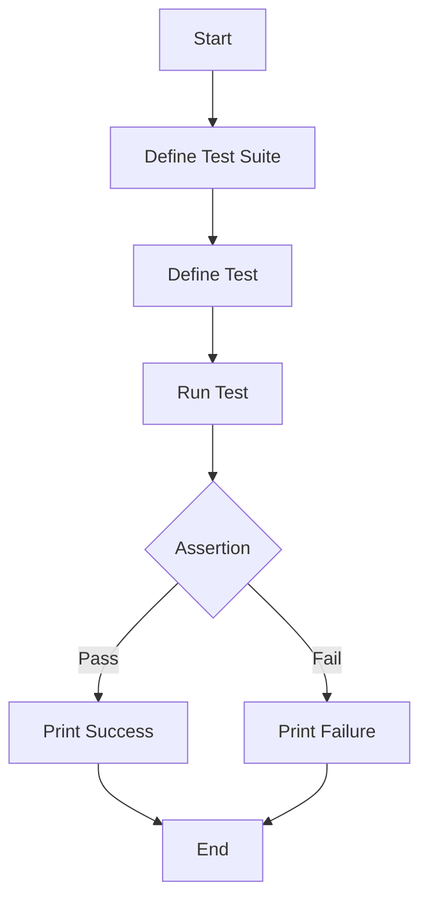

## 17.4.2 Testing Frameworks

In the realm of software development, testing is a cornerstone of ensuring code quality and reliability. For Java developers transitioning to Clojure, understanding how Domain-Specific Languages (DSLs) can simplify the creation and execution of testing frameworks is crucial. DSLs allow tests to be expressed in a more readable and domain-specific manner, enhancing both the development and maintenance of test suites. In this section, we will explore how Clojure's metaprogramming capabilities facilitate the creation of expressive testing frameworks, drawing parallels with Java's testing paradigms.

### Understanding DSLs in Testing Frameworks

A Domain-Specific Language (DSL) is a specialized language tailored to a particular application domain. In the context of testing frameworks, DSLs provide a way to write tests that are concise, expressive, and closely aligned with the domain they are testing. This contrasts with general-purpose programming languages, which may require more boilerplate code and less intuitive syntax for expressing tests.

#### Benefits of DSLs in Testing

- **Readability**: DSLs allow tests to be written in a way that is closer to natural language, making them easier to read and understand.
- **Expressiveness**: DSLs can encapsulate complex testing logic in simple constructs, reducing the cognitive load on developers.
- **Maintainability**: With a clear and concise syntax, DSL-based tests are easier to maintain and update as the codebase evolves.

### Clojure's Approach to Testing with DSLs

Clojure's Lisp heritage and metaprogramming capabilities make it an ideal language for creating DSLs. The language's macro system allows developers to extend the language's syntax and create custom constructs that can be used to express tests in a domain-specific way.

#### Example: A Simple Testing DSL in Clojure

Let's start by creating a simple DSL for testing arithmetic operations. This DSL will allow us to write tests in a more expressive manner.

```clojure
(defmacro deftest [name & body]
  `(defn ~name []
     (println "Running test:" '~name)
     ~@body))

(defmacro assert-equal [expected actual]
  `(if (= ~expected ~actual)
     (println "Test passed!")
     (println "Test failed! Expected:" ~expected "but got:" ~actual)))

;; Using the DSL
(deftest test-addition
  (assert-equal 4 (+ 2 2)))

(deftest test-subtraction
  (assert-equal 0 (- 2 2)))

;; Running the tests
(test-addition)
(test-subtraction)
```

**Explanation**:
- **`deftest` Macro**: Defines a test function with a given name and body.
- **`assert-equal` Macro**: Compares the expected and actual values, printing a message based on the result.

### Comparing with Java Testing Frameworks

In Java, testing frameworks like JUnit provide annotations and assertions to facilitate testing. However, these frameworks often require more boilerplate code compared to Clojure's DSL approach.

#### Java Example: JUnit Test

```java
import static org.junit.Assert.assertEquals;
import org.junit.Test;

public class ArithmeticTest {
    @Test
    public void testAddition() {
        assertEquals(4, 2 + 2);
    }

    @Test
    public void testSubtraction() {
        assertEquals(0, 2 - 2);
    }
}
```

**Comparison**:
- **Boilerplate**: Java requires import statements and annotations, which can add verbosity.
- **Syntax**: Clojure's DSL allows for more concise and expressive test definitions.

### Building a More Complex Testing DSL

Let's enhance our testing DSL to support more complex assertions and test suites.

```clojure
(defmacro assert-true [condition]
  `(if ~condition
     (println "Assertion passed!")
     (println "Assertion failed!")))

(defmacro assert-false [condition]
  `(if (not ~condition)
     (println "Assertion passed!")
     (println "Assertion failed!")))

(defmacro testsuite [name & tests]
  `(do
     (println "Running test suite:" '~name)
     ~@tests))

;; Using the enhanced DSL
(testsuite arithmetic-tests
  (deftest test-multiplication
    (assert-equal 9 (* 3 3)))
  (deftest test-division
    (assert-true (= 2 (/ 4 2)))))
```

**Explanation**:
- **`assert-true` and `assert-false` Macros**: Provide additional assertion capabilities.
- **`testsuite` Macro**: Groups multiple tests into a suite, allowing for organized test execution.

### Try It Yourself

Experiment with the DSL by adding new assertions or modifying existing tests. For example, try adding an `assert-not-equal` macro to check for inequality.

### Visualizing the Flow of Data in Testing DSLs

To better understand how data flows through our testing DSL, let's visualize the process using a flowchart.



**Diagram Explanation**: This flowchart illustrates the process of defining and running tests using our DSL, highlighting the assertion step where the test outcome is determined.

### Advantages of Clojure's DSL Approach

- **Flexibility**: Clojure's macros allow for the creation of highly flexible and customizable testing frameworks.
- **Conciseness**: DSLs reduce the amount of code needed to express tests, making them easier to write and maintain.
- **Expressiveness**: Tests can be written in a way that closely aligns with the domain being tested, improving readability.

### Challenges and Considerations

While DSLs offer many benefits, there are challenges to consider:

- **Learning Curve**: Developers new to Clojure or Lisp-like languages may need time to become comfortable with macros and DSLs.
- **Debugging**: Errors in macros can be difficult to diagnose, requiring a deep understanding of macro expansion and evaluation.

### Exercises and Practice Problems

1. **Extend the DSL**: Add a new macro `assert-greater-than` to check if one value is greater than another.
2. **Refactor a Java Test**: Take an existing Java test and refactor it using the Clojure DSL.
3. **Create a New DSL**: Design a DSL for testing string operations, including assertions for string equality and length.

### Key Takeaways

- **DSLs Enhance Readability**: By allowing tests to be expressed in a domain-specific manner, DSLs improve readability and maintainability.
- **Clojure's Macros Enable Flexibility**: The macro system in Clojure provides the tools needed to create powerful and expressive testing frameworks.
- **Comparison with Java**: While Java provides robust testing frameworks, Clojure's DSL approach offers a more concise and expressive alternative.

### Further Reading

- [Official Clojure Documentation](https://clojure.org/reference/documentation)
- [ClojureDocs](https://clojuredocs.org/)
- [JUnit Documentation](https://junit.org/junit5/docs/current/user-guide/)

Now that we've explored how DSLs can simplify testing frameworks in Clojure, let's apply these concepts to create more expressive and maintainable tests in your applications.

## Quiz: Mastering Clojure Testing Frameworks with DSLs



### What is a primary benefit of using DSLs in testing frameworks?

- [x] Improved readability and expressiveness
- [ ] Increased code complexity
- [ ] Reduced test coverage
- [ ] Slower test execution

> **Explanation:** DSLs improve readability and expressiveness by allowing tests to be written in a more natural and domain-specific manner.

### How does Clojure's macro system benefit testing DSLs?

- [x] It allows for the creation of custom syntax and constructs
- [ ] It simplifies debugging
- [ ] It reduces the need for assertions
- [ ] It increases boilerplate code

> **Explanation:** Clojure's macro system enables the creation of custom syntax and constructs, making it easier to build expressive DSLs for testing.

### In the provided Clojure DSL example, what does the `deftest` macro do?

- [x] Defines a test function with a given name and body
- [ ] Executes a test immediately
- [ ] Asserts that a condition is true
- [ ] Groups multiple tests into a suite

> **Explanation:** The `deftest` macro defines a test function with a specified name and body, allowing for organized test execution.

### What is a challenge associated with using DSLs in testing?

- [x] Debugging errors in macros
- [ ] Writing concise code
- [ ] Improving test coverage
- [ ] Reducing code readability

> **Explanation:** Debugging errors in macros can be challenging due to the complexity of macro expansion and evaluation.

### Which of the following is a valid assertion in the enhanced Clojure DSL?

- [x] `assert-true`
- [ ] `assert-false`
- [x] `assert-equal`
- [ ] `assert-not-equal`

> **Explanation:** The enhanced Clojure DSL includes `assert-true`, `assert-false`, and `assert-equal` as valid assertions.

### How does the Clojure DSL compare to Java's JUnit in terms of boilerplate code?

- [x] Clojure's DSL requires less boilerplate code
- [ ] Java's JUnit requires less boilerplate code
- [ ] Both require the same amount of boilerplate code
- [ ] Neither requires boilerplate code

> **Explanation:** Clojure's DSL approach typically requires less boilerplate code compared to Java's JUnit framework.

### What is the purpose of the `testsuite` macro in the Clojure DSL?

- [x] Groups multiple tests into a suite
- [ ] Executes a single test
- [ ] Asserts that a condition is false
- [ ] Defines a test function

> **Explanation:** The `testsuite` macro groups multiple tests into a suite, allowing for organized test execution.

### Which of the following is a benefit of using DSLs in testing?

- [x] Enhanced maintainability
- [ ] Increased code verbosity
- [ ] Reduced test coverage
- [ ] Slower test execution

> **Explanation:** DSLs enhance maintainability by providing a clear and concise syntax for expressing tests.

### What is a potential downside of using DSLs in testing?

- [x] Learning curve for new developers
- [ ] Improved readability
- [ ] Increased test coverage
- [ ] Faster test execution

> **Explanation:** There can be a learning curve for new developers who are unfamiliar with DSLs and Clojure's macro system.

### True or False: Clojure's DSL approach to testing is more expressive than Java's JUnit.

- [x] True
- [ ] False

> **Explanation:** Clojure's DSL approach is generally more expressive than Java's JUnit, allowing for more concise and readable test definitions.


