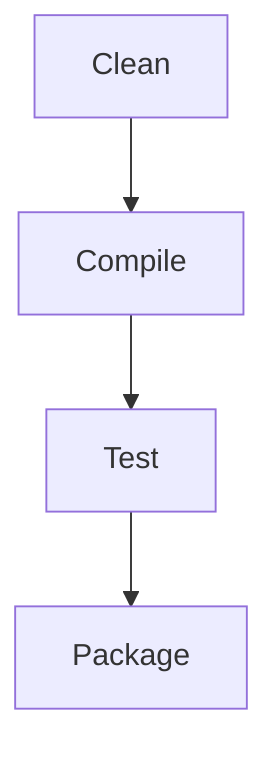

## 17.4.3 Build Systems and Task Runners

In this section, we delve into the fascinating world of Domain-Specific Languages (DSLs) and their application in building systems and task runners within the Clojure ecosystem. As experienced Java developers, you are likely familiar with build tools like Maven and Gradle. Here, we will explore how Clojure's unique features can enhance these processes, offering a more expressive and flexible approach to defining build scripts, automating tasks, and managing workflows.

### Understanding DSLs in Build Systems

A Domain-Specific Language (DSL) is a specialized language designed to solve problems within a specific domain. In the context of build systems and task runners, DSLs provide a concise and readable way to define tasks, dependencies, and workflows. Clojure's Lisp heritage, with its powerful macro system, makes it an excellent choice for creating DSLs.

#### Comparison with Java Build Tools

Java developers often use Maven or Gradle for build automation. These tools use XML or Groovy-based DSLs to define project configurations and tasks. While powerful, they can become verbose and complex. Clojure, with its emphasis on simplicity and expressiveness, offers an alternative approach.

**Java Example: Gradle Build Script**

```groovy
plugins {
    id 'java'
}

repositories {
    mavenCentral()
}

dependencies {
    implementation 'org.springframework.boot:spring-boot-starter'
}

task hello {
    doLast {
        println 'Hello, World!'
    }
}
```

**Clojure Example: Using a DSL for Build Automation**

```clojure
(defproject my-project "0.1.0-SNAPSHOT"
  :description "A sample Clojure project"
  :dependencies [[org.clojure/clojure "1.10.3"]
                 [ring/ring-core "1.9.0"]]
  :tasks {:hello (fn [] (println "Hello, World!"))})
```

In the Clojure example, we define a project using a DSL that is both concise and expressive. The `:tasks` map allows us to define custom tasks, similar to Gradle's task definitions.

### Creating a DSL for Build Automation in Clojure

Let's explore how to create a simple DSL for build automation in Clojure. We'll start by defining a basic structure for our DSL and then expand it to include more complex features.

#### Defining the DSL Structure

A DSL in Clojure is often built using macros, which allow us to extend the language's syntax. We'll define a macro `defbuild` that serves as the entry point for our build script.

```clojure
(defmacro defbuild [name & body]
  `(do
     (println "Defining build:" ~name)
     ~@body))
```

This macro simply prints the name of the build and evaluates the body. We can use this as a foundation to build more complex functionality.

#### Adding Tasks and Dependencies

Next, we'll extend our DSL to support task definitions and dependencies. We'll use a map to store tasks and their dependencies.

```clojure
(def tasks (atom {}))

(defmacro deftask [name & body]
  `(swap! tasks assoc ~name (fn [] ~@body)))

(defmacro depends-on [task]
  `(do
     (println "Running dependencies for" '~task)
     ((get @tasks ~task))))
```

With these macros, we can define tasks and specify dependencies between them. The `deftask` macro adds a task to the `tasks` atom, while `depends-on` allows us to specify dependencies.

#### Example Build Script

Let's create a simple build script using our DSL.

```clojure
(defbuild my-build
  (deftask clean
    (println "Cleaning project..."))

  (deftask compile
    (depends-on clean)
    (println "Compiling source code..."))

  (deftask test
    (depends-on compile)
    (println "Running tests..."))

  (deftask package
    (depends-on test)
    (println "Packaging application...")))

;; Execute a task
((get @tasks 'package))
```

In this example, we define a build with tasks for cleaning, compiling, testing, and packaging. Each task depends on the previous one, ensuring that they are executed in the correct order.

### Enhancing the DSL with Additional Features

Now that we have a basic DSL, let's enhance it with additional features such as conditional execution, parallel tasks, and error handling.

#### Conditional Execution

We can add support for conditional execution by introducing a `when` macro that evaluates a condition before executing a task.

```clojure
(defmacro when-task [condition task]
  `(when ~condition
     ((get @tasks ~task))))
```

This allows us to execute tasks conditionally based on the result of a predicate.

#### Parallel Task Execution

To support parallel task execution, we can use Clojure's `future` construct, which allows us to run tasks asynchronously.

```clojure
(defmacro parallel [& tasks]
  `(doall (map #(future ((get @tasks %))) ~tasks)))
```

With this macro, we can execute multiple tasks in parallel, improving the efficiency of our build process.

#### Error Handling

Error handling is crucial in build systems. We can add a `try-task` macro to catch exceptions and handle errors gracefully.

```clojure
(defmacro try-task [task]
  `(try
     ((get @tasks ~task))
     (catch Exception e
       (println "Error executing task:" ~task (.getMessage e)))))
```

This macro wraps task execution in a `try-catch` block, allowing us to handle errors without terminating the entire build process.

### Integrating with Existing Tools

Clojure's interoperability with Java allows us to integrate our DSL with existing build tools like Maven and Gradle. We can call Java methods directly from Clojure, enabling us to leverage existing libraries and tools.

#### Example: Using Maven from Clojure

```clojure
(import '[org.apache.maven.cli.MavenCli])

(defn run-maven [goal]
  (let [cli (MavenCli.)]
    (.doMain cli (into-array String [goal]) "." System/out System/err)))
```

In this example, we use Clojure's `import` to access the Maven CLI and execute a Maven goal from our Clojure code.

### Visualizing Task Dependencies

To better understand the flow of tasks and their dependencies, we can use a diagram to visualize the build process.



This diagram illustrates the sequence of tasks in our build process, highlighting the dependencies between them.

### Try It Yourself

Now that we've explored the basics of creating a DSL for build automation in Clojure, try modifying the code examples to add new features or customize the behavior of tasks. Here are a few ideas to get you started:

- Add a new task for deploying the application.
- Implement a feature to skip tasks based on user input.
- Enhance error handling to retry failed tasks.

### Exercises

1. **Extend the DSL**: Add support for logging task execution times.
2. **Integrate with Java**: Use Java libraries to send notifications when tasks complete.
3. **Optimize Parallel Execution**: Experiment with different strategies for parallel task execution to improve performance.

### Key Takeaways

- **DSLs in Clojure**: Clojure's macro system makes it an excellent choice for creating DSLs, offering a concise and expressive way to define build scripts and automate tasks.
- **Integration with Java**: Clojure's interoperability with Java allows us to leverage existing tools and libraries, enhancing the capabilities of our DSL.
- **Flexibility and Extensibility**: By building a custom DSL, we can tailor the build process to meet the specific needs of our projects, improving efficiency and maintainability.

For further reading, explore the [Official Clojure Documentation](https://clojure.org/reference/documentation) and [ClojureDocs](https://clojuredocs.org/), which provide comprehensive resources on Clojure's features and capabilities.

---

## Quiz: Mastering Build Systems and Task Runners in Clojure



### What is a Domain-Specific Language (DSL)?

- [x] A specialized language designed for a specific domain
- [ ] A general-purpose programming language
- [ ] A type of database query language
- [ ] A language used for web development

> **Explanation:** A DSL is a specialized language designed to solve problems within a specific domain, offering concise and expressive syntax.

### How does Clojure's macro system benefit DSL creation?

- [x] It allows extending the language's syntax
- [ ] It improves runtime performance
- [ ] It simplifies error handling
- [ ] It enhances memory management

> **Explanation:** Clojure's macro system allows developers to extend the language's syntax, making it ideal for creating DSLs.

### What is the purpose of the `deftask` macro in the example?

- [x] To define a task within the build system
- [ ] To execute a task immediately
- [ ] To log task execution times
- [ ] To handle errors during task execution

> **Explanation:** The `deftask` macro is used to define tasks within the build system, storing them in a map for later execution.

### How can tasks be executed in parallel in the provided DSL?

- [x] Using the `parallel` macro
- [ ] Using the `when-task` macro
- [ ] Using the `try-task` macro
- [ ] Using the `depends-on` macro

> **Explanation:** The `parallel` macro allows tasks to be executed in parallel by leveraging Clojure's `future` construct.

### What is the role of the `try-task` macro?

- [x] To handle errors during task execution
- [ ] To execute tasks conditionally
- [ ] To define task dependencies
- [ ] To log task execution times

> **Explanation:** The `try-task` macro wraps task execution in a `try-catch` block, allowing for error handling.

### Which Java build tool is mentioned as a comparison to Clojure's DSL?

- [x] Gradle
- [ ] Ant
- [ ] Jenkins
- [ ] Bamboo

> **Explanation:** Gradle is mentioned as a comparison, highlighting the differences between Groovy-based DSLs and Clojure's approach.

### How can Clojure integrate with existing Java tools?

- [x] By calling Java methods directly
- [ ] By rewriting Java code in Clojure
- [ ] By using a separate build script
- [ ] By converting Java code to Clojure

> **Explanation:** Clojure can call Java methods directly, allowing integration with existing Java tools and libraries.

### What does the `depends-on` macro do?

- [x] Specifies dependencies between tasks
- [ ] Executes tasks in parallel
- [ ] Handles errors during task execution
- [ ] Logs task execution times

> **Explanation:** The `depends-on` macro specifies dependencies between tasks, ensuring they are executed in the correct order.

### What is the benefit of using a DSL for build automation?

- [x] It provides a concise and expressive way to define tasks
- [ ] It increases the complexity of the build process
- [ ] It requires less memory
- [ ] It eliminates the need for error handling

> **Explanation:** A DSL provides a concise and expressive way to define tasks, improving readability and maintainability.

### True or False: Clojure's DSLs can only be used for build automation.

- [ ] True
- [x] False

> **Explanation:** False. Clojure's DSLs can be used for a wide range of applications beyond build automation, including configuration, testing, and more.


