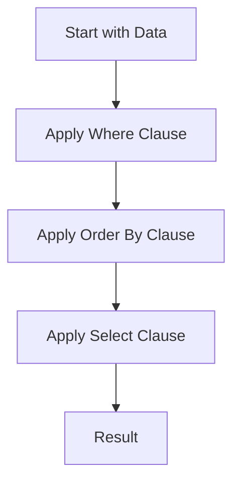

## 17.4.4 Query Languages

In this section, we delve into the fascinating world of Domain-Specific Languages (DSLs) in Clojure, focusing on how they can be leveraged to create expressive query languages. These DSLs enable developers to define queries in a more natural and intuitive manner, particularly when interacting with databases or processing data. As experienced Java developers, you will find that Clojure's metaprogramming capabilities offer a unique and powerful approach to constructing query languages that can simplify complex data operations.

### Understanding Query Languages

Query languages are specialized languages used to make queries in databases and data processing systems. They allow users to specify what data they want to retrieve or manipulate, without needing to know how the data is stored or accessed. SQL is perhaps the most well-known query language, but in the realm of Clojure, we can create custom query languages tailored to specific needs using DSLs.

### The Role of DSLs in Query Languages

DSLs in Clojure provide a way to create concise and expressive query languages. By leveraging Clojure's macro system and functional programming paradigms, we can design DSLs that are both powerful and easy to use. These DSLs can abstract away the complexities of underlying data structures and provide a more intuitive interface for querying data.

#### Benefits of Using DSLs for Query Languages

1. **Expressiveness**: DSLs can be designed to closely resemble natural language, making queries easier to read and write.
2. **Abstraction**: They abstract the underlying data access logic, allowing developers to focus on the query logic itself.
3. **Reusability**: DSLs can be reused across different projects, providing a consistent interface for querying data.
4. **Extensibility**: New features and capabilities can be added to the DSL without affecting existing queries.

### Building a Query Language DSL in Clojure

Let's explore how to build a simple query language DSL in Clojure. We'll start by defining a basic structure for our DSL and then gradually add more features.

#### Defining the Basic Structure

We'll begin by defining a simple DSL for querying a collection of maps. This DSL will allow us to filter, sort, and select data from the collection.

```clojure
(defn query [data & clauses]
  (reduce (fn [result clause]
            (clause result))
          data
          clauses))

(defn where [pred]
  (fn [data]
    (filter pred data)))

(defn order-by [key]
  (fn [data]
    (sort-by key data)))

(defn select [keys]
  (fn [data]
    (map #(select-keys % keys) data)))
```

In this example, we define a `query` function that takes a collection of data and a series of clauses. Each clause is a function that transforms the data. The `where`, `order-by`, and `select` functions are examples of such clauses.

#### Using the DSL

Let's see how we can use this DSL to query a collection of maps.

```clojure
(def data
  [{:name "Alice" :age 30 :city "New York"}
   {:name "Bob" :age 25 :city "San Francisco"}
   {:name "Charlie" :age 35 :city "Los Angeles"}])

(query data
       (where #(> (:age %) 28))
       (order-by :name)
       (select [:name :city]))
```

This query filters the data to include only people older than 28, sorts them by name, and selects only the `name` and `city` fields.

### Enhancing the DSL with More Features

Now that we have a basic DSL, let's enhance it with additional features such as grouping and aggregating data.

#### Adding Grouping and Aggregation

To add grouping and aggregation capabilities, we'll define new clauses for our DSL.

```clojure
(defn group-by [key]
  (fn [data]
    (group-by key data)))

(defn aggregate [agg-fn]
  (fn [data]
    (map agg-fn data)))
```

With these new clauses, we can group data by a specific key and apply an aggregation function to each group.

#### Example of Grouping and Aggregation

Let's use our enhanced DSL to group data by city and count the number of people in each city.

```clojure
(defn count-people [group]
  {:city (first (keys group))
   :count (count (val group))})

(query data
       (group-by :city)
       (aggregate count-people))
```

This query groups the data by city and counts the number of people in each group.

### Comparing with Java

In Java, creating a similar query language would typically involve using a combination of SQL-like query builders or criteria APIs. These approaches can be verbose and less flexible compared to Clojure's DSLs.

#### Java Example

Here's a simple example of querying data in Java using a criteria API.

```java
List<Person> people = Arrays.asList(
    new Person("Alice", 30, "New York"),
    new Person("Bob", 25, "San Francisco"),
    new Person("Charlie", 35, "Los Angeles")
);

List<Person> result = people.stream()
    .filter(p -> p.getAge() > 28)
    .sorted(Comparator.comparing(Person::getName))
    .collect(Collectors.toList());
```

While Java's stream API provides a functional approach to querying data, it lacks the expressiveness and flexibility of a custom DSL.

### Visualizing the Query Process

To better understand the flow of data through our DSL, let's visualize the process using a flowchart.



**Diagram Description**: This flowchart illustrates the process of querying data using our DSL. The data flows through each clause, transforming it step by step until the final result is produced.

### Try It Yourself

Experiment with the DSL by adding new clauses or modifying existing ones. For example, try adding a `limit` clause to restrict the number of results returned.

```clojure
(defn limit [n]
  (fn [data]
    (take n data)))
```

Use this new clause in a query to see how it affects the results.

### Exercises

1. **Create a New Clause**: Define a new clause for the DSL that allows for joining two collections based on a common key.
2. **Extend the Aggregation**: Enhance the `aggregate` function to support multiple aggregation operations, such as sum and average.
3. **Optimize the DSL**: Refactor the DSL to improve performance, particularly for large datasets.

### Key Takeaways

- **DSLs in Clojure** provide a powerful way to create expressive query languages that abstract away the complexities of data access.
- **Clojure's macro system** allows for the creation of concise and flexible DSLs that can be tailored to specific needs.
- **Comparing with Java**, Clojure's DSLs offer greater expressiveness and flexibility, making them ideal for complex data operations.
- **Experimentation and practice** are key to mastering the creation and use of DSLs in Clojure.

By leveraging Clojure's capabilities, you can create custom query languages that simplify data processing and enhance the readability and maintainability of your code.

## Quiz: Mastering Query Languages in Clojure



### What is a primary benefit of using DSLs for query languages in Clojure?

- [x] They provide an expressive and intuitive way to define queries.
- [ ] They require less memory than traditional query languages.
- [ ] They are faster than SQL queries.
- [ ] They eliminate the need for data validation.

> **Explanation:** DSLs offer expressiveness and abstraction, making queries easier to read and write.

### How does Clojure's macro system benefit DSL creation?

- [x] It allows for the creation of concise and flexible DSLs.
- [ ] It automatically optimizes query performance.
- [ ] It provides built-in support for SQL syntax.
- [ ] It simplifies error handling in queries.

> **Explanation:** Clojure's macro system enables the creation of powerful and flexible DSLs by allowing developers to define custom syntax and behavior.

### In the provided Clojure DSL example, what does the `where` clause do?

- [x] Filters data based on a predicate function.
- [ ] Sorts data by a specified key.
- [ ] Selects specific fields from the data.
- [ ] Groups data by a specified key.

> **Explanation:** The `where` clause filters data by applying a predicate function to each element.

### What is a key difference between Clojure's DSLs and Java's stream API?

- [x] Clojure's DSLs offer greater expressiveness and flexibility.
- [ ] Java's stream API is more concise.
- [ ] Clojure's DSLs are less powerful.
- [ ] Java's stream API supports custom syntax.

> **Explanation:** Clojure's DSLs provide more expressiveness and flexibility compared to Java's stream API, which is more limited in terms of custom syntax and behavior.

### Which clause would you use to limit the number of results in a Clojure DSL query?

- [x] `limit`
- [ ] `where`
- [ ] `order-by`
- [ ] `select`

> **Explanation:** The `limit` clause is used to restrict the number of results returned by a query.

### What is the purpose of the `group-by` clause in the Clojure DSL?

- [x] It groups data by a specified key.
- [ ] It filters data based on a predicate.
- [ ] It sorts data by a specified key.
- [ ] It selects specific fields from the data.

> **Explanation:** The `group-by` clause organizes data into groups based on a specified key.

### How can you enhance the `aggregate` function in the DSL?

- [x] By supporting multiple aggregation operations like sum and average.
- [ ] By automatically sorting the results.
- [ ] By filtering out null values.
- [ ] By converting data to JSON format.

> **Explanation:** Enhancing the `aggregate` function to support multiple operations increases its versatility and usefulness.

### What is a potential exercise to improve the DSL?

- [x] Define a new clause for joining collections.
- [ ] Implement a built-in SQL parser.
- [ ] Add support for XML data.
- [ ] Create a GUI for the DSL.

> **Explanation:** Adding a clause for joining collections can expand the DSL's functionality and applicability.

### What does the `select` clause do in the Clojure DSL?

- [x] Selects specific fields from the data.
- [ ] Filters data based on a predicate.
- [ ] Sorts data by a specified key.
- [ ] Groups data by a specified key.

> **Explanation:** The `select` clause extracts specific fields from each element in the data.

### True or False: Clojure's DSLs can be reused across different projects.

- [x] True
- [ ] False

> **Explanation:** One of the advantages of DSLs is their reusability, allowing them to be applied in various projects with similar requirements.


