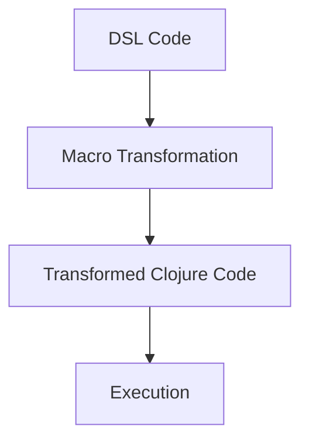

## 17.5.1 Using Macros to Transform DSL Code

In this section, we delve into the fascinating world of Clojure macros and their powerful ability to transform Domain-Specific Language (DSL) code into executable Clojure code. For experienced Java developers, understanding macros in Clojure can open up new possibilities in metaprogramming, allowing you to manipulate the abstract syntax tree (AST) and create more expressive and concise code.

### Introduction to Macros in Clojure

Macros in Clojure are a powerful feature that allows you to extend the language by transforming code at compile time. Unlike functions, which operate on values, macros operate on code itself, enabling you to manipulate the structure of your programs before they are evaluated.

#### What is a Macro?

A macro in Clojure is a special construct that takes code as input and produces transformed code as output. This transformation happens during the compilation phase, allowing you to generate and manipulate code dynamically.

#### Why Use Macros?

Macros are particularly useful for creating DSLs, where you want to provide a more natural syntax for specific tasks. By using macros, you can create concise and expressive code that is tailored to your application's domain.

### Understanding the Abstract Syntax Tree (AST)

Before diving into macro creation, it's essential to understand the concept of the Abstract Syntax Tree (AST). The AST is a tree representation of the syntactic structure of code. In Clojure, macros manipulate the AST to transform code.

#### AST in Clojure

In Clojure, the AST is represented using lists, vectors, maps, and other data structures. Macros can traverse and modify these structures to produce new code.

### Creating a Simple Macro

Let's start by creating a simple macro to understand how macros work in Clojure. We'll create a macro that transforms a custom DSL into Clojure code.

```clojure
(defmacro my-if [condition then-branch else-branch]
  `(if ~condition
     ~then-branch
     ~else-branch))
```

In this example, `my-if` is a macro that takes a condition, a then-branch, and an else-branch. It transforms these inputs into a standard Clojure `if` expression using the backtick (`) for quoting and the tilde (~) for unquoting.

### Transforming DSL Code with Macros

Now, let's explore how macros can be used to transform DSL code. We'll create a simple DSL for defining mathematical operations and use a macro to transform it into executable Clojure code.

#### Defining the DSL

Suppose we want to define a DSL for basic arithmetic operations. Our DSL will allow us to write expressions like `(calc (+ 1 2) (* 3 4))`, which should be transformed into Clojure code that performs these operations.

#### Creating the Macro

We'll create a macro called `calc` that transforms our DSL expressions into Clojure code.

```clojure
(defmacro calc [& expressions]
  (let [transform (fn [expr]
                    (if (list? expr)
                      (let [[op & args] expr]
                        (cons op (map transform args)))
                      expr))]
    `(do ~@(map transform expressions))))
```

In this macro, we define a helper function `transform` that recursively processes each expression. If an expression is a list, it extracts the operator and arguments, transforms the arguments, and reconstructs the list. Otherwise, it returns the expression as-is.

### Comparing Macros with Java Code

In Java, achieving similar functionality would require a more verbose approach, often involving reflection or complex parsing logic. Clojure's macros provide a more concise and expressive way to achieve code transformation.

#### Java Example

Consider a Java example where we want to achieve similar functionality using reflection:

```java
import java.lang.reflect.Method;

public class Calculator {
    public static Object calculate(String operation, Object... args) throws Exception {
        Method method = Math.class.getMethod(operation, double.class, double.class);
        return method.invoke(null, args);
    }

    public static void main(String[] args) throws Exception {
        System.out.println(calculate("addExact", 1, 2));
        System.out.println(calculate("multiplyExact", 3, 4));
    }
}
```

In this Java example, we use reflection to dynamically invoke methods on the `Math` class. While this approach works, it is less flexible and more error-prone compared to Clojure's macros.

### Advanced Macro Techniques

Now that we have a basic understanding of macros, let's explore some advanced techniques for transforming DSL code.

#### Quoting and Unquoting

Quoting (`) and unquoting (~) are essential techniques in macro writing. Quoting prevents code from being evaluated, while unquoting allows specific parts of the code to be evaluated.

#### Macro Expansion

Macro expansion is the process of transforming macro calls into executable code. You can use the `macroexpand` function to see how a macro call is expanded.

```clojure
(macroexpand '(calc (+ 1 2) (* 3 4)))
```

This will show the transformed code that the `calc` macro produces.

### Practical Example: Creating a DSL for Logging

Let's create a more practical example by designing a DSL for logging. Our DSL will allow us to write logging statements in a concise and expressive way.

#### Defining the DSL

We'll define a DSL that allows us to write logging statements like `(log :info "This is an info message")`.

#### Creating the Macro

We'll create a macro called `log` that transforms our DSL expressions into Clojure code that performs logging.

```clojure
(defmacro log [level message]
  `(println (str "[" ~level "] " ~message)))
```

In this macro, we use `println` to output the log message, prefixing it with the log level.

### Try It Yourself

Now that we've explored how macros can transform DSL code, try modifying the examples to create your own DSLs. Experiment with different operators and expressions to see how macros can simplify your code.

### Diagrams and Visualizations

To better understand how macros transform DSL code, let's visualize the process using a flowchart.



**Diagram Caption**: This flowchart illustrates the process of transforming DSL code into executable Clojure code using macros.

### Exercises

1. Create a macro that transforms a DSL for defining HTTP routes into Clojure code.
2. Modify the `calc` macro to support additional arithmetic operations.
3. Design a DSL for defining database queries and create a macro to transform it into Clojure code.

### Key Takeaways

- **Macros** in Clojure allow you to transform code at compile time, enabling powerful metaprogramming capabilities.
- **DSLs** can be created using macros to provide a more natural syntax for specific tasks.
- **Macro expansion** can be visualized using tools like `macroexpand` to understand how code is transformed.
- **Experimentation** with macros can lead to more expressive and concise code, tailored to your application's domain.

By leveraging macros, you can create powerful DSLs that simplify complex tasks and enhance the expressiveness of your Clojure code. As you continue your journey in Clojure, consider how macros can be used to transform and optimize your code for specific use cases.

## Quiz: Mastering Clojure Macros for DSL Transformation



### What is the primary purpose of macros in Clojure?

- [x] To transform code at compile time
- [ ] To execute code at runtime
- [ ] To optimize code for performance
- [ ] To handle exceptions

> **Explanation:** Macros in Clojure are used to transform code at compile time, allowing for powerful metaprogramming capabilities.

### How do macros differ from functions in Clojure?

- [x] Macros operate on code, while functions operate on values
- [ ] Macros are faster than functions
- [ ] Macros are used for error handling
- [ ] Macros are only used for DSLs

> **Explanation:** Macros operate on code itself, allowing for transformations at compile time, while functions operate on values at runtime.

### What is the role of the Abstract Syntax Tree (AST) in macro transformation?

- [x] It represents the syntactic structure of code
- [ ] It optimizes code execution
- [ ] It handles exceptions
- [ ] It manages memory allocation

> **Explanation:** The AST represents the syntactic structure of code, which macros manipulate to transform code.

### Which function can be used to visualize macro expansion in Clojure?

- [x] `macroexpand`
- [ ] `println`
- [ ] `eval`
- [ ] `quote`

> **Explanation:** The `macroexpand` function is used to visualize how a macro call is expanded into executable code.

### What is the purpose of quoting (`) and unquoting (~) in macros?

- [x] Quoting prevents evaluation, unquoting allows evaluation
- [ ] Quoting optimizes code, unquoting handles errors
- [ ] Quoting manages memory, unquoting allocates resources
- [ ] Quoting logs messages, unquoting prints output

> **Explanation:** Quoting prevents code from being evaluated, while unquoting allows specific parts of the code to be evaluated.

### How can macros simplify the creation of DSLs?

- [x] By providing a more natural syntax for specific tasks
- [ ] By optimizing code execution
- [ ] By handling exceptions automatically
- [ ] By managing memory allocation

> **Explanation:** Macros can simplify the creation of DSLs by providing a more natural and expressive syntax for specific tasks.

### What is the benefit of using macros over Java's reflection for code transformation?

- [x] Macros are more concise and expressive
- [ ] Macros are faster than reflection
- [ ] Macros handle exceptions better
- [ ] Macros optimize memory usage

> **Explanation:** Macros provide a more concise and expressive way to transform code compared to Java's reflection.

### In the provided `calc` macro example, what does the `transform` function do?

- [x] It recursively processes and transforms expressions
- [ ] It optimizes code for performance
- [ ] It handles exceptions in expressions
- [ ] It manages memory allocation

> **Explanation:** The `transform` function recursively processes and transforms expressions in the `calc` macro.

### True or False: Macros can only be used for creating DSLs.

- [ ] True
- [x] False

> **Explanation:** False. Macros can be used for a variety of purposes beyond creating DSLs, including code optimization and metaprogramming.

### What is a key takeaway from using macros in Clojure?

- [x] Macros enable powerful metaprogramming capabilities
- [ ] Macros are only useful for error handling
- [ ] Macros optimize memory usage
- [ ] Macros are faster than functions

> **Explanation:** Macros enable powerful metaprogramming capabilities, allowing for code transformation and optimization.


