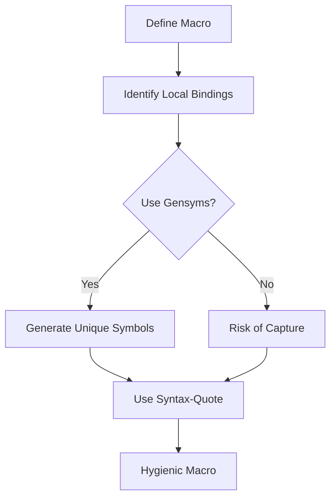

## 17.5.2 Hygiene and Avoiding Variable Capture

In the world of Clojure, macros are a powerful tool that allows developers to extend the language and create domain-specific languages (DSLs). However, with great power comes great responsibility. One of the critical challenges when working with macros is ensuring **hygiene** to prevent **variable capture** and name clashes. In this section, we will explore these concepts in depth, leveraging your existing Java knowledge to make the transition smoother.

### Understanding Variable Capture

Variable capture occurs when a macro unintentionally binds a variable in its expansion to a variable in the surrounding code. This can lead to unexpected behavior and bugs that are difficult to trace. Let's start by examining a simple example to illustrate this concept.

#### Java Analogy: Shadowing

In Java, a similar issue can occur with variable shadowing, where a local variable in a method shadows a field with the same name. Consider the following Java code:

```java
public class ShadowingExample {
    private int value = 10;

    public void printValue() {
        int value = 20; // This shadows the field 'value'
        System.out.println(value); // Prints 20, not 10
    }
}
```

In this example, the local variable `value` shadows the field `value`, leading to potentially confusing behavior. Similarly, in Clojure, macros can unintentionally capture variables, leading to similar issues.

### Clojure Example: Variable Capture

Let's look at a Clojure example to understand how variable capture can occur in macros:

```clojure
(defmacro capture-example [x]
  `(let [y 10]
     (+ y ~x)))

(let [y 5]
  (capture-example y))
```

In this example, the macro `capture-example` defines a local variable `y` within its expansion. However, when the macro is used, it captures the `y` from the surrounding `let` binding, leading to unexpected results.

### Preventing Variable Capture with Gensyms

To prevent variable capture, Clojure provides a mechanism called **gensyms**. A gensym is a unique symbol that ensures no name clashes occur. Let's modify our previous example to use gensyms:

```clojure
(defmacro capture-example-fixed [x]
  (let [y (gensym "y")]
    `(let [~y 10]
       (+ ~y ~x))))

(let [y 5]
  (capture-example-fixed y)) ; Correctly uses the macro's 'y', not the surrounding 'y'
```

In this revised example, `gensym` generates a unique symbol for `y`, ensuring that the macro's `y` does not interfere with any `y` in the surrounding code.

### The Role of Syntax-Quote

Another tool in Clojure's arsenal for maintaining macro hygiene is the **syntax-quote** (backtick `). The syntax-quote automatically resolves symbols to their fully qualified names, preventing accidental capture of local variables. It also allows for easy unquoting with the tilde `~` and splicing with `~@`.

Consider the following example:

```clojure
(defmacro syntax-quote-example [x]
  `(let [y# 10] ; The '#' ensures 'y' is a unique symbol
     (+ y# ~x)))

(let [y 5]
  (syntax-quote-example y)) ; Uses the macro's 'y#', not the surrounding 'y'
```

In this example, the syntax-quote ensures that `y#` is a unique symbol, preventing any capture of `y` from the surrounding context.

### Comparing Clojure Macros with Java

In Java, metaprogramming is typically achieved through reflection, which can be cumbersome and error-prone. Clojure's macros provide a more elegant and powerful way to achieve similar goals, with the added benefit of compile-time expansion.

#### Java Reflection Example

```java
import java.lang.reflect.Method;

public class ReflectionExample {
    public static void main(String[] args) throws Exception {
        Method method = MyClass.class.getMethod("myMethod");
        method.invoke(null);
    }
}

class MyClass {
    public static void myMethod() {
        System.out.println("Hello, Reflection!");
    }
}
```

In this Java example, reflection is used to invoke a method dynamically. While powerful, reflection lacks the compile-time safety and expressiveness of Clojure macros.

### Best Practices for Macro Hygiene

To ensure your macros are hygienic and free from variable capture issues, consider the following best practices:

1. **Use Gensyms**: Always use gensyms for local bindings within macros to avoid name clashes.
2. **Leverage Syntax-Quote**: Use syntax-quote to automatically resolve symbols to their fully qualified names.
3. **Test Macros Thoroughly**: Ensure your macros are tested in various contexts to catch any potential capture issues.
4. **Keep Macros Simple**: Aim for simplicity in your macro definitions to reduce the risk of unintended behavior.

### Try It Yourself

To solidify your understanding of macro hygiene, try modifying the following code examples:

1. Create a macro that defines a local variable and ensure it does not capture any variables from the surrounding context.
2. Experiment with syntax-quote and gensyms to see how they affect macro expansion.

### Diagram: Macro Hygiene Process

Below is a diagram illustrating the process of ensuring macro hygiene using gensyms and syntax-quote:



**Diagram Caption**: This flowchart outlines the steps to ensure macro hygiene, emphasizing the use of gensyms and syntax-quote to prevent variable capture.

### Further Reading

For more information on Clojure macros and hygiene, consider exploring the following resources:

- [Official Clojure Documentation on Macros](https://clojure.org/reference/macros)
- [ClojureDocs: Macros](https://clojuredocs.org/clojure.core/defmacro)
- [Clojure for the Brave and True: Macros](https://www.braveclojure.com/macros/)

### Exercises

1. **Exercise 1**: Write a macro that takes a list of expressions and evaluates them in sequence, ensuring no variable capture occurs.
2. **Exercise 2**: Refactor a Java method using reflection into a Clojure macro, focusing on maintaining hygiene.
3. **Exercise 3**: Create a DSL using Clojure macros that safely manipulates a data structure without variable capture.

### Key Takeaways

- **Macro Hygiene**: Essential for preventing variable capture and ensuring reliable macro behavior.
- **Gensyms and Syntax-Quote**: Powerful tools for maintaining hygiene in Clojure macros.
- **Comparison with Java**: Clojure macros offer a more expressive and safer alternative to Java's reflection.

Now that we've explored macro hygiene and variable capture, let's apply these concepts to create robust and reliable macros in your Clojure projects.

---

## Quiz: Mastering Macro Hygiene in Clojure



### What is variable capture in the context of Clojure macros?

- [x] When a macro unintentionally binds a variable in its expansion to a variable in the surrounding code.
- [ ] When a macro fails to compile due to syntax errors.
- [ ] When a macro captures the output of a function.
- [ ] When a macro is used to capture user input.

> **Explanation:** Variable capture occurs when a macro unintentionally binds a variable in its expansion to a variable in the surrounding code, leading to potential bugs.

### How can gensyms help prevent variable capture in Clojure macros?

- [x] By generating unique symbols that avoid name clashes.
- [ ] By automatically resolving symbols to their fully qualified names.
- [ ] By providing a way to inline functions.
- [ ] By allowing macros to capture user input.

> **Explanation:** Gensyms generate unique symbols, ensuring that local bindings within macros do not clash with variables in the surrounding code.

### What is the role of syntax-quote in Clojure macros?

- [x] It resolves symbols to their fully qualified names and allows for easy unquoting.
- [ ] It generates unique symbols to prevent variable capture.
- [ ] It provides a way to inline functions within macros.
- [ ] It captures the output of a function.

> **Explanation:** Syntax-quote resolves symbols to their fully qualified names, preventing accidental capture of local variables.

### Which of the following is a best practice for ensuring macro hygiene?

- [x] Use gensyms for local bindings within macros.
- [ ] Avoid using macros altogether.
- [ ] Use reflection to dynamically invoke methods.
- [ ] Capture variables from the surrounding context.

> **Explanation:** Using gensyms for local bindings within macros is a best practice to avoid name clashes and ensure macro hygiene.

### What is a potential risk of not using gensyms in macros?

- [x] Variable capture and unintended behavior.
- [ ] Increased compilation time.
- [ ] Reduced readability of code.
- [ ] Difficulty in debugging syntax errors.

> **Explanation:** Not using gensyms can lead to variable capture, where a macro unintentionally binds a variable in its expansion to a variable in the surrounding code.

### How does Clojure's approach to macros compare to Java's reflection?

- [x] Clojure macros provide compile-time expansion and safety, while Java reflection is runtime-based and can be error-prone.
- [ ] Clojure macros are less powerful than Java reflection.
- [ ] Java reflection offers more compile-time safety than Clojure macros.
- [ ] Both Clojure macros and Java reflection provide the same level of expressiveness.

> **Explanation:** Clojure macros provide compile-time expansion and safety, making them more expressive and reliable compared to Java's runtime-based reflection.

### What is the purpose of the tilde `~` in a syntax-quoted expression?

- [x] To unquote a symbol, allowing it to be evaluated.
- [ ] To generate a unique symbol.
- [ ] To resolve a symbol to its fully qualified name.
- [ ] To capture the output of a function.

> **Explanation:** The tilde `~` is used to unquote a symbol within a syntax-quoted expression, allowing it to be evaluated.

### Which tool can be used to visualize macro transformations in Clojure?

- [x] `macroexpand`
- [ ] `gensym`
- [ ] `syntax-quote`
- [ ] `reflection`

> **Explanation:** `macroexpand` is used to visualize macro transformations, helping developers understand how macros are expanded.

### What is a gensym in Clojure?

- [x] A unique symbol generated to avoid name clashes in macros.
- [ ] A tool for visualizing macro transformations.
- [ ] A way to resolve symbols to their fully qualified names.
- [ ] A method for capturing user input.

> **Explanation:** A gensym is a unique symbol generated to avoid name clashes in macros, ensuring macro hygiene.

### True or False: Syntax-quote automatically resolves symbols to their fully qualified names.

- [x] True
- [ ] False

> **Explanation:** True. Syntax-quote automatically resolves symbols to their fully qualified names, preventing accidental capture of local variables.


