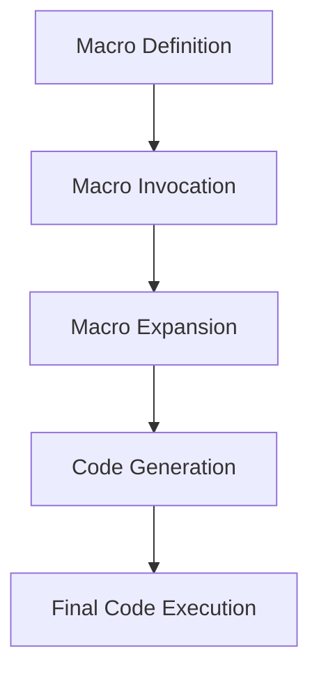

## 17.5.3 Advanced Macro Techniques

In this section, we delve into the advanced macro techniques that Clojure offers, which can significantly enhance your ability to write expressive and powerful code. As experienced Java developers, you are likely familiar with Java's reflection and annotation processing. However, Clojure's macros provide a more direct and flexible way to manipulate code at compile time. We will explore recursive macros, macro-generating macros, and how to handle macro expansion order effectively.

### Understanding Recursive Macros

Recursive macros are a powerful feature in Clojure that allow you to define macros that call themselves. This can be particularly useful for generating complex code structures or implementing domain-specific languages (DSLs).

#### Recursive Macro Example

Let's start with a simple example of a recursive macro that generates nested `let` bindings:

```clojure
(defmacro nested-let [bindings & body]
  (if (empty? bindings)
    `(do ~@body)
    `(let [~(first bindings) ~(second bindings)]
       (nested-let ~(drop 2 bindings) ~@body))))
```

**Explanation:**

- **Base Case:** If `bindings` is empty, the macro expands to a `do` block containing the `body`.
- **Recursive Case:** The macro creates a `let` binding for the first pair of `bindings` and recursively calls itself with the remaining bindings.

**Try It Yourself:**

Modify the `nested-let` macro to include a print statement that outputs each binding as it is created. This will help you understand the order of execution.

### Macro-Generating Macros

Macro-generating macros, also known as "macro macros," are macros that produce other macros. This technique can be used to create families of related macros or to encapsulate common patterns in macro definitions.

#### Example: Creating a Family of Logging Macros

Suppose we want to create a set of logging macros (`log-debug`, `log-info`, `log-error`) that share a common structure. We can use a macro-generating macro to achieve this:

```clojure
(defmacro deflogger [level]
  `(defmacro ~(symbol (str "log-" level)) [msg]
     `(println ~(str "[" (clojure.string/upper-case ~level) "]") ~msg)))

(deflogger "debug")
(deflogger "info")
(deflogger "error")
```

**Explanation:**

- **`deflogger` Macro:** This macro generates a new logging macro for each specified `level`.
- **Generated Macros:** The `log-debug`, `log-info`, and `log-error` macros are created with consistent behavior.

**Try It Yourself:**

Extend the `deflogger` macro to include a timestamp in each log message. This will provide more context for each log entry.

### Handling Macro Expansion Order

Understanding and controlling the order of macro expansion is crucial when writing complex macros. Clojure provides tools like `macroexpand` and `macroexpand-1` to help you visualize and debug macro expansions.

#### Example: Debugging Macro Expansion

Consider a macro that generates a series of function calls:

```clojure
(defmacro chain [& forms]
  (reduce (fn [acc form]
            `(-> ~acc ~form))
          forms))

(macroexpand-1 '(chain (inc) (dec) (str)))
```

**Explanation:**

- **`chain` Macro:** This macro uses the threading macro `->` to chain function calls.
- **`macroexpand-1`:** This function shows the first step of macro expansion, helping you understand how the macro transforms the code.

**Try It Yourself:**

Experiment with `macroexpand` and `macroexpand-1` on different macros to see how they transform code. This practice will deepen your understanding of macro expansion order.

### Advanced Techniques and Best Practices

#### Quoting and Unquoting

Quoting (`'`) and unquoting (`~`) are essential tools in macro writing. They allow you to control which parts of the macro are evaluated and which are treated as code.

#### Hygiene and Avoiding Variable Capture

Hygienic macros prevent variable capture by ensuring that variables within the macro do not interfere with variables in the surrounding code. Clojure's `gensym` function is often used to generate unique symbols.

#### Error Handling in Macros

Macros can include error handling to provide meaningful messages when used incorrectly. This can be achieved by checking conditions and throwing exceptions with descriptive messages.

### Diagrams and Visualizations

To better understand the flow of macro expansion and transformation, let's visualize a simple macro expansion process:



**Diagram Explanation:**

- **Macro Definition:** The initial definition of the macro.
- **Macro Invocation:** The point where the macro is called in the code.
- **Macro Expansion:** The process of transforming the macro into executable code.
- **Code Generation:** The resulting code after expansion.
- **Final Code Execution:** The execution of the generated code.

### Exercises and Practice Problems

1. **Recursive Macro Challenge:** Create a recursive macro that generates a nested series of `if` statements. Test it with different conditions and actions.

2. **Macro-Generating Macro Exercise:** Write a macro-generating macro that creates a set of arithmetic operation macros (`add`, `subtract`, `multiply`, `divide`). Ensure each macro performs the correct operation.

3. **Macro Expansion Debugging:** Use `macroexpand` to debug a complex macro you have written. Identify any issues with expansion order and correct them.

### Key Takeaways

- **Recursive Macros:** Allow for complex code generation by calling themselves.
- **Macro-Generating Macros:** Enable the creation of related macros with shared patterns.
- **Macro Expansion Order:** Understanding and controlling expansion order is crucial for writing effective macros.
- **Best Practices:** Use quoting, unquoting, and hygiene to write robust and maintainable macros.

By mastering these advanced macro techniques, you can harness the full power of Clojure's metaprogramming capabilities, creating expressive and efficient code that goes beyond what is possible in Java.

For further reading, explore the [Official Clojure Documentation](https://clojure.org/reference/macros) and [ClojureDocs](https://clojuredocs.org/).

## Quiz: Test Your Knowledge on Advanced Macro Techniques



### What is a recursive macro in Clojure?

- [x] A macro that calls itself to generate complex code structures.
- [ ] A macro that generates other macros.
- [ ] A macro that expands into a single function call.
- [ ] A macro that handles errors during expansion.

> **Explanation:** Recursive macros call themselves to generate complex code structures, similar to recursive functions.

### Which function helps visualize macro expansion in Clojure?

- [x] `macroexpand`
- [ ] `println`
- [ ] `reduce`
- [ ] `gensym`

> **Explanation:** `macroexpand` is used to visualize and debug macro expansions in Clojure.

### What is the purpose of a macro-generating macro?

- [x] To create a family of related macros with shared patterns.
- [ ] To execute code at runtime.
- [ ] To handle errors in macros.
- [ ] To optimize performance.

> **Explanation:** Macro-generating macros create related macros with shared patterns, enhancing code reuse.

### How can you prevent variable capture in macros?

- [x] Use `gensym` to generate unique symbols.
- [ ] Use `println` to debug variables.
- [ ] Use `reduce` to combine variables.
- [ ] Use `macroexpand` to visualize variables.

> **Explanation:** `gensym` generates unique symbols to prevent variable capture in macros.

### What is the role of quoting in macros?

- [x] To control which parts of the macro are evaluated.
- [ ] To execute code at runtime.
- [ ] To generate unique symbols.
- [ ] To handle errors in macros.

> **Explanation:** Quoting controls which parts of the macro are evaluated and which are treated as code.

### Which of the following is a best practice for writing macros?

- [x] Ensure macros are hygienic to avoid variable capture.
- [ ] Use macros to execute code at runtime.
- [ ] Avoid using `gensym` for unique symbols.
- [ ] Use macros to handle errors in functions.

> **Explanation:** Ensuring macros are hygienic prevents variable capture and maintains code integrity.

### What is the benefit of using macro-generating macros?

- [x] They enable code reuse by creating related macros.
- [ ] They execute code at runtime.
- [ ] They optimize performance.
- [ ] They handle errors in macros.

> **Explanation:** Macro-generating macros enable code reuse by creating related macros with shared patterns.

### How can you debug a complex macro?

- [x] Use `macroexpand` to visualize the expansion process.
- [ ] Use `println` to print variables.
- [ ] Use `reduce` to combine expressions.
- [ ] Use `gensym` to generate unique symbols.

> **Explanation:** `macroexpand` helps visualize and debug the expansion process of complex macros.

### What is a key takeaway from advanced macro techniques?

- [x] Macros can generate complex code structures and enhance expressiveness.
- [ ] Macros execute code at runtime.
- [ ] Macros optimize performance.
- [ ] Macros handle errors in functions.

> **Explanation:** Advanced macro techniques allow macros to generate complex code structures and enhance expressiveness.

### True or False: Macros in Clojure can execute code at runtime.

- [ ] True
- [x] False

> **Explanation:** Macros in Clojure transform code at compile time, not runtime.


