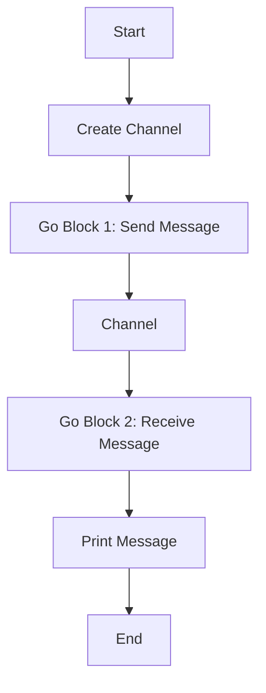

## 17.6.1 The `clojure.core.async` DSL

Asynchronous programming is a crucial aspect of modern software development, enabling applications to perform non-blocking operations and handle multiple tasks concurrently. In Clojure, the `core.async` library provides a powerful Domain-Specific Language (DSL) for asynchronous programming, allowing developers to write code that looks synchronous while managing concurrency effectively. This section delves into the `core.async` DSL, exploring its concepts, features, and practical applications.

### Understanding Asynchronous Programming

Before diving into `core.async`, let's briefly discuss asynchronous programming and its significance. Asynchronous programming allows a program to initiate a potentially time-consuming operation and continue executing other tasks while waiting for the operation to complete. This approach is particularly useful for I/O-bound tasks, such as network requests or file operations, where waiting for a response can block the main execution thread.

In Java, asynchronous programming is often achieved using threads, futures, or callbacks. However, managing these constructs can be complex and error-prone, especially when dealing with shared mutable state. Clojure's `core.async` library offers a more elegant solution by providing a set of abstractions that simplify asynchronous programming.

### Introduction to `core.async`

The `core.async` library is inspired by the Communicating Sequential Processes (CSP) model, which uses channels for communication between concurrent processes. In `core.async`, channels are used to pass messages between different parts of a program, allowing for decoupled and non-blocking communication.

#### Key Concepts in `core.async`

- **Channels**: Channels are the primary means of communication in `core.async`. They act as conduits for passing messages between different parts of a program. Channels can be buffered or unbuffered, and they support operations such as `put!` and `take!` for sending and receiving messages.

- **Go Blocks**: Go blocks are a core feature of `core.async`, allowing developers to write asynchronous code that looks synchronous. A go block is a lightweight thread that can perform non-blocking operations using channels.

- **Alts**: The `alts!` function allows a go block to wait for multiple channel operations to complete, enabling the selection of the first available result.

- **Pipelines**: Pipelines are a higher-level abstraction for processing data through a series of transformations, using channels to pass data between stages.

### Using Channels in `core.async`

Channels are the backbone of `core.async`, providing a mechanism for communication between different parts of a program. Let's explore how to create and use channels in Clojure.

```clojure
(require '[clojure.core.async :refer [chan put! take! close!]])

;; Create a channel
(def my-channel (chan))

;; Put a value onto the channel
(put! my-channel "Hello, World!")

;; Take a value from the channel
(take! my-channel println)

;; Close the channel
(close! my-channel)
```

In this example, we create a channel using the `chan` function, put a value onto the channel with `put!`, and take a value from the channel using `take!`. The `println` function is used as a callback to print the value taken from the channel.

### Go Blocks: Writing Asynchronous Code

Go blocks are a powerful feature of `core.async`, allowing developers to write asynchronous code that appears synchronous. A go block is a lightweight thread that can perform non-blocking operations using channels.

```clojure
(require '[clojure.core.async :refer [go <! >! chan]])

(defn async-example []
  (let [c (chan)]
    (go
      (>! c "Hello from go block!")
      (println "Message sent"))
    (go
      (let [msg (<! c)]
        (println "Received message:" msg)))))

(async-example)
```

In this example, we define a function `async-example` that creates a channel `c`. We use two go blocks: one to send a message onto the channel using `>!`, and another to receive the message using `<!`. The `println` function is used to print the messages sent and received.

### Alts: Waiting for Multiple Channel Operations

The `alts!` function allows a go block to wait for multiple channel operations to complete, enabling the selection of the first available result. This feature is useful for handling multiple asynchronous tasks concurrently.

```clojure
(require '[clojure.core.async :refer [go alts! chan]])

(defn alts-example []
  (let [c1 (chan)
        c2 (chan)]
    (go
      (alts! [[c1 "Message from c1"]
              [c2 "Message from c2"]]
             (fn [[v ch]]
               (println "Received from channel:" ch "Value:" v))))
    (go (>! c1 "Hello from c1"))))

(alts-example)
```

In this example, we create two channels, `c1` and `c2`, and use `alts!` to wait for a message from either channel. The first message received is printed along with the channel it was received from.

### Pipelines: Processing Data Streams

Pipelines are a higher-level abstraction in `core.async` for processing data through a series of transformations. They use channels to pass data between stages, allowing for concurrent processing of data streams.

```clojure
(require '[clojure.core.async :refer [pipeline chan close!]])

(defn pipeline-example []
  (let [input (chan)
        output (chan)]
    (pipeline 3 output (map inc) input)
    (go
      (doseq [i (range 5)]
        (>! input i))
      (close! input))
    (go
      (loop []
        (when-let [result (<! output)]
          (println "Processed result:" result)
          (recur))))))

(pipeline-example)
```

In this example, we create a pipeline with three stages that increment each value from the input channel and send the result to the output channel. The `doseq` loop sends values to the input channel, and the `loop` receives and prints processed results from the output channel.

### Comparing `core.async` with Java's Asynchronous Programming

Java provides several mechanisms for asynchronous programming, such as threads, futures, and the `CompletableFuture` class. While these constructs are powerful, they can be complex to manage, especially when dealing with shared mutable state.

In contrast, `core.async` offers a more declarative approach to asynchronous programming, using channels and go blocks to simplify concurrency management. This approach reduces the complexity of managing threads and synchronization, allowing developers to focus on the logic of their applications.

#### Java Example: Using `CompletableFuture`

```java
import java.util.concurrent.CompletableFuture;

public class AsyncExample {
    public static void main(String[] args) {
        CompletableFuture<String> future = CompletableFuture.supplyAsync(() -> {
            return "Hello from CompletableFuture!";
        });

        future.thenAccept(System.out::println);
    }
}
```

In this Java example, we use `CompletableFuture` to perform an asynchronous operation and print the result. While this approach is effective, it requires managing futures and callbacks, which can become complex in larger applications.

### Visualizing `core.async` Concepts

To better understand the flow of data in `core.async`, let's visualize the process using a Mermaid.js diagram.



**Diagram Description**: This diagram illustrates the flow of data in a `core.async` program. It shows the creation of a channel, the sending and receiving of messages using go blocks, and the final printing of the message.

### Try It Yourself

Now that we've explored the basics of `core.async`, try modifying the examples to deepen your understanding:

- **Experiment with Channel Buffers**: Modify the channel creation to use buffered channels and observe how it affects the program's behavior.
- **Create a Pipeline with Different Transformations**: Change the transformation function in the pipeline example to perform different operations on the data.
- **Implement a Timeout with `alts!`**: Use the `alts!` function to implement a timeout mechanism for receiving messages from a channel.

### Exercises

1. **Implement a Simple Chat Application**: Use `core.async` to create a simple chat application where multiple users can send and receive messages concurrently.
2. **Build a Web Crawler**: Use `core.async` to implement a web crawler that fetches and processes web pages asynchronously.
3. **Create a Real-Time Data Processing System**: Use `core.async` to build a system that processes real-time data streams and performs transformations on the data.

### Key Takeaways

- **Channels**: Channels are the primary means of communication in `core.async`, allowing for decoupled and non-blocking communication between different parts of a program.
- **Go Blocks**: Go blocks enable developers to write asynchronous code that looks synchronous, simplifying concurrency management.
- **Pipelines**: Pipelines provide a higher-level abstraction for processing data streams through a series of transformations.
- **Comparison with Java**: `core.async` offers a more declarative approach to asynchronous programming compared to Java's traditional mechanisms, reducing complexity and improving code readability.

By mastering the `core.async` DSL, you can harness the power of asynchronous programming in Clojure, enabling you to build efficient and scalable applications.

### Further Reading

- [Official Clojure Documentation](https://clojure.org/reference/async)
- [ClojureDocs: core.async](https://clojuredocs.org/clojure.core.async)
- [GitHub: core.async](https://github.com/clojure/core.async)

## Quiz: Mastering Clojure's Core Async DSL



### What is the primary purpose of channels in `core.async`?

- [x] To facilitate communication between different parts of a program
- [ ] To manage memory allocation
- [ ] To handle exceptions
- [ ] To perform mathematical calculations

> **Explanation:** Channels in `core.async` are used to pass messages between different parts of a program, enabling decoupled and non-blocking communication.

### How do go blocks in `core.async` help in writing asynchronous code?

- [x] They allow asynchronous code to look synchronous
- [ ] They increase the execution speed of the code
- [ ] They provide error handling mechanisms
- [ ] They manage memory allocation

> **Explanation:** Go blocks in `core.async` enable developers to write asynchronous code that appears synchronous, simplifying concurrency management.

### Which function in `core.async` allows a go block to wait for multiple channel operations?

- [x] `alts!`
- [ ] `put!`
- [ ] `take!`
- [ ] `close!`

> **Explanation:** The `alts!` function allows a go block to wait for multiple channel operations to complete, selecting the first available result.

### What is a key advantage of using pipelines in `core.async`?

- [x] They provide a higher-level abstraction for processing data streams
- [ ] They increase the speed of data processing
- [ ] They handle exceptions automatically
- [ ] They reduce memory usage

> **Explanation:** Pipelines in `core.async` offer a higher-level abstraction for processing data streams through a series of transformations, allowing for concurrent processing.

### How does `core.async` compare to Java's `CompletableFuture`?

- [x] `core.async` provides a more declarative approach to asynchronous programming
- [ ] `core.async` is faster than `CompletableFuture`
- [x] `core.async` simplifies concurrency management
- [ ] `core.async` is more memory-efficient

> **Explanation:** `core.async` offers a more declarative approach to asynchronous programming compared to Java's `CompletableFuture`, simplifying concurrency management and reducing complexity.

### What is the role of the `<!` operator in `core.async`?

- [x] To receive a message from a channel
- [ ] To send a message to a channel
- [ ] To close a channel
- [ ] To create a new channel

> **Explanation:** The `<!` operator is used to receive a message from a channel within a go block in `core.async`.

### What is the purpose of the `pipeline` function in `core.async`?

- [x] To process data through a series of transformations
- [ ] To create new channels
- [x] To pass data between stages using channels
- [ ] To handle exceptions

> **Explanation:** The `pipeline` function in `core.async` processes data through a series of transformations, using channels to pass data between stages.

### Which of the following is a feature of `core.async` channels?

- [x] They can be buffered or unbuffered
- [ ] They automatically handle exceptions
- [ ] They increase the speed of data processing
- [ ] They manage memory allocation

> **Explanation:** Channels in `core.async` can be buffered or unbuffered, providing flexibility in how messages are passed between different parts of a program.

### What is a common use case for the `alts!` function in `core.async`?

- [x] Implementing a timeout mechanism for receiving messages
- [ ] Increasing the speed of data processing
- [ ] Automatically handling exceptions
- [ ] Managing memory allocation

> **Explanation:** The `alts!` function is commonly used to implement a timeout mechanism for receiving messages from a channel in `core.async`.

### True or False: Go blocks in `core.async` are heavyweight threads.

- [ ] True
- [x] False

> **Explanation:** Go blocks in `core.async` are lightweight threads, allowing for efficient asynchronous programming without the overhead of traditional threads.


