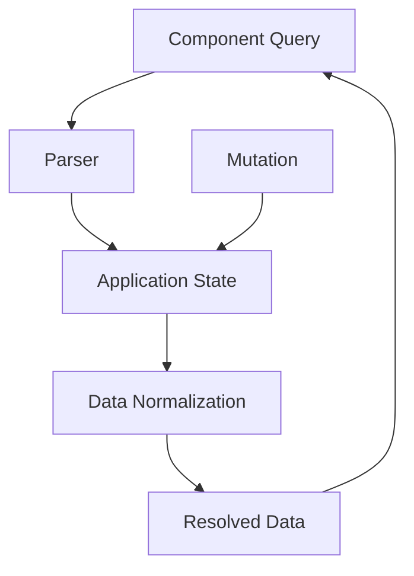

## 17.6.2 `om.next` Query Language

In this section, we delve into the `om.next` query language, a powerful Domain-Specific Language (DSL) in Clojure that draws inspiration from GraphQL. This DSL is designed to query application state efficiently, offering a declarative approach to data fetching and manipulation. As experienced Java developers transitioning to Clojure, you'll find `om.next` to be a compelling tool that enhances your ability to manage complex application states with ease.

### Introduction to `om.next`

`om.next` is a ClojureScript library that builds upon the ideas of its predecessor, Om, to provide a more robust and flexible framework for building user interfaces. It introduces a novel approach to managing application state and data flow, leveraging a query language similar to GraphQL. This allows developers to specify precisely what data they need, reducing over-fetching and under-fetching issues commonly encountered in traditional RESTful architectures.

### The Inspiration from GraphQL

GraphQL, developed by Facebook, is a query language for APIs that allows clients to request only the data they need. It provides a more efficient and flexible alternative to REST by enabling clients to define the structure of the response. `om.next` adopts this philosophy, allowing Clojure developers to define queries that specify the exact shape of the data required by their components.

### Key Concepts in `om.next` Query Language

#### Queries and Components

In `om.next`, components are associated with queries that describe the data they require. This is akin to defining a contract between the component and the data layer. The query language allows you to express nested data requirements, making it easy to fetch complex data structures in a single request.

```clojure
(ns my-app.core
  (:require [om.next :as om :refer-macros [defui]]))

(defui MyComponent
  static om/IQuery
  (query [this]
    '[:user/name :user/email :user/friends]))
```

In this example, `MyComponent` declares a query that requests a user's name, email, and friends. The query is expressed as a vector of keywords, each representing a piece of data the component needs.

#### Parsing and Normalization

`om.next` introduces the concept of a parser, which interprets queries and retrieves the necessary data from the application state. The parser is responsible for resolving queries into actual data, often interacting with a remote server or local database.

Normalization is another crucial aspect of `om.next`. It involves transforming the application state into a normalized form, where entities are stored in a flat structure and referenced by unique identifiers. This approach simplifies data updates and ensures consistency across the application.

```clojure
(defn read [{:keys [state]} key params]
  (let [st @state]
    {:value (get st key)}))
```

The `read` function is a simple parser implementation that retrieves data from the application state based on the query key.

#### Mutations

In addition to queries, `om.next` supports mutations, which are operations that modify the application state. Mutations are defined similarly to queries but include logic for updating the state.

```clojure
(defmethod mutate 'user/update-email
  [{:keys [state]} _ {:keys [email]}]
  {:action #(swap! state assoc-in [:user :email] email)})
```

Here, the `mutate` method defines a mutation that updates a user's email address. The mutation logic is encapsulated within the `:action` key, which performs the state update.

### Comparing `om.next` with Java Approaches

In Java, managing application state often involves using frameworks like Spring or Hibernate, which rely on object-oriented principles and annotations to define data models and persistence logic. While these frameworks are powerful, they can lead to complex and tightly coupled codebases.

`om.next`, with its functional approach and declarative query language, offers a more modular and flexible alternative. By separating data requirements from component logic, `om.next` promotes a cleaner architecture and easier maintenance.

#### Java Example: Traditional REST API

```java
@RestController
@RequestMapping("/api")
public class UserController {

    @Autowired
    private UserService userService;

    @GetMapping("/user")
    public User getUser(@RequestParam String id) {
        return userService.findUserById(id);
    }
}
```

In this Java example, a REST controller defines an endpoint to fetch user data. The data structure is fixed, and any changes require modifications to both the client and server code.

#### Clojure Example: `om.next` Query

```clojure
(defui UserComponent
  static om/IQuery
  (query [this]
    '[:user/id :user/name :user/email]))
```

With `om.next`, the query is defined within the component, allowing for more flexibility and reducing the need for server-side changes when data requirements evolve.

### Advantages of `om.next` Query Language

- **Declarative Data Fetching**: Define what data is needed without worrying about how to fetch it.
- **Efficient State Management**: Normalization and parsing ensure consistent and efficient data handling.
- **Flexibility and Modularity**: Components are decoupled from data sources, making it easier to adapt to changing requirements.

### Try It Yourself

To get hands-on experience with `om.next`, try modifying the query in the `MyComponent` example to include additional user attributes, such as `:user/age` or `:user/address`. Observe how the changes affect the component's data requirements and explore how the parser resolves these queries.

### Visualizing `om.next` Data Flow

Below is a diagram illustrating the flow of data in an `om.next` application, from query definition to data retrieval and state update.



**Diagram Description**: This flowchart shows how a component query is processed by the parser, interacts with the application state, undergoes normalization, and returns resolved data to the component. Mutations directly update the application state.

### Exercises

1. **Define a New Component**: Create a new component that queries a list of products, including attributes like `:product/id`, `:product/name`, and `:product/price`.
2. **Implement a Mutation**: Write a mutation to update a product's price and integrate it with your component.
3. **Normalize Data**: Practice normalizing a nested data structure and observe how it simplifies updates.

### Key Takeaways

- `om.next` provides a powerful query language inspired by GraphQL, enabling efficient and flexible data management in Clojure applications.
- By separating data requirements from component logic, `om.next` promotes a modular and maintainable architecture.
- Understanding and leveraging `om.next` can significantly enhance your ability to build complex, data-driven applications in Clojure.

For further reading, explore the [Official Clojure Documentation](https://clojure.org) and [ClojureDocs](https://clojuredocs.org) for more in-depth information on `om.next` and related topics.

---

## Quiz: Mastering `om.next` Query Language



### What is the primary inspiration for the `om.next` query language?

- [x] GraphQL
- [ ] SQL
- [ ] REST
- [ ] SOAP

> **Explanation:** `om.next` is inspired by GraphQL, focusing on declarative data fetching.

### How does `om.next` handle data updates?

- [x] Through mutations
- [ ] Direct state modification
- [ ] Using RESTful endpoints
- [ ] Via SQL queries

> **Explanation:** `om.next` uses mutations to handle data updates, encapsulating state changes.

### What is the role of a parser in `om.next`?

- [x] To interpret queries and retrieve data
- [ ] To compile Clojure code
- [ ] To render UI components
- [ ] To manage user sessions

> **Explanation:** The parser interprets queries and retrieves the necessary data from the application state.

### What is a key advantage of using `om.next` over traditional REST APIs?

- [x] Declarative data fetching
- [ ] Faster network requests
- [ ] Easier server-side implementation
- [ ] Better error handling

> **Explanation:** `om.next` allows for declarative data fetching, specifying exactly what data is needed.

### Which of the following is a feature of `om.next`?

- [x] Data normalization
- [ ] Automatic UI rendering
- [ ] Built-in authentication
- [ ] SQL query support

> **Explanation:** `om.next` includes data normalization to manage application state efficiently.

### How are queries defined in `om.next`?

- [x] As vectors of keywords
- [ ] As SQL statements
- [ ] Using XML
- [ ] With JSON objects

> **Explanation:** Queries in `om.next` are defined as vectors of keywords representing data requirements.

### What is the purpose of normalization in `om.next`?

- [x] To transform state into a flat structure
- [ ] To encrypt data
- [ ] To compress data
- [ ] To validate user input

> **Explanation:** Normalization transforms the application state into a flat structure for consistency and efficiency.

### How does `om.next` differ from Java's traditional state management?

- [x] It uses a functional approach
- [ ] It relies on annotations
- [ ] It requires XML configuration
- [ ] It uses inheritance

> **Explanation:** `om.next` employs a functional approach, contrasting with Java's object-oriented state management.

### What is a mutation in `om.next`?

- [x] An operation that modifies application state
- [ ] A query for fetching data
- [ ] A UI component
- [ ] A database transaction

> **Explanation:** Mutations in `om.next` are operations that modify the application state.

### True or False: `om.next` queries can only fetch data from local state.

- [ ] True
- [x] False

> **Explanation:** `om.next` queries can fetch data from both local state and remote servers.


