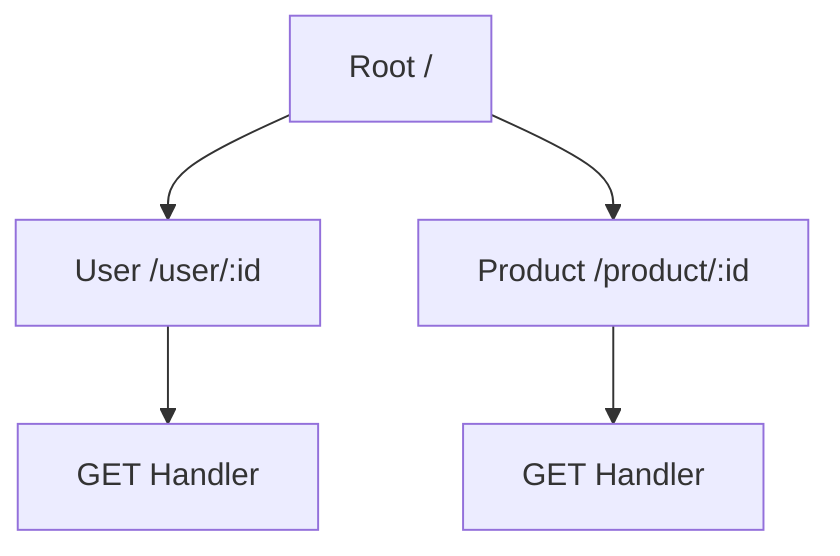

## 17.6.3 `reitit` Routing DSL

In the world of web development, defining routes is a fundamental task. For Java developers, this often involves using frameworks like Spring MVC or JAX-RS, which provide annotations and configuration files to map URLs to controller methods. In Clojure, the `reitit` library offers a powerful and flexible Domain-Specific Language (DSL) for defining routes in a more declarative and concise manner. This section will guide you through the `reitit` Routing DSL, illustrating how it simplifies route definitions and enhances the development experience.

### Introduction to `reitit`

`reitit` is a fast and flexible routing library for Clojure and ClojureScript. It is designed to be both simple and powerful, providing a DSL that allows developers to define routes in a way that is both expressive and easy to understand. Unlike traditional Java frameworks that rely heavily on annotations and XML configurations, `reitit` leverages Clojure's strengths in data manipulation and functional programming to offer a more streamlined approach.

#### Key Features of `reitit`

- **Declarative Route Definitions**: Define routes using data structures, making them easy to read and modify.
- **Middleware Support**: Attach middleware to routes or route groups for cross-cutting concerns like authentication and logging.
- **Path Parameters and Query Parameters**: Easily extract parameters from URLs and queries.
- **Integration with Ring**: Seamlessly integrates with the Ring HTTP server, a common choice for Clojure web applications.
- **Extensibility**: Customize and extend routing behavior with ease.

### Getting Started with `reitit`

Before diving into the DSL, let's set up a basic Clojure project with `reitit`. We'll use Leiningen, a popular build tool for Clojure, to manage our project dependencies.

#### Setting Up the Project

First, create a new Leiningen project:

```bash
lein new app reitit-example
```

Next, add `reitit` to your `project.clj` dependencies:

```clojure
(defproject reitit-example "0.1.0-SNAPSHOT"
  :dependencies [[org.clojure/clojure "1.10.3"]
                 [metosin/reitit "0.5.15"]
                 [ring/ring-core "1.9.4"]
                 [ring/ring-jetty-adapter "1.9.4"]])
```

Run `lein deps` to download the dependencies.

### Defining Routes with `reitit`

With `reitit`, routes are defined using Clojure data structures, typically vectors or maps. This approach provides a clear and concise way to specify routes and their associated handlers.

#### Basic Route Definition

Let's start with a simple example. We'll define a route that responds to HTTP GET requests at the root path (`/`).

```clojure
(ns reitit-example.core
  (:require [reitit.ring :as ring]
            [ring.adapter.jetty :as jetty]))

(defn handler [request]
  {:status 200
   :headers {"Content-Type" "text/plain"}
   :body "Hello, World!"})

(def app
  (ring/ring-handler
    (ring/router
      [["/" {:get handler}]])))

(defn -main []
  (jetty/run-jetty app {:port 3000 :join? false}))
```

In this example, we define a single route that maps the root path `/` to a handler function. The handler returns a simple HTTP response with a status code, headers, and body.

#### Running the Application

To run the application, execute the following command:

```bash
lein run
```

Visit `http://localhost:3000` in your browser, and you should see "Hello, World!" displayed.

### Advanced Routing Features

`reitit` offers a variety of features that make it easy to define complex routing logic. Let's explore some of these features in more detail.

#### Path Parameters

Path parameters allow you to capture dynamic segments of a URL. For example, consider a route that captures a user ID from the URL.

```clojure
(defn user-handler [request]
  (let [user-id (get-in request [:path-params :id])]
    {:status 200
     :headers {"Content-Type" "text/plain"}
     :body (str "User ID: " user-id)}))

(def app
  (ring/ring-handler
    (ring/router
      [["/user/:id" {:get user-handler}]])))
```

In this example, the route `/user/:id` captures the `id` segment of the URL and makes it available in the `:path-params` map of the request.

#### Middleware

Middleware functions are a powerful way to add cross-cutting concerns to your application, such as authentication, logging, or error handling. `reitit` allows you to attach middleware to individual routes or groups of routes.

```clojure
(defn wrap-logging [handler]
  (fn [request]
    (println "Request received:" request)
    (handler request)))

(def app
  (ring/ring-handler
    (ring/router
      [["/user/:id" {:get user-handler
                     :middleware [wrap-logging]}]])))
```

In this example, the `wrap-logging` middleware logs each incoming request before passing it to the handler.

#### Route Groups

Route groups allow you to apply middleware or other settings to multiple routes at once. This is useful for organizing routes and reducing duplication.

```clojure
(def app
  (ring/ring-handler
    (ring/router
      ["/api"
       {:middleware [wrap-logging]}
       ["/user/:id" {:get user-handler}]
       ["/product/:id" {:get product-handler}]])))
```

Here, the `wrap-logging` middleware is applied to all routes under the `/api` path.

### Comparing `reitit` with Java Routing

Java developers are often familiar with routing using annotations or XML configurations. Let's compare `reitit` with a typical Java routing setup.

#### Java Example with Spring MVC

In Spring MVC, you might define a route using annotations like this:

```java
@RestController
public class UserController {

    @GetMapping("/user/{id}")
    public ResponseEntity<String> getUser(@PathVariable String id) {
        return ResponseEntity.ok("User ID: " + id);
    }
}
```

#### Clojure Example with `reitit`

The equivalent `reitit` route is defined using a data structure:

```clojure
(def app
  (ring/ring-handler
    (ring/router
      [["/user/:id" {:get user-handler}]])))
```

**Comparison**:
- **Declarative vs. Imperative**: `reitit` uses a declarative approach with data structures, while Java uses annotations and imperative code.
- **Flexibility**: `reitit` allows for more flexible and dynamic route definitions, as routes are just data that can be manipulated programmatically.
- **Conciseness**: `reitit` routes are often more concise, reducing boilerplate code.

### Visualizing Route Definitions

To better understand how `reitit` routes are structured, let's visualize a simple routing setup using a diagram.



**Diagram Explanation**: This diagram illustrates a basic routing structure with a root path and two sub-paths for user and product resources. Each path is associated with a GET handler.

### Try It Yourself

Now that we've explored the basics of `reitit`, try modifying the example code to add new routes or middleware. Here are some ideas:

- Add a new route for a `/product/:id` path with a corresponding handler.
- Implement middleware that checks for a specific header in the request.
- Create a route group for `/admin` paths with authentication middleware.

### Exercises

1. **Define a Route with Query Parameters**: Create a route that accepts query parameters and returns them in the response.
2. **Implement Custom Middleware**: Write middleware that logs the response time for each request.
3. **Nested Route Groups**: Define nested route groups with different middleware applied at each level.

### Summary and Key Takeaways

- **`reitit` DSL**: A powerful and flexible way to define routes in Clojure web applications.
- **Declarative Approach**: Routes are defined using data structures, making them easy to read and modify.
- **Middleware and Extensibility**: Attach middleware to routes or groups for cross-cutting concerns.
- **Comparison with Java**: `reitit` offers a more concise and flexible alternative to traditional Java routing frameworks.

By leveraging `reitit`, you can build robust and maintainable web applications in Clojure with ease. Now that we've explored how `reitit` simplifies route definitions, let's apply these concepts to enhance your web development projects.

For further reading, check out the [Official `reitit` Documentation](https://github.com/metosin/reitit) and explore more examples on [ClojureDocs](https://clojuredocs.org/).

## Quiz: Mastering `reitit` Routing DSL in Clojure



### What is the primary advantage of using `reitit` for routing in Clojure?

- [x] Declarative route definitions using data structures
- [ ] Annotations similar to Java frameworks
- [ ] XML configuration files
- [ ] Built-in database integration

> **Explanation:** `reitit` uses data structures for route definitions, making them easy to read and modify.

### How does `reitit` handle path parameters in routes?

- [x] By capturing dynamic segments of the URL
- [ ] By using query strings
- [ ] Through XML configuration
- [ ] Using annotations

> **Explanation:** `reitit` captures path parameters as dynamic segments of the URL, accessible in the request map.

### Which of the following is a feature of `reitit`?

- [x] Middleware support
- [ ] Built-in ORM
- [ ] Annotation-based routing
- [ ] XML-based configuration

> **Explanation:** `reitit` supports middleware, allowing developers to attach cross-cutting concerns to routes.

### In `reitit`, how are routes typically defined?

- [x] Using vectors or maps
- [ ] With annotations
- [ ] Through XML files
- [ ] Using Java classes

> **Explanation:** Routes in `reitit` are defined using Clojure data structures like vectors or maps.

### What is the purpose of middleware in `reitit`?

- [x] To add cross-cutting concerns like logging or authentication
- [ ] To define database schemas
- [ ] To handle XML configurations
- [ ] To manage Java class dependencies

> **Explanation:** Middleware in `reitit` is used to add functionalities like logging or authentication to routes.

### How does `reitit` compare to Java's Spring MVC in terms of route definition?

- [x] `reitit` uses data structures, while Spring MVC uses annotations
- [ ] Both use XML configurations
- [ ] `reitit` uses annotations, while Spring MVC uses data structures
- [ ] Both rely on Java classes

> **Explanation:** `reitit` defines routes using data structures, whereas Spring MVC uses annotations.

### What is a route group in `reitit`?

- [x] A collection of routes with shared middleware or settings
- [ ] A Java class for handling routes
- [ ] An XML configuration file
- [ ] A database table for routes

> **Explanation:** Route groups in `reitit` allow for shared middleware or settings across multiple routes.

### Which of the following is a common use case for `reitit` middleware?

- [x] Logging requests
- [ ] Defining database schemas
- [ ] Managing XML configurations
- [ ] Compiling Java classes

> **Explanation:** Middleware in `reitit` is commonly used for logging requests and other cross-cutting concerns.

### What is the benefit of using `reitit`'s declarative approach to routing?

- [x] Easier to read and modify routes
- [ ] Requires more boilerplate code
- [ ] Relies on XML configurations
- [ ] Requires Java annotations

> **Explanation:** `reitit`'s declarative approach makes routes easier to read and modify.

### True or False: `reitit` integrates seamlessly with the Ring HTTP server.

- [x] True
- [ ] False

> **Explanation:** `reitit` is designed to integrate seamlessly with the Ring HTTP server, a common choice for Clojure web applications.


