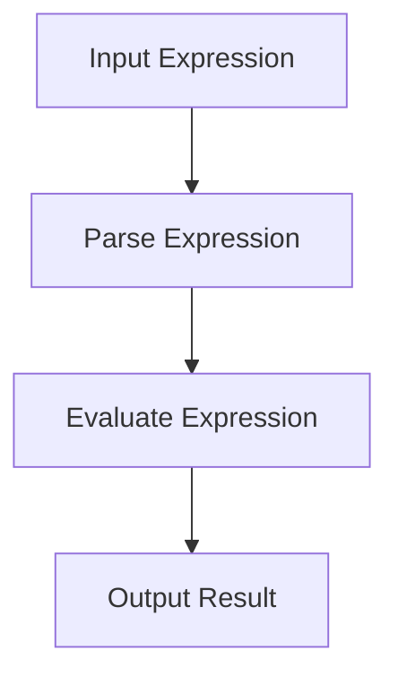

## 17.7.1 Complexity and Readability

As experienced Java developers transitioning to Clojure, you may find yourself intrigued by the power of metaprogramming and Domain-Specific Languages (DSLs). While DSLs can significantly enhance expressiveness and reduce boilerplate, they can also introduce complexity and hinder readability if not designed with care. In this section, we will explore the challenges of complexity and readability in Clojure DSLs and provide strategies to maintain simplicity and clarity.

### Understanding DSL Complexity

DSLs are specialized languages tailored to a specific problem domain. They can be internal, embedded within a host language like Clojure, or external, with their own syntax and parser. Internal DSLs leverage the host language's syntax and semantics, making them easier to integrate but also prone to complexity if not carefully managed.

#### The Power and Pitfalls of DSLs

**Advantages of DSLs:**
- **Expressiveness:** DSLs allow domain experts to express solutions in terms that are natural to them.
- **Abstraction:** They abstract away low-level details, focusing on the problem domain.
- **Reusability:** DSLs can encapsulate common patterns, making code more reusable.

**Challenges of DSLs:**
- **Complexity:** As DSLs grow, they can become difficult to understand and maintain.
- **Readability:** Non-standard syntax can confuse developers unfamiliar with the DSL.
- **Integration:** DSLs must integrate seamlessly with the host language and existing systems.

### Strategies for Maintaining Simplicity

To harness the benefits of DSLs without succumbing to complexity, consider the following strategies:

#### 1. **Keep It Simple**

The KISS (Keep It Simple, Stupid) principle is paramount in DSL design. Aim for minimalism and clarity. Avoid adding features that do not directly contribute to solving the domain problem.

#### 2. **Leverage Clojure's Simplicity**

Clojure's syntax is inherently simple and consistent. Use this to your advantage by designing DSLs that align with Clojure's idioms. For example, use Clojure's data structures and functions to represent DSL constructs.

**Example: A Simple DSL for Arithmetic Expressions**

```clojure
(defn evaluate [expr]
  (cond
    (number? expr) expr
    (list? expr)
    (let [[op & args] expr]
      (case op
        '+ (apply + (map evaluate args))
        '- (apply - (map evaluate args))
        '* (apply * (map evaluate args))
        '/ (apply / (map evaluate args))))))

;; Usage
(evaluate '(+ 1 2 (* 3 4))) ; => 15
```

*In this example, we define a simple DSL for arithmetic expressions using Clojure's list syntax. The `evaluate` function recursively processes the expression, demonstrating how Clojure's simplicity can be leveraged to create a readable DSL.*

#### 3. **Use Descriptive Naming**

Choose names that clearly convey the purpose and behavior of DSL constructs. Descriptive names improve readability and help developers understand the DSL's intent.

#### 4. **Provide Documentation and Examples**

Comprehensive documentation and examples are crucial for any DSL. They guide users in understanding the DSL's capabilities and limitations. Consider creating a user guide or reference manual.

#### 5. **Limit Scope and Features**

Avoid feature creep by limiting the DSL's scope to the essential aspects of the problem domain. This focus helps prevent unnecessary complexity and keeps the DSL manageable.

#### 6. **Encourage Community Feedback**

Engage with the community to gather feedback on the DSL's design and usability. Community input can provide valuable insights and help identify areas for improvement.

### Comparing Clojure DSLs with Java

Java developers are accustomed to using libraries and frameworks to achieve domain-specific functionality. While Java's verbosity can sometimes hinder expressiveness, it also enforces a level of structure that can aid readability.

**Java Example: Arithmetic Expressions**

```java
public class ExpressionEvaluator {
    public static int evaluate(Expression expr) {
        if (expr instanceof NumberExpression) {
            return ((NumberExpression) expr).getValue();
        } else if (expr instanceof BinaryExpression) {
            BinaryExpression binary = (BinaryExpression) expr;
            int left = evaluate(binary.getLeft());
            int right = evaluate(binary.getRight());
            switch (binary.getOperator()) {
                case ADD: return left + right;
                case SUBTRACT: return left - right;
                case MULTIPLY: return left * right;
                case DIVIDE: return left / right;
                default: throw new IllegalArgumentException("Unknown operator");
            }
        }
        throw new IllegalArgumentException("Unknown expression type");
    }
}
```

*In Java, we define classes to represent different types of expressions. While this approach is more verbose than Clojure, it provides a clear structure that can aid readability.*

### Balancing Complexity and Readability

Finding the right balance between complexity and readability is key to successful DSL design. Here are some additional tips:

#### Use Macros Judiciously

Macros are powerful tools in Clojure that can transform code at compile time. However, they can also obscure the underlying logic if overused. Use macros to simplify repetitive patterns, but avoid using them for complex logic that could be expressed more clearly with functions.

**Example: Macro for Repetitive Patterns**

```clojure
(defmacro with-logging [expr]
  `(do
     (println "Executing:" '~expr)
     (let [result# ~expr]
       (println "Result:" result#)
       result#)))

;; Usage
(with-logging (+ 1 2)) ; Logs the expression and result
```

*The `with-logging` macro simplifies logging around expressions, demonstrating how macros can reduce boilerplate while maintaining readability.*

#### Diagramming DSL Flow

Visualizing the flow of data through a DSL can enhance understanding. Consider using diagrams to illustrate how DSL constructs interact and transform data.



*This diagram illustrates the flow of data through an arithmetic expression DSL, from input parsing to evaluation and output.*

#### Encourage Best Practices

Promote best practices for using the DSL, such as consistent naming conventions and idiomatic usage patterns. Encourage developers to follow these practices to maintain code quality.

### Exercises and Practice Problems

1. **Design a Simple DSL:** Create a DSL for a domain of your choice, such as a task management system or a configuration language. Focus on simplicity and readability.

2. **Refactor a Complex DSL:** Identify a complex DSL in an existing project and refactor it to improve readability. Document the changes and their impact on code clarity.

3. **Compare DSLs:** Compare a Clojure DSL with a similar Java library or framework. Analyze the trade-offs in terms of complexity, readability, and expressiveness.

### Key Takeaways

- **DSLs Enhance Expressiveness:** DSLs can make code more expressive and aligned with domain concepts.
- **Complexity Management is Crucial:** Without careful design, DSLs can become complex and hinder readability.
- **Leverage Clojure's Simplicity:** Use Clojure's simple syntax and semantics to create clear and concise DSLs.
- **Balance Features and Readability:** Focus on essential features and maintain a balance between expressiveness and clarity.

By understanding the challenges of complexity and readability in DSLs and applying these strategies, you can create powerful, maintainable, and user-friendly DSLs in Clojure. Now that we've explored how to manage complexity in DSLs, let's apply these concepts to enhance your Clojure projects.

## Quiz: Mastering Complexity and Readability in Clojure DSLs



### What is a primary advantage of using DSLs?

- [x] They allow domain experts to express solutions in natural terms.
- [ ] They increase the verbosity of code.
- [ ] They make integration with other languages difficult.
- [ ] They require complex syntax.

> **Explanation:** DSLs are designed to allow domain experts to express solutions in terms that are natural to them, enhancing expressiveness and abstraction.

### Which principle is crucial for maintaining simplicity in DSL design?

- [x] Keep It Simple, Stupid (KISS)
- [ ] Feature Creep
- [ ] Complexity Maximization
- [ ] Verbosity Enhancement

> **Explanation:** The KISS principle emphasizes simplicity and clarity, which are crucial for maintaining simplicity in DSL design.

### How can macros be used effectively in DSLs?

- [x] To simplify repetitive patterns
- [ ] To obscure logic
- [ ] To increase complexity
- [ ] To replace all functions

> **Explanation:** Macros can be used effectively to simplify repetitive patterns, reducing boilerplate while maintaining readability.

### What is a potential drawback of using macros excessively?

- [x] They can obscure the underlying logic.
- [ ] They simplify code too much.
- [ ] They are always slower than functions.
- [ ] They are not supported in Clojure.

> **Explanation:** Excessive use of macros can obscure the underlying logic, making code harder to understand.

### Which strategy can help improve DSL readability?

- [x] Use descriptive naming
- [ ] Increase feature set
- [ ] Use complex syntax
- [ ] Avoid documentation

> **Explanation:** Using descriptive naming helps improve readability by clearly conveying the purpose and behavior of DSL constructs.

### What is a key difference between Clojure DSLs and Java libraries?

- [x] Clojure DSLs leverage simple syntax and semantics.
- [ ] Java libraries are always more expressive.
- [ ] Clojure DSLs are more verbose.
- [ ] Java libraries cannot be used for domain-specific functionality.

> **Explanation:** Clojure DSLs leverage simple syntax and semantics, making them more concise and expressive compared to Java libraries.

### How can diagrams aid in understanding DSLs?

- [x] By visualizing the flow of data
- [ ] By increasing complexity
- [ ] By replacing code
- [ ] By obscuring logic

> **Explanation:** Diagrams can aid in understanding DSLs by visualizing the flow of data and illustrating how constructs interact.

### What should be avoided to maintain DSL simplicity?

- [x] Feature creep
- [ ] Descriptive naming
- [ ] Community feedback
- [ ] Documentation

> **Explanation:** Feature creep should be avoided to maintain DSL simplicity and prevent unnecessary complexity.

### What is the role of community feedback in DSL design?

- [x] To gather insights and identify areas for improvement
- [ ] To increase complexity
- [ ] To replace documentation
- [ ] To enforce strict syntax

> **Explanation:** Community feedback provides valuable insights and helps identify areas for improvement in DSL design.

### True or False: DSLs should always aim to replace all functions with macros.

- [ ] True
- [x] False

> **Explanation:** DSLs should not aim to replace all functions with macros, as macros can obscure logic if overused. They should be used judiciously to simplify repetitive patterns.


