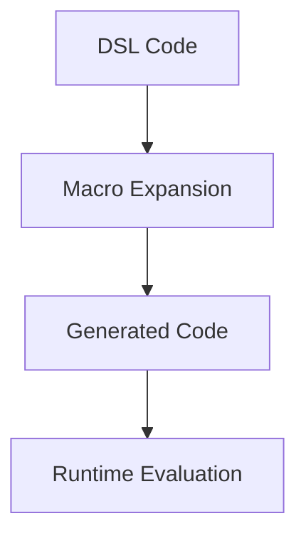

## 17.7.2 Debugging DSL Code

Debugging Domain-Specific Languages (DSLs) in Clojure can be a daunting task, especially for developers transitioning from Java. The power of Clojure's macros and metaprogramming capabilities allows for the creation of expressive and concise DSLs, but it also introduces unique challenges in debugging. In this section, we will explore these challenges and provide practical solutions to help you effectively debug DSL code in Clojure.

### Understanding the Challenges

When working with DSLs in Clojure, the primary challenge lies in the abstraction layers introduced by macros. Macros transform code at compile-time, which can obscure the original intent and make it difficult to trace errors. Additionally, the dynamic nature of Clojure and its reliance on runtime evaluation can further complicate debugging efforts.

#### Key Challenges in Debugging DSL Code

1. **Macro Expansion Complexity**: Macros can generate complex code that is difficult to understand and debug.
2. **Error Localization**: Identifying the source of an error in macro-generated code can be challenging.
3. **Code Clarity**: Maintaining readability and clarity in DSL code is essential for effective debugging.
4. **Tooling Limitations**: Traditional debugging tools may not fully support macro expansion and DSL-specific constructs.

### Leveraging Macro Expansion Tools

Macro expansion is a crucial step in understanding how your DSL code is transformed. Clojure provides several tools to assist in macro expansion, allowing you to inspect the generated code and identify potential issues.

#### Using `macroexpand` and `macroexpand-1`

The `macroexpand` and `macroexpand-1` functions are invaluable tools for inspecting macro-generated code. These functions allow you to see the code produced by a macro before it is evaluated.

```clojure
(defmacro my-macro [x]
  `(println "The value is:" ~x))

;; Using macroexpand-1 to see the transformation
(macroexpand-1 '(my-macro 42))
;; Output: (clojure.core/println "The value is:" 42)
```

**Explanation**: In this example, `macroexpand-1` reveals that `my-macro` transforms into a `println` expression. This insight helps in understanding how the macro operates and aids in debugging.

#### Visualizing Macro Transformations

Visualizing macro transformations can provide a clearer understanding of how DSL code is structured. Consider using diagrams to represent the flow of data and transformations within your DSL.



**Diagram Explanation**: This flowchart illustrates the process of transforming DSL code through macro expansion into generated code, which is then evaluated at runtime.

### Maintaining Code Clarity

Code clarity is essential for effective debugging. When working with DSLs, it's crucial to maintain a balance between abstraction and readability.

#### Tips for Maintaining Code Clarity

- **Use Descriptive Names**: Choose meaningful names for macros and DSL constructs to convey their purpose.
- **Document Macros**: Provide clear documentation for macros, including examples of usage and expected transformations.
- **Limit Macro Complexity**: Keep macros simple and focused on a single responsibility to reduce complexity.
- **Use Inline Comments**: Add comments within macro definitions to explain complex logic or transformations.

### Debugging Techniques for DSL Code

Effective debugging requires a combination of techniques tailored to the unique challenges of DSL code. Here are some strategies to consider:

#### Step-by-Step Debugging

1. **Isolate the Problem**: Identify the specific macro or DSL construct causing the issue.
2. **Expand Macros**: Use `macroexpand` to inspect the generated code and verify its correctness.
3. **Simplify the Code**: Reduce the code to a minimal example that reproduces the issue.
4. **Add Debugging Output**: Insert `println` statements or use logging to trace the execution flow.

#### Comparing with Java Debugging

Java developers are accustomed to using debuggers and stack traces to identify issues. While Clojure's dynamic nature presents different challenges, similar principles can be applied:

- **Use REPL for Interactive Debugging**: The Clojure REPL allows for interactive exploration and testing of code, similar to using a Java debugger.
- **Leverage Stack Traces**: Analyze stack traces to identify the source of errors, keeping in mind the additional layer of macro expansion.

### Practical Example: Debugging a Simple DSL

Let's walk through a practical example of debugging a simple DSL in Clojure. We'll create a DSL for defining mathematical expressions and demonstrate how to debug it.

#### Defining the DSL

```clojure
(defmacro defexpr [name & body]
  `(defn ~name [] ~@body))

(defexpr add-two-numbers
  (+ 1 2))
```

**Explanation**: The `defexpr` macro defines a function that evaluates a mathematical expression. In this case, `add-two-numbers` returns the sum of 1 and 2.

#### Debugging the DSL

Suppose we encounter an issue where the expression does not evaluate as expected. Here's how we can debug it:

1. **Expand the Macro**: Use `macroexpand-1` to inspect the transformation.

   ```clojure
   (macroexpand-1 '(defexpr add-two-numbers (+ 1 2)))
   ;; Output: (defn add-two-numbers [] (+ 1 2))
   ```

2. **Verify the Generated Code**: Ensure the generated code matches the intended logic.

3. **Test the Function**: Call the function and verify the output.

   ```clojure
   (add-two-numbers)
   ;; Output: 3
   ```

4. **Add Debugging Output**: If the output is incorrect, add `println` statements to trace the execution.

   ```clojure
   (defmacro defexpr [name & body]
     `(defn ~name []
        (println "Evaluating expression:" '~body)
        ~@body))
   ```

### Try It Yourself

Experiment with the following modifications to the DSL code:

- **Add a Subtraction Expression**: Extend the DSL to support subtraction and verify its correctness.
- **Introduce a Bug**: Intentionally introduce a bug in the macro and practice debugging it using the techniques discussed.

### External Resources

For further reading on Clojure macros and debugging techniques, consider the following resources:

- [Official Clojure Documentation](https://clojure.org/reference/macros)
- [ClojureDocs: Macro Reference](https://clojuredocs.org/quickref#macros)
- [Clojure Programming by Chas Emerick, Brian Carper, and Christophe Grand](https://www.oreilly.com/library/view/clojure-programming/9781449310387/)

### Exercises

1. **Create a Custom DSL**: Design a simple DSL for a specific domain (e.g., configuration management) and implement it using Clojure macros. Debug any issues that arise during development.

2. **Refactor a Java Codebase**: Identify a section of Java code that could benefit from a DSL and refactor it using Clojure. Compare the debugging process between the two implementations.

3. **Analyze a Complex DSL**: Choose an existing Clojure DSL (e.g., `clojure.core.async`) and analyze its macro usage. Practice debugging by expanding macros and tracing execution.

### Key Takeaways

- Debugging DSL code in Clojure requires a deep understanding of macro expansion and code transformations.
- Tools like `macroexpand` are essential for inspecting generated code and identifying issues.
- Maintaining code clarity and simplicity is crucial for effective debugging.
- Leveraging Java debugging techniques, such as stack traces and interactive exploration, can aid in debugging Clojure DSLs.

By mastering these techniques, you'll be well-equipped to tackle the challenges of debugging DSL code in Clojure and harness the full power of its metaprogramming capabilities.

## Quiz: Mastering Debugging in Clojure DSLs



### What is a primary challenge when debugging DSL code in Clojure?

- [x] Macro expansion complexity
- [ ] Lack of syntax highlighting
- [ ] Limited library support
- [ ] Absence of a REPL

> **Explanation:** Macro expansion complexity is a primary challenge because it can obscure the original code's intent, making it difficult to trace errors.

### Which Clojure function is used to inspect the transformation of macros?

- [x] `macroexpand`
- [ ] `println`
- [ ] `defmacro`
- [ ] `eval`

> **Explanation:** `macroexpand` is used to inspect the transformation of macros, allowing developers to see the generated code.

### What is a recommended practice for maintaining code clarity in DSLs?

- [x] Use descriptive names for macros
- [ ] Avoid comments
- [ ] Increase macro complexity
- [ ] Use global variables

> **Explanation:** Using descriptive names for macros helps convey their purpose, enhancing code clarity and readability.

### How can Java developers leverage their existing skills when debugging Clojure DSLs?

- [x] Use REPL for interactive debugging
- [ ] Ignore stack traces
- [ ] Avoid using debuggers
- [ ] Rely solely on print statements

> **Explanation:** Java developers can leverage their skills by using the REPL for interactive debugging, similar to using a Java debugger.

### What is the purpose of the `macroexpand-1` function?

- [x] To expand a single macro invocation
- [ ] To execute a macro
- [ ] To define a macro
- [ ] To compile a macro

> **Explanation:** `macroexpand-1` expands a single macro invocation, allowing developers to inspect the immediate transformation.

### Which tool can be used to visualize macro transformations?

- [x] Diagrams
- [ ] Text editors
- [ ] Compilers
- [ ] Version control systems

> **Explanation:** Diagrams can be used to visualize macro transformations, providing a clearer understanding of the code structure.

### What is a benefit of using inline comments in macro definitions?

- [x] Explaining complex logic
- [ ] Increasing code size
- [ ] Obfuscating code
- [ ] Reducing readability

> **Explanation:** Inline comments help explain complex logic within macro definitions, aiding in understanding and debugging.

### Which external resource is recommended for further reading on Clojure macros?

- [x] Official Clojure Documentation
- [ ] Java API Documentation
- [ ] Python Official Documentation
- [ ] Ruby on Rails Guides

> **Explanation:** The Official Clojure Documentation is a recommended resource for further reading on Clojure macros.

### What is a key takeaway from this section on debugging DSL code?

- [x] Tools like `macroexpand` are essential for inspecting generated code.
- [ ] Avoid using macros in DSLs.
- [ ] DSLs are inherently easy to debug.
- [ ] Java debugging techniques are not applicable to Clojure.

> **Explanation:** Tools like `macroexpand` are essential for inspecting generated code and identifying issues in DSLs.

### True or False: Maintaining code clarity is not important when working with DSLs.

- [ ] True
- [x] False

> **Explanation:** False. Maintaining code clarity is crucial for effective debugging and understanding of DSL code.


