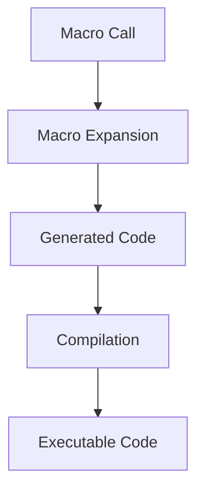

## 17.7.3 Performance Considerations

In this section, we delve into the performance considerations associated with using macros in Clojure, particularly in the context of metaprogramming and domain-specific languages (DSLs). As experienced Java developers transitioning to Clojure, understanding these nuances will help you write efficient and performant Clojure code. We'll explore how macros can affect both compilation time and runtime performance, and discuss strategies to mitigate potential overhead.

### Understanding Macros and Their Impact on Performance

Macros in Clojure are a powerful tool for metaprogramming, allowing developers to extend the language by writing code that writes code. This capability can lead to more expressive and concise programs. However, it also introduces performance considerations that must be carefully managed.

#### Compilation Time Overhead

Macros are expanded at compile time, which means they can increase the time it takes to compile your code. This is because the macro expansion process involves transforming macro calls into executable code, which can be complex depending on the macro's logic.

**Example: A Simple Macro**

```clojure
(defmacro unless [condition & body]
  `(if (not ~condition)
     (do ~@body)))

;; Usage
(unless false
  (println "This will print because the condition is false."))
```

In this example, the `unless` macro is expanded into an `if` expression during compilation. While this macro is simple, more complex macros can significantly increase compilation time.

#### Runtime Overhead

While macros themselves do not introduce runtime overhead (since they are expanded at compile time), the code they generate can impact runtime performance. For instance, if a macro generates inefficient code or excessive function calls, it can slow down execution.

**Example: Inefficient Macro Expansion**

```clojure
(defmacro repeat-n-times [n & body]
  `(dotimes [_ ~n]
     ~@body))

;; Usage
(repeat-n-times 1000
  (println "This is inefficient if the body is complex."))
```

In this case, if the body of the macro is complex or involves heavy computation, the repeated execution can lead to performance bottlenecks.

### Optimizing Macro Performance

To ensure that macros do not negatively impact performance, consider the following optimization techniques:

#### 1. Minimize Macro Complexity

Keep macros as simple as possible. Avoid embedding complex logic within macros, and instead, delegate complex operations to functions that can be called from the expanded code.

**Example: Simplifying Macros**

```clojure
(defmacro simple-repeat [n & body]
  `(dotimes [_ ~n]
     (simple-body ~@body)))

(defn simple-body [& body]
  (apply do body))
```

By moving the body execution to a separate function, we reduce the complexity within the macro itself.

#### 2. Use Functions for Repeated Logic

If a macro involves repeated logic, consider using functions to encapsulate that logic. This not only improves readability but also allows for better optimization by the Clojure compiler.

**Example: Function Encapsulation**

```clojure
(defmacro log-and-execute [expr]
  `(do
     (println "Executing:" '~expr)
     (execute ~expr)))

(defn execute [expr]
  (eval expr))
```

Here, the `execute` function handles the evaluation, keeping the macro focused on logging.

#### 3. Avoid Overuse of Macros

While macros are powerful, they should not be overused. Consider whether a function or a higher-order function could achieve the same result without the complexity of a macro.

**Example: Function vs. Macro**

```clojure
;; Using a function
(defn conditional-execute [condition f]
  (when condition
    (f)))

;; Using a macro
(defmacro conditional-execute-macro [condition & body]
  `(when ~condition
     (do ~@body)))
```

In many cases, a function like `conditional-execute` can be more efficient and easier to maintain than a macro.

### Comparing Clojure Macros with Java Reflection

Java developers might be familiar with using reflection for metaprogramming. While reflection provides runtime flexibility, it can introduce significant performance overhead due to its dynamic nature.

**Clojure Macros vs. Java Reflection**

- **Compile-Time vs. Runtime**: Clojure macros operate at compile time, generating static code that can be optimized by the compiler. In contrast, Java reflection occurs at runtime, which can slow down execution.
- **Type Safety**: Macros allow for compile-time type checking, whereas reflection bypasses compile-time checks, potentially leading to runtime errors.
- **Performance**: Macros can be more performant than reflection because they avoid the overhead of runtime type inspection and method invocation.

### Visualizing Macro Expansion

To better understand how macros transform code, let's visualize the macro expansion process using a Mermaid.js diagram.



**Diagram Explanation**: This diagram illustrates the flow from a macro call to executable code. The macro call is expanded into generated code, which is then compiled into executable code.

### Try It Yourself: Experimenting with Macros

To deepen your understanding of macros and their performance implications, try modifying the examples provided:

1. **Simplify the `repeat-n-times` Macro**: Refactor the macro to use a function for the body execution and measure any changes in performance.
2. **Create a New Macro**: Design a macro that generates a custom control structure, such as a `while` loop, and analyze its impact on compilation and runtime performance.

### Exercises and Practice Problems

1. **Exercise 1**: Write a macro that logs the execution time of a given expression. Ensure that the macro is efficient and does not introduce unnecessary overhead.
2. **Exercise 2**: Compare the performance of a macro-based solution with a function-based solution for a simple task, such as iterating over a collection and applying a transformation.

### Key Takeaways

- **Macros are powerful tools** for metaprogramming in Clojure, but they require careful consideration of performance implications.
- **Compilation time can increase** with complex macros, so strive for simplicity and delegate complex logic to functions.
- **Runtime performance is influenced** by the code generated by macros, so ensure that the generated code is efficient.
- **Avoid overusing macros**; consider whether functions or higher-order functions can achieve the desired result.
- **Clojure macros offer advantages** over Java reflection in terms of compile-time safety and performance.

By understanding and applying these performance considerations, you can harness the full power of Clojure macros while maintaining efficient and performant code.

### Further Reading

- [Clojure Macros Documentation](https://clojure.org/reference/macros)
- [Clojure Performance Tips](https://clojure.org/guides/performance)
- [Java Reflection Overview](https://docs.oracle.com/javase/tutorial/reflect/)

## Quiz: Test Your Understanding of Clojure Macros and Performance



### What is the primary advantage of using macros in Clojure?

- [x] They allow for compile-time code generation.
- [ ] They execute faster than functions.
- [ ] They are easier to write than functions.
- [ ] They provide runtime flexibility.

> **Explanation:** Macros in Clojure are used for compile-time code generation, allowing developers to extend the language and create new syntactic constructs.

### How do macros affect compilation time?

- [x] They can increase compilation time due to the expansion process.
- [ ] They decrease compilation time by simplifying code.
- [ ] They have no impact on compilation time.
- [ ] They only affect runtime performance.

> **Explanation:** Macros can increase compilation time because they involve transforming macro calls into executable code during the compilation process.

### What is a potential downside of using macros?

- [x] They can generate inefficient code if not carefully designed.
- [ ] They are always slower than functions.
- [ ] They cannot be used for metaprogramming.
- [ ] They are not supported in Clojure.

> **Explanation:** If not carefully designed, macros can generate inefficient code that impacts runtime performance.

### How can you optimize macro performance?

- [x] Minimize macro complexity and use functions for repeated logic.
- [ ] Use macros for all repetitive tasks.
- [ ] Avoid using functions within macros.
- [ ] Increase the number of macro expansions.

> **Explanation:** To optimize macro performance, minimize complexity and use functions for repeated logic to keep macros simple and efficient.

### What is a key difference between Clojure macros and Java reflection?

- [x] Macros operate at compile time, while reflection operates at runtime.
- [ ] Macros are slower than reflection.
- [ ] Reflection is type-safe, while macros are not.
- [ ] Macros provide runtime flexibility, while reflection does not.

> **Explanation:** Clojure macros operate at compile time, generating static code, whereas Java reflection operates at runtime, which can introduce performance overhead.

### Why should macros be used sparingly?

- [x] They can complicate code and increase maintenance overhead.
- [ ] They are not supported in all Clojure environments.
- [ ] They are slower than functions.
- [ ] They cannot be tested.

> **Explanation:** Macros should be used sparingly because they can complicate code and increase maintenance overhead if overused.

### What is the role of the `macroexpand` function in Clojure?

- [x] It shows the expanded form of a macro.
- [ ] It executes a macro.
- [ ] It compiles a macro into bytecode.
- [ ] It optimizes macro performance.

> **Explanation:** The `macroexpand` function in Clojure is used to show the expanded form of a macro, helping developers understand how macros transform code.

### How can you measure the impact of a macro on performance?

- [x] Compare the execution time of macro-generated code with equivalent function-based code.
- [ ] Use the `macroexpand` function to optimize the macro.
- [ ] Count the number of lines in the macro definition.
- [ ] Check the macro's syntax for errors.

> **Explanation:** To measure the impact of a macro on performance, compare the execution time of the macro-generated code with equivalent function-based code.

### What is a common use case for macros in Clojure?

- [x] Creating custom control structures.
- [ ] Performing runtime type checks.
- [ ] Optimizing memory usage.
- [ ] Simplifying function calls.

> **Explanation:** A common use case for macros in Clojure is creating custom control structures, allowing developers to extend the language's syntax.

### True or False: Macros in Clojure can introduce runtime overhead.

- [x] True
- [ ] False

> **Explanation:** While macros themselves do not introduce runtime overhead, the code they generate can impact runtime performance if not carefully designed.


