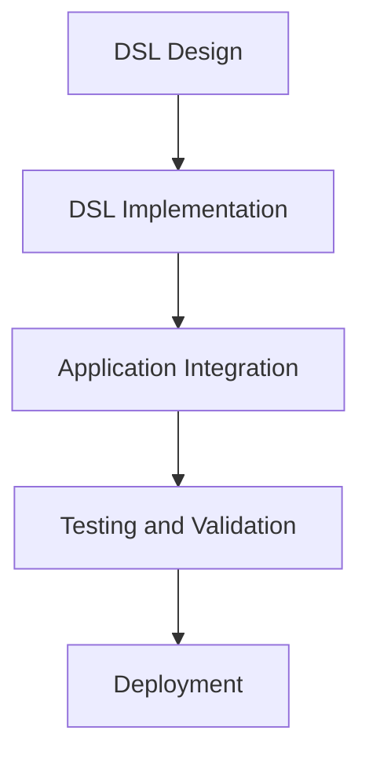

## 17.8.1 Embedding DSLs in Larger Systems

As experienced Java developers transitioning to Clojure, you are likely familiar with the concept of Domain-Specific Languages (DSLs). These specialized languages are designed to solve problems within a specific domain, offering a more expressive and concise way to represent domain logic. In this section, we will explore how to embed DSLs into larger Clojure systems, ensuring they interact correctly with the rest of the codebase. We will draw parallels between Java and Clojure, providing clear examples and diagrams to illustrate key concepts.

### Understanding DSLs in the Context of Clojure

DSLs in Clojure leverage the language's metaprogramming capabilities, particularly macros, to create concise and expressive domain-specific syntax. Unlike Java, where DSLs often require external libraries or complex frameworks, Clojure's homoiconicity (code as data) makes it an ideal candidate for DSL creation.

#### Key Characteristics of DSLs

- **Expressiveness**: DSLs allow domain experts to express concepts in a language that closely resembles the domain itself.
- **Conciseness**: By abstracting complex logic, DSLs reduce boilerplate code.
- **Focus**: DSLs are tailored to specific tasks, making them more efficient for domain-specific operations.

### Embedding DSLs: A Step-by-Step Guide

To effectively embed a DSL into a larger system, we must ensure that it integrates seamlessly with existing components. This involves several steps, from designing the DSL to implementing and testing it within the application.

#### Step 1: Designing the DSL

Designing a DSL involves understanding the domain requirements and identifying the key operations that the DSL should support. This step is crucial as it lays the foundation for the DSL's syntax and semantics.

**Example**: Let's consider a DSL for configuring a web server. The DSL should allow users to define routes, middleware, and handlers in a concise manner.

```clojure
(defmacro defroute [method path handler]
  `(assoc-in routes [~method ~path] ~handler))

(defroute :get "/home" home-handler)
(defroute :post "/submit" submit-handler)
```

**Explanation**: The `defroute` macro simplifies route definition by associating HTTP methods and paths with their respective handlers.

#### Step 2: Implementing the DSL

Once the DSL is designed, the next step is to implement it using Clojure's metaprogramming features. This involves writing macros and functions that translate the DSL syntax into executable Clojure code.

**Code Example**: Implementing a simple DSL for mathematical expressions.

```clojure
(defmacro math-expr [& expr]
  (list 'eval expr))

(math-expr (+ 1 2 (* 3 4))) ; Evaluates to 15
```

**Explanation**: The `math-expr` macro evaluates mathematical expressions, demonstrating how DSLs can simplify complex operations.

#### Step 3: Integrating the DSL with the Application

Integration involves ensuring that the DSL interacts correctly with the rest of the application. This requires careful consideration of the application's architecture and the DSL's role within it.

**Diagram**: Integration Flow of a DSL in a Clojure Application



**Caption**: This diagram illustrates the flow of integrating a DSL into a Clojure application, from design to deployment.

#### Step 4: Testing and Validation

Testing is critical to ensure that the DSL functions as expected and interacts correctly with other components. This involves unit testing the DSL's macros and functions, as well as integration testing within the application.

**Code Example**: Unit testing a DSL macro.

```clojure
(deftest test-math-expr
  (is (= 15 (math-expr (+ 1 2 (* 3 4))))))
```

**Explanation**: This test verifies that the `math-expr` macro evaluates expressions correctly.

#### Step 5: Deployment and Maintenance

Once the DSL is integrated and tested, it can be deployed as part of the larger system. Ongoing maintenance involves updating the DSL as domain requirements evolve and ensuring compatibility with other system components.

### Comparing DSL Integration in Java and Clojure

In Java, embedding a DSL often involves using external libraries or frameworks, such as ANTLR or Groovy. These tools provide the necessary infrastructure for parsing and executing DSL code but can introduce complexity and overhead.

**Java Code Example**: Using Groovy for a DSL.

```java
import groovy.lang.GroovyShell;

public class DSLExample {
    public static void main(String[] args) {
        GroovyShell shell = new GroovyShell();
        Object result = shell.evaluate("2 + 3 * 4");
        System.out.println(result); // Outputs 14
    }
}
```

**Clojure Code Example**: Using a Clojure DSL.

```clojure
(defmacro simple-calc [& expr]
  (list 'eval expr))

(simple-calc (+ 2 (* 3 4))) ; Evaluates to 14
```

**Comparison**: While Java requires external tools for DSL integration, Clojure's macros provide a native and seamless way to embed DSLs, reducing complexity and improving maintainability.

### Best Practices for Embedding DSLs

- **Keep DSLs Focused**: Ensure that the DSL addresses specific domain needs without overcomplicating the syntax.
- **Leverage Clojure's Metaprogramming**: Use macros to create expressive and concise DSLs.
- **Ensure Compatibility**: Test the DSL thoroughly to ensure it integrates smoothly with existing code.
- **Document DSL Usage**: Provide clear documentation and examples to help users understand and use the DSL effectively.

### Try It Yourself: Experimenting with DSLs

To deepen your understanding, try modifying the provided DSL examples. For instance, extend the `defroute` macro to support additional HTTP methods or add error handling to the `math-expr` macro.

### Exercises and Practice Problems

1. **Exercise 1**: Design a DSL for configuring database connections. Implement macros to define connection parameters and query execution.

2. **Exercise 2**: Create a DSL for defining data validation rules. Use Clojure's macros to implement the DSL and integrate it into a sample application.

3. **Exercise 3**: Extend the `math-expr` DSL to support additional mathematical operations, such as exponentiation and logarithms.

### Key Takeaways

- **DSLs Enhance Expressiveness**: By focusing on domain-specific needs, DSLs simplify complex logic and improve code readability.
- **Clojure's Metaprogramming Capabilities**: Clojure's macros provide a powerful tool for creating and embedding DSLs within larger systems.
- **Seamless Integration**: With careful design and testing, DSLs can be integrated into existing applications, enhancing functionality without introducing unnecessary complexity.

### Further Reading

- [Official Clojure Documentation](https://clojure.org/reference/macros)
- [ClojureDocs](https://clojuredocs.org/)
- [GitHub: Clojure DSL Examples](https://github.com/clojure-examples/dsl)

Now that we've explored how to embed DSLs in larger systems, let's apply these concepts to enhance your Clojure applications. By leveraging Clojure's unique features, you can create powerful and expressive DSLs that integrate seamlessly with your existing codebase.

## Quiz: Embedding DSLs in Larger Systems



### What is a key advantage of using DSLs in Clojure?

- [x] They allow for expressive and concise domain-specific syntax.
- [ ] They require external libraries for implementation.
- [ ] They are only suitable for small applications.
- [ ] They are primarily used for performance optimization.

> **Explanation:** DSLs in Clojure leverage the language's metaprogramming capabilities to create expressive and concise syntax tailored to specific domains.

### Which Clojure feature is most commonly used to implement DSLs?

- [x] Macros
- [ ] Atoms
- [ ] Agents
- [ ] Vars

> **Explanation:** Clojure's macros are used to implement DSLs by transforming domain-specific syntax into executable code.

### How does Clojure's approach to DSLs differ from Java's?

- [x] Clojure uses native macros, while Java often requires external tools.
- [ ] Java has built-in support for DSLs, while Clojure does not.
- [ ] Clojure DSLs are less expressive than Java DSLs.
- [ ] Java DSLs are easier to integrate than Clojure DSLs.

> **Explanation:** Clojure uses native macros for DSL implementation, whereas Java often relies on external tools like ANTLR or Groovy.

### What is the purpose of the `defroute` macro in the example?

- [x] To simplify route definition by associating HTTP methods and paths with handlers.
- [ ] To evaluate mathematical expressions.
- [ ] To define database connections.
- [ ] To handle error logging.

> **Explanation:** The `defroute` macro simplifies route definition by associating HTTP methods and paths with their respective handlers.

### Which step is crucial for ensuring a DSL integrates well with an application?

- [x] Testing and Validation
- [ ] Designing the DSL
- [ ] Implementing the DSL
- [ ] Deployment

> **Explanation:** Testing and validation are crucial to ensure the DSL functions as expected and integrates correctly with other components.

### What is a common use case for DSLs in software development?

- [x] Configuring web servers
- [ ] Writing low-level system code
- [ ] Optimizing database queries
- [ ] Implementing machine learning algorithms

> **Explanation:** DSLs are often used for configuring web servers, as they provide a concise way to define routes, middleware, and handlers.

### How can you extend the `math-expr` DSL?

- [x] By adding support for additional mathematical operations
- [ ] By integrating it with a Java library
- [ ] By converting it to a Java-based DSL
- [ ] By removing existing operations

> **Explanation:** You can extend the `math-expr` DSL by adding support for additional mathematical operations, such as exponentiation.

### What is a best practice when embedding DSLs in larger systems?

- [x] Keep DSLs focused on specific domain needs.
- [ ] Use DSLs for all application logic.
- [ ] Avoid testing DSLs.
- [ ] Minimize documentation for DSLs.

> **Explanation:** Keeping DSLs focused on specific domain needs ensures they remain efficient and easy to use.

### Which diagram best represents the integration flow of a DSL in a Clojure application?

- [x] A flowchart showing design, implementation, integration, testing, and deployment.
- [ ] A class diagram showing DSL classes and interfaces.
- [ ] A sequence diagram showing DSL method calls.
- [ ] A pie chart showing DSL usage statistics.

> **Explanation:** A flowchart showing the steps from design to deployment best represents the integration flow of a DSL in a Clojure application.

### True or False: Clojure's macros provide a seamless way to embed DSLs, reducing complexity compared to Java.

- [x] True
- [ ] False

> **Explanation:** Clojure's macros provide a native and seamless way to embed DSLs, reducing complexity and improving maintainability compared to Java.


