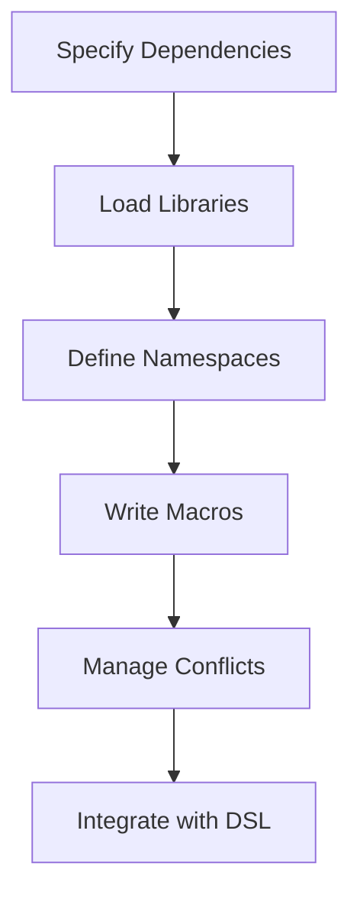

## 17.8.3 Managing Dependencies and Namespaces

In this section, we will explore how to manage dependencies and namespaces within Clojure Domain-Specific Languages (DSLs), with a particular focus on the role of macros. As experienced Java developers, you are likely familiar with the concept of namespaces and dependency management through packages and build tools like Maven or Gradle. In Clojure, these concepts are handled differently, offering both challenges and opportunities for more flexible and powerful code organization.

### Understanding Dependencies in Clojure

Dependencies in Clojure are managed using tools like Leiningen and tools.deps. These tools allow you to specify libraries your project depends on, similar to Maven or Gradle in Java. However, Clojure's approach is more dynamic and flexible, allowing for easier experimentation and integration of libraries.

#### Specifying Dependencies

In Clojure, dependencies are typically specified in a `project.clj` file for Leiningen or a `deps.edn` file for tools.deps. Here's a simple example using Leiningen:

```clojure
;; project.clj
(defproject my-clojure-dsl "0.1.0-SNAPSHOT"
  :description "A Clojure DSL project"
  :dependencies [[org.clojure/clojure "1.10.3"]
                 [some-library "1.2.3"]])
```

For tools.deps, the equivalent would be:

```clojure
;; deps.edn
{:deps {org.clojure/clojure {:mvn/version "1.10.3"}
        some-library {:mvn/version "1.2.3"}}}
```

Both files serve the same purpose: to declare the libraries your project needs. The choice between Leiningen and tools.deps often comes down to personal preference and project requirements.

#### Managing Dependencies

Managing dependencies in Clojure involves ensuring that the correct versions of libraries are used and resolving conflicts when multiple libraries depend on different versions of the same library. This is similar to dependency management in Java, but with some key differences due to Clojure's dynamic nature.

**Dependency Conflicts:** In Java, dependency conflicts are often resolved using dependency mediation strategies provided by Maven or Gradle. In Clojure, tools like `lein-ancient` can help identify outdated dependencies, and `lein-deps-tree` can visualize dependency trees to help resolve conflicts.

**Dynamic Loading:** Clojure allows for dynamic loading of dependencies at runtime, which can be particularly useful in DSLs where you might want to load different libraries based on user input or configuration.

### Namespace Management in Clojure

Namespaces in Clojure are similar to packages in Java. They provide a way to organize code and avoid naming conflicts. However, Clojure's approach to namespaces is more flexible, allowing for dynamic creation and manipulation.

#### Defining and Using Namespaces

In Clojure, you define a namespace using the `ns` macro. Here's an example:

```clojure
(ns my-clojure-dsl.core
  (:require [clojure.string :as str]))

(defn greet [name]
  (str "Hello, " name "!"))
```

In this example, we define a namespace `my-clojure-dsl.core` and require the `clojure.string` library, aliasing it as `str`. This is similar to Java's `import` statements but with more flexibility.

#### Managing Namespace Dependencies

Managing namespace dependencies involves ensuring that the correct namespaces are available and resolving conflicts when different namespaces define the same symbols. This is similar to managing classpath issues in Java but with more dynamic capabilities.

**Dynamic Namespace Loading:** Clojure allows for dynamic loading of namespaces at runtime, which can be useful in DSLs where you might want to load different namespaces based on user input or configuration.

**Namespace Aliasing and Referencing:** Clojure provides powerful tools for aliasing and referencing namespaces, allowing you to avoid naming conflicts and make your code more readable.

### Integrating Macros with Dependencies and Namespaces

Macros in Clojure are a powerful tool for metaprogramming, allowing you to generate code at compile time. However, they can also introduce complexity when managing dependencies and namespaces.

#### Writing Macros with Dependencies

When writing macros that depend on external libraries, it's important to ensure that those libraries are available at compile time. This can be done by requiring the necessary namespaces within the macro definition.

```clojure
(defmacro with-logging [body]
  `(do
     (println "Executing:" '~body)
     ~body))
```

In this example, the `with-logging` macro prints the code being executed. If this macro depended on an external library, you would need to ensure that the library is required in the namespace where the macro is defined.

#### Managing Namespace Conflicts in Macros

Macros can introduce namespace conflicts if they generate code that uses symbols from different namespaces. To avoid this, you can use fully qualified symbols or alias namespaces within the macro.

```clojure
(defmacro safe-divide [a b]
  `(try
     (/ ~a ~b)
     (catch ArithmeticException e
       (println "Division by zero"))))
```

In this example, the `safe-divide` macro uses the `try` and `catch` constructs to handle division by zero. If these constructs were part of an external library, you would need to ensure that the library is required in the namespace where the macro is defined.

### Practical Examples and Exercises

Let's explore some practical examples and exercises to reinforce these concepts.

#### Example: Creating a DSL with Dynamic Dependencies

Imagine you're building a DSL for data processing that allows users to specify different data sources and transformations. You might want to dynamically load libraries based on the user's configuration.

```clojure
(defn load-library [lib]
  (require (symbol lib)))

(defn process-data [config]
  (doseq [lib (:libraries config)]
    (load-library lib))
  ;; Process data using loaded libraries
  )
```

In this example, the `process-data` function takes a configuration map and dynamically loads the specified libraries. This allows for flexible and extensible data processing pipelines.

#### Exercise: Managing Namespace Conflicts

Try modifying the `safe-divide` macro to handle other exceptions, such as `NullPointerException`. Ensure that the necessary namespaces are required and avoid namespace conflicts.

### Diagrams and Visual Aids

To better understand these concepts, let's look at some diagrams.



**Diagram 1:** This flowchart illustrates the process of managing dependencies and namespaces in a Clojure DSL, from specifying dependencies to integrating with the DSL.

### Further Reading and Resources

For more information on managing dependencies and namespaces in Clojure, check out the following resources:

- [Official Clojure Documentation](https://clojure.org/reference/namespaces)
- [ClojureDocs](https://clojuredocs.org/)
- [Leiningen Documentation](https://leiningen.org/)
- [tools.deps Documentation](https://clojure.org/guides/deps_and_cli)

### Key Takeaways

- **Dependencies in Clojure** are managed using tools like Leiningen and tools.deps, allowing for dynamic loading and flexible integration.
- **Namespaces in Clojure** provide a way to organize code and avoid naming conflicts, similar to packages in Java but with more flexibility.
- **Macros in Clojure** can introduce complexity in managing dependencies and namespaces, but they offer powerful metaprogramming capabilities.
- **Dynamic loading** of dependencies and namespaces can enhance the flexibility and extensibility of Clojure DSLs.

### Exercises and Practice Problems

1. **Exercise:** Modify the `process-data` function to handle errors when loading libraries. Ensure that the function fails gracefully and provides useful error messages.

2. **Practice Problem:** Create a macro that generates a function to log the execution time of a given block of code. Ensure that the macro handles namespace conflicts and requires the necessary libraries.

3. **Challenge:** Build a simple DSL for mathematical expressions that allows users to define variables and evaluate expressions. Use macros to generate efficient code and manage dependencies dynamically.

### Encouragement and Support

Now that we've explored how to manage dependencies and namespaces in Clojure DSLs, let's apply these concepts to build powerful and flexible applications. Remember, the key to mastering Clojure is practice and experimentation. Don't hesitate to explore new libraries and techniques, and always strive to write clean, idiomatic code.

## Quiz: Mastering Dependencies and Namespaces in Clojure DSLs



### What is the primary tool for managing dependencies in Clojure?

- [x] Leiningen
- [ ] Maven
- [ ] Gradle
- [ ] Ant

> **Explanation:** Leiningen is the primary tool for managing dependencies in Clojure, similar to Maven or Gradle in Java.

### How are namespaces defined in Clojure?

- [x] Using the `ns` macro
- [ ] Using the `namespace` keyword
- [ ] Using the `package` keyword
- [ ] Using the `import` statement

> **Explanation:** Namespaces in Clojure are defined using the `ns` macro, which is similar to Java's package system.

### What is a common issue when using macros in Clojure?

- [x] Namespace conflicts
- [ ] Memory leaks
- [ ] Slow execution
- [ ] Lack of type safety

> **Explanation:** Macros can introduce namespace conflicts if not managed properly, as they generate code at compile time.

### How can you dynamically load a library in Clojure?

- [x] Using the `require` function with a symbol
- [ ] Using the `import` statement
- [ ] Using the `load` function
- [ ] Using the `include` keyword

> **Explanation:** You can dynamically load a library in Clojure using the `require` function with a symbol.

### What is the purpose of aliasing namespaces in Clojure?

- [x] To avoid naming conflicts
- [ ] To improve performance
- [ ] To reduce memory usage
- [ ] To simplify syntax

> **Explanation:** Aliasing namespaces in Clojure helps avoid naming conflicts and makes code more readable.

### Which file is used to specify dependencies in a Leiningen project?

- [x] project.clj
- [ ] deps.edn
- [ ] build.gradle
- [ ] pom.xml

> **Explanation:** In a Leiningen project, dependencies are specified in the `project.clj` file.

### What is a benefit of dynamic namespace loading in Clojure?

- [x] Flexibility in code execution
- [ ] Improved type safety
- [ ] Faster compilation
- [ ] Reduced memory usage

> **Explanation:** Dynamic namespace loading in Clojure provides flexibility in code execution, allowing for more adaptable applications.

### How can you resolve dependency conflicts in Clojure?

- [x] Using tools like `lein-ancient` and `lein-deps-tree`
- [ ] By manually editing the classpath
- [ ] By recompiling the project
- [ ] By using a different IDE

> **Explanation:** Tools like `lein-ancient` and `lein-deps-tree` help resolve dependency conflicts in Clojure.

### What is a key advantage of using macros in Clojure DSLs?

- [x] Code generation at compile time
- [ ] Improved runtime performance
- [ ] Enhanced security
- [ ] Simplified syntax

> **Explanation:** Macros in Clojure DSLs allow for code generation at compile time, providing powerful metaprogramming capabilities.

### True or False: Clojure's approach to namespaces is more flexible than Java's package system.

- [x] True
- [ ] False

> **Explanation:** Clojure's approach to namespaces is indeed more flexible than Java's package system, allowing for dynamic creation and manipulation.


