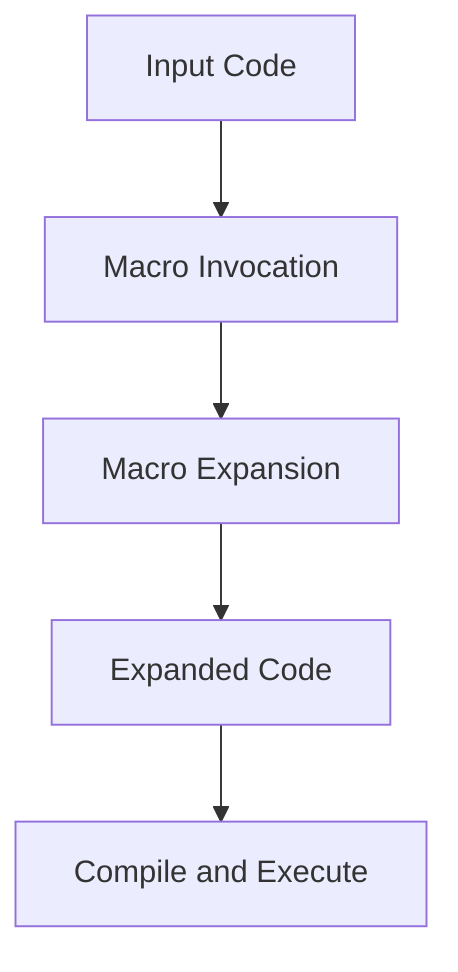

## 17.9.1 Testing Macro Code

In this section, we delve into the intricacies of testing macro code in Clojure, a crucial aspect of ensuring the reliability and correctness of your metaprogramming endeavors. Macros, a powerful feature of Clojure, allow developers to extend the language by transforming code at compile time. However, this power comes with the responsibility of ensuring that the generated code behaves as expected. Testing macros involves understanding macro expansion, verifying generated code, and ensuring that the macros integrate seamlessly into your domain-specific languages (DSLs).

### Understanding Macros in Clojure

Before we dive into testing strategies, let's briefly revisit what macros are and how they function in Clojure. Macros are a form of metaprogramming that allows you to manipulate code as data. They are defined using the `defmacro` keyword and can transform input expressions into more complex forms.

Here's a simple example of a macro:

```clojure
(defmacro when-not [test & body]
  `(if (not ~test)
     (do ~@body)))
```

In this example, the `when-not` macro takes a test expression and a body of code. It expands into an `if` expression that executes the body if the test is false.

### The Importance of Testing Macros

Testing macros is essential because they operate at a different level than regular functions. While functions are evaluated at runtime, macros are expanded at compile time. This means that errors in macros can lead to cryptic compile-time errors or unexpected runtime behavior. Testing ensures that your macros generate the correct code and behave as intended.

### Strategies for Testing Macros

1. **Macro Expansion Verification**: One of the first steps in testing macros is to verify their expansion. You can use the `macroexpand` or `macroexpand-1` functions to see how a macro transforms its input.

   ```clojure
   (macroexpand '(when-not false (println "Hello, World!")))
   ```

   This will output the expanded form of the macro, allowing you to verify that it generates the expected code.

2. **Unit Testing with `clojure.test`**: You can write unit tests for macros using the `clojure.test` framework. These tests should focus on the behavior of the generated code rather than the macro itself.

   ```clojure
   (deftest test-when-not
     (is (= (macroexpand '(when-not false (println "Hello, World!")))
            '(if (not false) (do (println "Hello, World!"))))))
   ```

3. **Testing Edge Cases**: Ensure that your macros handle edge cases gracefully. This includes testing with no arguments, invalid arguments, or complex nested expressions.

4. **Integration Testing**: If your macros are part of a larger DSL, it's important to test them in the context of the DSL. This ensures that they interact correctly with other macros and functions.

5. **Property-Based Testing**: Use property-based testing to verify that your macros maintain certain invariants. This can be particularly useful for macros that generate complex code.

### Comparing Macros to Java's Reflection

In Java, reflection is often used for metaprogramming tasks, such as inspecting or modifying the behavior of classes at runtime. While reflection provides powerful capabilities, it can be error-prone and difficult to test due to its runtime nature. In contrast, Clojure's macros operate at compile time, allowing for more predictable and testable code transformations.

### Code Example: Testing a Macro

Let's walk through a more complex example of testing a macro. We'll create a macro that defines a simple DSL for logging messages with different levels (info, warning, error).

```clojure
(defmacro log [level & messages]
  `(println (str "[" ~level "] " ~@messages)))

(deftest test-log-macro
  (is (= (macroexpand '(log "INFO" "This is an info message"))
         '(println (str "[" "INFO" "] " "This is an info message")))))

(deftest test-log-macro-behavior
  (is (= (with-out-str (log "ERROR" "An error occurred"))
         "[ERROR] An error occurred\n")))
```

In this example, we test both the macro expansion and the behavior of the generated code. The `with-out-str` function captures the output of `println` for comparison.

### Try It Yourself

Experiment with the `log` macro by adding new logging levels or modifying the message format. Use `macroexpand` to verify the changes.

### Diagram: Macro Expansion Process

Below is a diagram illustrating the macro expansion process in Clojure:



**Caption**: This diagram shows the flow of data through the macro expansion process, from input code to execution.

### Best Practices for Testing Macros

- **Keep Macros Simple**: Complex macros are harder to test and maintain. Strive for simplicity and clarity.
- **Document Macro Behavior**: Clearly document what your macros do and any assumptions they make about their input.
- **Use Descriptive Names**: Choose macro names that clearly convey their purpose and behavior.
- **Test Incrementally**: Start by testing the simplest cases and gradually add more complex scenarios.

### Exercises

1. **Create a Macro**: Write a macro that generates a `for` loop in Clojure. Test its expansion and behavior with different loop conditions.
2. **Refactor a Function**: Take a complex function and refactor it into a macro. Write tests to ensure the macro behaves as expected.
3. **DSL Integration**: Create a small DSL using macros and test its integration with other Clojure code.

### Key Takeaways

- **Macros are powerful tools** for code transformation in Clojure, but they require careful testing to ensure correctness.
- **Macro expansion verification** is a critical step in testing, allowing you to see the generated code.
- **Unit and integration tests** help ensure that macros behave as expected in different contexts.
- **Property-based testing** can be used to verify invariants and edge cases in macro-generated code.

By mastering the art of testing macros, you'll be well-equipped to harness the full power of Clojure's metaprogramming capabilities. Now that we've explored testing strategies for macros, let's apply these concepts to build robust and reliable DSLs in your applications.

For further reading on macros and testing in Clojure, check out the [Official Clojure Documentation](https://clojure.org/reference/macros) and [ClojureDocs](https://clojuredocs.org/).

## Quiz: Mastering Macro Testing in Clojure



### What is the primary purpose of macros in Clojure?

- [x] To transform code at compile time
- [ ] To execute code at runtime
- [ ] To handle exceptions
- [ ] To manage memory

> **Explanation:** Macros in Clojure are used to transform code at compile time, allowing for powerful metaprogramming capabilities.

### Which function is used to verify the expansion of a macro?

- [x] `macroexpand`
- [ ] `eval`
- [ ] `apply`
- [ ] `reduce`

> **Explanation:** The `macroexpand` function is used to see how a macro transforms its input, helping verify the generated code.

### What is a key difference between macros and functions in Clojure?

- [x] Macros are expanded at compile time, while functions are evaluated at runtime.
- [ ] Macros can only be used for arithmetic operations.
- [ ] Functions can modify global state, while macros cannot.
- [ ] Macros are always faster than functions.

> **Explanation:** Macros are expanded at compile time, allowing them to transform code before it is executed, unlike functions which are evaluated at runtime.

### Why is it important to test the behavior of macro-generated code?

- [x] To ensure the generated code behaves as expected
- [ ] To increase the runtime speed of the code
- [ ] To reduce memory usage
- [ ] To simplify the code

> **Explanation:** Testing the behavior of macro-generated code ensures that it performs the intended operations and integrates correctly with other code.

### Which testing framework is commonly used for unit testing macros in Clojure?

- [x] `clojure.test`
- [ ] `JUnit`
- [ ] `Mockito`
- [ ] `TestNG`

> **Explanation:** `clojure.test` is the standard testing framework used in Clojure for unit testing, including testing macros.

### What is a benefit of using property-based testing for macros?

- [x] It verifies that macros maintain certain invariants.
- [ ] It simplifies the macro code.
- [ ] It increases the speed of macro expansion.
- [ ] It reduces the need for documentation.

> **Explanation:** Property-based testing helps ensure that macros maintain certain invariants and handle a wide range of inputs correctly.

### How can you capture the output of `println` in a test?

- [x] Using `with-out-str`
- [ ] Using `macroexpand`
- [ ] Using `reduce`
- [ ] Using `apply`

> **Explanation:** The `with-out-str` function captures the output of `println`, allowing it to be compared in tests.

### What is a common pitfall when writing complex macros?

- [x] They can be difficult to test and maintain.
- [ ] They always run slower than functions.
- [ ] They cannot be used in DSLs.
- [ ] They require more memory.

> **Explanation:** Complex macros can be difficult to test and maintain, so it's important to strive for simplicity.

### Which of the following is a best practice for testing macros?

- [x] Document macro behavior clearly
- [ ] Avoid using `macroexpand`
- [ ] Test only the simplest cases
- [ ] Use macros only for arithmetic operations

> **Explanation:** Documenting macro behavior clearly helps ensure that others understand how the macro should be used and tested.

### True or False: Macros in Clojure are similar to Java's reflection in terms of functionality.

- [ ] True
- [x] False

> **Explanation:** Macros in Clojure operate at compile time to transform code, while Java's reflection operates at runtime to inspect or modify classes.


