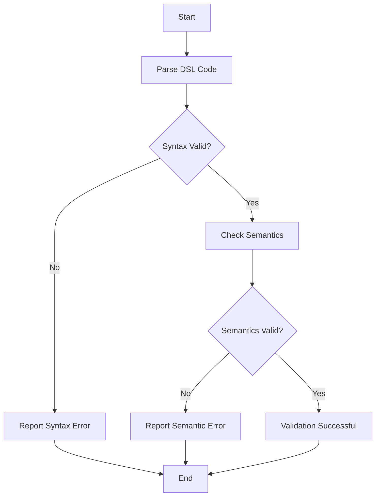

## 17.9.2 Validating DSL Syntax and Semantics

As experienced Java developers transitioning to Clojure, understanding how to validate Domain-Specific Languages (DSLs) is crucial for ensuring that the code you write or generate is both syntactically correct and semantically meaningful. In this section, we will delve into techniques for validating DSLs in Clojure, providing helpful error messages, and ensuring that your DSLs are robust and reliable.

### Introduction to DSL Validation

Domain-Specific Languages (DSLs) are specialized mini-languages tailored to a specific problem domain. They allow developers to express solutions in a more natural and concise manner. However, with this power comes the responsibility of ensuring that the DSL code is both syntactically correct and semantically valid.

**Syntax Validation** involves checking the structure of the DSL code to ensure it adheres to the predefined grammar rules. **Semantic Validation**, on the other hand, ensures that the code makes sense in the context of the domain it is intended to model.

### Syntax Validation in Clojure

Syntax validation is the first step in ensuring that your DSL is correctly interpreted. In Clojure, this involves parsing the DSL code and checking it against a set of grammar rules.

#### Parsing DSL Code

To parse DSL code, we can use Clojure's powerful data structures and functions. Let's consider a simple DSL for defining workflows:

```clojure
(def workflow-dsl
  '(workflow
     (task "Task 1" :depends-on [])
     (task "Task 2" :depends-on ["Task 1"])
     (task "Task 3" :depends-on ["Task 1" "Task 2"])))
```

In this example, `workflow` is a DSL construct that contains a series of `task` definitions. Each task has a name and a list of dependencies.

#### Validating Syntax with Spec

Clojure's `clojure.spec` library is a powerful tool for validating data structures. We can define a spec for our DSL and use it to validate the syntax:

```clojure
(require '[clojure.spec.alpha :as s])

(s/def ::task-name string?)
(s/def ::depends-on (s/coll-of string? :kind vector?))
(s/def ::task (s/keys :req [::task-name ::depends-on]))
(s/def ::workflow (s/coll-of ::task :kind list?))

(defn validate-syntax [dsl]
  (if (s/valid? ::workflow dsl)
    (println "Syntax is valid.")
    (println "Syntax errors:" (s/explain-str ::workflow dsl))))

(validate-syntax workflow-dsl)
```

In this code, we define specs for `task-name`, `depends-on`, and `task`. The `::workflow` spec ensures that the DSL is a list of tasks. The `validate-syntax` function checks if the DSL conforms to the spec and prints any syntax errors.

### Semantic Validation in Clojure

Once the syntax is validated, the next step is to ensure that the DSL code is semantically correct. This involves checking the logical consistency and meaning of the code.

#### Semantic Rules

For our workflow DSL, semantic validation might include ensuring that there are no circular dependencies between tasks. Let's implement a function to check for this:

```clojure
(defn check-circular-dependencies [tasks]
  (letfn [(visit [task visited]
            (if (visited task)
              (throw (ex-info "Circular dependency detected" {:task task}))
              (reduce (fn [v dep]
                        (visit dep (conj v task)))
                      visited
                      (get-in tasks [task :depends-on]))))]
    (doseq [task (keys tasks)]
      (visit task #{}))))

(defn validate-semantics [dsl]
  (let [tasks (into {} (map (fn [[_ name & {:keys [depends-on]}]]
                              [name {:depends-on depends-on}])
                            dsl))]
    (try
      (check-circular-dependencies tasks)
      (println "Semantics are valid.")
      (catch Exception e
        (println "Semantic error:" (.getMessage e))))))

(validate-semantics workflow-dsl)
```

In this example, `check-circular-dependencies` is a recursive function that throws an exception if a circular dependency is detected. The `validate-semantics` function converts the DSL into a map of tasks and checks for circular dependencies.

### Providing Helpful Error Messages

When validating DSLs, providing clear and informative error messages is crucial for helping users understand and fix issues in their code.

#### Enhancing Error Messages

We can enhance our error messages by including more context about the error:

```clojure
(defn validate-semantics [dsl]
  (let [tasks (into {} (map (fn [[_ name & {:keys [depends-on]}]]
                              [name {:depends-on depends-on}])
                            dsl))]
    (try
      (check-circular-dependencies tasks)
      (println "Semantics are valid.")
      (catch Exception e
        (println "Semantic error in task:" (:task (ex-data e)) "- Circular dependency detected")))))

(validate-semantics workflow-dsl)
```

By using `ex-info` and `ex-data`, we can pass additional information about the error, such as the specific task causing the issue.

### Comparing with Java

In Java, validating DSLs often involves using parser generators like ANTLR or writing custom parsers. These tools provide powerful mechanisms for syntax validation but can be complex to set up and use.

Clojure's approach, leveraging its data structures and `clojure.spec`, offers a more concise and expressive way to define and validate DSLs. The use of functional programming paradigms allows for more straightforward semantic validation through recursion and higher-order functions.

### Try It Yourself

Experiment with the workflow DSL by adding new tasks and dependencies. Try introducing a circular dependency to see how the validation functions handle it. Modify the error messages to include more details about the errors.

### Diagram: Workflow DSL Validation Process



*Diagram: This flowchart illustrates the process of validating a DSL, starting with parsing, followed by syntax and semantic validation, and ending with error reporting if necessary.*

### Exercises

1. **Extend the DSL**: Add new constructs to the workflow DSL, such as `parallel-task`, and update the validation functions to handle them.
2. **Improve Error Messages**: Modify the error messages to include line numbers or positions in the DSL code.
3. **Implement a New DSL**: Design a simple DSL for a different domain, such as a configuration language, and implement syntax and semantic validation for it.

### Key Takeaways

- **Syntax and Semantic Validation**: Both are essential for ensuring the correctness of DSLs.
- **Clojure's Spec Library**: Provides a powerful tool for defining and validating DSL syntax.
- **Semantic Validation**: Involves checking logical consistency and domain-specific rules.
- **Error Messages**: Should be clear and informative to help users debug their DSL code.
- **Comparison with Java**: Clojure offers a more concise and expressive approach to DSL validation.

By mastering these techniques, you can create robust and reliable DSLs in Clojure, enhancing your applications' expressiveness and usability.

## Quiz: Validating DSL Syntax and Semantics in Clojure



### What is the primary purpose of syntax validation in a DSL?

- [x] To ensure the DSL code adheres to predefined grammar rules.
- [ ] To check the logical consistency of the DSL code.
- [ ] To provide helpful error messages.
- [ ] To optimize the performance of the DSL code.

> **Explanation:** Syntax validation ensures that the DSL code follows the correct structure and grammar.

### Which Clojure library is commonly used for syntax validation?

- [x] clojure.spec
- [ ] clojure.core
- [ ] clojure.data
- [ ] clojure.java

> **Explanation:** The `clojure.spec` library is used for defining and validating data structures, making it suitable for syntax validation.

### What does semantic validation involve?

- [ ] Checking the structure of the DSL code.
- [x] Ensuring the code makes sense in the domain context.
- [ ] Providing error messages.
- [ ] Optimizing code execution.

> **Explanation:** Semantic validation ensures that the DSL code is logically consistent and meaningful within its domain.

### How can you enhance error messages in Clojure?

- [x] By using `ex-info` and `ex-data` to include additional context.
- [ ] By writing custom parsers.
- [ ] By using Java exceptions.
- [ ] By optimizing the DSL code.

> **Explanation:** `ex-info` and `ex-data` allow you to pass additional information about errors, enhancing error messages.

### What is a common tool for parsing DSLs in Java?

- [ ] clojure.spec
- [x] ANTLR
- [ ] JavaFX
- [ ] Spring Boot

> **Explanation:** ANTLR is a popular parser generator used in Java for parsing DSLs.

### In the provided workflow DSL, what does the `:depends-on` key represent?

- [ ] The name of the task.
- [x] The dependencies of the task.
- [ ] The priority of the task.
- [ ] The duration of the task.

> **Explanation:** The `:depends-on` key specifies the dependencies of a task in the workflow DSL.

### What is the role of `clojure.spec` in DSL validation?

- [x] To define and validate the structure of DSL code.
- [ ] To execute DSL code.
- [ ] To optimize DSL performance.
- [ ] To provide error messages.

> **Explanation:** `clojure.spec` is used to define the expected structure of data and validate it against those definitions.

### Which function is used to check for circular dependencies in the example?

- [ ] validate-syntax
- [ ] validate-semantics
- [x] check-circular-dependencies
- [ ] ex-info

> **Explanation:** The `check-circular-dependencies` function is responsible for detecting circular dependencies in the DSL.

### What is the benefit of using Clojure for DSL validation compared to Java?

- [x] More concise and expressive syntax.
- [ ] Faster execution speed.
- [ ] Better integration with databases.
- [ ] Easier to learn for beginners.

> **Explanation:** Clojure's functional programming paradigm and expressive syntax make it more concise and expressive for DSL validation.

### True or False: Semantic validation is only concerned with the syntax of the DSL code.

- [ ] True
- [x] False

> **Explanation:** Semantic validation goes beyond syntax to ensure the code is logically consistent and meaningful within its domain.


