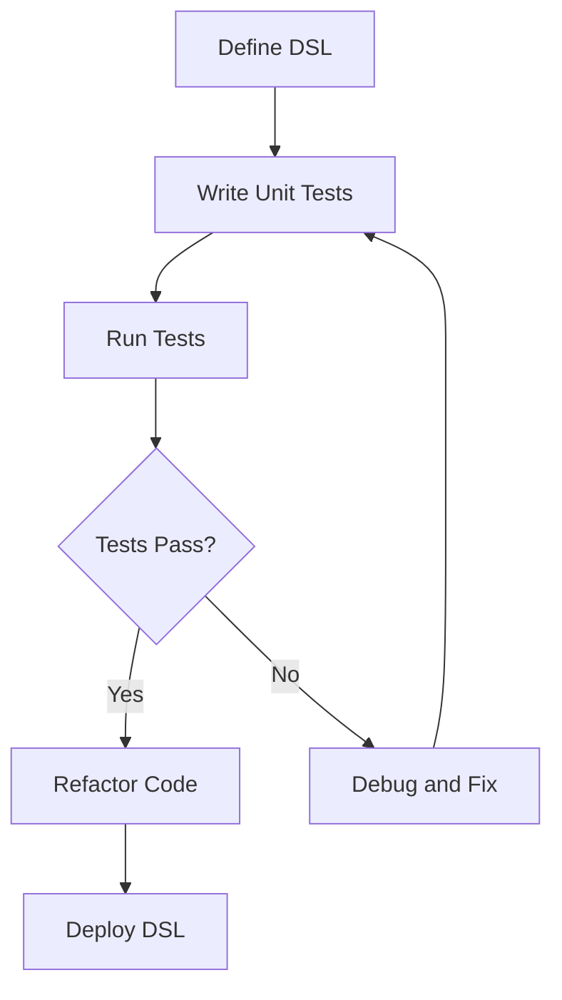

## 17.9.3 Writing Unit Tests for DSL Functions

In this section, we will delve into the intricacies of writing unit tests for Domain-Specific Language (DSL) functions in Clojure. As experienced Java developers, you are likely familiar with the importance of testing in ensuring code quality and reliability. This guide will help you leverage your existing knowledge to effectively test DSL functions in Clojure, ensuring that your DSLs are robust and maintainable.

### Understanding DSLs and Their Importance

A **Domain-Specific Language (DSL)** is a specialized language tailored to a specific application domain. Unlike general-purpose programming languages, DSLs are designed to express solutions concisely and clearly within their domain. In Clojure, DSLs often leverage the language's powerful macro system to create expressive and flexible syntax.

#### Why Test DSL Functions?

Testing DSL functions is crucial because:

- **Ensures Correctness**: Validates that the DSL behaves as expected and produces correct results.
- **Facilitates Maintenance**: Makes it easier to refactor and extend the DSL without introducing bugs.
- **Improves Reliability**: Increases confidence in the DSL's stability and robustness.

### Key Concepts in Testing DSL Functions

Before we dive into the specifics of testing DSL functions, let's review some key concepts:

- **Unit Testing**: Focuses on testing individual units of code, such as functions or methods, in isolation.
- **Test-Driven Development (TDD)**: A development approach where tests are written before the code, guiding the implementation.
- **Mocking and Stubbing**: Techniques used to simulate the behavior of complex objects or systems during testing.

### Setting Up Your Testing Environment

To begin testing DSL functions in Clojure, you'll need to set up a testing environment. Clojure provides several testing libraries, with `clojure.test` being the most commonly used.

#### Installing `clojure.test`

Ensure that your project includes `clojure.test` as a dependency. You can add it to your `project.clj` file if you're using Leiningen:

```clojure
(defproject my-dsl-project "0.1.0-SNAPSHOT"
  :dependencies [[org.clojure/clojure "1.10.3"]
                 [org.clojure/test.check "1.1.0"]])
```

### Writing Unit Tests for DSL Functions

Let's explore how to write unit tests for DSL functions in Clojure. We'll use a simple DSL for arithmetic expressions as an example.

#### Defining the DSL

First, let's define a basic DSL for arithmetic operations:

```clojure
(ns my-dsl.core)

(defmacro arithmetic [expr]
  `(eval ~expr))

;; Example usage:
;; (arithmetic (+ 1 2)) => 3
```

#### Writing Tests

Now, let's write unit tests for the `arithmetic` macro using `clojure.test`:

```clojure
(ns my-dsl.core-test
  (:require [clojure.test :refer :all]
            [my-dsl.core :refer :all]))

(deftest test-arithmetic
  (testing "Basic arithmetic operations"
    (is (= 3 (arithmetic '(+ 1 2))))
    (is (= 5 (arithmetic '(* 1 5))))
    (is (= 0 (arithmetic '(- 5 5))))
    (is (= 2 (arithmetic '(/ 4 2))))))
```

### Comparing with Java Testing

In Java, testing typically involves using frameworks like JUnit. Here's a comparison of testing a similar arithmetic DSL in Java:

```java
import static org.junit.Assert.assertEquals;
import org.junit.Test;

public class ArithmeticDSLTest {

    @Test
    public void testAddition() {
        assertEquals(3, ArithmeticDSL.evaluate("(+ 1 2)"));
    }

    @Test
    public void testMultiplication() {
        assertEquals(5, ArithmeticDSL.evaluate("(* 1 5)"));
    }
}
```

**Key Differences**:
- **Syntax**: Clojure's syntax is more concise and expressive, leveraging its macro system.
- **Immutability**: Clojure's immutable data structures simplify testing by avoiding side effects.

### Advanced Testing Techniques

#### Property-Based Testing

Clojure's `test.check` library allows for property-based testing, which can be particularly useful for DSLs. Instead of writing individual test cases, you define properties that should hold true for a wide range of inputs.

```clojure
(ns my-dsl.core-test
  (:require [clojure.test :refer :all]
            [clojure.test.check :as tc]
            [clojure.test.check.generators :as gen]
            [clojure.test.check.properties :as prop]))

(def arithmetic-prop
  (prop/for-all [a gen/int
                 b gen/int]
    (= (+ a b) (arithmetic `(+ ~a ~b)))))

(tc/quick-check 100 arithmetic-prop)
```

### Handling Edge Cases

When testing DSL functions, it's important to consider edge cases, such as:

- **Invalid Syntax**: Ensure that the DSL handles invalid input gracefully.
- **Boundary Values**: Test the limits of the DSL's capabilities.
- **Performance**: Evaluate the DSL's performance with large or complex expressions.

### Try It Yourself

Experiment with the following modifications to the `arithmetic` DSL:

- **Add Support for New Operations**: Extend the DSL to support additional arithmetic operations, such as exponentiation.
- **Implement Error Handling**: Modify the DSL to provide meaningful error messages for invalid expressions.

### Visualizing DSL Testing

Below is a flowchart illustrating the process of testing a DSL function:



*Caption: Flowchart illustrating the process of testing a DSL function, from definition to deployment.*

### Exercises

1. **Extend the DSL**: Add support for logical operations (e.g., `and`, `or`) and write corresponding tests.
2. **Property-Based Testing**: Implement property-based tests for the new operations.
3. **Performance Testing**: Measure the performance of the DSL with increasingly complex expressions.

### Key Takeaways

- **Unit Testing is Essential**: Ensures the correctness and reliability of DSL functions.
- **Leverage Clojure's Features**: Use Clojure's expressive syntax and immutability to simplify testing.
- **Consider Edge Cases**: Thoroughly test the DSL's behavior with a variety of inputs.

By following these guidelines, you can effectively write unit tests for DSL functions in Clojure, ensuring that your DSLs are robust, maintainable, and reliable.

### Further Reading

- [Clojure Official Documentation](https://clojure.org/)
- [ClojureDocs](https://clojuredocs.org/)
- [Test-Driven Development with Clojure](https://pragprog.com/titles/vmclojure/test-driven-development-with-clojure/)

## Quiz: Mastering Unit Testing for DSL Functions in Clojure



### What is the primary purpose of unit testing DSL functions?

- [x] To ensure the correctness and reliability of the DSL
- [ ] To improve the performance of the DSL
- [ ] To simplify the syntax of the DSL
- [ ] To increase the complexity of the DSL

> **Explanation:** Unit testing ensures that the DSL functions behave as expected and produce correct results, improving reliability.

### Which Clojure library is commonly used for unit testing?

- [x] clojure.test
- [ ] clojure.core
- [ ] clojure.data
- [ ] clojure.java

> **Explanation:** `clojure.test` is the standard library for unit testing in Clojure.

### What is property-based testing?

- [x] Testing that verifies properties hold true for a range of inputs
- [ ] Testing that focuses on individual test cases
- [ ] Testing that only checks for syntax errors
- [ ] Testing that ignores edge cases

> **Explanation:** Property-based testing involves defining properties that should hold true for a wide range of inputs, rather than writing individual test cases.

### How does Clojure's immutability benefit testing?

- [x] It simplifies testing by avoiding side effects
- [ ] It complicates testing by introducing more variables
- [ ] It has no impact on testing
- [ ] It makes testing slower

> **Explanation:** Immutability ensures that data does not change unexpectedly, making it easier to test functions without worrying about side effects.

### What is the role of mocking in testing?

- [x] Simulating the behavior of complex objects or systems
- [ ] Increasing the complexity of tests
- [ ] Reducing the number of test cases
- [ ] Simplifying the syntax of the DSL

> **Explanation:** Mocking allows you to simulate the behavior of complex objects or systems, making it easier to test functions in isolation.

### Which of the following is an edge case to consider when testing DSL functions?

- [x] Invalid syntax
- [ ] Common use cases
- [ ] Simple expressions
- [ ] Basic arithmetic operations

> **Explanation:** Edge cases like invalid syntax should be considered to ensure the DSL handles unexpected inputs gracefully.

### What is the benefit of using `test.check` for testing DSL functions?

- [x] It allows for property-based testing
- [ ] It simplifies syntax errors
- [ ] It reduces the need for unit tests
- [ ] It increases the complexity of tests

> **Explanation:** `test.check` enables property-based testing, which can be particularly useful for DSLs by verifying properties across a wide range of inputs.

### How can you extend the arithmetic DSL to support new operations?

- [x] Add new macros for additional operations
- [ ] Simplify existing macros
- [ ] Remove existing operations
- [ ] Increase the complexity of existing operations

> **Explanation:** You can extend the DSL by adding new macros to support additional operations, enhancing its functionality.

### What is the purpose of the `arithmetic` macro in the example?

- [x] To evaluate arithmetic expressions
- [ ] To simplify syntax errors
- [ ] To increase the complexity of expressions
- [ ] To reduce the number of operations

> **Explanation:** The `arithmetic` macro is designed to evaluate arithmetic expressions, demonstrating a simple DSL in Clojure.

### True or False: Unit testing DSL functions is only necessary for complex DSLs.

- [ ] True
- [x] False

> **Explanation:** Unit testing is important for all DSLs, regardless of complexity, to ensure correctness and reliability.


