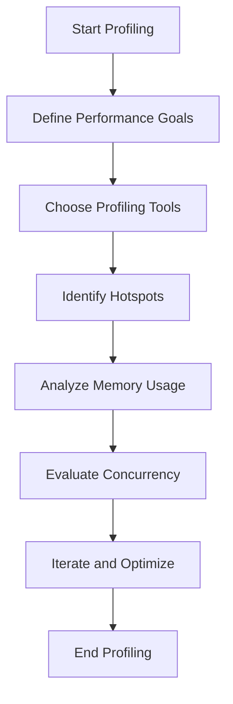

## 18.1.1 The Importance of Profiling

In the world of software development, performance is a critical factor that can make or break an application. As experienced Java developers transitioning to Clojure, understanding the importance of profiling is essential to ensure that your applications run efficiently. Profiling is the process of analyzing a program to determine which parts are consuming the most resources, such as CPU time or memory. This section will guide you through the significance of profiling, how it compares to Java, and the methodologies you can employ to optimize your Clojure applications effectively.

### Why Profiling Matters

Profiling is crucial because it helps you identify real performance bottlenecks rather than optimizing prematurely. Premature optimization can lead to complex code that is difficult to maintain and may not even address the actual performance issues. By profiling, you can focus your optimization efforts on the parts of the code that will have the most significant impact on performance.

#### Key Benefits of Profiling

- **Resource Efficiency**: Identify which parts of your application are consuming excessive resources and optimize them to improve overall efficiency.
- **Improved User Experience**: Faster applications lead to better user satisfaction and engagement.
- **Cost Reduction**: Efficient applications can reduce infrastructure costs, especially in cloud environments where resources are billed based on usage.
- **Informed Decision-Making**: Profiling provides data-driven insights that guide your optimization strategies.

### Profiling in Clojure vs. Java

As a Java developer, you might be familiar with profiling tools like VisualVM, JProfiler, or YourKit. These tools are also applicable to Clojure, as it runs on the Java Virtual Machine (JVM). However, Clojure's functional nature and emphasis on immutability introduce unique considerations for profiling.

#### Similarities

- **JVM-Based**: Both Java and Clojure applications run on the JVM, allowing the use of the same profiling tools.
- **Garbage Collection**: Memory management and garbage collection profiling are relevant for both languages.
- **Thread Management**: Profiling thread usage and synchronization issues is crucial in both environments.

#### Differences

- **Functional Paradigm**: Clojure's functional programming model means that performance bottlenecks often arise from different patterns compared to object-oriented Java.
- **Immutable Data Structures**: Profiling memory usage in Clojure requires understanding how immutable data structures are implemented and shared.
- **Concurrency Models**: Clojure's concurrency primitives (atoms, refs, agents) differ from Java's traditional concurrency mechanisms, affecting how you profile concurrent applications.

### Profiling Methodologies

To effectively profile your Clojure applications, you need to follow a structured approach. Here are some methodologies to consider:

#### 1. Define Performance Goals

Before you start profiling, it's essential to define what performance means for your application. Are you optimizing for speed, memory usage, or scalability? Setting clear goals will help you focus your profiling efforts.

#### 2. Use the Right Tools

Choose profiling tools that suit your needs. For JVM-based applications, tools like VisualVM, JProfiler, and YourKit are popular choices. For Clojure-specific insights, consider using tools like [Criterium](https://github.com/hugoduncan/criterium) for benchmarking and [Rebel Readline](https://github.com/bhauman/rebel-readline) for REPL-based profiling.

#### 3. Identify Hotspots

Use your profiling tools to identify hotspots in your code. These are the parts of your application that consume the most resources. Focus on optimizing these areas first.

#### 4. Analyze Memory Usage

Memory profiling is crucial, especially in Clojure, where immutable data structures can lead to different memory usage patterns. Use tools to analyze heap dumps and understand how memory is allocated.

#### 5. Evaluate Concurrency

If your application is concurrent, profile how threads are being utilized. Look for contention, deadlocks, or excessive context switching that can degrade performance.

#### 6. Iterate and Optimize

Profiling is an iterative process. After identifying and optimizing bottlenecks, profile again to see the impact of your changes. Continue this cycle until you meet your performance goals.

### Clojure Profiling Tools and Techniques

Let's explore some tools and techniques specific to Clojure that can aid in profiling and performance optimization.

#### Criterium for Benchmarking

Criterium is a Clojure library designed for accurate benchmarking of code. It provides robust statistical analysis to ensure that your benchmarks are reliable.

```clojure
(require '[criterium.core :refer [quick-bench]])

(defn slow-function [n]
  (reduce + (range n)))

(quick-bench (slow-function 10000))
```

In this example, `quick-bench` is used to measure the performance of `slow-function`. Criterium runs the function multiple times and provides statistical analysis of the results.

#### VisualVM for JVM Profiling

VisualVM is a powerful tool for profiling JVM applications. It provides insights into CPU usage, memory consumption, and thread activity.

- **CPU Profiling**: Identify which functions are consuming the most CPU time.
- **Memory Profiling**: Analyze heap dumps to understand memory allocation patterns.
- **Thread Analysis**: Monitor thread activity to detect issues like deadlocks or excessive context switching.

#### REPL-Based Profiling

Clojure's REPL (Read-Eval-Print Loop) is a powerful tool for interactive development. You can use it to profile code snippets in real-time.

```clojure
(time (slow-function 10000))
```

The `time` function in Clojure provides a simple way to measure the execution time of a function. While not as comprehensive as dedicated profiling tools, it can be useful for quick checks during development.

### Try It Yourself

To get hands-on experience with profiling in Clojure, try the following exercises:

1. **Benchmark a Function**: Use Criterium to benchmark a function in your Clojure project. Experiment with different input sizes and analyze the results.
2. **Profile a Clojure Application**: Use VisualVM to profile a Clojure application. Identify CPU and memory hotspots and consider how you might optimize them.
3. **Explore Concurrency**: If your application uses Clojure's concurrency primitives, profile how they are being utilized. Look for potential improvements in thread management.

### Diagrams and Visualizations

To better understand the flow of data and the impact of profiling, let's look at some visualizations.



**Diagram 1**: This flowchart illustrates the profiling process, from defining performance goals to iterating and optimizing your application.

### Key Takeaways

- Profiling is essential for identifying real performance bottlenecks and optimizing your Clojure applications effectively.
- Use JVM-based profiling tools like VisualVM, JProfiler, or YourKit, along with Clojure-specific tools like Criterium.
- Focus on optimizing hotspots, analyzing memory usage, and evaluating concurrency.
- Profiling is an iterative process that requires continuous monitoring and optimization.

By understanding the importance of profiling and employing the right methodologies, you can ensure that your Clojure applications are efficient, scalable, and provide a great user experience.

### Further Reading

For more information on profiling and performance optimization in Clojure, consider exploring the following resources:

- [Clojure Official Documentation](https://clojure.org/)
- [Criterium GitHub Repository](https://github.com/hugoduncan/criterium)
- [VisualVM Official Website](https://visualvm.github.io/)

Now that we've explored the importance of profiling, let's apply these concepts to optimize your Clojure applications effectively.

## SEO optimized quiz title



### What is the primary purpose of profiling in software development?

- [x] To identify performance bottlenecks
- [ ] To write more code
- [ ] To increase application size
- [ ] To add more features

> **Explanation:** Profiling is used to identify performance bottlenecks in applications, allowing developers to focus optimization efforts where they will have the most impact.

### Which tool is commonly used for profiling JVM applications?

- [x] VisualVM
- [ ] Eclipse
- [ ] NetBeans
- [ ] IntelliJ IDEA

> **Explanation:** VisualVM is a popular tool for profiling JVM applications, providing insights into CPU usage, memory consumption, and thread activity.

### What is a key difference between profiling in Clojure and Java?

- [x] Clojure's functional paradigm introduces unique performance patterns
- [ ] Java is faster than Clojure
- [ ] Clojure does not run on the JVM
- [ ] Java uses different memory management

> **Explanation:** Clojure's functional programming model and immutable data structures introduce unique performance patterns compared to Java's object-oriented approach.

### What is the role of Criterium in Clojure profiling?

- [x] It provides accurate benchmarking of code
- [ ] It compiles Clojure code
- [ ] It manages dependencies
- [ ] It handles concurrency

> **Explanation:** Criterium is a Clojure library used for accurate benchmarking of code, offering robust statistical analysis of performance.

### Which of the following is NOT a benefit of profiling?

- [ ] Improved user experience
- [ ] Cost reduction
- [x] Increased code complexity
- [ ] Resource efficiency

> **Explanation:** Profiling aims to improve user experience, reduce costs, and increase resource efficiency, not to increase code complexity.

### What is the first step in the profiling process?

- [x] Define performance goals
- [ ] Write more code
- [ ] Deploy the application
- [ ] Add new features

> **Explanation:** The first step in the profiling process is to define performance goals, which helps focus optimization efforts.

### How does Clojure's REPL assist in profiling?

- [x] It allows real-time profiling of code snippets
- [ ] It compiles Clojure code
- [ ] It manages dependencies
- [ ] It handles concurrency

> **Explanation:** Clojure's REPL allows developers to profile code snippets in real-time, providing quick insights during development.

### What is a hotspot in the context of profiling?

- [x] A part of the code consuming the most resources
- [ ] A new feature
- [ ] A bug in the code
- [ ] A security vulnerability

> **Explanation:** A hotspot is a part of the code that consumes the most resources, making it a target for optimization.

### Which concurrency primitive is unique to Clojure?

- [x] Atoms
- [ ] Threads
- [ ] Locks
- [ ] Semaphores

> **Explanation:** Atoms are a concurrency primitive unique to Clojure, providing a way to manage shared state in a thread-safe manner.

### Profiling is an iterative process.

- [x] True
- [ ] False

> **Explanation:** Profiling is indeed an iterative process, requiring continuous monitoring and optimization to achieve desired performance goals.


