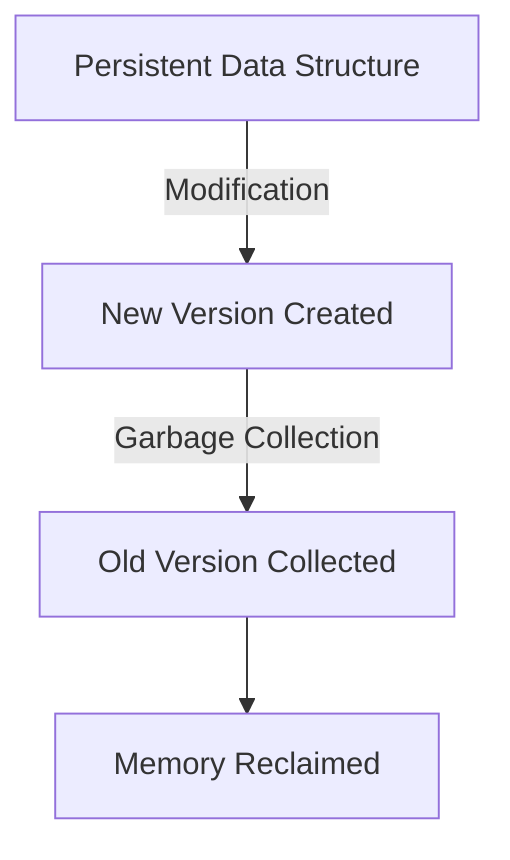
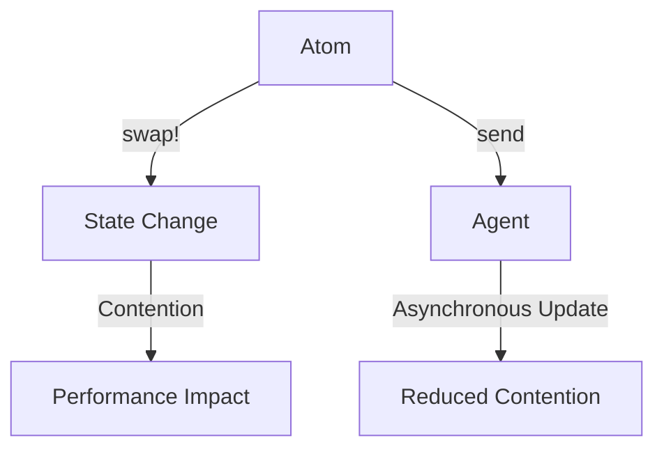

## 18.1.2 Common Sources of Bottlenecks

As experienced Java developers transitioning to Clojure, understanding the common sources of performance bottlenecks is crucial for optimizing your applications. While Clojure offers many advantages, such as immutability and functional programming paradigms, it also presents unique challenges that can impact performance. In this section, we will explore these bottlenecks, compare them with Java, and provide strategies to mitigate them.

### Memory Allocations and Garbage Collection

Memory management is a critical aspect of performance in any application. In Clojure, excessive memory allocations can lead to frequent garbage collection (GC) cycles, which can degrade performance.

#### Understanding Memory Allocation in Clojure

Clojure's persistent data structures are designed to be immutable, which means that any modification results in a new version of the data structure. This immutability is achieved through structural sharing, which minimizes the need for copying entire data structures. However, frequent creation of new data structures can lead to increased memory usage.

**Example:**

```clojure
(defn create-large-list []
  (loop [i 0 acc []]
    (if (< i 1000000)
      (recur (inc i) (conj acc i))
      acc)))

(create-large-list)
```

*Comment:* This function creates a large list by repeatedly conjuring elements, which can lead to high memory usage.

#### Comparing with Java

In Java, mutable data structures like `ArrayList` allow in-place modifications, reducing the need for frequent allocations. However, this comes at the cost of potential concurrency issues.

**Java Example:**

```java
import java.util.ArrayList;

public class LargeList {
    public static void main(String[] args) {
        ArrayList<Integer> list = new ArrayList<>();
        for (int i = 0; i < 1000000; i++) {
            list.add(i);
        }
    }
}
```

*Comment:* This Java code modifies the list in place, which is more memory-efficient but less safe in concurrent environments.

#### Mitigation Strategies

- **Use Transients:** Clojure provides transient versions of its persistent data structures for temporary, mutable operations, which can reduce memory allocations.

  **Example:**

  ```clojure
  (defn create-large-list-transient []
    (persistent!
      (loop [i 0 acc (transient [])]
        (if (< i 1000000)
          (recur (inc i) (conj! acc i))
          acc))))
  ```

  *Comment:* Using transients can significantly reduce memory allocations during list creation.

- **Profile Memory Usage:** Tools like VisualVM or YourKit can help identify memory hotspots in your application.

### I/O Latency

Input/Output operations are another common source of bottlenecks, especially in applications that rely heavily on file or network operations.

#### Understanding I/O in Clojure

Clojure's I/O operations are built on top of Java's I/O libraries, which means they inherit both the strengths and weaknesses of Java's I/O model. Blocking I/O operations can lead to thread contention and increased latency.

**Example:**

```clojure
(defn read-file [filename]
  (with-open [rdr (clojure.java.io/reader filename)]
    (doall (line-seq rdr))))
```

*Comment:* This function reads a file line by line, which can be slow for large files.

#### Comparing with Java

Java offers both blocking and non-blocking I/O options. The `java.nio` package provides non-blocking I/O, which can improve performance in I/O-bound applications.

**Java Example:**

```java
import java.nio.file.*;
import java.io.IOException;

public class ReadFile {
    public static void main(String[] args) throws IOException {
        Path path = Paths.get("largefile.txt");
        Files.lines(path).forEach(System.out::println);
    }
}
```

*Comment:* Using `Files.lines` in Java can be more efficient for large files due to its use of streams.

#### Mitigation Strategies

- **Use Asynchronous I/O:** Consider using libraries like `core.async` for non-blocking I/O operations in Clojure.

  **Example:**

  ```clojure
  (require '[clojure.core.async :refer [go <! >! chan]])

  (defn async-read-file [filename]
    (let [c (chan)]
      (go
        (with-open [rdr (clojure.java.io/reader filename)]
          (doseq [line (line-seq rdr)]
            (>! c line)))
        (close! c))
      c))
  ```

  *Comment:* This example uses `core.async` to read a file asynchronously, reducing I/O latency.

- **Batch I/O Operations:** Grouping I/O operations can reduce the overhead of multiple small reads or writes.

### Inefficient Algorithms

Algorithmic efficiency is a fundamental aspect of performance optimization. Inefficient algorithms can lead to excessive CPU usage and slow application performance.

#### Understanding Algorithmic Efficiency in Clojure

Clojure's functional programming paradigm encourages the use of higher-order functions and recursion, which can sometimes lead to inefficient algorithms if not used carefully.

**Example:**

```clojure
(defn naive-fibonacci [n]
  (if (<= n 1)
    n
    (+ (naive-fibonacci (- n 1))
       (naive-fibonacci (- n 2)))))

(naive-fibonacci 30)
```

*Comment:* This naive recursive implementation of the Fibonacci sequence has exponential time complexity.

#### Comparing with Java

Java developers often use iterative approaches to implement algorithms, which can be more efficient in terms of time complexity.

**Java Example:**

```java
public class Fibonacci {
    public static int fibonacci(int n) {
        if (n <= 1) return n;
        int prev = 0, curr = 1;
        for (int i = 2; i <= n; i++) {
            int next = prev + curr;
            prev = curr;
            curr = next;
        }
        return curr;
    }

    public static void main(String[] args) {
        System.out.println(fibonacci(30));
    }
}
```

*Comment:* This iterative approach to calculating Fibonacci numbers is more efficient.

#### Mitigation Strategies

- **Optimize Recursive Functions:** Use tail recursion and the `recur` keyword to optimize recursive functions in Clojure.

  **Example:**

  ```clojure
  (defn tail-recursive-fibonacci [n]
    (loop [a 0 b 1 i n]
      (if (zero? i)
        a
        (recur b (+ a b) (dec i)))))

  (tail-recursive-fibonacci 30)
  ```

  *Comment:* This tail-recursive implementation is more efficient and avoids stack overflow.

- **Choose Appropriate Data Structures:** Selecting the right data structure can significantly impact algorithm performance. For example, using a map for lookups instead of a list can reduce time complexity from O(n) to O(1).

### Concurrency and Parallelism

Concurrency and parallelism can introduce bottlenecks if not managed properly. Clojure provides several concurrency primitives, but improper use can lead to contention and reduced performance.

#### Understanding Concurrency in Clojure

Clojure's concurrency model is built around immutable data structures and functional programming principles, which can simplify concurrency but also introduce challenges.

**Example:**

```clojure
(def counter (atom 0))

(defn increment-counter []
  (swap! counter inc))

(dotimes [_ 1000]
  (future (increment-counter)))
```

*Comment:* This example uses an atom to manage state across multiple threads, but excessive contention can slow down performance.

#### Comparing with Java

Java provides a rich set of concurrency utilities, such as `synchronized` blocks and `java.util.concurrent` package, which offer more control but require careful management to avoid deadlocks and race conditions.

**Java Example:**

```java
import java.util.concurrent.atomic.AtomicInteger;

public class Counter {
    private static final AtomicInteger counter = new AtomicInteger(0);

    public static void main(String[] args) {
        for (int i = 0; i < 1000; i++) {
            new Thread(() -> counter.incrementAndGet()).start();
        }
    }
}
```

*Comment:* This Java example uses `AtomicInteger` for thread-safe increments, similar to Clojure's atom.

#### Mitigation Strategies

- **Use Agents for Asynchronous Updates:** Agents in Clojure provide a way to manage state changes asynchronously, reducing contention.

  **Example:**

  ```clojure
  (def counter (agent 0))

  (defn increment-counter []
    (send counter inc))

  (dotimes [_ 1000]
    (increment-counter))
  ```

  *Comment:* Agents handle state changes asynchronously, which can improve performance in concurrent applications.

- **Leverage Parallel Processing:** Use Clojure's `pmap` for parallel processing of collections, which can improve performance for CPU-bound tasks.

  **Example:**

  ```clojure
  (defn square [n]
    (* n n))

  (pmap square (range 1000000))
  ```

  *Comment:* This example uses `pmap` to parallelize the computation of squares, leveraging multiple CPU cores.

### Try It Yourself

To deepen your understanding, try modifying the provided code examples:

1. **Memory Management:** Experiment with transients in different scenarios to see how they affect memory usage.
2. **I/O Operations:** Implement a non-blocking I/O operation using `core.async` and compare its performance with a blocking approach.
3. **Algorithm Optimization:** Rewrite the naive Fibonacci function using memoization to improve its efficiency.
4. **Concurrency:** Create a concurrent application using agents and compare its performance with an atom-based approach.

### Diagrams and Visualizations

To better understand these concepts, let's visualize the flow of data and control in Clojure applications.

#### Memory Allocation and Garbage Collection



*Caption:* This diagram illustrates how Clojure's persistent data structures create new versions upon modification, leading to potential garbage collection.

#### Concurrency Model



*Caption:* This diagram compares the use of atoms and agents in Clojure's concurrency model, highlighting the impact on performance.

### Exercises and Practice Problems

1. **Memory Optimization:** Write a Clojure function that uses transients to efficiently build a large vector. Measure the memory usage before and after optimization.
2. **I/O Performance:** Create a Clojure script that reads a large file using both blocking and non-blocking I/O. Compare the execution times.
3. **Algorithm Efficiency:** Implement a memoized version of the Fibonacci sequence in Clojure. Compare its performance with the naive recursive version.
4. **Concurrency Experiment:** Develop a concurrent application using both atoms and agents. Measure the performance difference in terms of execution time and resource usage.

### Key Takeaways

- **Memory Management:** Understanding how Clojure's persistent data structures impact memory allocation is crucial for optimizing performance.
- **I/O Operations:** Non-blocking I/O can significantly reduce latency in I/O-bound applications.
- **Algorithm Efficiency:** Choosing the right algorithm and data structure can greatly impact application performance.
- **Concurrency:** Proper use of Clojure's concurrency primitives can enhance performance in multi-threaded applications.

By identifying and addressing these common sources of bottlenecks, you can optimize your Clojure applications for better performance. Remember to leverage your Java experience to draw parallels and apply best practices in Clojure.

For further reading, consider exploring the [Official Clojure Documentation](https://clojure.org/reference/documentation) and [ClojureDocs](https://clojuredocs.org/).

---

## Quiz: Understanding Performance Bottlenecks in Clojure



### What is a common source of performance bottlenecks in Clojure applications?

- [x] Excessive memory allocations
- [ ] Lack of comments in code
- [ ] Using too many functions
- [ ] Writing code in a single file

> **Explanation:** Excessive memory allocations can lead to frequent garbage collection, impacting performance.

### How can you reduce memory allocations in Clojure?

- [x] Use transients for temporary mutable operations
- [ ] Avoid using functions
- [ ] Write code in a single file
- [ ] Use more global variables

> **Explanation:** Transients allow for temporary mutable operations, reducing memory allocations.

### What is a benefit of using non-blocking I/O in Clojure?

- [x] Reduced latency in I/O-bound applications
- [ ] Increased code complexity
- [ ] More memory usage
- [ ] Slower execution time

> **Explanation:** Non-blocking I/O reduces latency by allowing other operations to proceed while waiting for I/O.

### Which Clojure feature can help optimize recursive functions?

- [x] Tail recursion with the `recur` keyword
- [ ] Using global variables
- [ ] Writing functions in a single line
- [ ] Avoiding recursion

> **Explanation:** Tail recursion with `recur` optimizes recursive functions by reusing stack frames.

### How can you manage state changes asynchronously in Clojure?

- [x] Use agents for asynchronous updates
- [ ] Use global variables
- [x] Use atoms for synchronous updates
- [ ] Avoid using state

> **Explanation:** Agents handle state changes asynchronously, reducing contention.

### What is a common issue with blocking I/O operations?

- [x] Thread contention and increased latency
- [ ] Reduced memory usage
- [ ] Faster execution time
- [ ] Simpler code

> **Explanation:** Blocking I/O can lead to thread contention and increased latency.

### How can you improve algorithm efficiency in Clojure?

- [x] Choose appropriate data structures
- [ ] Use more global variables
- [x] Optimize recursive functions
- [ ] Avoid using functions

> **Explanation:** Choosing the right data structures and optimizing recursive functions can improve efficiency.

### What is a key advantage of Clojure's persistent data structures?

- [x] Immutability and structural sharing
- [ ] Increased memory usage
- [ ] Slower performance
- [ ] More complex code

> **Explanation:** Clojure's persistent data structures are immutable and use structural sharing to minimize copying.

### How can you leverage parallel processing in Clojure?

- [x] Use `pmap` for parallel processing of collections
- [ ] Use more global variables
- [ ] Write code in a single file
- [ ] Avoid using collections

> **Explanation:** `pmap` allows for parallel processing of collections, leveraging multiple CPU cores.

### True or False: Clojure's concurrency model is built around mutable data structures.

- [ ] True
- [x] False

> **Explanation:** Clojure's concurrency model is built around immutable data structures, simplifying concurrency.


