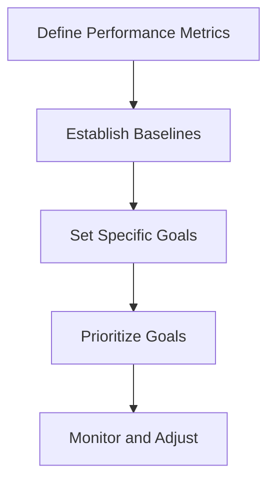

## 18.1.3 Setting Performance Goals

Setting performance goals is a critical step in the development of any application, especially when transitioning from Java to Clojure. As experienced Java developers, you are likely familiar with performance tuning in an imperative context. In this section, we will explore how to set realistic performance goals for Clojure applications, taking into account the unique characteristics of functional programming and Clojure's strengths.

### Understanding Performance Goals

Performance goals are specific, measurable objectives that define how well an application should perform under certain conditions. These goals are essential for ensuring that your application meets user expectations and operates efficiently. In the context of Clojure, performance goals should consider factors such as immutability, concurrency, and the JVM's capabilities.

#### Key Considerations for Performance Goals

1. **User Expectations**: Understand what your users expect in terms of speed and responsiveness. This can vary greatly depending on the application type (e.g., web application, data processing pipeline).

2. **Application Requirements**: Define the critical performance metrics for your application, such as response time, throughput, and resource utilization.

3. **Benchmarking**: Establish benchmarks based on similar applications or industry standards to provide a baseline for performance.

4. **Scalability**: Consider how your application will perform as the load increases. This includes both vertical scaling (improving performance on a single machine) and horizontal scaling (distributing load across multiple machines).

5. **Resource Constraints**: Be aware of the hardware and software limitations that may impact performance, such as memory, CPU, and network bandwidth.

### Setting Realistic Performance Goals

To set realistic performance goals, you need to balance ambition with feasibility. Here are some steps to guide you:

#### 1. Define Performance Metrics

Identify the key performance metrics that are relevant to your application. Common metrics include:

- **Response Time**: The time it takes for the application to respond to a user request.
- **Throughput**: The number of requests the application can handle in a given time period.
- **Latency**: The delay between a request and its corresponding response.
- **Resource Utilization**: The amount of CPU, memory, and other resources consumed by the application.

#### 2. Establish Baselines

Use benchmarking tools to measure the current performance of your application or similar applications. This will help you establish a baseline against which you can measure improvements.

#### 3. Set Specific Goals

Based on your baselines and user expectations, set specific, measurable goals for each performance metric. For example, "Reduce response time to under 200 milliseconds for 95% of requests."

#### 4. Prioritize Goals

Not all performance goals are equally important. Prioritize them based on their impact on user experience and business objectives.

#### 5. Monitor and Adjust

Continuously monitor your application's performance and adjust your goals as necessary. Use tools like [VisualVM](https://visualvm.github.io/) or [JProfiler](https://www.ej-technologies.com/products/jprofiler/overview.html) to track performance metrics and identify areas for improvement.

### Leveraging Clojure's Strengths

Clojure offers several features that can help you achieve your performance goals:

#### Immutability and Persistent Data Structures

Clojure's immutable data structures can lead to more predictable performance, as they avoid the pitfalls of mutable state. However, they may introduce overhead due to structural sharing. Understanding when and how to use these structures effectively is key to optimizing performance.

```clojure
;; Example of using a persistent vector
(def my-vector (conj [1 2 3] 4))
;; my-vector is now [1 2 3 4], and the original vector [1 2 3] remains unchanged
```

#### Concurrency Primitives

Clojure's concurrency primitives, such as atoms, refs, and agents, provide powerful tools for managing state in concurrent applications. These primitives can help you achieve high throughput and low latency in multi-threaded environments.

```clojure
;; Example of using an atom for concurrency
(def counter (atom 0))

(defn increment-counter []
  (swap! counter inc))

;; Increment the counter in a thread-safe manner
(increment-counter)
```

#### JVM Interoperability

Clojure runs on the JVM, allowing you to leverage Java's mature ecosystem and performance optimizations. You can use Java libraries and tools to enhance your Clojure application's performance.

```clojure
;; Example of calling a Java method from Clojure
(.toUpperCase "hello") ;; Returns "HELLO"
```

### Comparing Clojure and Java Performance

When setting performance goals, it's important to understand the differences between Clojure and Java:

- **Memory Usage**: Clojure's persistent data structures may use more memory than Java's mutable collections. However, they offer benefits in terms of safety and concurrency.
- **Execution Speed**: Java's imperative style can be faster for certain operations, but Clojure's functional style can lead to more efficient code in other scenarios, especially when leveraging higher-order functions and lazy evaluation.
- **Concurrency**: Clojure's concurrency model can simplify multi-threaded programming compared to Java's traditional synchronization mechanisms.

### Practical Example: Setting Performance Goals for a Web Application

Let's consider a web application built with Clojure. Here are some performance goals you might set:

1. **Response Time**: Ensure that 95% of requests are handled in under 200 milliseconds.
2. **Throughput**: Achieve a throughput of 1000 requests per second under peak load.
3. **Scalability**: Support horizontal scaling to handle increased traffic.
4. **Resource Utilization**: Keep CPU usage below 70% and memory usage below 80% under normal load.

#### Code Example: Optimizing a Clojure Web Application

```clojure
(ns myapp.core
  (:require [ring.adapter.jetty :refer [run-jetty]]
            [ring.middleware.defaults :refer [wrap-defaults site-defaults]]))

(defn handler [request]
  {:status 200
   :headers {"Content-Type" "text/plain"}
   :body "Hello, World!"})

(def app
  (wrap-defaults handler site-defaults))

(defn -main []
  (run-jetty app {:port 3000}))
```

In this example, we use the Ring library to create a simple web server. To optimize performance, we can:

- Use a more efficient HTTP server, such as [http-kit](http://www.http-kit.org/).
- Implement caching strategies to reduce the load on the server.
- Optimize database queries to improve response times.

### Try It Yourself

Experiment with the code examples provided in this section. Try modifying the web application to use different concurrency primitives or data structures. Measure the impact on performance using tools like VisualVM or JProfiler.

### Diagrams and Visualizations

Below is a flowchart illustrating the process of setting performance goals for a Clojure application:



*Diagram 1: The process of setting performance goals for a Clojure application.*

### Further Reading

For more information on performance optimization in Clojure, consider the following resources:

- [Official Clojure Documentation](https://clojure.org/reference/documentation)
- [ClojureDocs](https://clojuredocs.org/)
- [Clojure Performance Guide](https://clojure.org/guides/performance)

### Exercises

1. **Identify Performance Metrics**: Choose a Clojure application you are working on and identify the key performance metrics.
2. **Establish Baselines**: Use a benchmarking tool to measure the current performance of your application.
3. **Set and Prioritize Goals**: Based on your findings, set specific performance goals and prioritize them.
4. **Optimize Code**: Implement changes to optimize your application's performance and measure the impact.

### Key Takeaways

- Setting realistic performance goals is essential for ensuring your Clojure application meets user expectations.
- Leverage Clojure's strengths, such as immutability and concurrency primitives, to achieve your performance goals.
- Continuously monitor and adjust your performance goals based on application requirements and user feedback.

Now that we've explored how to set performance goals for Clojure applications, let's apply these concepts to optimize your code and deliver a high-performing application.

## Quiz: Mastering Performance Goals in Clojure



### What is the primary purpose of setting performance goals?

- [x] To ensure the application meets user expectations and operates efficiently.
- [ ] To increase the complexity of the application.
- [ ] To reduce the number of features in the application.
- [ ] To make the application more difficult to maintain.

> **Explanation:** Setting performance goals helps ensure that the application meets user expectations and operates efficiently, which is crucial for user satisfaction and application success.

### Which of the following is NOT a common performance metric?

- [ ] Response Time
- [ ] Throughput
- [ ] Latency
- [x] Color Scheme

> **Explanation:** Color scheme is not a performance metric. Common performance metrics include response time, throughput, and latency.

### How can Clojure's immutability benefit performance?

- [x] By providing more predictable performance and avoiding mutable state pitfalls.
- [ ] By increasing memory usage significantly.
- [ ] By making code harder to read.
- [ ] By reducing the need for concurrency.

> **Explanation:** Clojure's immutability provides more predictable performance and avoids the pitfalls of mutable state, which can lead to safer and more efficient code.

### What is a key advantage of Clojure's concurrency primitives?

- [x] They simplify multi-threaded programming compared to traditional synchronization mechanisms.
- [ ] They increase the complexity of concurrency management.
- [ ] They require more resources than Java's concurrency mechanisms.
- [ ] They are only useful for single-threaded applications.

> **Explanation:** Clojure's concurrency primitives simplify multi-threaded programming by providing safer and more efficient ways to manage state.

### What should be done after setting specific performance goals?

- [x] Prioritize the goals based on their impact on user experience and business objectives.
- [ ] Ignore the goals and focus on adding new features.
- [ ] Set new goals immediately without testing.
- [ ] Remove all existing goals.

> **Explanation:** After setting specific performance goals, it's important to prioritize them based on their impact on user experience and business objectives to ensure that the most critical goals are addressed first.

### How can you leverage Java's ecosystem in a Clojure application?

- [x] By using Java libraries and tools to enhance performance.
- [ ] By avoiding all Java-related tools and libraries.
- [ ] By rewriting Java libraries in Clojure.
- [ ] By using Java only for testing purposes.

> **Explanation:** Clojure runs on the JVM, allowing developers to leverage Java's mature ecosystem and performance optimizations to enhance their Clojure applications.

### What is an example of a practical performance goal for a web application?

- [x] Ensure that 95% of requests are handled in under 200 milliseconds.
- [ ] Increase the number of features by 50%.
- [ ] Reduce the codebase size by 30%.
- [ ] Change the user interface design.

> **Explanation:** A practical performance goal for a web application is to ensure that 95% of requests are handled in under 200 milliseconds, which directly impacts user experience.

### What tool can be used to monitor Clojure application performance?

- [x] VisualVM
- [ ] Photoshop
- [ ] Microsoft Word
- [ ] Excel

> **Explanation:** VisualVM is a tool that can be used to monitor the performance of Clojure applications, providing insights into resource utilization and potential bottlenecks.

### What is the benefit of using persistent data structures in Clojure?

- [x] They offer benefits in terms of safety and concurrency.
- [ ] They significantly increase memory usage.
- [ ] They make code harder to maintain.
- [ ] They are only useful for small applications.

> **Explanation:** Persistent data structures in Clojure offer benefits in terms of safety and concurrency, as they avoid the issues associated with mutable state.

### True or False: Clojure's functional style can lead to more efficient code in certain scenarios compared to Java's imperative style.

- [x] True
- [ ] False

> **Explanation:** Clojure's functional style can lead to more efficient code in certain scenarios, especially when leveraging higher-order functions and lazy evaluation, compared to Java's imperative style.


