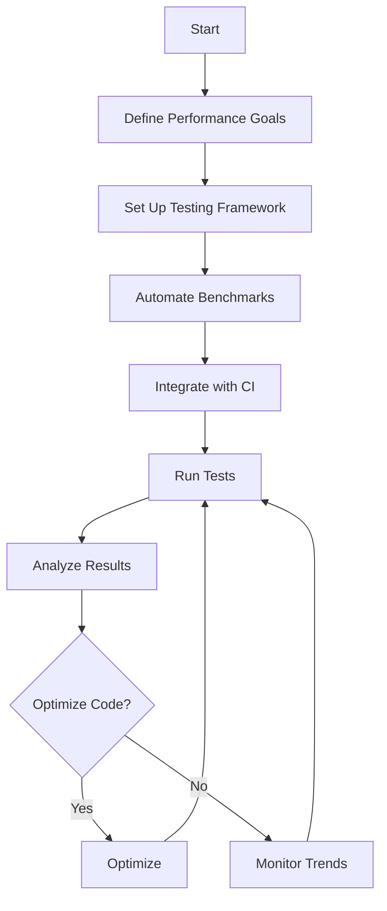

## 18.10.1 Regular Performance Testing

In the world of software development, performance is a critical aspect that can make or break the user experience. As experienced Java developers transitioning to Clojure, understanding how to incorporate regular performance testing into your development process is essential. This section will guide you through the importance of performance testing, how to automate performance benchmarks, and best practices for maintaining optimal performance in your Clojure applications.

### Why Regular Performance Testing Matters

Performance testing is not just about ensuring your application runs fast; it's about maintaining a consistent level of performance as your codebase evolves. Regular performance testing helps you:

- **Detect Regressions Early**: By integrating performance tests into your development workflow, you can catch performance regressions before they reach production.
- **Ensure Scalability**: As your application grows, performance testing ensures that it can handle increased load without degradation.
- **Optimize Resource Usage**: Identify bottlenecks and optimize resource usage to reduce costs and improve efficiency.
- **Improve User Experience**: A performant application leads to a better user experience, which is crucial for user retention and satisfaction.

### Automating Performance Benchmarks

Automation is key to effective performance testing. By automating benchmarks, you can run tests consistently and frequently, providing immediate feedback to developers. Here's how you can automate performance benchmarks in Clojure:

#### Setting Up a Performance Testing Framework

To automate performance benchmarks, you'll need a testing framework that supports performance testing. In Clojure, you can use libraries like [Criterium](https://github.com/hugoduncan/criterium) to measure the performance of your code.

```clojure
(ns myapp.performance
  (:require [criterium.core :refer [quick-bench]]))

(defn my-function [x]
  ;; Simulate some computation
  (reduce + (range x)))

;; Run a performance benchmark
(quick-bench (my-function 10000))
```

**Explanation**: In this example, we use Criterium's `quick-bench` to measure the performance of `my-function`. The library provides accurate measurements by accounting for JVM warm-up and garbage collection.

#### Integrating with Continuous Integration (CI)

To ensure performance tests run automatically, integrate them into your CI pipeline. This way, performance benchmarks are executed with every code change, and any regressions are detected immediately.

- **Jenkins**: Use the [Clojure plugin](https://plugins.jenkins.io/clojure/) to run Clojure tests, including performance benchmarks.
- **GitHub Actions**: Set up a workflow to run performance tests on every pull request.

```yaml
name: Clojure Performance Tests

on: [push, pull_request]

jobs:
  test:
    runs-on: ubuntu-latest
    steps:
    - uses: actions/checkout@v2
    - name: Set up Clojure
      uses: DeLaGuardo/setup-clojure@v1
      with:
        tools-deps: '1.10.1.536'
    - name: Run Performance Tests
      run: clojure -M:test
```

**Explanation**: This GitHub Actions workflow sets up a Clojure environment and runs performance tests on every push or pull request.

### Best Practices for Performance Testing

To get the most out of your performance testing efforts, follow these best practices:

#### Define Performance Goals

Before you start testing, define clear performance goals. These goals should be specific, measurable, achievable, relevant, and time-bound (SMART). For example, "Reduce the response time of the API endpoint to under 200ms for 95% of requests."

#### Use Realistic Test Data

Performance tests should use data that closely resembles production data. This ensures that the test results are representative of real-world performance.

#### Monitor and Analyze Results

Regularly monitor performance test results and analyze trends over time. Use tools like [Grafana](https://grafana.com/) and [Prometheus](https://prometheus.io/) to visualize performance metrics and identify patterns.

#### Optimize Based on Findings

Use the insights gained from performance testing to optimize your code. Focus on areas with the highest impact on performance, such as database queries, network calls, and computationally intensive functions.

### Comparing Clojure and Java Performance Testing

As Java developers, you may be familiar with performance testing tools like JMH (Java Microbenchmark Harness). While Clojure and Java share the JVM, there are differences in how performance testing is approached:

- **Clojure's Functional Nature**: Clojure's emphasis on immutability and pure functions can lead to different performance characteristics compared to Java's object-oriented approach.
- **Concurrency Models**: Clojure's concurrency primitives (atoms, refs, agents) offer different performance trade-offs compared to Java's traditional concurrency mechanisms.

#### Java Example: JMH Benchmark

```java
import org.openjdk.jmh.annotations.*;

@State(Scope.Thread)
public class MyBenchmark {

    @Benchmark
    public void testMethod() {
        // Simulate some computation
        int sum = 0;
        for (int i = 0; i < 10000; i++) {
            sum += i;
        }
    }
}
```

**Explanation**: This Java example uses JMH to benchmark a simple computation. JMH provides detailed performance metrics and is widely used in the Java community.

### Try It Yourself

Experiment with the Clojure performance testing example by modifying the function being benchmarked. Try different data sizes and observe how it affects performance. Consider adding additional benchmarks for other parts of your application.

### Diagrams and Visualizations

To better understand the flow of performance testing, let's visualize the process using a flowchart:



**Diagram Explanation**: This flowchart illustrates the performance testing process, from defining goals to continuous optimization and monitoring.

### External Resources

For more information on performance testing in Clojure, consider exploring the following resources:

- [Criterium Documentation](https://github.com/hugoduncan/criterium)
- [Clojure Performance Tips](https://clojure.org/guides/performance)
- [JMH Documentation](https://openjdk.java.net/projects/code-tools/jmh/)

### Exercises

1. **Benchmark a Clojure Function**: Choose a function in your Clojure project and use Criterium to benchmark its performance. Analyze the results and identify any potential optimizations.

2. **Integrate Performance Testing with CI**: Set up a CI pipeline for your Clojure project that includes performance testing. Ensure that performance benchmarks run on every code change.

3. **Compare Clojure and Java Performance**: Write equivalent functions in Clojure and Java, and benchmark them using Criterium and JMH, respectively. Compare the results and discuss any differences.

### Key Takeaways

- Regular performance testing is crucial for maintaining optimal application performance and detecting regressions early.
- Automating performance benchmarks ensures consistent and frequent testing, providing immediate feedback to developers.
- Clojure's functional nature and concurrency models offer unique performance characteristics compared to Java.
- Integrating performance testing into your CI pipeline is essential for continuous performance monitoring and optimization.

By incorporating these practices into your development workflow, you can ensure that your Clojure applications remain performant and scalable as they evolve.

## Quiz: Mastering Regular Performance Testing in Clojure



### What is the primary benefit of regular performance testing?

- [x] Detecting performance regressions early
- [ ] Reducing code complexity
- [ ] Improving code readability
- [ ] Enhancing security

> **Explanation:** Regular performance testing helps identify performance regressions before they reach production, ensuring consistent application performance.

### Which Clojure library is commonly used for performance benchmarking?

- [x] Criterium
- [ ] Ring
- [ ] Compojure
- [ ] Leiningen

> **Explanation:** Criterium is a popular Clojure library for performance benchmarking, providing accurate measurements by accounting for JVM warm-up and garbage collection.

### How can performance tests be automated in a CI pipeline?

- [x] By integrating performance tests into the CI workflow
- [ ] By manually running tests after each code change
- [ ] By using a separate testing environment
- [ ] By writing performance tests in Java

> **Explanation:** Automating performance tests in a CI pipeline ensures they run consistently with every code change, providing immediate feedback to developers.

### What is a key difference between Clojure and Java performance testing?

- [x] Clojure emphasizes immutability and pure functions
- [ ] Java has better performance testing tools
- [ ] Clojure cannot run on the JVM
- [ ] Java does not support concurrency

> **Explanation:** Clojure's emphasis on immutability and pure functions leads to different performance characteristics compared to Java's object-oriented approach.

### What is the purpose of defining performance goals?

- [x] To set specific, measurable targets for performance optimization
- [ ] To increase code complexity
- [ ] To reduce the number of tests
- [ ] To improve code readability

> **Explanation:** Defining performance goals helps set clear, measurable targets for optimization, ensuring that performance testing efforts are focused and effective.

### Which tool can be used to visualize performance metrics?

- [x] Grafana
- [ ] Criterium
- [ ] Leiningen
- [ ] Ring

> **Explanation:** Grafana is a popular tool for visualizing performance metrics, allowing developers to monitor trends and identify patterns.

### What is a common practice for optimizing code based on performance test results?

- [x] Focus on areas with the highest impact on performance
- [ ] Rewrite the entire codebase
- [ ] Ignore test results
- [ ] Increase code complexity

> **Explanation:** Optimizing code based on performance test results involves focusing on areas with the highest impact on performance, such as database queries and network calls.

### How does Clojure's concurrency model differ from Java's?

- [x] Clojure uses atoms, refs, and agents
- [ ] Clojure does not support concurrency
- [ ] Java has no concurrency primitives
- [ ] Clojure uses threads exclusively

> **Explanation:** Clojure's concurrency model includes primitives like atoms, refs, and agents, offering different performance trade-offs compared to Java's traditional concurrency mechanisms.

### What is the benefit of using realistic test data in performance tests?

- [x] Ensures test results are representative of real-world performance
- [ ] Reduces the number of tests needed
- [ ] Simplifies test setup
- [ ] Increases code complexity

> **Explanation:** Using realistic test data ensures that performance test results accurately reflect real-world performance, leading to more reliable insights.

### True or False: Regular performance testing can improve user experience.

- [x] True
- [ ] False

> **Explanation:** Regular performance testing helps maintain optimal application performance, leading to a better user experience and increased user satisfaction.


