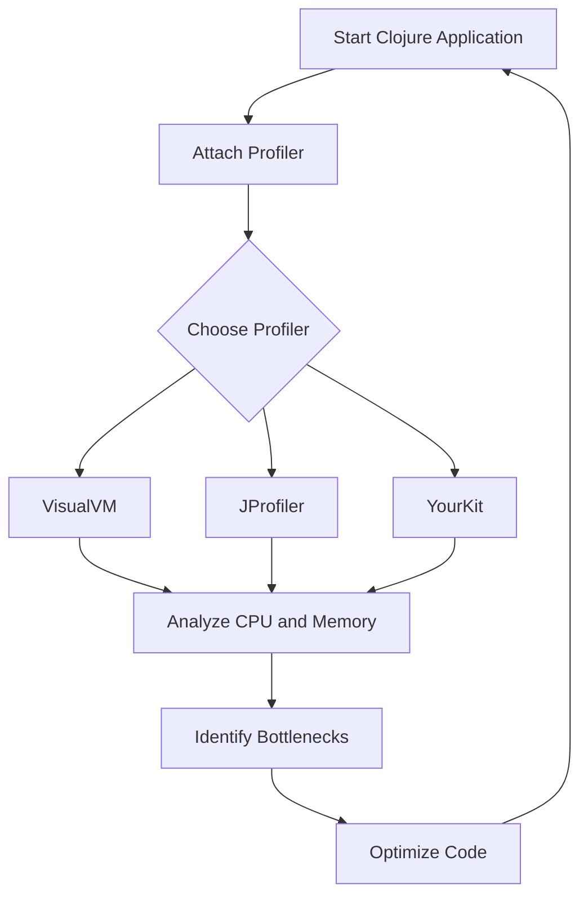

## 18.2.1 Using VisualVM and Other Profilers

In the world of software development, performance optimization is crucial, especially when working with languages like Clojure that run on the Java Virtual Machine (JVM). Profiling tools such as VisualVM, JProfiler, and YourKit are indispensable for identifying performance bottlenecks and understanding the behavior of your Clojure applications. In this section, we will explore how to use these tools effectively to profile Clojure applications, drawing parallels with Java profiling techniques to leverage your existing knowledge.

### Introduction to Profiling Tools

Profiling is the process of analyzing a program to determine where it spends most of its time and which parts of the code are consuming the most resources. This is particularly important in Clojure applications, where functional programming paradigms and immutable data structures can introduce unique performance considerations.

#### Why Profiling Matters

- **Identify Bottlenecks**: Profiling helps pinpoint slow parts of your application, allowing you to focus optimization efforts where they will have the most impact.
- **Resource Management**: Understanding memory usage and garbage collection can lead to more efficient resource management.
- **Concurrency Analysis**: Profiling tools can help analyze thread usage and concurrency issues, which are common in Clojure due to its emphasis on immutable data and concurrency primitives.

### VisualVM: A Free and Powerful Tool

VisualVM is a free, open-source profiling tool that comes bundled with the Java Development Kit (JDK). It provides a comprehensive set of features for monitoring and profiling Java applications, and by extension, Clojure applications.

#### Setting Up VisualVM

1. **Installation**: VisualVM is included in the JDK, but you can also download the latest version from the [VisualVM website](https://visualvm.github.io/).
2. **Launching VisualVM**: Start VisualVM from the command line or your operating system's application launcher.
3. **Connecting to a Clojure Application**: VisualVM can attach to any running JVM process. Ensure your Clojure application is running, and it should appear in the VisualVM interface.

#### Profiling a Clojure Application with VisualVM

1. **Monitor CPU Usage**: VisualVM provides a real-time view of CPU usage, helping you identify which threads are consuming the most CPU time.
2. **Analyze Memory Usage**: Use the memory profiler to track object allocations and garbage collection activity.
3. **Thread Analysis**: VisualVM's thread monitoring feature allows you to see thread states and identify potential deadlocks or contention issues.

```clojure
;; Example Clojure Code to Profile
(defn compute-intensive-task []
  (reduce + (map #(* % %) (range 1 1000000))))

;; Run the task
(compute-intensive-task)
```

**Commentary**: This simple Clojure function performs a compute-intensive task by squaring numbers and summing them. Profiling this function with VisualVM can help identify CPU and memory usage patterns.

#### VisualVM Features

- **Heap Dump Analysis**: Capture and analyze heap dumps to investigate memory leaks.
- **CPU and Memory Sampling**: Lightweight sampling provides insights without significant overhead.
- **Plugin Support**: Extend VisualVM's functionality with plugins for additional features.

### Advanced Profiling with JProfiler

JProfiler is a commercial profiling tool that offers advanced features for in-depth analysis of Java applications. It is particularly useful for complex Clojure applications that require detailed profiling.

#### Key Features of JProfiler

- **CPU Profiling**: Detailed call graphs and hot spot analysis.
- **Memory Profiling**: Track object allocations and identify memory leaks.
- **Thread Profiling**: Analyze thread states and synchronization issues.
- **Database Profiling**: Monitor JDBC calls and database performance.

#### Using JProfiler with Clojure

1. **Setup**: Download and install JProfiler from the [JProfiler website](https://www.ej-technologies.com/products/jprofiler/overview.html).
2. **Integration**: JProfiler can attach to a running JVM or start a JVM with profiling enabled.
3. **Profiling Session**: Start a profiling session and select the Clojure application process.

```clojure
;; Example Clojure Code for JProfiler
(defn database-query []
  ;; Simulate a database query
  (Thread/sleep 1000)
  (println "Query executed"))

;; Run the query
(database-query)
```

**Commentary**: This example simulates a database query with a sleep function. JProfiler can help analyze the execution time and identify performance bottlenecks in real database interactions.

### YourKit: A Comprehensive Profiling Solution

YourKit is another powerful commercial profiler that provides a wide range of features for Java and Clojure applications. It is known for its user-friendly interface and detailed analysis capabilities.

#### YourKit Features

- **CPU and Memory Profiling**: Similar to JProfiler, YourKit offers detailed CPU and memory analysis.
- **Exception Profiling**: Track and analyze exceptions to improve error handling.
- **Integration with Build Tools**: YourKit integrates with popular build tools like Maven and Gradle.

#### Profiling Clojure with YourKit

1. **Installation**: Download and install YourKit from the [YourKit website](https://www.yourkit.com/).
2. **Attaching to a JVM**: YourKit can attach to a running JVM or start a new JVM with profiling enabled.
3. **Analyzing Results**: Use YourKit's intuitive interface to analyze profiling data and identify optimization opportunities.

```clojure
;; Example Clojure Code for YourKit
(defn exception-prone-task []
  (try
    (/ 1 0) ;; This will throw an exception
    (catch ArithmeticException e
      (println "Caught exception:" (.getMessage e)))))

;; Run the task
(exception-prone-task)
```

**Commentary**: This example demonstrates exception handling in Clojure. YourKit can help track exceptions and analyze their impact on application performance.

### Comparing Profiling Tools

| Feature                | VisualVM       | JProfiler      | YourKit       |
|------------------------|----------------|----------------|---------------|
| **Cost**               | Free           | Commercial     | Commercial    |
| **Ease of Use**        | Moderate       | High           | High          |
| **CPU Profiling**      | Basic          | Advanced       | Advanced      |
| **Memory Profiling**   | Basic          | Advanced       | Advanced      |
| **Thread Analysis**    | Basic          | Advanced       | Advanced      |
| **Integration**        | Limited        | Extensive      | Extensive     |

**Diagram: Profiling Workflow**



*Caption*: This flowchart illustrates the typical workflow for profiling a Clojure application using VisualVM, JProfiler, or YourKit.

### Best Practices for Profiling Clojure Applications

- **Profile in a Staging Environment**: Avoid profiling in production to prevent performance degradation.
- **Focus on Hot Spots**: Concentrate on optimizing the most resource-intensive parts of your application.
- **Iterative Optimization**: Profile, optimize, and re-profile to ensure improvements are effective.
- **Use Multiple Tools**: Different tools offer unique insights; using more than one can provide a comprehensive view.

### Try It Yourself

Experiment with the provided code examples by modifying the range in `compute-intensive-task` or introducing additional exceptions in `exception-prone-task`. Observe how these changes affect profiling results in VisualVM, JProfiler, or YourKit.

### Further Reading

- [Official VisualVM Documentation](https://visualvm.github.io/documentation.html)
- [JProfiler User Guide](https://www.ej-technologies.com/products/jprofiler/docs.html)
- [YourKit Documentation](https://www.yourkit.com/docs/)

### Exercises

1. **Profile a Real Application**: Choose a Clojure application you are working on and profile it using VisualVM. Identify at least two areas for optimization.
2. **Compare Tools**: Use both JProfiler and YourKit to profile the same application. Compare the insights provided by each tool.
3. **Optimize a Function**: Take a compute-intensive function in your application and optimize it based on profiling data. Document the changes and their impact on performance.

### Key Takeaways

- Profiling is essential for identifying performance bottlenecks in Clojure applications.
- VisualVM, JProfiler, and YourKit are powerful tools for profiling JVM applications.
- Each tool offers unique features and insights, making them suitable for different profiling needs.
- Regular profiling and optimization can significantly improve application performance.

Now that we've explored how to use profiling tools to optimize Clojure applications, let's apply these concepts to enhance the performance of your projects.

## Quiz: Mastering Profiling Tools for Clojure Applications



### Which of the following is a free profiling tool included with the JDK?

- [x] VisualVM
- [ ] JProfiler
- [ ] YourKit
- [ ] NetBeans Profiler

> **Explanation:** VisualVM is a free, open-source profiling tool that comes bundled with the JDK.

### What is the primary purpose of profiling a Clojure application?

- [x] Identify performance bottlenecks
- [ ] Increase code readability
- [ ] Simplify code structure
- [ ] Enhance security

> **Explanation:** Profiling helps identify performance bottlenecks, allowing developers to focus optimization efforts effectively.

### Which profiling tool is known for its user-friendly interface and detailed analysis capabilities?

- [ ] VisualVM
- [ ] JProfiler
- [x] YourKit
- [ ] Eclipse MAT

> **Explanation:** YourKit is known for its user-friendly interface and detailed analysis capabilities.

### What feature does JProfiler offer that is particularly useful for analyzing database performance?

- [ ] Thread Analysis
- [x] Database Profiling
- [ ] Heap Dump Analysis
- [ ] Exception Tracking

> **Explanation:** JProfiler offers database profiling, which is useful for monitoring JDBC calls and database performance.

### Which of the following is NOT a feature of VisualVM?

- [ ] CPU Usage Monitoring
- [ ] Memory Profiling
- [ ] Thread Analysis
- [x] Exception Profiling

> **Explanation:** Exception profiling is not a feature of VisualVM; it is available in tools like YourKit.

### What is a common best practice when profiling applications?

- [x] Profile in a staging environment
- [ ] Profile in production
- [ ] Focus on low-impact areas
- [ ] Use only one profiling tool

> **Explanation:** Profiling in a staging environment prevents performance degradation in production.

### Which tool provides integration with popular build tools like Maven and Gradle?

- [ ] VisualVM
- [ ] JProfiler
- [x] YourKit
- [ ] NetBeans Profiler

> **Explanation:** YourKit provides integration with popular build tools like Maven and Gradle.

### What is the benefit of using multiple profiling tools?

- [x] Provides a comprehensive view
- [ ] Increases profiling time
- [ ] Simplifies the profiling process
- [ ] Reduces the need for optimization

> **Explanation:** Using multiple tools provides a comprehensive view of application performance.

### Which of the following is a key takeaway from profiling Clojure applications?

- [x] Regular profiling can significantly improve performance
- [ ] Profiling is only necessary for large applications
- [ ] Profiling tools are interchangeable
- [ ] Profiling is primarily for debugging

> **Explanation:** Regular profiling and optimization can significantly improve application performance.

### True or False: VisualVM can attach to any running JVM process.

- [x] True
- [ ] False

> **Explanation:** VisualVM can attach to any running JVM process, making it versatile for profiling.


