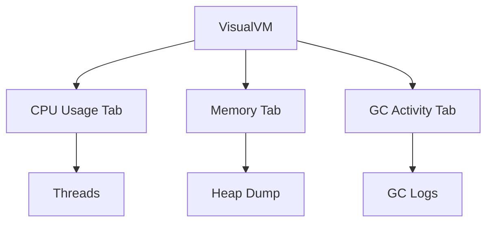
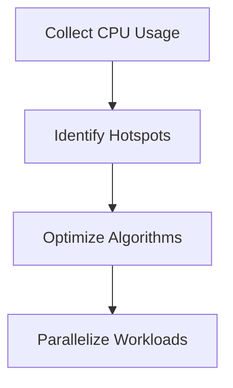

## 18.2.2 Collecting and Analyzing Metrics

As experienced Java developers transitioning to Clojure, understanding how to collect and analyze performance metrics is crucial for optimizing your applications. In this section, we will explore how to gather essential metrics such as CPU usage, memory consumption, and garbage collection statistics in Clojure applications. We will also delve into interpreting these metrics to identify and resolve performance bottlenecks.

### Understanding Performance Metrics

Performance metrics provide insights into how your application utilizes system resources. By monitoring these metrics, you can identify inefficiencies and optimize your code for better performance. Key metrics include:

- **CPU Usage**: Indicates how much processing power your application consumes.
- **Memory Consumption**: Shows the amount of memory used by your application.
- **Garbage Collection (GC) Statistics**: Provides information on memory management and the frequency and duration of garbage collection events.

### Collecting Metrics in Clojure

Clojure, running on the Java Virtual Machine (JVM), allows you to leverage Java's robust profiling tools to collect performance metrics. Let's explore some tools and techniques for gathering these metrics.

#### Using Java Management Extensions (JMX)

Java Management Extensions (JMX) is a powerful technology for monitoring and managing Java applications. Clojure applications can utilize JMX to collect metrics such as memory usage and garbage collection statistics.

**Example: Collecting Memory Usage with JMX**

```clojure
(import [java.lang.management ManagementFactory])

(defn get-memory-usage []
  (let [memory-mx-bean (ManagementFactory/getMemoryMXBean)
        heap-memory-usage (.getHeapMemoryUsage memory-mx-bean)]
    {:init (.getInit heap-memory-usage)
     :used (.getUsed heap-memory-usage)
     :committed (.getCommitted heap-memory-usage)
     :max (.getMax heap-memory-usage)}))

;; Usage
(println "Memory Usage:" (get-memory-usage))
```

*Comments*:
- We import `ManagementFactory` from `java.lang.management` to access JVM management interfaces.
- `getMemoryMXBean` retrieves the memory management bean.
- `getHeapMemoryUsage` provides details about heap memory usage.

**Try It Yourself**: Modify the code to collect non-heap memory usage by using `getNonHeapMemoryUsage`.

#### Leveraging VisualVM

VisualVM is a visual tool for monitoring and troubleshooting Java applications. It provides a user-friendly interface to view CPU usage, memory consumption, and GC statistics.

**Steps to Use VisualVM**:
1. **Install VisualVM**: Download and install VisualVM from [VisualVM's official site](https://visualvm.github.io/).
2. **Run Your Clojure Application**: Start your Clojure application with JMX enabled.
3. **Connect VisualVM**: Open VisualVM and connect to your running Clojure application.
4. **Monitor Metrics**: Use VisualVM's tabs to monitor CPU, memory, and GC activity.

**Diagram**: VisualVM Interface Overview



*Caption*: VisualVM provides a comprehensive interface for monitoring various performance metrics.

**Try It Yourself**: Experiment with VisualVM's profiling features to capture a heap dump and analyze memory usage patterns.

#### Using Clojure's Built-in Tools

Clojure provides several built-in functions and libraries to help you gather performance metrics.

**Example: Using `clojure.core` Functions**

```clojure
(defn measure-execution-time [f]
  (let [start-time (System/nanoTime)
        result (f)
        end-time (System/nanoTime)]
    {:result result
     :execution-time (/ (- end-time start-time) 1e6)})) ; Convert to milliseconds

;; Usage
(measure-execution-time #(Thread/sleep 1000))
```

*Comments*:
- `System/nanoTime` is used to measure execution time in nanoseconds.
- We convert the time to milliseconds for easier interpretation.

**Try It Yourself**: Modify the function to measure the execution time of different Clojure expressions.

### Analyzing Metrics

Once you've collected performance metrics, the next step is to analyze them to identify potential issues.

#### Interpreting CPU Usage

High CPU usage may indicate that your application is performing intensive computations or inefficient operations. Consider the following:

- **Identify Hotspots**: Use profiling tools to locate functions or loops consuming excessive CPU time.
- **Optimize Algorithms**: Review and optimize algorithms to reduce computational complexity.
- **Parallelize Workloads**: Leverage Clojure's concurrency primitives, such as `pmap`, to parallelize CPU-bound tasks.

**Diagram**: CPU Usage Analysis Flow



*Caption*: A flowchart illustrating the process of analyzing and optimizing CPU usage.

#### Understanding Memory Consumption

Memory consumption metrics help you understand how your application uses memory resources. Key considerations include:

- **Heap vs. Non-Heap Memory**: Differentiate between heap and non-heap memory usage.
- **Memory Leaks**: Look for patterns indicating memory leaks, such as continuously increasing memory usage.
- **Optimize Data Structures**: Use Clojure's persistent data structures to manage memory efficiently.

**Example: Analyzing Memory Usage**

```clojure
(defn analyze-memory-usage []
  (let [memory-usage (get-memory-usage)]
    (println "Heap Memory Used:" (:used memory-usage))
    (println "Heap Memory Max:" (:max memory-usage))
    (println "Heap Memory Committed:" (:committed memory-usage))))

(analyze-memory-usage)
```

*Comments*:
- We use the previously defined `get-memory-usage` function to retrieve memory metrics.
- The function prints key memory usage statistics.

**Try It Yourself**: Extend the function to analyze non-heap memory usage and identify potential memory leaks.

#### Interpreting Garbage Collection Statistics

Garbage collection (GC) metrics provide insights into memory management efficiency. Consider the following:

- **GC Frequency and Duration**: Frequent or long GC pauses can impact application performance.
- **GC Algorithms**: Understand the GC algorithm used by the JVM (e.g., G1, CMS) and its impact on performance.
- **Tuning GC**: Adjust JVM GC parameters to optimize performance based on your application's needs.

**Diagram**: Garbage Collection Analysis


*Caption*: A diagram illustrating the process of analyzing and tuning garbage collection.

**Try It Yourself**: Use VisualVM to monitor GC activity and experiment with different JVM GC settings to observe their impact.

### Comparing Clojure and Java Metrics Collection

While Clojure leverages the JVM for metrics collection, there are some differences in how metrics are interpreted and optimized compared to Java.

- **Functional Paradigm**: Clojure's functional paradigm encourages immutability and pure functions, which can lead to different memory usage patterns compared to Java's object-oriented approach.
- **Concurrency Models**: Clojure's concurrency primitives (e.g., atoms, refs, agents) offer different performance characteristics compared to Java's traditional threading model.

**Example: Comparing Memory Usage**

```java
// Java Example
List<Integer> list = new ArrayList<>();
for (int i = 0; i < 1000000; i++) {
    list.add(i);
}

// Clojure Example
(def clojure-list (vec (range 1000000)))
```

*Comments*:
- In Java, we use an `ArrayList` to store integers, which may lead to higher memory usage due to mutability.
- In Clojure, we use a persistent vector, which is optimized for immutability and memory efficiency.

**Try It Yourself**: Compare the memory usage of mutable and immutable data structures in both Java and Clojure.

### Best Practices for Collecting and Analyzing Metrics

To effectively collect and analyze performance metrics in Clojure applications, consider the following best practices:

- **Regular Monitoring**: Continuously monitor performance metrics in development and production environments to detect issues early.
- **Automated Alerts**: Set up automated alerts for abnormal metric values, such as high CPU usage or memory leaks.
- **Profiling in Development**: Profile your application during development to identify and resolve performance bottlenecks before deployment.
- **Documentation**: Document your findings and optimizations to build a knowledge base for future reference.

### Exercises and Practice Problems

1. **Exercise 1**: Use VisualVM to monitor a Clojure application and identify a performance bottleneck. Document your findings and propose optimizations.
2. **Exercise 2**: Implement a Clojure function to collect and log GC statistics periodically. Analyze the logs to identify potential issues.
3. **Exercise 3**: Compare the memory usage of a mutable Java data structure and an immutable Clojure data structure. Discuss the differences and implications.

### Key Takeaways

- Collecting and analyzing performance metrics is essential for optimizing Clojure applications.
- Use tools like JMX and VisualVM to gather CPU, memory, and GC metrics.
- Analyze metrics to identify performance bottlenecks and optimize your code.
- Leverage Clojure's functional paradigm and concurrency primitives for efficient resource management.
- Regular monitoring and documentation are crucial for maintaining optimal performance.

Now that we've explored how to collect and analyze performance metrics in Clojure, let's apply these concepts to optimize your applications for better performance and efficiency.

## Quiz: Mastering Metrics Collection and Analysis in Clojure



### What is the primary purpose of collecting performance metrics in Clojure applications?

- [x] To identify and resolve performance bottlenecks
- [ ] To increase the application's code size
- [ ] To reduce the application's functionality
- [ ] To make the application more complex

> **Explanation:** Collecting performance metrics helps identify inefficiencies and optimize the application for better performance.

### Which tool is commonly used to monitor Java applications, including Clojure, for performance metrics?

- [x] VisualVM
- [ ] Eclipse
- [ ] NetBeans
- [ ] IntelliJ IDEA

> **Explanation:** VisualVM is a popular tool for monitoring Java applications, providing insights into CPU usage, memory consumption, and garbage collection.

### What does JMX stand for in the context of Java applications?

- [x] Java Management Extensions
- [ ] Java Memory Extensions
- [ ] Java Monitoring Extensions
- [ ] Java Management Execution

> **Explanation:** JMX stands for Java Management Extensions, a technology for monitoring and managing Java applications.

### In Clojure, which function can be used to measure the execution time of a function?

- [x] System/nanoTime
- [ ] System/currentTimeMillis
- [ ] System/exit
- [ ] System/getProperty

> **Explanation:** System/nanoTime is used to measure execution time in nanoseconds, allowing precise timing of function execution.

### What is a common sign of a memory leak in an application?

- [x] Continuously increasing memory usage
- [ ] Decreasing CPU usage
- [ ] Stable memory usage
- [ ] Decreasing memory usage

> **Explanation:** A memory leak is often indicated by continuously increasing memory usage, as memory is not being released properly.

### Which Clojure data structure is optimized for immutability and memory efficiency?

- [x] Persistent Vector
- [ ] ArrayList
- [ ] HashMap
- [ ] LinkedList

> **Explanation:** Clojure's persistent vector is optimized for immutability and memory efficiency, unlike Java's mutable ArrayList.

### What is the role of garbage collection in a Clojure application?

- [x] To manage memory by reclaiming unused objects
- [ ] To increase CPU usage
- [ ] To decrease application performance
- [ ] To add more objects to memory

> **Explanation:** Garbage collection manages memory by reclaiming unused objects, helping to prevent memory leaks and optimize performance.

### Which JVM parameter can be adjusted to optimize garbage collection performance?

- [x] GC algorithm
- [ ] CPU clock speed
- [ ] Network bandwidth
- [ ] Disk space

> **Explanation:** Adjusting the GC algorithm and its parameters can optimize garbage collection performance, reducing pauses and improving efficiency.

### How can Clojure's concurrency primitives help optimize CPU-bound tasks?

- [x] By parallelizing workloads
- [ ] By increasing memory usage
- [ ] By reducing code readability
- [ ] By adding more threads

> **Explanation:** Clojure's concurrency primitives, such as pmap, can parallelize workloads, optimizing CPU-bound tasks for better performance.

### True or False: Regular monitoring of performance metrics is only necessary in production environments.

- [ ] True
- [x] False

> **Explanation:** Regular monitoring is essential in both development and production environments to detect and resolve performance issues early.


