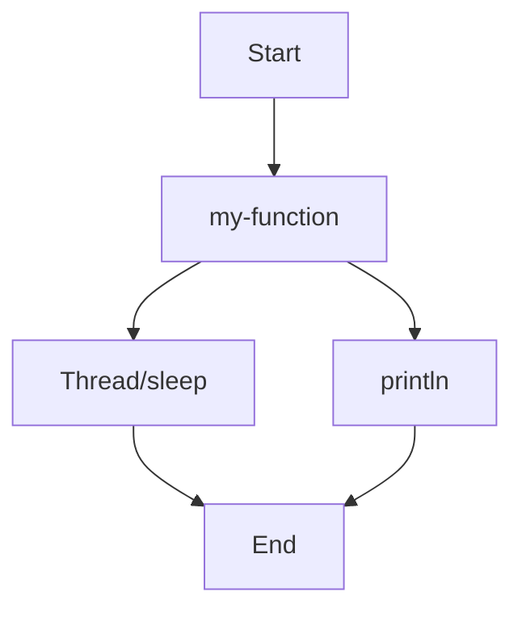

## 18.2.3 Clojure-Specific Profiling Tools

As experienced Java developers, you are likely familiar with the importance of profiling to identify performance bottlenecks and optimize applications. In Clojure, profiling is equally crucial, especially given its functional nature and reliance on the JVM. This section explores Clojure-specific profiling tools, such as `clj-async-profiler` and `criterium`, which provide insights into performance at the language level. These tools help you understand how your Clojure code interacts with the JVM and where optimizations can be made.

### Understanding the Need for Clojure-Specific Profiling

Clojure, being a dynamic language that runs on the JVM, inherits both the strengths and challenges of the Java platform. While Java developers often use tools like VisualVM or JProfiler, Clojure developers have access to specialized tools that cater to the unique aspects of the language, such as its functional paradigms and immutable data structures.

#### Key Differences Between Java and Clojure Profiling

- **Functional Paradigms**: Clojure's emphasis on immutability and higher-order functions requires profiling tools that can handle these constructs efficiently.
- **Dynamic Typing**: Unlike Java, Clojure is dynamically typed, which can introduce performance overheads that need to be profiled and optimized.
- **Concurrency Models**: Clojure's concurrency primitives, such as atoms, refs, and agents, necessitate profiling tools that can analyze concurrent execution paths.

### Introducing `clj-async-profiler`

`clj-async-profiler` is a Clojure wrapper around the popular `async-profiler`, a low-overhead sampling profiler for the JVM. It provides detailed insights into CPU and memory usage, making it an invaluable tool for Clojure developers.

#### Features of `clj-async-profiler`

- **Low Overhead**: Minimal impact on application performance during profiling.
- **Comprehensive Reports**: Generates flame graphs and detailed reports for CPU and memory usage.
- **Integration with Clojure**: Seamlessly integrates with Clojure projects, allowing for easy setup and use.

#### Setting Up `clj-async-profiler`

To get started with `clj-async-profiler`, you need to add it to your project dependencies. Here's how you can do it using Leiningen:

```clojure
;; Add to your project.clj
:dependencies [[clj-async-profiler "0.5.1"]]
```

Once added, you can start profiling your application. Here's a simple example:

```clojure
(ns my-app.core
  (:require [clj-async-profiler.core :as profiler]))

(defn my-function []
  ;; Simulate some work
  (Thread/sleep 1000)
  (println "Function executed"))

(defn -main []
  ;; Start profiling
  (profiler/start {:event :cpu})
  (my-function)
  ;; Stop profiling and generate report
  (profiler/stop)
  (profiler/dump-flamegraph "flamegraph.html"))
```

In this example, we start the profiler, execute a function, and then stop the profiler to generate a flame graph. The flame graph provides a visual representation of CPU usage, helping you identify hotspots in your code.

#### Analyzing Flame Graphs

Flame graphs are a powerful way to visualize performance data. They show the call stack and the time spent in each function, allowing you to quickly identify performance bottlenecks.



*Diagram: A simplified representation of a flame graph showing the call stack for `my-function`.*

### Exploring `criterium` for Benchmarking

While `clj-async-profiler` is excellent for profiling, `criterium` is a tool designed for benchmarking Clojure code. It provides precise and reliable performance measurements, accounting for JVM warm-up and garbage collection.

#### Features of `criterium`

- **Statistical Analysis**: Provides detailed statistical analysis of benchmark results.
- **JVM Warm-up**: Automatically handles JVM warm-up to ensure accurate measurements.
- **Garbage Collection**: Accounts for garbage collection during benchmarking.

#### Setting Up `criterium`

To use `criterium`, add it to your project dependencies:

```clojure
;; Add to your project.clj
:dependencies [[criterium "0.4.6"]]
```

Here's an example of how to benchmark a function using `criterium`:

```clojure
(ns my-app.benchmark
  (:require [criterium.core :refer [bench]]))

(defn my-function []
  ;; Simulate some work
  (reduce + (range 1000)))

(defn -main []
  (bench (my-function)))
```

In this example, `criterium` benchmarks `my-function`, providing detailed output on execution time, standard deviation, and more.

#### Interpreting Benchmark Results

`criterium` outputs a comprehensive report, including mean execution time, standard deviation, and percentiles. This data helps you understand the performance characteristics of your code and identify areas for optimization.

### Comparing Clojure Profiling with Java

While Java developers often rely on tools like JProfiler or YourKit, Clojure-specific tools offer advantages tailored to the language's unique features:

- **Integration with Clojure**: Tools like `clj-async-profiler` and `criterium` integrate seamlessly with Clojure's build tools and workflows.
- **Functional Paradigms**: These tools are designed to handle Clojure's functional constructs, providing more relevant insights than general JVM profilers.

### Best Practices for Profiling Clojure Applications

1. **Profile in Production-Like Environments**: Ensure that your profiling environment closely resembles production to get accurate results.
2. **Focus on Hotspots**: Use flame graphs and benchmark reports to identify and optimize hotspots in your code.
3. **Iterate and Measure**: Continuously profile and benchmark your application as you make changes to ensure performance improvements.

### Try It Yourself

Experiment with the provided examples by modifying the functions being profiled or benchmarked. Try adding more complex logic or increasing the workload to see how it affects performance.

### Exercises

1. **Profile a Clojure Web Application**: Use `clj-async-profiler` to profile a simple Clojure web application and identify performance bottlenecks.
2. **Benchmark Data Processing Functions**: Use `criterium` to benchmark functions that process large datasets and analyze the results.

### Key Takeaways

- **Clojure-Specific Tools**: `clj-async-profiler` and `criterium` are powerful tools for profiling and benchmarking Clojure applications.
- **Flame Graphs and Benchmarks**: Use flame graphs to visualize CPU usage and `criterium` for precise benchmarking.
- **Continuous Optimization**: Regularly profile and benchmark your code to maintain optimal performance.

By leveraging these tools, you can gain deep insights into your Clojure application's performance and make informed decisions to optimize it effectively.

### Further Reading

- [Official Clojure Documentation](https://clojure.org/)
- [ClojureDocs](https://clojuredocs.org/)
- [clj-async-profiler GitHub Repository](https://github.com/clojure-goes-fast/clj-async-profiler)
- [criterium GitHub Repository](https://github.com/hugoduncan/criterium)

## Quiz: Mastering Clojure-Specific Profiling Tools



### What is the primary purpose of `clj-async-profiler`?

- [x] To provide low-overhead CPU and memory profiling for Clojure applications
- [ ] To benchmark Clojure functions with statistical analysis
- [ ] To manage dependencies in Clojure projects
- [ ] To compile Clojure code to Java bytecode

> **Explanation:** `clj-async-profiler` is designed for profiling CPU and memory usage in Clojure applications with minimal overhead.

### Which tool is best suited for benchmarking Clojure functions?

- [ ] clj-async-profiler
- [x] criterium
- [ ] Leiningen
- [ ] VisualVM

> **Explanation:** `criterium` is specifically designed for benchmarking Clojure functions, providing detailed statistical analysis.

### What type of graph does `clj-async-profiler` generate to visualize performance data?

- [ ] Bar graph
- [ ] Line graph
- [x] Flame graph
- [ ] Pie chart

> **Explanation:** `clj-async-profiler` generates flame graphs to visualize CPU usage and identify performance bottlenecks.

### How does `criterium` ensure accurate benchmarking results?

- [x] By accounting for JVM warm-up and garbage collection
- [ ] By running benchmarks in a separate thread
- [ ] By using machine learning algorithms
- [ ] By compiling Clojure code to native binaries

> **Explanation:** `criterium` handles JVM warm-up and garbage collection to provide accurate benchmarking results.

### What is a key advantage of using Clojure-specific profiling tools over general JVM profilers?

- [x] They integrate seamlessly with Clojure's functional paradigms
- [ ] They are faster than JVM profilers
- [ ] They do not require any setup
- [ ] They are open-source

> **Explanation:** Clojure-specific tools are designed to work with the language's functional constructs, providing more relevant insights.

### Which of the following is NOT a feature of `clj-async-profiler`?

- [ ] Low overhead
- [ ] Flame graph generation
- [x] Statistical benchmarking
- [ ] Integration with Clojure

> **Explanation:** `clj-async-profiler` focuses on profiling, not benchmarking, which is the domain of `criterium`.

### What is the main focus of flame graphs generated by `clj-async-profiler`?

- [x] Visualizing CPU usage and call stacks
- [ ] Displaying memory allocation patterns
- [ ] Showing network traffic
- [ ] Illustrating database queries

> **Explanation:** Flame graphs visualize CPU usage and call stacks to help identify performance bottlenecks.

### How can you modify the provided `clj-async-profiler` example to profile memory usage instead of CPU?

- [x] Change the event type to `:alloc` in the `profiler/start` function
- [ ] Use a different profiler tool
- [ ] Increase the workload in `my-function`
- [ ] Add more print statements

> **Explanation:** Changing the event type to `:alloc` allows `clj-async-profiler` to profile memory allocations.

### What is the benefit of using `criterium` for benchmarking over manual timing methods?

- [x] It provides statistical analysis and accounts for JVM warm-up
- [ ] It is faster than manual timing
- [ ] It requires no setup
- [ ] It automatically optimizes the code

> **Explanation:** `criterium` offers statistical analysis and handles JVM warm-up, providing more accurate benchmarks than manual timing.

### True or False: `clj-async-profiler` can be used to profile both CPU and memory usage in Clojure applications.

- [x] True
- [ ] False

> **Explanation:** `clj-async-profiler` can profile both CPU and memory usage, making it versatile for performance analysis.


