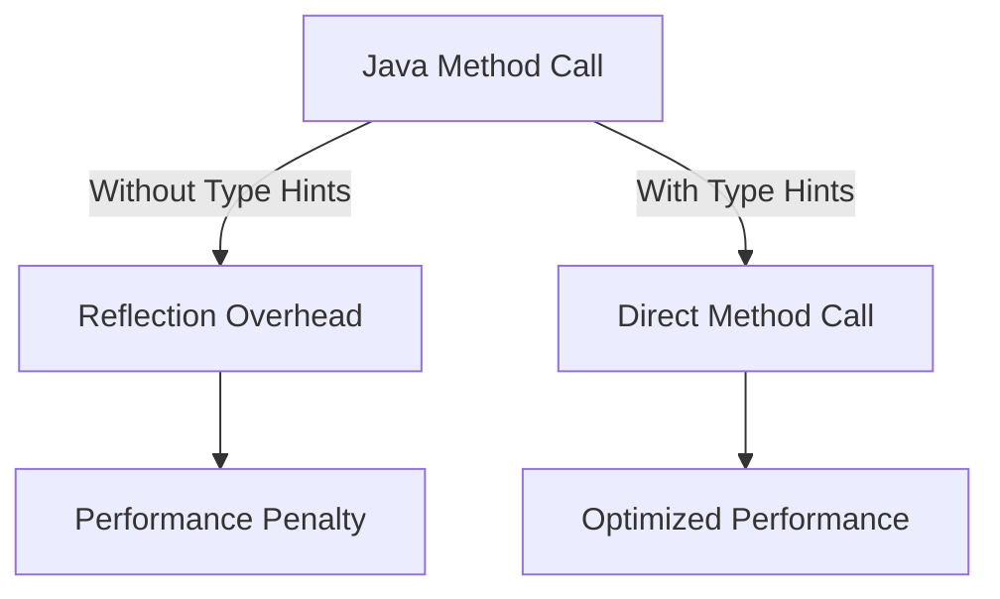

## 18.3.1 Avoiding Reflection

Reflection is a powerful feature in Java that allows programs to inspect and manipulate objects at runtime. However, this flexibility comes at a cost: performance overhead. In Clojure, reflection can occur when calling Java methods without explicit type information. This section will guide you through understanding reflection in Clojure, its impact on performance, and how to avoid it using type hints and other techniques.

### Understanding Reflection in Clojure

Reflection in Clojure occurs when the language needs to determine the type of an object at runtime to call a method or access a field. This process involves looking up method signatures and can significantly slow down your application, especially in performance-critical sections of code.

#### How Reflection Works

When you call a Java method from Clojure without specifying the types of the arguments or the return type, Clojure uses reflection to resolve the method call. This involves:

1. **Inspecting the Object**: Clojure examines the object to determine its class.
2. **Finding the Method**: It searches for a method that matches the name and argument types.
3. **Invoking the Method**: Once found, the method is invoked.

This process is repeated each time the method is called, leading to unnecessary overhead.

#### Example of Reflection in Clojure

Consider the following Clojure code that calls a Java method:

```clojure
(defn calculate-area [radius]
  (* Math/PI (. Math pow radius 2)))
```

In this example, the call to `Math/pow` involves reflection because Clojure does not know the types of `radius` and the return type of `Math/pow`.

### Identifying Reflection in Your Code

To identify where reflection occurs in your Clojure code, you can use the `*warn-on-reflection*` dynamic variable. When set to `true`, Clojure will emit warnings whenever reflection is used.

```clojure
(set! *warn-on-reflection* true)
```

By enabling this setting, you can pinpoint areas in your code that require optimization.

### Avoiding Reflection with Type Hints

Type hints are a way to provide Clojure with type information, allowing it to bypass reflection. By specifying the expected types of arguments and return values, you can significantly improve performance.

#### Using Type Hints

Type hints are added using metadata in Clojure. Here's how you can apply them to the previous example:

```clojure
(defn calculate-area [^double radius]
  (* Math/PI (. Math ^double pow radius 2.0)))
```

In this revised version, `^double` is used to hint that `radius` is a double, and `^double` before `pow` indicates the return type. This eliminates the need for reflection.

#### Type Hinting Best Practices

- **Be Specific**: Use the most specific type possible to avoid unnecessary casting.
- **Consistent Usage**: Apply type hints consistently across your codebase to maintain performance.
- **Avoid Overuse**: While type hints are beneficial, overusing them can make your code harder to read. Use them judiciously in performance-critical sections.

### Comparing Clojure and Java Reflection

In Java, reflection is often used for dynamic class loading, method invocation, and field access. While powerful, it is generally avoided in performance-sensitive applications due to its overhead.

#### Java Reflection Example

```java
import java.lang.reflect.Method;

public class ReflectionExample {
    public static void main(String[] args) throws Exception {
        Class<?> mathClass = Class.forName("java.lang.Math");
        Method powMethod = mathClass.getMethod("pow", double.class, double.class);
        double result = (double) powMethod.invoke(null, 2.0, 3.0);
        System.out.println("Result: " + result);
    }
}
```

This Java code uses reflection to call the `Math.pow` method. The process involves class loading, method lookup, and invocation, similar to what happens in Clojure without type hints.

### Performance Impact of Reflection

Reflection can introduce significant performance penalties due to:

- **Method Lookup**: The process of finding the correct method to invoke.
- **Dynamic Dispatch**: The overhead of calling methods dynamically rather than statically.
- **Increased Complexity**: Reflection can make code harder to understand and maintain.

### Measuring Performance in Clojure

To measure the performance impact of reflection, you can use benchmarking tools like Criterium. Here's an example of how to benchmark the `calculate-area` function:

```clojure
(require '[criterium.core :refer [quick-bench]])

(defn calculate-area [^double radius]
  (* Math/PI (. Math ^double pow radius 2.0)))

(quick-bench (calculate-area 5.0))
```

This will provide you with detailed performance metrics, allowing you to compare the impact of reflection before and after applying type hints.

### Try It Yourself

Experiment with the following code snippets to see the impact of reflection:

1. **Without Type Hints**: Remove the type hints from the `calculate-area` function and benchmark it.
2. **With Type Hints**: Add type hints and compare the performance.
3. **Different Data Types**: Try using different data types and see how they affect performance.

### Diagrams and Visualizations

To better understand the flow of data and the impact of reflection, consider the following diagram:



**Diagram Explanation**: This flowchart illustrates the difference between calling a Java method with and without type hints in Clojure. Without type hints, reflection overhead is introduced, leading to a performance penalty. With type hints, the method call is direct, resulting in optimized performance.

### Further Reading and Resources

For more information on reflection and performance optimization in Clojure, consider the following resources:

- [Official Clojure Documentation](https://clojure.org/reference/java_interop)
- [ClojureDocs on Type Hints](https://clojuredocs.org/clojure.core/type-hint)
- [Criterium Benchmarking Library](https://github.com/hugoduncan/criterium)

### Exercises and Practice Problems

1. **Identify Reflection**: Enable `*warn-on-reflection*` in a Clojure project and identify all instances of reflection.
2. **Optimize Code**: Apply type hints to eliminate reflection and measure the performance improvement.
3. **Compare with Java**: Write equivalent Java code using reflection and compare the performance with Clojure.

### Key Takeaways

- **Reflection in Clojure**: Reflection occurs when Clojure needs to determine types at runtime, leading to performance overhead.
- **Type Hints**: Use type hints to provide Clojure with type information, eliminating the need for reflection.
- **Performance Optimization**: Avoiding reflection can significantly improve the performance of your Clojure applications.
- **Benchmarking**: Use tools like Criterium to measure and compare performance before and after optimization.

By understanding and avoiding reflection, you can write more efficient and performant Clojure code, leveraging the full power of the JVM without the associated overhead.

---

## Quiz: Mastering Clojure Performance by Avoiding Reflection



### What is the primary reason to avoid reflection in Clojure?

- [x] Performance overhead
- [ ] Code readability
- [ ] Security concerns
- [ ] Compatibility issues

> **Explanation:** Reflection introduces performance overhead due to runtime type resolution, which can slow down your application.

### How can you identify reflection in your Clojure code?

- [x] By setting `*warn-on-reflection*` to `true`
- [ ] By using a debugger
- [ ] By writing unit tests
- [ ] By using a profiler

> **Explanation:** Setting `*warn-on-reflection*` to `true` will emit warnings whenever reflection is used, helping you identify areas for optimization.

### What is the purpose of type hints in Clojure?

- [x] To provide type information and avoid reflection
- [ ] To improve code readability
- [ ] To enforce type safety
- [ ] To enable dynamic typing

> **Explanation:** Type hints provide Clojure with type information, allowing it to bypass reflection and improve performance.

### Which of the following is a consequence of using reflection in Clojure?

- [x] Increased method lookup time
- [ ] Improved code readability
- [ ] Enhanced security
- [ ] Reduced memory usage

> **Explanation:** Reflection increases method lookup time due to the need for runtime type resolution.

### What is the correct way to apply a type hint to a function argument in Clojure?

- [x] `[^double radius]`
- [ ] `[double radius]`
- [ ] `[radius double]`
- [ ] `[radius: double]`

> **Explanation:** `[^double radius]` is the correct syntax for applying a type hint to a function argument in Clojure.

### What tool can you use to benchmark Clojure code performance?

- [x] Criterium
- [ ] JUnit
- [ ] Mockito
- [ ] JProfiler

> **Explanation:** Criterium is a benchmarking library used to measure and analyze the performance of Clojure code.

### Which of the following is NOT a benefit of avoiding reflection in Clojure?

- [ ] Improved performance
- [ ] Faster method invocation
- [x] Increased code complexity
- [ ] Reduced runtime overhead

> **Explanation:** Avoiding reflection reduces runtime overhead and improves performance, but it does not increase code complexity.

### How does reflection affect method invocation in Clojure?

- [x] It introduces runtime overhead
- [ ] It simplifies method calls
- [ ] It enforces type safety
- [ ] It enhances code readability

> **Explanation:** Reflection introduces runtime overhead by requiring type resolution at runtime, slowing down method invocation.

### What is the impact of type hints on Clojure code?

- [x] They eliminate reflection and improve performance
- [ ] They enforce strict typing
- [ ] They increase code readability
- [ ] They enhance security

> **Explanation:** Type hints eliminate reflection by providing type information, leading to improved performance.

### True or False: Reflection is always necessary in Clojure for Java interop.

- [ ] True
- [x] False

> **Explanation:** Reflection is not always necessary; it can be avoided by using type hints to provide Clojure with the necessary type information.


