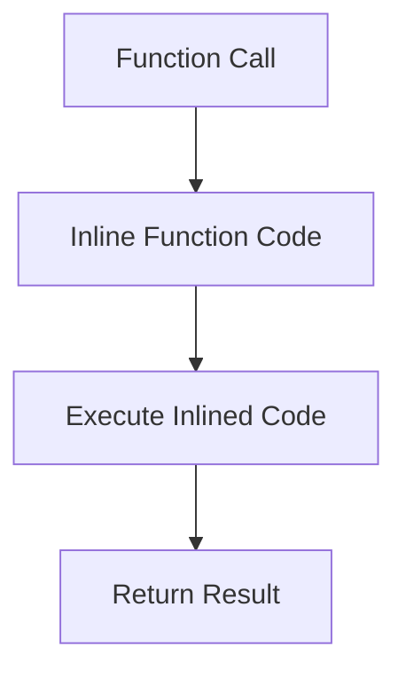

## 18.3.2 Inlining Functions

In the world of software development, performance optimization is a crucial aspect that can significantly impact the efficiency and responsiveness of applications. For experienced Java developers transitioning to Clojure, understanding how to optimize function calls through inlining can be a game-changer. In this section, we'll delve into the concept of inlining functions in Clojure, explore the use of the `inline` metadata, and compare these techniques with Java's approach to function inlining.

### Understanding Function Inlining

**Function inlining** is a performance optimization technique where the compiler replaces a function call with the actual code of the function. This can reduce the overhead associated with function calls, such as stack manipulation and context switching, leading to faster execution times.

#### Why Inline Functions?

Inlining is particularly beneficial for small, frequently used functions. By eliminating the function call overhead, inlining can lead to:

- **Reduced Execution Time**: Directly executing the function's code avoids the overhead of a function call.
- **Improved Cache Utilization**: Inlined code can lead to better instruction cache utilization.
- **Enhanced Performance**: Especially in tight loops or recursive functions where the function call overhead can accumulate.

#### Inlining in Java

In Java, the Just-In-Time (JIT) compiler automatically inlines methods that are small and frequently called. Java developers often rely on the JIT compiler's heuristics to decide which methods to inline. However, developers can influence this process by writing methods that are conducive to inlining, such as keeping methods small and avoiding complex control flows.

### Inlining in Clojure

Clojure, being a dynamic language, provides a different approach to inlining. While it doesn't have a JIT compiler like Java, it allows developers to use the `inline` metadata to suggest inlining for specific functions.

#### Using the `inline` Metadata

The `inline` metadata in Clojure is a hint to the compiler that a particular function should be inlined. This is particularly useful for small utility functions that are called frequently.

Here's how you can define an inline function in Clojure:

```clojure
(defn ^:inline add [x y]
  (+ x y))
```

In this example, the `^:inline` metadata suggests that the `add` function should be inlined. This means that wherever `add` is called, the compiler will attempt to replace the call with the actual code `(+ x y)`.

#### Benefits of Inlining in Clojure

- **Reduced Overhead**: By eliminating the function call overhead, inlining can lead to faster execution times.
- **Simplified Code**: Inlining can make the codebase cleaner by reducing the need for small utility functions scattered throughout the code.
- **Improved Performance**: Especially in performance-critical sections of code, such as loops or recursive functions.

### Comparing Clojure and Java Inlining

While both Java and Clojure support inlining, the mechanisms and implications differ:

- **Java**: Relies on the JIT compiler to automatically inline methods based on heuristics.
- **Clojure**: Provides explicit control over inlining through the `inline` metadata, allowing developers to optimize specific functions.

### Code Example: Inlining in Clojure vs. Java

Let's compare a simple example of inlining in Clojure and Java.

**Clojure Example:**

```clojure
(defn ^:inline square [x]
  (* x x))

(defn calculate-squares [numbers]
  (map square numbers))
```

In this example, the `square` function is inlined, meaning that the multiplication operation is directly inserted into the `map` function, reducing the overhead of function calls.

**Java Example:**

```java
public class InlineExample {
    public static int square(int x) {
        return x * x;
    }

    public static List<Integer> calculateSquares(List<Integer> numbers) {
        return numbers.stream()
                      .map(InlineExample::square)
                      .collect(Collectors.toList());
    }
}
```

In Java, the JIT compiler may choose to inline the `square` method based on its heuristics. However, developers have less explicit control over this process compared to Clojure.

### Try It Yourself: Experimenting with Inlining

To get hands-on experience with inlining in Clojure, try modifying the `square` function to include additional operations and observe the impact on performance. Consider using the `time` macro to measure execution time before and after inlining.

### Diagrams and Visualizations

To better understand the concept of inlining, let's visualize the flow of data through an inlined function using a Mermaid.js diagram.



**Diagram Description**: This diagram illustrates the process of inlining a function call. The function call is replaced with the actual code of the function, which is then executed directly, resulting in a return value.

### Exercises and Practice Problems

1. **Exercise 1**: Define a small utility function in Clojure and use the `inline` metadata to suggest inlining. Measure the performance before and after inlining using the `time` macro.

2. **Exercise 2**: Compare the performance of a recursive function with and without inlining. Analyze the impact on execution time and stack usage.

3. **Exercise 3**: Explore the impact of inlining on a Clojure project by identifying frequently used functions and applying the `inline` metadata. Document the performance improvements observed.

### Key Takeaways

- **Inlining** is a powerful optimization technique that can reduce function call overhead and improve performance.
- **Clojure's `inline` metadata** provides explicit control over inlining, allowing developers to optimize specific functions.
- **Java's JIT compiler** automatically inlines methods based on heuristics, offering less explicit control compared to Clojure.
- **Hands-on experimentation** with inlining can provide valuable insights into its impact on performance.

By understanding and applying inlining techniques, you can enhance the performance of your Clojure applications and make informed decisions about when and where to apply this optimization.

### Further Reading

- [Clojure Documentation on Metadata](https://clojure.org/reference/metadata)
- [ClojureDocs: Inline Functions](https://clojuredocs.org/clojure.core/inline)
- [Java Performance Tuning Guide](https://www.oracle.com/java/technologies/javase/performance.html)

## Quiz: Mastering Function Inlining in Clojure



### What is the primary benefit of inlining functions in Clojure?

- [x] Reducing function call overhead
- [ ] Increasing code complexity
- [ ] Enhancing code readability
- [ ] Simplifying debugging

> **Explanation:** Inlining functions reduces the overhead associated with function calls, leading to faster execution times.

### How does Clojure allow developers to suggest inlining for specific functions?

- [x] Using the `inline` metadata
- [ ] By writing functions in a specific style
- [ ] Through the JIT compiler
- [ ] By using a special keyword

> **Explanation:** Clojure uses the `inline` metadata to hint at inlining specific functions.

### In Java, what mechanism is primarily responsible for inlining methods?

- [x] The JIT compiler
- [ ] The `inline` keyword
- [ ] Manual annotations
- [ ] The JVM interpreter

> **Explanation:** The JIT compiler in Java automatically inlines methods based on heuristics.

### Which of the following is a potential downside of inlining functions?

- [x] Increased code size
- [ ] Decreased execution speed
- [ ] Reduced cache utilization
- [ ] Improved readability

> **Explanation:** Inlining can lead to increased code size, which may affect cache utilization.

### What is the purpose of the `time` macro in Clojure?

- [x] To measure execution time
- [ ] To inline functions
- [ ] To optimize code
- [ ] To handle exceptions

> **Explanation:** The `time` macro is used to measure the execution time of a block of code in Clojure.

### Which of the following is true about inlining in Clojure compared to Java?

- [x] Clojure provides explicit control over inlining
- [ ] Java provides more explicit control over inlining
- [ ] Both languages use the same mechanism for inlining
- [ ] Inlining is not possible in Clojure

> **Explanation:** Clojure allows developers to explicitly control inlining using the `inline` metadata.

### What is a common use case for inlining functions?

- [x] Small, frequently used utility functions
- [ ] Large, complex algorithms
- [ ] Functions with many side effects
- [ ] Functions that are rarely called

> **Explanation:** Inlining is most beneficial for small, frequently used utility functions to reduce call overhead.

### How can you measure the performance impact of inlining in Clojure?

- [x] Using the `time` macro
- [ ] By counting the number of function calls
- [ ] By analyzing the stack trace
- [ ] By using the `inline` keyword

> **Explanation:** The `time` macro can be used to measure the execution time and assess the performance impact of inlining.

### What is a potential risk of excessive inlining?

- [x] Code bloat
- [ ] Improved performance
- [ ] Simplified codebase
- [ ] Enhanced readability

> **Explanation:** Excessive inlining can lead to code bloat, which may negatively impact performance.

### True or False: Inlining is always beneficial for performance.

- [ ] True
- [x] False

> **Explanation:** Inlining is not always beneficial; it can lead to increased code size and may not be suitable for all functions.


