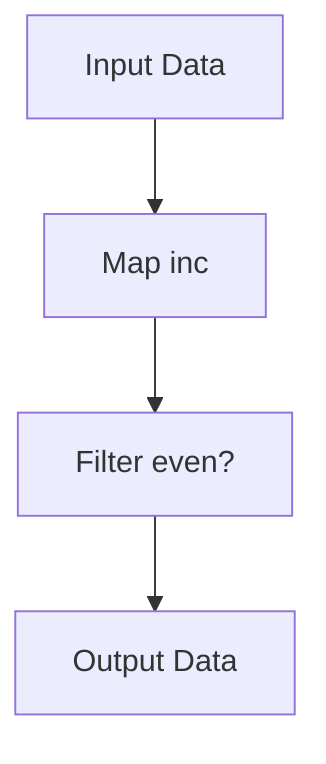

## 18.3.3 Reducing Function Call Overhead

As experienced Java developers, you're likely familiar with the concept of function call overhead and its impact on performance. In Clojure, a functional programming language that emphasizes immutability and higher-order functions, understanding and optimizing function call overhead is crucial for building efficient applications. In this section, we'll explore strategies to reduce function call overhead, focusing on techniques like using transducers, avoiding unnecessary function recreation, and leveraging Clojure's unique features.

### Understanding Function Call Overhead

Function call overhead refers to the computational cost associated with invoking a function. This cost can include stack operations, parameter passing, and context switching. In Clojure, where functions are first-class citizens and higher-order functions are prevalent, minimizing this overhead is essential for maintaining performance.

#### Comparing Java and Clojure Function Calls

In Java, method calls are typically optimized by the JVM, especially when using techniques like inlining. However, in Clojure, the dynamic nature and frequent use of higher-order functions can introduce additional overhead. Let's compare a simple function call in both languages:

**Java Example:**

```java
public class FunctionExample {
    public static int add(int a, int b) {
        return a + b;
    }

    public static void main(String[] args) {
        int result = add(5, 3);
        System.out.println(result);
    }
}
```

**Clojure Example:**

```clojure
(defn add [a b]
  (+ a b))

(defn -main []
  (println (add 5 3)))
```

While both examples perform a simple addition, the Clojure version involves additional overhead due to its dynamic nature and the use of higher-order functions. Let's explore how we can reduce this overhead.

### Strategies for Reducing Function Call Overhead

#### 1. Using Transducers

Transducers are a powerful feature in Clojure that allow you to compose and apply transformations to data without creating intermediate collections. This reduces the overhead associated with multiple function calls and improves performance.

**Example:**

```clojure
(defn process-data [data]
  (transduce
    (comp
      (map inc)
      (filter even?))
    conj
    []
    data))

(defn -main []
  (println (process-data (range 10))))
```

In this example, `transduce` applies a series of transformations (`map` and `filter`) to the data in a single pass, avoiding the creation of intermediate collections.

**Diagram: Transducer Flow**



*Caption: This diagram illustrates the flow of data through a transducer, applying transformations in a single pass.*

#### 2. Avoiding Unnecessary Function Recreation

In Clojure, functions can be created dynamically, but this can lead to unnecessary overhead if not managed carefully. Avoid recreating functions within loops or frequently called code paths.

**Example:**

```clojure
(defn process-items [items]
  (let [process-fn (fn [item] (* item 2))]
    (map process-fn items)))

(defn -main []
  (println (process-items (range 5))))
```

By defining `process-fn` outside of the loop, we avoid recreating the function on each iteration, reducing overhead.

#### 3. Leveraging Inline Functions

Clojure allows you to define inline functions using the `fn` keyword. While this can be convenient, it's important to use them judiciously to avoid unnecessary overhead.

**Example:**

```clojure
(defn process-items [items]
  (map #(inc %) items))

(defn -main []
  (println (process-items (range 5))))
```

In this example, the inline function `#(inc %)` is concise and efficient for simple operations. However, for more complex logic, consider defining a named function to avoid repeated creation.

#### 4. Utilizing Persistent Data Structures

Clojure's persistent data structures are designed to be efficient and minimize overhead. By leveraging these structures, you can reduce the cost of function calls that manipulate collections.

**Example:**

```clojure
(defn update-map [m]
  (assoc m :new-key "new-value"))

(defn -main []
  (let [original-map {:a 1 :b 2}]
    (println (update-map original-map))))
```

Persistent data structures ensure that updates are efficient and do not require copying the entire structure, reducing overhead.

### Practical Tips for Reducing Overhead

- **Profile Your Code**: Use tools like [VisualVM](https://visualvm.github.io/) or [Criterium](https://github.com/hugoduncan/criterium) to identify hotspots and optimize function calls.
- **Minimize Closure Creation**: Avoid creating closures within loops or frequently executed code paths.
- **Use Type Hints**: Provide type hints to help the Clojure compiler optimize function calls and reduce reflection overhead.
- **Optimize Recursion**: Use tail recursion and the `recur` keyword to optimize recursive function calls.

### Try It Yourself

Experiment with the following code snippets to see how different strategies impact performance:

1. **Modify the Transducer Example**: Add additional transformations and observe the impact on performance.
2. **Refactor the Function Recreation Example**: Move the function definition inside the loop and compare performance.
3. **Inline vs Named Functions**: Compare the performance of inline functions versus named functions for complex operations.

### Exercises

1. **Optimize a Data Processing Pipeline**: Given a sequence of data transformations, refactor the code to use transducers and measure the performance improvement.
2. **Reduce Closure Overhead**: Identify closures in a given codebase and refactor them to minimize overhead.
3. **Profile and Optimize**: Use a profiling tool to identify function call overhead in a sample application and apply the strategies discussed to optimize it.

### Key Takeaways

- **Transducers**: Use transducers to apply transformations in a single pass, reducing function call overhead.
- **Function Recreation**: Avoid unnecessary function recreation by defining functions outside of loops and frequently called code paths.
- **Persistent Data Structures**: Leverage Clojure's persistent data structures to minimize overhead when manipulating collections.
- **Profiling and Optimization**: Regularly profile your code to identify and optimize function call overhead.

By applying these strategies, you can effectively reduce function call overhead in your Clojure applications, leading to improved performance and efficiency.

## Quiz: Mastering Function Call Optimization in Clojure



### What is function call overhead?

- [x] The computational cost associated with invoking a function
- [ ] The time it takes to write a function
- [ ] The memory used by a function
- [ ] The number of lines in a function

> **Explanation:** Function call overhead refers to the computational cost involved in invoking a function, including stack operations and parameter passing.

### How do transducers help reduce function call overhead?

- [x] By applying transformations in a single pass without creating intermediate collections
- [ ] By increasing the number of function calls
- [ ] By using more memory
- [ ] By slowing down the execution

> **Explanation:** Transducers apply transformations in a single pass, avoiding the creation of intermediate collections and reducing function call overhead.

### What is a common mistake that leads to unnecessary function recreation?

- [x] Defining functions inside loops
- [ ] Using persistent data structures
- [ ] Applying type hints
- [ ] Using inline functions

> **Explanation:** Defining functions inside loops can lead to unnecessary function recreation, increasing overhead.

### What is the benefit of using persistent data structures in Clojure?

- [x] They minimize overhead when manipulating collections
- [ ] They increase memory usage
- [ ] They slow down execution
- [ ] They require more function calls

> **Explanation:** Persistent data structures are designed to be efficient and minimize overhead when manipulating collections.

### How can you optimize recursive function calls in Clojure?

- [x] Use tail recursion and the `recur` keyword
- [ ] Avoid recursion altogether
- [ ] Use more memory
- [ ] Increase the number of function calls

> **Explanation:** Tail recursion and the `recur` keyword help optimize recursive function calls by reducing stack usage.

### What tool can you use to profile Clojure code?

- [x] VisualVM
- [ ] Microsoft Word
- [ ] Adobe Photoshop
- [ ] Google Chrome

> **Explanation:** VisualVM is a tool that can be used to profile Clojure code and identify performance bottlenecks.

### Why should you use type hints in Clojure?

- [x] To help the compiler optimize function calls and reduce reflection overhead
- [ ] To increase the number of function calls
- [ ] To slow down execution
- [ ] To use more memory

> **Explanation:** Type hints help the Clojure compiler optimize function calls and reduce reflection overhead.

### What is the impact of using inline functions for complex operations?

- [x] They can increase overhead if used excessively
- [ ] They always improve performance
- [ ] They reduce memory usage
- [ ] They simplify code

> **Explanation:** While inline functions are convenient, using them excessively for complex operations can increase overhead.

### How can you reduce closure creation overhead?

- [x] Avoid creating closures within loops or frequently executed code paths
- [ ] Use more closures
- [ ] Increase memory usage
- [ ] Slow down execution

> **Explanation:** Avoiding closure creation within loops or frequently executed code paths helps reduce overhead.

### True or False: Transducers create intermediate collections.

- [ ] True
- [x] False

> **Explanation:** Transducers do not create intermediate collections; they apply transformations in a single pass.


