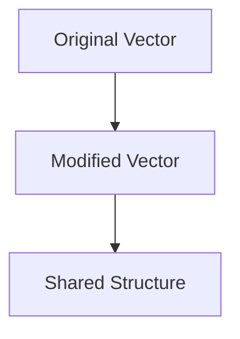

## 18.4.1 Choosing the Right Data Structures

In the realm of software development, selecting the right data structures is crucial for achieving optimal performance and efficiency. For Java developers transitioning to Clojure, understanding how to choose the appropriate data structures is essential, especially given Clojure's emphasis on immutability and functional programming. In this section, we'll explore the various data structures available in Clojure, compare them with their Java counterparts, and provide guidance on selecting the best data structures for different scenarios.

### Understanding Clojure's Data Structures

Clojure offers a rich set of immutable, persistent data structures that are designed to work seamlessly with its functional programming paradigm. These data structures include lists, vectors, maps, and sets. Each of these structures has unique characteristics and performance trade-offs that make them suitable for specific use cases.

#### Lists

Clojure lists are linked lists, which means they are optimized for operations at the head of the list, such as adding or removing elements. Lists are ideal for scenarios where you need to frequently access or modify the first element.

```clojure
;; Creating a list in Clojure
(def my-list '(1 2 3 4 5))

;; Adding an element to the front
(def new-list (cons 0 my-list)) ; => (0 1 2 3 4 5)

;; Accessing the first element
(first my-list) ; => 1
```

In Java, a similar structure would be a `LinkedList`, which also provides efficient operations at the head but lacks immutability by default.

```java
// Creating a LinkedList in Java
LinkedList<Integer> myList = new LinkedList<>(Arrays.asList(1, 2, 3, 4, 5));

// Adding an element to the front
myList.addFirst(0);

// Accessing the first element
int firstElement = myList.getFirst(); // => 1
```

#### Vectors

Vectors in Clojure are similar to arrays in Java but are immutable and support efficient random access and updates. They are implemented as a persistent data structure, which allows for efficient structural sharing.

```clojure
;; Creating a vector in Clojure
(def my-vector [1 2 3 4 5])

;; Accessing an element by index
(nth my-vector 2) ; => 3

;; Updating an element
(def updated-vector (assoc my-vector 2 10)) ; => [1 2 10 4 5]
```

In Java, an `ArrayList` provides similar functionality but is mutable.

```java
// Creating an ArrayList in Java
ArrayList<Integer> myVector = new ArrayList<>(Arrays.asList(1, 2, 3, 4, 5));

// Accessing an element by index
int element = myVector.get(2); // => 3

// Updating an element
myVector.set(2, 10); // myVector becomes [1, 2, 10, 4, 5]
```

#### Maps

Clojure maps are key-value pairs similar to Java's `HashMap`, but they are immutable and support efficient lookup, insertion, and updates.

```clojure
;; Creating a map in Clojure
(def my-map {:a 1 :b 2 :c 3})

;; Accessing a value by key
(get my-map :b) ; => 2

;; Adding a new key-value pair
(def updated-map (assoc my-map :d 4)) ; => {:a 1, :b 2, :c 3, :d 4}
```

In Java, a `HashMap` is mutable and does not provide the same guarantees of immutability.

```java
// Creating a HashMap in Java
HashMap<String, Integer> myMap = new HashMap<>();
myMap.put("a", 1);
myMap.put("b", 2);
myMap.put("c", 3);

// Accessing a value by key
int value = myMap.get("b"); // => 2

// Adding a new key-value pair
myMap.put("d", 4); // myMap becomes {a=1, b=2, c=3, d=4}
```

#### Sets

Sets in Clojure are collections of unique elements, similar to Java's `HashSet`, but they are immutable and support efficient membership testing.

```clojure
;; Creating a set in Clojure
(def my-set #{1 2 3 4 5})

;; Checking membership
(contains? my-set 3) ; => true

;; Adding an element
(def updated-set (conj my-set 6)) ; => #{1 2 3 4 5 6}
```

In Java, a `HashSet` is mutable and does not provide immutability by default.

```java
// Creating a HashSet in Java
HashSet<Integer> mySet = new HashSet<>(Arrays.asList(1, 2, 3, 4, 5));

// Checking membership
boolean contains = mySet.contains(3); // => true

// Adding an element
mySet.add(6); // mySet becomes [1, 2, 3, 4, 5, 6]
```

### Performance Trade-offs

When choosing a data structure in Clojure, it's important to consider the performance trade-offs associated with each type. Here are some key considerations:

- **Lists**: Efficient for operations at the head but not for random access or updates.
- **Vectors**: Provide efficient random access and updates, making them suitable for scenarios where you need to frequently access elements by index.
- **Maps**: Offer efficient key-value lookups and updates, ideal for associative data.
- **Sets**: Efficient for membership testing and ensuring uniqueness.

### Immutability and Persistent Data Structures

One of the key differences between Clojure and Java is Clojure's emphasis on immutability. Clojure's data structures are persistent, meaning they share structure between versions to minimize copying and maximize efficiency.

#### Structural Sharing

Structural sharing is a technique used in persistent data structures to share parts of the data structure between different versions. This allows for efficient updates without the need to copy the entire structure.

```clojure
;; Example of structural sharing in vectors
(def original-vector [1 2 3 4 5])
(def modified-vector (assoc original-vector 2 10))

;; Both vectors share structure
```

In Java, achieving similar immutability requires additional effort, such as using libraries like Guava or creating custom immutable classes.

### Choosing the Right Data Structure

To choose the right data structure, consider the following questions:

1. **What operations will be performed most frequently?** If you need fast access by index, a vector is a good choice. For frequent additions or removals at the head, a list is more suitable.

2. **Is immutability important for your use case?** If so, Clojure's data structures provide built-in immutability, whereas in Java, you may need to implement it manually.

3. **Do you need to ensure uniqueness?** Use a set if you need to maintain a collection of unique elements.

4. **Are key-value associations required?** Maps are ideal for associative data and provide efficient lookups.

### Practical Examples and Exercises

Let's apply these concepts with some practical examples and exercises.

#### Example: Implementing a Simple Cache

Suppose you need to implement a simple cache that stores key-value pairs. You can use a map in Clojure for this purpose.

```clojure
(defn create-cache []
  (atom {}))

(defn cache-put [cache key value]
  (swap! cache assoc key value))

(defn cache-get [cache key]
  (get @cache key))

;; Usage
(def my-cache (create-cache))
(cache-put my-cache :a 1)
(cache-get my-cache :a) ; => 1
```

#### Exercise: Implement a Set of Unique Elements

Try implementing a set that only allows unique elements. Use Clojure's set data structure to ensure uniqueness.

```clojure
(defn add-to-set [s element]
  (conj s element))

;; Test your implementation
(def my-set #{})
(def updated-set (add-to-set my-set 1))
(println updated-set) ; => #{1}
```

### Diagrams and Visualizations

To better understand the flow of data and the concept of structural sharing, let's visualize these concepts using Mermaid.js diagrams.



*Diagram 1: Structural sharing between original and modified vectors.*

### Further Reading

For more information on Clojure's data structures and their performance characteristics, consider exploring the following resources:

- [Official Clojure Documentation](https://clojure.org/reference/data_structures)
- [ClojureDocs](https://clojuredocs.org/)
- [Persistent Data Structures in Clojure](https://hypirion.com/musings/understanding-persistent-vector-pt-1)

### Key Takeaways

- **Clojure's data structures are immutable and persistent**, providing efficiency and safety in concurrent environments.
- **Choosing the right data structure** depends on the operations you need to perform and the importance of immutability.
- **Structural sharing** allows for efficient updates without copying entire data structures.
- **Practice and experimentation** are key to mastering the use of Clojure's data structures.

Now that we've explored how to choose the right data structures in Clojure, let's apply these concepts to optimize performance in your applications.

## Quiz: Mastering Clojure Data Structures



### Which Clojure data structure is optimized for operations at the head?

- [x] List
- [ ] Vector
- [ ] Map
- [ ] Set

> **Explanation:** Clojure lists are linked lists, making them efficient for operations at the head.

### What is a key advantage of Clojure's vectors over Java's ArrayList?

- [x] Immutability
- [ ] Faster random access
- [ ] Built-in sorting
- [ ] Larger capacity

> **Explanation:** Clojure's vectors are immutable, unlike Java's ArrayList, which is mutable.

### How does Clojure achieve efficient updates in its data structures?

- [x] Structural sharing
- [ ] Copying entire structures
- [ ] Using mutable fields
- [ ] Dynamic resizing

> **Explanation:** Clojure uses structural sharing to efficiently update data structures without copying them entirely.

### Which Clojure data structure is best for ensuring uniqueness?

- [x] Set
- [ ] List
- [ ] Vector
- [ ] Map

> **Explanation:** Sets in Clojure ensure that all elements are unique.

### What is the primary benefit of using maps in Clojure?

- [x] Efficient key-value lookups
- [ ] Fast iteration
- [ ] Automatic sorting
- [ ] Dynamic resizing

> **Explanation:** Maps provide efficient key-value lookups, making them ideal for associative data.

### In Clojure, what operation is efficient with vectors?

- [x] Random access
- [ ] Adding to the head
- [ ] Removing from the tail
- [ ] Sorting

> **Explanation:** Vectors provide efficient random access due to their indexed nature.

### What is a common use case for Clojure's list data structure?

- [x] Frequent additions or removals at the head
- [ ] Fast random access
- [ ] Ensuring uniqueness
- [ ] Key-value associations

> **Explanation:** Lists are ideal for operations at the head, such as adding or removing elements.

### How does Clojure's immutability benefit concurrent programming?

- [x] Prevents race conditions
- [ ] Increases memory usage
- [ ] Slows down execution
- [ ] Requires more code

> **Explanation:** Immutability prevents race conditions by ensuring data cannot be changed unexpectedly.

### What is a key difference between Clojure's maps and Java's HashMap?

- [x] Immutability
- [ ] Faster lookups
- [ ] Larger capacity
- [ ] Built-in sorting

> **Explanation:** Clojure's maps are immutable, while Java's HashMap is mutable.

### True or False: Clojure's data structures are designed to be mutable.

- [ ] True
- [x] False

> **Explanation:** Clojure's data structures are designed to be immutable, promoting safety and simplicity in concurrent programming.


