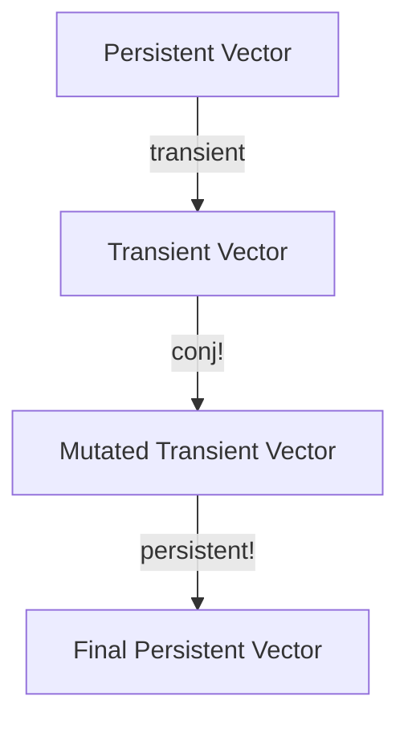

## 18.4.3 Utilizing Transients for Local Mutability

In this section, we will delve into the concept of transients in Clojure, a powerful feature that allows for efficient, localized mutations of data structures. This is particularly useful when building up data structures in a controlled manner, offering a performance boost while adhering to the principles of functional programming.

### Understanding Transients

Transients in Clojure provide a way to perform mutable operations on data structures in a controlled and efficient manner. They are designed to be used in scenarios where you need to build up a data structure incrementally, such as in loops or recursive functions, and then convert it back to an immutable form.

#### Why Use Transients?

- **Performance Optimization**: Transients allow you to perform mutations without the overhead of creating new immutable data structures at each step.
- **Controlled Mutability**: They provide a way to mutate data locally without affecting the global state, maintaining the benefits of immutability.
- **Ease of Use**: Transients are easy to use and integrate seamlessly with existing Clojure code.

### Transients vs. Persistent Data Structures

Clojure's persistent data structures are immutable, meaning that any modification results in a new version of the data structure. This immutability is a cornerstone of functional programming, offering benefits such as thread safety and easier reasoning about code. However, it can introduce performance overhead when building large data structures.

Transients offer a solution by allowing temporary mutability. They are not meant to replace persistent data structures but to complement them in specific scenarios where performance is critical.

#### Key Differences

- **Mutability**: Transients allow for in-place modifications, whereas persistent data structures do not.
- **Scope**: Transients are intended for local, temporary use and should not be shared across threads.
- **Conversion**: Transients can be converted back to persistent data structures once modifications are complete.

### Using Transients in Clojure

Let's explore how to use transients in Clojure with some code examples. We'll start by creating a transient data structure, perform some operations, and then convert it back to a persistent form.

#### Creating Transients

To create a transient version of a data structure, use the `transient` function. Here's an example with a vector:

```clojure
(def my-vector [1 2 3 4 5])

;; Convert to a transient vector
(def transient-vector (transient my-vector))
```

#### Performing Mutations

Once you have a transient data structure, you can perform mutations using functions like `conj!`, `assoc!`, `dissoc!`, etc. These functions are similar to their persistent counterparts but are optimized for transients.

```clojure
;; Add an element to the transient vector
(def updated-transient-vector (conj! transient-vector 6))

;; Update an element in the transient vector
(def updated-transient-vector (assoc! updated-transient-vector 0 10))
```

#### Converting Back to Persistent

After performing the necessary mutations, convert the transient back to a persistent data structure using the `persistent!` function.

```clojure
;; Convert back to a persistent vector
(def final-vector (persistent! updated-transient-vector))
```

### Code Example: Building a Large Vector

Let's see a complete example where we build a large vector using transients and compare it to using persistent data structures.

```clojure
(defn build-large-vector [n]
  (loop [i 0
         v (transient [])]
    (if (< i n)
      (recur (inc i) (conj! v i))
      (persistent! v))))

;; Build a vector with 1,000,000 elements
(def large-vector (build-large-vector 1000000))
```

#### Performance Comparison

To understand the performance benefits of transients, let's compare the time taken to build a large vector using persistent data structures versus transients.

```clojure
;; Using persistent data structures
(time
 (let [v []]
   (loop [i 0
          v v]
     (if (< i 1000000)
       (recur (inc i) (conj v i))
       v))))

;; Using transients
(time
 (build-large-vector 1000000))
```

### Try It Yourself

Experiment with the code examples above by modifying the size of the vector or the operations performed. Observe the performance differences and how transients can optimize your code.

### Diagrams and Visualizations

To better understand how transients work, let's visualize the process of converting a persistent vector to a transient, performing mutations, and converting it back.



**Diagram Explanation**: This flowchart illustrates the process of using transients in Clojure. We start with a persistent vector, convert it to a transient, perform mutations, and finally convert it back to a persistent vector.

### Comparing with Java

In Java, mutable data structures are common, and developers often use `ArrayList`, `HashMap`, etc., for similar purposes. However, these structures are mutable by default, which can lead to issues with concurrency and state management.

Clojure's approach with transients allows for controlled mutability, providing a balance between performance and the benefits of immutability.

#### Java Code Example

Here's a Java example of building a list with mutable operations:

```java
import java.util.ArrayList;
import java.util.List;

public class BuildList {
    public static void main(String[] args) {
        List<Integer> list = new ArrayList<>();
        for (int i = 0; i < 1000000; i++) {
            list.add(i);
        }
    }
}
```

### Key Takeaways

- **Transients offer a way to perform efficient, localized mutations** in Clojure, providing a performance boost while maintaining functional programming principles.
- **Use transients when building up large data structures** in a controlled manner, and convert them back to persistent forms once done.
- **Transients are not thread-safe** and should be used within a single thread or function scope.
- **Clojure's transients provide a balance between performance and immutability**, offering advantages over Java's mutable data structures in terms of concurrency and state management.

### Exercises

1. Modify the `build-large-vector` function to use a map instead of a vector. Compare the performance with and without transients.
2. Implement a function that uses transients to build a set of unique elements from a list of random numbers.
3. Explore the use of transients with other data structures like maps and sets. What are the performance implications?

### Further Reading

- [Clojure Transients Documentation](https://clojure.org/reference/transients)
- [ClojureDocs: Transients](https://clojuredocs.org/clojure.core/transient)
- [Functional Programming in Clojure](https://www.braveclojure.com/)

Now that we've explored how to use transients for local mutability in Clojure, let's apply these concepts to optimize performance in your applications.

## Quiz: Mastering Transients in Clojure



### What is the primary benefit of using transients in Clojure?

- [x] Performance optimization through localized mutability
- [ ] Ensuring thread safety across multiple threads
- [ ] Simplifying code readability
- [ ] Enhancing security features

> **Explanation:** Transients provide performance optimization by allowing localized mutability, reducing the overhead of creating new immutable data structures.

### How do you convert a transient data structure back to a persistent one?

- [x] Using the `persistent!` function
- [ ] Using the `transient` function
- [ ] Using the `assoc!` function
- [ ] Using the `conj!` function

> **Explanation:** The `persistent!` function is used to convert a transient data structure back to its persistent form.

### Which of the following operations can be performed on a transient vector?

- [x] `conj!`
- [x] `assoc!`
- [ ] `dissoc!`
- [ ] `merge!`

> **Explanation:** `conj!` and `assoc!` are operations that can be performed on transient vectors, allowing for efficient mutations.

### Are transients in Clojure thread-safe?

- [ ] Yes, they are thread-safe.
- [x] No, they are not thread-safe.
- [ ] Only when used with locks.
- [ ] Only in certain conditions.

> **Explanation:** Transients are not thread-safe and should be used within a single thread or function scope.

### What is the correct way to create a transient from a persistent vector?

- [x] `(transient my-vector)`
- [ ] `(persistent! my-vector)`
- [ ] `(assoc! my-vector)`
- [ ] `(conj! my-vector)`

> **Explanation:** The `transient` function is used to create a transient version of a persistent vector.

### Which Java data structure is most similar to Clojure's transients in terms of mutability?

- [ ] `HashSet`
- [x] `ArrayList`
- [ ] `TreeMap`
- [ ] `LinkedList`

> **Explanation:** `ArrayList` in Java is mutable, similar to how transients allow for localized mutability in Clojure.

### What is a key difference between transients and persistent data structures?

- [x] Transients allow in-place modifications.
- [ ] Transients are immutable.
- [ ] Persistent data structures are mutable.
- [ ] Transients are thread-safe.

> **Explanation:** Transients allow for in-place modifications, unlike persistent data structures which are immutable.

### Can transients be shared across multiple threads?

- [ ] Yes, they can be shared.
- [x] No, they should not be shared.
- [ ] Only with synchronization.
- [ ] Only with atomic operations.

> **Explanation:** Transients should not be shared across multiple threads as they are not thread-safe.

### What function is used to add an element to a transient vector?

- [x] `conj!`
- [ ] `assoc!`
- [ ] `dissoc!`
- [ ] `merge!`

> **Explanation:** The `conj!` function is used to add an element to a transient vector.

### Transients in Clojure are designed to replace persistent data structures.

- [ ] True
- [x] False

> **Explanation:** Transients are not designed to replace persistent data structures but to complement them in specific scenarios where performance is critical.


