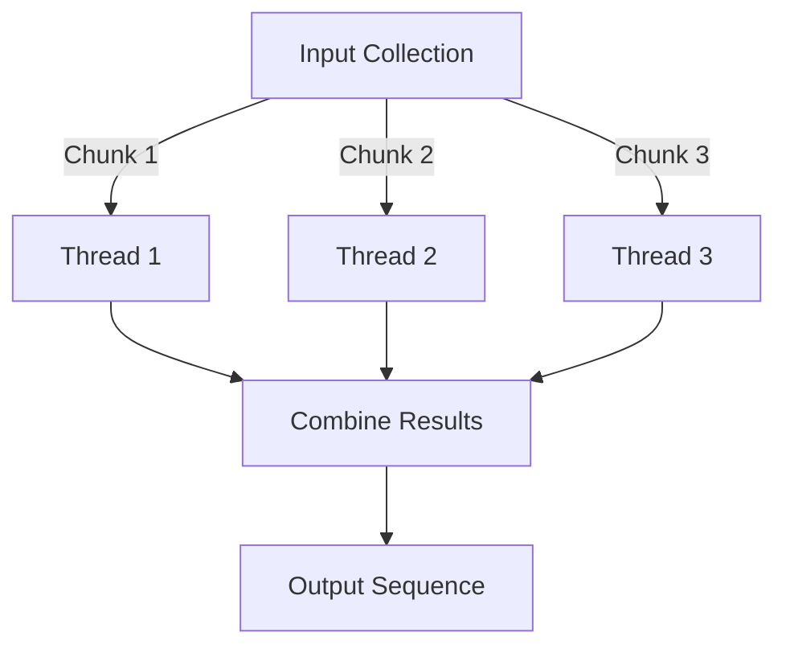

## 18.5.1 Parallel Processing with pmap

In the world of modern computing, efficiently utilizing the available hardware resources is crucial for achieving optimal performance. As Java developers transitioning to Clojure, you may be familiar with Java's concurrency mechanisms, such as threads and the `ForkJoinPool`. In this section, we will explore how Clojure's `pmap` function can simplify parallel processing, allowing you to leverage multiple CPU cores for computationally intensive tasks.

### Understanding Parallel Processing in Clojure

Parallel processing involves executing multiple computations simultaneously, taking advantage of multi-core processors to improve performance. In Clojure, `pmap` is a higher-order function that enables parallel processing by applying a function to each element of a collection concurrently.

#### The Role of `pmap`

`pmap` stands for "parallel map." It is similar to the standard `map` function but processes elements in parallel. This can lead to significant performance improvements for tasks that are CPU-bound and can be executed independently.

**Key Characteristics of `pmap`:**

- **Concurrency**: `pmap` utilizes multiple threads to process elements concurrently.
- **Laziness**: Like `map`, `pmap` returns a lazy sequence, meaning elements are computed as they are needed.
- **Order Preservation**: The order of elements in the output sequence matches the input sequence.

### Comparing `pmap` with Java's Concurrency

In Java, parallel processing often involves creating and managing threads manually or using the `ForkJoinPool`. While powerful, these approaches can be complex and error-prone. Clojure's `pmap` abstracts away much of this complexity, providing a simpler and more declarative way to achieve parallelism.

**Java Example: Parallel Processing with ForkJoinPool**

```java
import java.util.List;
import java.util.concurrent.ForkJoinPool;
import java.util.concurrent.RecursiveTask;

public class ParallelProcessingExample {
    public static void main(String[] args) {
        ForkJoinPool forkJoinPool = new ForkJoinPool();
        List<Integer> numbers = List.of(1, 2, 3, 4, 5);
        List<Integer> results = forkJoinPool.invoke(new SquareTask(numbers));
        System.out.println(results);
    }

    static class SquareTask extends RecursiveTask<List<Integer>> {
        private final List<Integer> numbers;

        SquareTask(List<Integer> numbers) {
            this.numbers = numbers;
        }

        @Override
        protected List<Integer> compute() {
            if (numbers.size() <= 1) {
                return numbers.stream().map(n -> n * n).toList();
            } else {
                int mid = numbers.size() / 2;
                SquareTask leftTask = new SquareTask(numbers.subList(0, mid));
                SquareTask rightTask = new SquareTask(numbers.subList(mid, numbers.size()));
                leftTask.fork();
                List<Integer> rightResult = rightTask.compute();
                List<Integer> leftResult = leftTask.join();
                leftResult.addAll(rightResult);
                return leftResult;
            }
        }
    }
}
```

**Clojure Example: Parallel Processing with `pmap`**

```clojure
(def numbers [1 2 3 4 5])

(defn square [n]
  (* n n))

(def results (pmap square numbers))

(println results)
```

In the Clojure example, `pmap` handles the parallelism for us, making the code more concise and easier to read.

### How `pmap` Works

Under the hood, `pmap` uses a thread pool to distribute the work across multiple threads. It divides the input collection into chunks and processes each chunk in parallel. The results are then combined into a single lazy sequence.

**Diagram: Parallel Processing with `pmap`**



*Caption: This diagram illustrates how `pmap` divides the input collection into chunks, processes each chunk in parallel using separate threads, and combines the results into a single output sequence.*

### When to Use `pmap`

`pmap` is most effective for CPU-bound tasks where each element can be processed independently. It is not suitable for I/O-bound tasks, as the overhead of managing threads can outweigh the benefits of parallelism.

**Considerations for Using `pmap`:**

- **Task Independence**: Ensure that the function applied to each element does not depend on the results of other elements.
- **Task Granularity**: The tasks should be sufficiently large to justify the overhead of parallel processing.
- **Resource Availability**: Ensure that your system has enough CPU cores to benefit from parallelism.

### Practical Examples of `pmap`

Let's explore some practical examples to see `pmap` in action.

#### Example 1: Parallel Computation of Factorials

Suppose we want to compute the factorial of a list of numbers in parallel.

```clojure
(defn factorial [n]
  (reduce * (range 1 (inc n))))

(def numbers [5 6 7 8 9])

(def results (pmap factorial numbers))

(println results) ; Output: (120 720 5040 40320 362880)
```

In this example, `pmap` computes the factorial of each number concurrently, leveraging multiple CPU cores.

#### Example 2: Image Processing

Consider a scenario where we need to apply a filter to a collection of images.

```clojure
(defn apply-filter [image]
  ;; Simulate image processing
  (Thread/sleep 100)
  (str "Processed " image))

(def images ["image1.jpg" "image2.jpg" "image3.jpg"])

(def processed-images (pmap apply-filter images))

(println processed-images)
```

Here, `pmap` processes each image in parallel, reducing the overall processing time.

### Try It Yourself

Now that we've explored some examples, try modifying the code to experiment with different functions and input data. For instance, you could:

- Change the `factorial` function to compute the sum of squares.
- Use a larger collection of images to observe the performance benefits of parallel processing.

### Performance Considerations

While `pmap` can significantly improve performance, it's essential to consider the following:

- **Thread Management**: `pmap` uses a fixed-size thread pool. If the tasks are too small, the overhead of managing threads may negate the benefits.
- **Lazy Evaluation**: Since `pmap` returns a lazy sequence, ensure that the sequence is fully realized when measuring performance.
- **Resource Contention**: Be mindful of other processes running on the system that may compete for CPU resources.

### Exercises

1. **Implement a Parallel Map-Reduce**: Use `pmap` to implement a parallel version of the map-reduce pattern. Apply a transformation to a collection and then reduce the results to a single value.

2. **Optimize a Computational Task**: Identify a computationally intensive task in your Java projects and rewrite it using Clojure's `pmap`. Measure the performance improvements.

3. **Experiment with Different Thread Pool Sizes**: Modify the default thread pool size used by `pmap` and observe the impact on performance.

### Summary and Key Takeaways

In this section, we've explored how Clojure's `pmap` function can simplify parallel processing, allowing you to leverage multiple CPU cores for computationally intensive tasks. By abstracting away the complexity of thread management, `pmap` provides a powerful tool for achieving concurrency in a functional programming paradigm.

**Key Takeaways:**

- `pmap` enables parallel processing by applying a function to each element of a collection concurrently.
- It is most effective for CPU-bound tasks where each element can be processed independently.
- `pmap` abstracts away the complexity of thread management, making parallel processing more accessible.

By incorporating `pmap` into your Clojure projects, you can achieve significant performance improvements while maintaining the simplicity and elegance of functional programming.

### Further Reading

For more information on Clojure's concurrency features, consider exploring the following resources:

- [Official Clojure Documentation on Concurrency](https://clojure.org/reference/concurrency)
- [ClojureDocs: pmap](https://clojuredocs.org/clojure.core/pmap)
- [Clojure Programming by Chas Emerick, Brian Carper, and Christophe Grand](https://www.oreilly.com/library/view/clojure-programming/9781449310387/)

---

## Quiz: Mastering Parallel Processing with pmap in Clojure



### What does `pmap` stand for in Clojure?

- [x] Parallel Map
- [ ] Persistent Map
- [ ] Partial Map
- [ ] Performance Map

> **Explanation:** `pmap` stands for Parallel Map, which applies a function to each element of a collection concurrently.

### Which of the following is a key characteristic of `pmap`?

- [x] It returns a lazy sequence.
- [ ] It modifies the input collection.
- [ ] It processes elements sequentially.
- [ ] It requires manual thread management.

> **Explanation:** `pmap` returns a lazy sequence, meaning elements are computed as they are needed.

### When is `pmap` most effective?

- [x] For CPU-bound tasks where each element can be processed independently.
- [ ] For I/O-bound tasks.
- [ ] For tasks that require sequential processing.
- [ ] For tasks with interdependent elements.

> **Explanation:** `pmap` is most effective for CPU-bound tasks where each element can be processed independently.

### What is a potential drawback of using `pmap`?

- [x] The overhead of managing threads may negate the benefits for small tasks.
- [ ] It cannot be used with collections.
- [ ] It does not support concurrency.
- [ ] It requires explicit synchronization.

> **Explanation:** The overhead of managing threads may negate the benefits for small tasks, making `pmap` less effective in such cases.

### How does `pmap` differ from Java's `ForkJoinPool`?

- [x] `pmap` abstracts away thread management, while `ForkJoinPool` requires manual configuration.
- [ ] `pmap` is used for I/O-bound tasks, while `ForkJoinPool` is for CPU-bound tasks.
- [ ] `pmap` processes elements sequentially, while `ForkJoinPool` processes them concurrently.
- [ ] `pmap` is a Java library, while `ForkJoinPool` is a Clojure function.

> **Explanation:** `pmap` abstracts away thread management, providing a simpler and more declarative way to achieve parallelism compared to `ForkJoinPool`.

### Which function is used to apply a filter to a collection of images in parallel?

- [x] `pmap`
- [ ] `filter`
- [ ] `reduce`
- [ ] `map`

> **Explanation:** `pmap` is used to apply a function to each element of a collection in parallel, making it suitable for processing images concurrently.

### What should you consider when using `pmap`?

- [x] Task independence and resource availability.
- [ ] The size of the input collection only.
- [ ] The order of elements in the collection.
- [ ] The type of elements in the collection.

> **Explanation:** When using `pmap`, consider task independence and resource availability to ensure effective parallel processing.

### What type of sequence does `pmap` return?

- [x] Lazy sequence
- [ ] Eager sequence
- [ ] Mutable sequence
- [ ] Immutable sequence

> **Explanation:** `pmap` returns a lazy sequence, meaning elements are computed as they are needed.

### Which of the following is a benefit of using `pmap`?

- [x] Simplifies parallel processing by abstracting thread management.
- [ ] Requires manual thread management.
- [ ] Processes elements sequentially.
- [ ] Modifies the input collection.

> **Explanation:** `pmap` simplifies parallel processing by abstracting thread management, making it easier to achieve concurrency.

### True or False: `pmap` is suitable for I/O-bound tasks.

- [ ] True
- [x] False

> **Explanation:** `pmap` is not suitable for I/O-bound tasks, as the overhead of managing threads can outweigh the benefits of parallelism.


