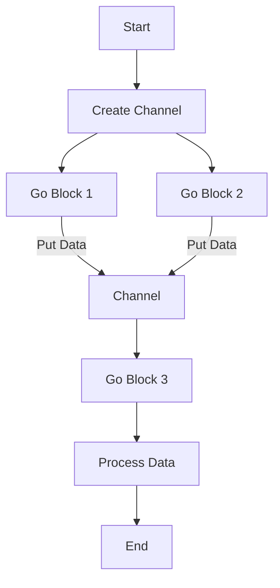

## 18.5.2 Asynchronous Processing

Asynchronous processing is a powerful paradigm that allows programs to perform tasks concurrently without blocking the execution of other tasks. In Clojure, the `core.async` library provides a robust framework for asynchronous programming, enabling developers to write non-blocking code that can handle multiple tasks efficiently. This section will delve into the concepts of asynchronous processing in Clojure, compare it with Java's concurrency mechanisms, and provide practical examples to illustrate its benefits.

### Understanding Asynchronous Processing

Asynchronous processing allows a program to initiate a task and move on to other tasks before the initial task completes. This is particularly useful in scenarios where tasks involve waiting for external resources, such as network requests or file I/O operations. By not blocking the main thread, asynchronous processing can significantly improve the responsiveness and throughput of applications.

#### Key Concepts in Asynchronous Processing

- **Non-blocking Operations**: These operations do not halt the execution of the program while waiting for a task to complete. Instead, they allow other tasks to proceed, improving overall efficiency.
- **Concurrency vs. Parallelism**: Concurrency involves managing multiple tasks at once, while parallelism involves executing multiple tasks simultaneously. Asynchronous processing focuses on concurrency, allowing tasks to be interleaved without necessarily running in parallel.
- **Callbacks and Promises**: Common patterns in asynchronous programming where callbacks are functions executed upon task completion, and promises represent the eventual result of an asynchronous operation.

### Asynchronous Processing in Clojure with `core.async`

Clojure's `core.async` library provides a set of abstractions for asynchronous programming, inspired by the Communicating Sequential Processes (CSP) model. It introduces channels as a means of communication between different parts of a program, allowing for non-blocking data exchange.

#### Channels

Channels are the core abstraction in `core.async`. They act as conduits for passing messages between different parts of a program. Channels can be buffered or unbuffered, and they support operations like `put!` and `take!` for writing to and reading from the channel, respectively.

```clojure
(require '[clojure.core.async :refer [chan put! take! go]])

;; Create a channel
(def my-channel (chan))

;; Asynchronously put a value onto the channel
(go
  (put! my-channel "Hello, Clojure!"))

;; Asynchronously take a value from the channel
(go
  (let [message (take! my-channel)]
    (println "Received message:" message)))
```

In this example, we create a channel and use `go` blocks to perform asynchronous `put!` and `take!` operations. The `go` block is a macro that transforms the code inside it into a state machine, allowing for non-blocking execution.

#### Go Blocks

Go blocks are a fundamental construct in `core.async` that enable asynchronous code execution. They allow you to write code that looks synchronous but executes asynchronously. Inside a `go` block, operations like `<!` (take) and `>!` (put) are used to interact with channels.

```clojure
(go
  (let [result (<! (some-async-operation))]
    (println "Operation result:" result)))
```

The `<!` operator is used to take a value from a channel, and the `>!` operator is used to put a value onto a channel. These operations are non-blocking within a `go` block, allowing other tasks to proceed concurrently.

### Comparing Clojure's Asynchronous Processing with Java

Java provides several mechanisms for asynchronous processing, such as threads, the `ExecutorService`, and `CompletableFuture`. While these tools are powerful, they can be complex and verbose compared to Clojure's `core.async`.

#### Java's CompletableFuture

Java's `CompletableFuture` is a flexible tool for asynchronous programming, allowing you to compose and chain asynchronous tasks.

```java
import java.util.concurrent.CompletableFuture;

CompletableFuture.supplyAsync(() -> {
    // Simulate a long-running task
    return "Hello, Java!";
}).thenAccept(result -> {
    System.out.println("Result: " + result);
});
```

While `CompletableFuture` provides a fluent API for asynchronous tasks, it can become cumbersome when dealing with complex workflows involving multiple asynchronous operations.

#### Advantages of Clojure's `core.async`

- **Simplicity**: `core.async` provides a simple and expressive syntax for asynchronous programming, reducing boilerplate code.
- **Composability**: Channels and go blocks allow for easy composition of asynchronous workflows.
- **Non-blocking**: `core.async` operations are non-blocking, enabling efficient resource utilization.

### Practical Examples of Asynchronous Processing in Clojure

Let's explore some practical examples to illustrate the power of asynchronous processing in Clojure.

#### Example 1: Fetching Data from Multiple Sources

Suppose we need to fetch data from multiple APIs concurrently and process the results. We can use `core.async` to achieve this efficiently.

```clojure
(require '[clojure.core.async :refer [chan go <! >!]])

(defn fetch-data [url]
  ;; Simulate an asynchronous HTTP request
  (go
    (Thread/sleep 1000) ;; Simulate delay
    (str "Data from " url)))

(defn process-data []
  (let [urls ["http://api1.com" "http://api2.com" "http://api3.com"]
        results-chan (chan)]
    (doseq [url urls]
      (go
        (let [data (<! (fetch-data url))]
          (>! results-chan data))))
    (go
      (dotimes [_ (count urls)]
        (println "Received:" (<! results-chan))))))
```

In this example, we create a channel `results-chan` to collect data from multiple URLs. Each URL is processed in a separate `go` block, allowing for concurrent fetching. The results are then printed as they become available.

#### Example 2: Implementing a Simple Worker Pool

A worker pool is a common pattern for managing a fixed number of concurrent tasks. We can implement a simple worker pool using `core.async`.

```clojure
(require '[clojure.core.async :refer [chan go <! >!]])

(defn worker [tasks]
  (go
    (while true
      (let [task (<! tasks)]
        (println "Processing task:" task)
        (Thread/sleep 500) ;; Simulate task processing
        (println "Task completed:" task)))))

(defn start-worker-pool [num-workers tasks]
  (dotimes [_ num-workers]
    (worker tasks)))

(defn main []
  (let [tasks (chan)]
    (start-worker-pool 3 tasks)
    (doseq [task (range 10)]
      (go (>! tasks task)))))
```

In this example, we define a `worker` function that processes tasks from a channel. The `start-worker-pool` function initializes a specified number of workers, each running in its own `go` block. Tasks are then added to the `tasks` channel for processing.

### Try It Yourself

To deepen your understanding of asynchronous processing in Clojure, try modifying the examples above:

1. **Add Error Handling**: Modify the `fetch-data` function to simulate errors and handle them gracefully within the `go` blocks.
2. **Implement Timeouts**: Introduce timeouts for tasks in the worker pool to prevent them from running indefinitely.
3. **Visualize Data Flow**: Use the Mermaid.js diagram below to visualize the flow of data through channels and go blocks.



*Diagram 1: Flow of data through channels and go blocks in a Clojure asynchronous processing example.*

### Further Reading

For more information on asynchronous processing in Clojure, consider exploring the following resources:

- [Official Clojure Documentation](https://clojure.org/reference/async)
- [ClojureDocs: core.async](https://clojuredocs.org/clojure.core.async)
- [GitHub: core.async Examples](https://github.com/clojure/core.async)

### Exercises

1. **Implement a Rate Limiter**: Create a rate limiter using `core.async` to control the rate of task execution.
2. **Build a Chat Application**: Use `core.async` to implement a simple chat application where messages are exchanged asynchronously.
3. **Simulate a Traffic Light System**: Model a traffic light system using channels and go blocks to manage state transitions.

### Key Takeaways

- Asynchronous processing in Clojure, facilitated by `core.async`, allows for efficient task management without blocking threads.
- Channels and go blocks provide a powerful abstraction for non-blocking communication and task execution.
- Clojure's approach to asynchronous processing is simpler and more expressive than traditional Java concurrency mechanisms.
- By leveraging `core.async`, developers can build responsive and high-performance applications.

Now that we've explored asynchronous processing in Clojure, let's apply these concepts to enhance the performance and responsiveness of your applications.

## Quiz: Mastering Asynchronous Processing in Clojure



### What is the primary benefit of asynchronous processing?

- [x] It allows tasks to be executed concurrently without blocking.
- [ ] It simplifies code by using fewer lines.
- [ ] It ensures tasks are executed in a specific order.
- [ ] It eliminates the need for error handling.

> **Explanation:** Asynchronous processing allows tasks to be executed concurrently without blocking, improving responsiveness and throughput.

### Which Clojure library is used for asynchronous processing?

- [x] core.async
- [ ] clojure.java.jdbc
- [ ] clojure.test
- [ ] clojure.core.logic

> **Explanation:** The `core.async` library in Clojure provides abstractions for asynchronous programming.

### What is the role of channels in core.async?

- [x] They facilitate communication between different parts of a program.
- [ ] They store data persistently.
- [ ] They manage memory allocation.
- [ ] They handle exceptions.

> **Explanation:** Channels in `core.async` act as conduits for passing messages between different parts of a program.

### How do go blocks in Clojure work?

- [x] They transform code into a state machine for non-blocking execution.
- [ ] They execute code in parallel threads.
- [ ] They block execution until a task completes.
- [ ] They simplify error handling.

> **Explanation:** Go blocks transform code into a state machine, allowing for non-blocking execution.

### What is the equivalent of Clojure's core.async in Java?

- [ ] clojure.java.jdbc
- [x] CompletableFuture
- [ ] java.util.List
- [ ] java.util.Map

> **Explanation:** Java's `CompletableFuture` provides a flexible tool for asynchronous programming, similar to Clojure's `core.async`.

### Which operator is used to take a value from a channel in a go block?

- [x] <!
- [ ] >!
- [ ] put!
- [ ] take!

> **Explanation:** The `<!` operator is used to take a value from a channel within a go block.

### What is a common pattern for managing a fixed number of concurrent tasks?

- [x] Worker pool
- [ ] Singleton pattern
- [ ] Factory pattern
- [ ] Observer pattern

> **Explanation:** A worker pool is a common pattern for managing a fixed number of concurrent tasks.

### What is a key advantage of using core.async over Java's concurrency mechanisms?

- [x] Simplicity and expressiveness
- [ ] Faster execution speed
- [ ] Automatic error correction
- [ ] Built-in security features

> **Explanation:** Core.async provides a simpler and more expressive syntax for asynchronous programming compared to Java's concurrency mechanisms.

### How can you handle errors in asynchronous processing with core.async?

- [x] By using try-catch blocks within go blocks
- [ ] By ignoring them
- [ ] By using Java's exception handling
- [ ] By logging them to a file

> **Explanation:** Errors in asynchronous processing with core.async can be handled using try-catch blocks within go blocks.

### True or False: Asynchronous processing in Clojure can improve application responsiveness.

- [x] True
- [ ] False

> **Explanation:** True. Asynchronous processing allows tasks to be executed concurrently, improving application responsiveness.


