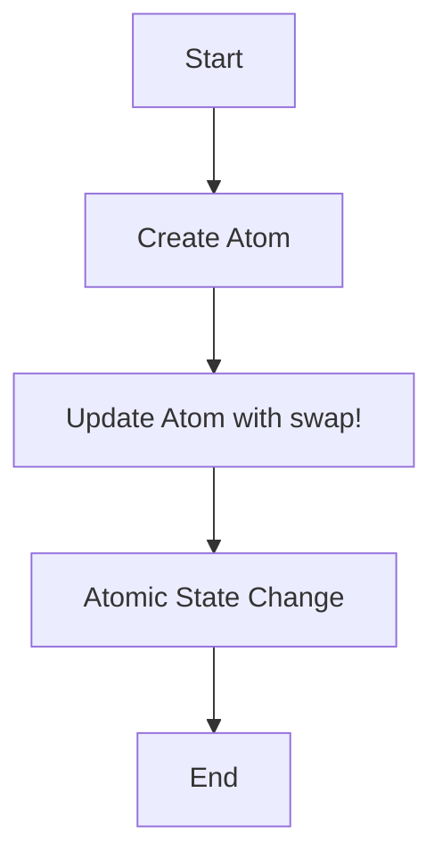
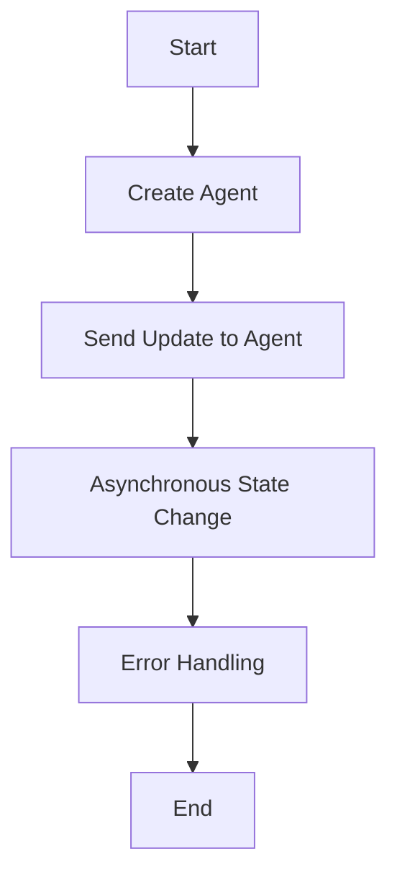

## 18.5.3 Effective Use of Atoms and Agents

In the realm of concurrent programming, managing state efficiently is crucial to building performant and reliable applications. Clojure, with its functional programming paradigm, offers unique concurrency primitives such as **Atoms** and **Agents** that help developers manage state changes without the traditional pitfalls of locks and synchronization. In this section, we will explore how to use Atoms and Agents effectively, drawing parallels with Java's concurrency mechanisms to ease the transition for Java developers.

### Understanding Atoms and Agents

Atoms and Agents are part of Clojure's concurrency model designed to handle state changes in a controlled manner. They provide a way to manage mutable state while maintaining the benefits of immutability and functional programming.

#### Atoms

Atoms are used for managing synchronous, independent state changes. They are ideal for situations where you need to update a single piece of state atomically and ensure that no other thread can see an inconsistent state.

- **Atomic Updates**: Atoms provide atomic updates using compare-and-swap (CAS) operations, ensuring that state changes are consistent and thread-safe.
- **Immutability**: While the state within an Atom can change, each change results in a new immutable value, preserving the benefits of immutability.
- **Simplicity**: Atoms are simple to use and understand, making them a great choice for managing simple state changes.

#### Agents

Agents are designed for managing asynchronous state changes. They allow you to update state in the background, without blocking the main thread.

- **Asynchronous Updates**: Agents process updates asynchronously, allowing other operations to continue without waiting for the state change to complete.
- **Error Handling**: Agents provide built-in error handling mechanisms, allowing you to manage exceptions that occur during state updates.
- **Coordination**: While Agents are asynchronous, they ensure that updates are applied in the order they are sent, maintaining consistency.

### Atoms vs. Agents: When to Use Each

Choosing between Atoms and Agents depends on the nature of the state changes you need to manage:

- **Use Atoms** when you need synchronous updates and the state changes are independent of each other.
- **Use Agents** when you need asynchronous updates and can afford to process state changes in the background.

### Using Atoms in Clojure

Atoms are straightforward to use and are often the first choice for managing simple state changes. Let's explore how to use Atoms effectively in Clojure.

#### Creating and Using Atoms

Creating an Atom is simple. You use the `atom` function to create an Atom with an initial value:

```clojure
(def counter (atom 0)) ; Create an Atom with an initial value of 0
```

To update the value of an Atom, you use the `swap!` function, which applies a function to the current value of the Atom:

```clojure
(swap! counter inc) ; Increment the counter atomically
```

The `swap!` function ensures that the update is atomic, using a compare-and-swap mechanism to apply the change.

#### Practical Example: Shared Counter

Let's consider a practical example where we use an Atom to manage a shared counter:

```clojure
(def counter (atom 0))

(defn increment-counter []
  (swap! counter inc))

(defn decrement-counter []
  (swap! counter dec))

(defn get-counter []
  @counter) ; Dereference the Atom to get its current value

;; Usage
(increment-counter)
(decrement-counter)
(println "Current counter value:" (get-counter))
```

In this example, we define functions to increment, decrement, and retrieve the value of the counter. The use of `swap!` ensures that updates are atomic and thread-safe.

#### Avoiding Contention with Atoms

While Atoms provide atomic updates, contention can occur if multiple threads attempt to update the Atom simultaneously. To minimize contention:

- **Minimize the Critical Section**: Keep the function passed to `swap!` as simple and fast as possible.
- **Use Local State**: Where possible, perform computations outside the `swap!` function and only update the Atom with the final result.

### Using Agents in Clojure

Agents are ideal for managing state changes that can be processed asynchronously. They allow you to offload state updates to a separate thread, freeing up the main thread for other tasks.

#### Creating and Using Agents

Creating an Agent is similar to creating an Atom, but you use the `agent` function:

```clojure
(def status (agent "Idle")) ; Create an Agent with an initial value
```

To update the value of an Agent, you use the `send` function, which applies a function to the current value of the Agent asynchronously:

```clojure
(send status (fn [_] "Processing")) ; Update the status asynchronously
```

The `send` function queues the update to be processed by a separate thread, allowing the main thread to continue executing.

#### Practical Example: Background Processing

Let's consider an example where we use an Agent to manage the status of a background task:

```clojure
(def status (agent "Idle"))

(defn start-task []
  (send status (fn [_] "Processing"))
  ;; Simulate a long-running task
  (Thread/sleep 2000)
  (send status (fn [_] "Completed")))

(defn get-status []
  @status) ; Dereference the Agent to get its current value

;; Usage
(start-task)
(println "Current status:" (get-status))
```

In this example, we use an Agent to manage the status of a task that runs in the background. The use of `send` allows the status updates to be processed asynchronously.

#### Error Handling with Agents

Agents provide built-in error handling mechanisms. If an exception occurs during an update, the Agent's error handler is invoked. You can set a custom error handler using the `set-error-handler!` function:

```clojure
(set-error-handler! status (fn [agent error]
                             (println "Error occurred:" error)))
```

This allows you to manage exceptions and ensure that your application remains robust.

### Comparing Atoms and Agents with Java

In Java, managing concurrent state changes often involves using locks or synchronization mechanisms. Let's compare Atoms and Agents with Java's concurrency mechanisms:

#### Atoms vs. Java's `synchronized`

Atoms provide a simpler and more efficient way to manage atomic state changes compared to Java's `synchronized` keyword:

- **Simplicity**: Atoms are easier to use and understand, reducing the complexity of your code.
- **Performance**: Atoms use compare-and-swap operations, which are often more efficient than locks.

#### Agents vs. Java's `ExecutorService`

Agents provide a higher-level abstraction for managing asynchronous tasks compared to Java's `ExecutorService`:

- **Ease of Use**: Agents are easier to use and require less boilerplate code.
- **Error Handling**: Agents provide built-in error handling mechanisms, making it easier to manage exceptions.

### Best Practices for Using Atoms and Agents

To use Atoms and Agents effectively, consider the following best practices:

- **Choose the Right Tool**: Use Atoms for synchronous updates and Agents for asynchronous updates.
- **Minimize Contention**: Keep the critical section in `swap!` functions small and fast.
- **Handle Errors Gracefully**: Use custom error handlers with Agents to manage exceptions.
- **Avoid Overuse**: Use Atoms and Agents judiciously, and consider other concurrency primitives like Refs and Software Transactional Memory (STM) for more complex state management needs.

### Try It Yourself

To deepen your understanding of Atoms and Agents, try modifying the code examples provided:

- **Experiment with Contention**: Create multiple threads that update an Atom simultaneously and observe the effects.
- **Explore Error Handling**: Introduce an error in an Agent's update function and implement a custom error handler.
- **Combine Atoms and Agents**: Use both Atoms and Agents in a single application to manage different types of state changes.

### Diagrams and Visualizations

To better understand the flow of data and state changes with Atoms and Agents, let's visualize these concepts using Mermaid.js diagrams.

#### Atom State Update Flow



*Diagram 1: Flow of state updates using Atoms in Clojure.*

#### Agent State Update Flow



*Diagram 2: Flow of state updates using Agents in Clojure.*

### Further Reading

For more information on Atoms and Agents, consider exploring the following resources:

- [Official Clojure Documentation on Atoms](https://clojure.org/reference/atoms)
- [Official Clojure Documentation on Agents](https://clojure.org/reference/agents)
- [ClojureDocs: Atoms](https://clojuredocs.org/clojure.core/atom)
- [ClojureDocs: Agents](https://clojuredocs.org/clojure.core/agent)

### Exercises

1. **Implement a Shared Counter**: Create a shared counter using an Atom and simulate concurrent updates from multiple threads.
2. **Background Task Manager**: Use an Agent to manage the status of multiple background tasks and implement error handling.
3. **State Management with Atoms and Agents**: Combine Atoms and Agents to manage different types of state changes in a single application.

### Key Takeaways

- **Atoms and Agents** provide powerful concurrency primitives for managing state changes in Clojure.
- **Atoms** are ideal for synchronous, independent state changes, while **Agents** are suited for asynchronous updates.
- **Error handling** is built into Agents, allowing for robust state management.
- **Choosing the right tool** and following best practices can help you build efficient and reliable concurrent applications.

Now that we've explored how to use Atoms and Agents effectively, let's apply these concepts to manage state efficiently in your applications.

## Quiz: Mastering Atoms and Agents in Clojure



### What is the primary use case for Atoms in Clojure?

- [x] Managing synchronous, independent state changes
- [ ] Handling asynchronous state changes
- [ ] Managing complex state transactions
- [ ] Coordinating multiple threads

> **Explanation:** Atoms are used for managing synchronous, independent state changes, ensuring atomic updates.

### How do Agents handle state updates in Clojure?

- [ ] Synchronously
- [x] Asynchronously
- [ ] Using locks
- [ ] With transactions

> **Explanation:** Agents handle state updates asynchronously, allowing other operations to continue without blocking.

### Which function is used to update the value of an Atom?

- [x] swap!
- [ ] send
- [ ] reset!
- [ ] alter

> **Explanation:** The `swap!` function is used to update the value of an Atom atomically.

### What is the purpose of the `set-error-handler!` function in Agents?

- [x] To manage exceptions that occur during state updates
- [ ] To synchronize state updates
- [ ] To reset the Agent's state
- [ ] To log state changes

> **Explanation:** The `set-error-handler!` function is used to manage exceptions that occur during state updates in Agents.

### When should you use Agents instead of Atoms?

- [ ] For synchronous updates
- [x] For asynchronous updates
- [ ] For managing complex transactions
- [ ] For coordinating multiple threads

> **Explanation:** Agents are used for asynchronous updates, allowing state changes to be processed in the background.

### Which Clojure function is used to create an Agent?

- [ ] atom
- [x] agent
- [ ] ref
- [ ] var

> **Explanation:** The `agent` function is used to create an Agent in Clojure.

### What is a key advantage of using Atoms over Java's `synchronized` keyword?

- [x] Simplicity and performance
- [ ] Asynchronous processing
- [ ] Built-in error handling
- [ ] Complex state management

> **Explanation:** Atoms provide a simpler and more efficient way to manage atomic state changes compared to Java's `synchronized` keyword.

### How do you dereference an Atom or Agent to get its current value?

- [x] Using the `@` symbol
- [ ] Using the `get` function
- [ ] Using the `deref` function
- [ ] Using the `value` function

> **Explanation:** You can dereference an Atom or Agent to get its current value using the `@` symbol.

### What is the primary benefit of using Agents for state management?

- [ ] Synchronous updates
- [x] Asynchronous updates
- [ ] Complex transactions
- [ ] Coordinated state changes

> **Explanation:** Agents provide asynchronous updates, allowing state changes to be processed without blocking the main thread.

### True or False: Atoms and Agents can be used together in a single application to manage different types of state changes.

- [x] True
- [ ] False

> **Explanation:** Atoms and Agents can be used together in a single application to manage different types of state changes, leveraging their respective strengths.


