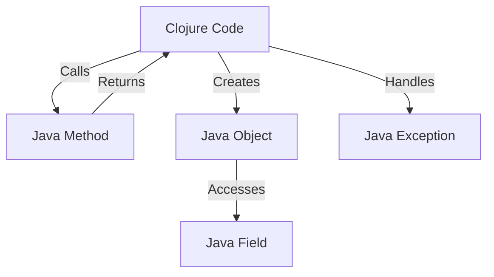

## 18.6.1 Using Java Interop for Performance

As experienced Java developers transitioning to Clojure, you bring a wealth of knowledge about the Java ecosystem and its performance characteristics. Clojure, being a JVM language, allows seamless interoperability with Java, which can be a powerful tool for performance optimization. In this section, we'll explore how to leverage Java interoperability to enhance performance in Clojure applications, when to consider writing performance-critical code in Java, and how to effectively integrate Java libraries.

### Understanding Java Interoperability in Clojure

Clojure's interoperability with Java is one of its most compelling features. It allows you to call Java methods, use Java libraries, and even write parts of your application in Java when necessary. This interoperability provides the flexibility to optimize performance-critical sections of your code by leveraging Java's mature ecosystem and performance-tuned libraries.

#### Key Concepts of Java Interop in Clojure

- **Java Method Invocation**: Clojure can directly call Java methods using a straightforward syntax.
- **Java Object Creation**: You can instantiate Java objects and use them within Clojure code.
- **Field Access**: Accessing fields of Java objects is simple and intuitive.
- **Exception Handling**: Clojure can catch and throw Java exceptions, allowing for robust error handling.

### When to Use Java Interop for Performance

While Clojure is a powerful language for functional programming, there are scenarios where Java's performance optimizations can be beneficial:

1. **Performance-Critical Sections**: For algorithms or operations that require high performance, writing them in Java can provide speed improvements.
2. **Existing Java Libraries**: Leveraging well-optimized Java libraries can save development time and improve performance.
3. **Complex Data Processing**: Java's concurrency utilities and optimized data structures can be advantageous for intensive data processing tasks.
4. **Interfacing with Legacy Systems**: When integrating with existing Java systems, using Java interop can simplify the process and maintain performance.

### Java Interop Syntax and Examples

Let's dive into some examples to illustrate how Java interop works in Clojure.

#### Calling Java Methods

In Clojure, calling a Java method is as simple as using the `.` operator. Here's an example of calling a static method and an instance method:

```clojure
;; Static method call
(Math/pow 2 3) ; => 8.0

;; Instance method call
(let [sb (StringBuilder.)]
  (.append sb "Hello, ")
  (.append sb "world!")
  (.toString sb)) ; => "Hello, world!"
```

**Explanation**: The `Math/pow` method is a static method, so we call it directly on the `Math` class. For instance methods, like `append` and `toString` on `StringBuilder`, we create an instance and use the `.` operator to call methods on it.

#### Creating Java Objects

Creating Java objects in Clojure is straightforward. You use the `new` keyword or the class constructor:

```clojure
;; Using the new keyword
(def date (new java.util.Date))

;; Using the class constructor
(def date (java.util.Date.))
```

**Explanation**: Both approaches create a new instance of `java.util.Date`. The second form is more idiomatic in Clojure.

#### Accessing Fields

Accessing fields of Java objects can be done using the `.` operator:

```clojure
(let [point (java.awt.Point. 10 20)]
  (println (.x point)) ; => 10
  (println (.y point))) ; => 20
```

**Explanation**: We create a `Point` object and access its `x` and `y` fields using the `.` operator.

#### Handling Java Exceptions

Clojure can catch and throw Java exceptions using `try`, `catch`, and `throw`:

```clojure
(try
  (throw (Exception. "Something went wrong"))
  (catch Exception e
    (println "Caught exception:" (.getMessage e))))
```

**Explanation**: We throw an exception and catch it, printing the exception message.

### Performance Considerations and Best Practices

When using Java interop for performance, consider the following best practices:

- **Minimize Reflection**: Reflection can introduce performance overhead. Use type hints to avoid it.
- **Leverage Java Libraries**: Use well-optimized Java libraries for performance-critical tasks.
- **Profile and Benchmark**: Always profile and benchmark your code to identify bottlenecks and validate performance improvements.

#### Type Hinting to Avoid Reflection

Type hints in Clojure can help avoid reflection, which can slow down method calls. Here's how you can use type hints:

```clojure
(defn calculate-power [^double base ^double exponent]
  (Math/pow base exponent))
```

**Explanation**: The `^double` type hints tell Clojure the types of `base` and `exponent`, allowing it to avoid reflection when calling `Math/pow`.

### Comparing Java and Clojure Code for Performance

Let's compare a simple performance-critical operation implemented in both Java and Clojure to highlight differences and similarities.

#### Java Code Example

```java
public class Factorial {
    public static long factorial(int n) {
        long result = 1;
        for (int i = 1; i <= n; i++) {
            result *= i;
        }
        return result;
    }
}
```

**Explanation**: This Java code calculates the factorial of a number using an iterative approach.

#### Clojure Code Example

```clojure
(defn factorial [n]
  (reduce * (range 1 (inc n))))
```

**Explanation**: The Clojure code uses `reduce` and `range` to calculate the factorial, showcasing a more functional approach.

### Try It Yourself

Experiment with the following modifications to deepen your understanding:

- Modify the Java and Clojure factorial implementations to handle large numbers using `BigInteger`.
- Profile both implementations to compare their performance on large inputs.
- Integrate a Java library for matrix operations into a Clojure project and measure performance improvements.

### Diagrams and Visualizations

To better understand the flow of data and function calls in Clojure and Java, let's look at a diagram illustrating the interaction between Clojure and Java code.



**Diagram Caption**: This flowchart illustrates the interaction between Clojure code and Java methods, objects, fields, and exceptions.

### Further Reading and Resources

For more information on Clojure's Java interoperability, consider the following resources:

- [Official Clojure Documentation on Java Interop](https://clojure.org/reference/java_interop)
- [ClojureDocs: Java Interop Examples](https://clojuredocs.org/quickref#Java%20Interop)
- [Effective Java by Joshua Bloch](https://www.oreilly.com/library/view/effective-java-3rd/9780134686097/) - A great resource for understanding Java performance best practices.

### Exercises and Practice Problems

1. **Exercise 1**: Implement a Clojure function that uses Java's `ArrayList` to store and retrieve elements. Compare its performance with Clojure's native `vector`.
2. **Exercise 2**: Write a Clojure program that uses Java's `ThreadPoolExecutor` for concurrent task execution. Measure the performance against Clojure's `pmap`.
3. **Exercise 3**: Integrate a Java library for image processing into a Clojure application. Optimize the image processing pipeline for performance.

### Key Takeaways

- **Java Interop**: Clojure's seamless interoperability with Java allows you to leverage Java's performance optimizations and libraries.
- **Performance Optimization**: Use Java interop for performance-critical sections, complex data processing, and interfacing with legacy systems.
- **Best Practices**: Minimize reflection, leverage Java libraries, and profile your code to ensure optimal performance.

By understanding and effectively using Java interoperability, you can enhance the performance of your Clojure applications while taking advantage of Java's mature ecosystem. Now that we've explored how to optimize performance using Java interop, let's apply these concepts to build efficient and high-performing Clojure applications.

## Quiz: Mastering Java Interop for Performance in Clojure



### What is a key benefit of using Java interop in Clojure?

- [x] Leveraging Java's mature libraries for performance-critical tasks
- [ ] Simplifying Clojure syntax
- [ ] Avoiding functional programming paradigms
- [ ] Replacing Clojure's concurrency model

> **Explanation:** Java interop allows Clojure developers to use Java's mature libraries, which can be highly optimized for performance-critical tasks.

### How can you avoid reflection in Clojure when using Java interop?

- [x] Use type hints
- [ ] Use macros
- [ ] Avoid using Java libraries
- [ ] Write all code in Java

> **Explanation:** Type hints in Clojure can help avoid reflection, which can introduce performance overhead.

### Which of the following is a scenario where Java interop is beneficial?

- [x] Interfacing with legacy Java systems
- [ ] Writing simple arithmetic operations
- [ ] Implementing basic data structures
- [ ] Avoiding the use of Java libraries

> **Explanation:** Java interop is particularly beneficial when interfacing with legacy Java systems, where performance and compatibility are crucial.

### What is the purpose of the `.` operator in Clojure?

- [x] To call Java methods and access fields
- [ ] To define functions
- [ ] To create Clojure macros
- [ ] To handle exceptions

> **Explanation:** The `.` operator in Clojure is used to call Java methods and access fields of Java objects.

### How do you create a new Java object in Clojure?

- [x] Using the `new` keyword or class constructor
- [ ] Using the `def` keyword
- [ ] Using the `fn` keyword
- [ ] Using the `let` keyword

> **Explanation:** You can create a new Java object in Clojure using the `new` keyword or the class constructor.

### Which Java method is called in the following Clojure code: `(Math/pow 2 3)`?

- [x] `Math.pow`
- [ ] `Math.sqrt`
- [ ] `Math.abs`
- [ ] `Math.log`

> **Explanation:** The Clojure code `(Math/pow 2 3)` calls the `Math.pow` method to calculate the power of 2 raised to 3.

### What is a common use case for Java interop in Clojure?

- [x] Using Java's concurrency utilities for complex data processing
- [ ] Simplifying Clojure's syntax
- [ ] Avoiding the use of functional programming
- [ ] Replacing Clojure's data structures

> **Explanation:** Java interop is commonly used in Clojure to leverage Java's concurrency utilities for complex data processing tasks.

### How can you handle Java exceptions in Clojure?

- [x] Using `try`, `catch`, and `throw`
- [ ] Using `def`, `let`, and `fn`
- [ ] Using `loop` and `recur`
- [ ] Using `map` and `reduce`

> **Explanation:** Java exceptions in Clojure can be handled using `try`, `catch`, and `throw`.

### What is the result of the following Clojure code: `(let [sb (StringBuilder.)] (.append sb "Hello, ") (.append sb "world!") (.toString sb))`?

- [x] "Hello, world!"
- [ ] "world!"
- [ ] "Hello, "
- [ ] ""

> **Explanation:** The code creates a `StringBuilder`, appends "Hello, " and "world!", and then converts it to a string, resulting in "Hello, world!".

### True or False: Clojure can directly call Java methods and use Java libraries without any additional configuration.

- [x] True
- [ ] False

> **Explanation:** Clojure can directly call Java methods and use Java libraries due to its seamless interoperability with Java.


