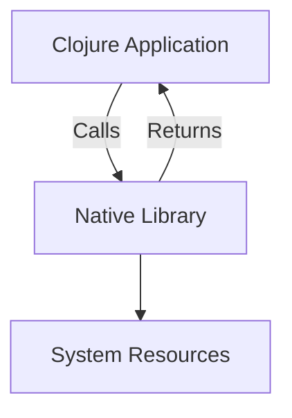

## 18.6.3 Trade-offs and Risks

Integrating native code with Clojure can offer significant performance benefits, but it also introduces a range of trade-offs and risks that developers must carefully consider. In this section, we will explore these complexities, focusing on the increased maintenance burden, potential memory safety issues, and other challenges associated with native code integration. We will also compare these aspects with Java, providing insights into how Clojure's functional paradigm can both alleviate and exacerbate these challenges.

### Understanding Native Code Integration

Native code refers to programs written in languages like C or C++, which are compiled directly to machine code. This can lead to performance improvements, especially in computationally intensive tasks. However, integrating such code with a high-level language like Clojure involves several considerations:

- **Performance Gains**: Native code can execute faster than JVM bytecode, which is interpreted or just-in-time compiled.
- **Access to System Resources**: Native code can interact directly with hardware and system resources, which is not always possible with JVM languages.
- **Legacy Code Utilization**: Many existing libraries and systems are written in native languages, and reusing them can save development time.

### Trade-offs of Native Code Integration

While the benefits are clear, the trade-offs can be significant:

#### 1. **Increased Maintenance Burden**

Integrating native code can complicate the build and deployment processes. Developers must manage multiple toolchains and ensure compatibility across different platforms and architectures.

- **Build Complexity**: Native code requires a separate compilation step, often involving platform-specific tools.
- **Cross-Platform Issues**: Ensuring that native code runs consistently across different operating systems can be challenging.
- **Dependency Management**: Native libraries may have their own dependencies, which need to be managed alongside Clojure's dependencies.

#### 2. **Memory Safety Concerns**

Languages like C and C++ do not provide the same level of memory safety as Clojure or Java. This can lead to issues such as:

- **Buffer Overflows**: Writing beyond the bounds of allocated memory can corrupt data and lead to security vulnerabilities.
- **Memory Leaks**: Failing to release memory can lead to increased memory usage and eventual application crashes.
- **Dangling Pointers**: Accessing memory that has been freed can result in undefined behavior.

#### 3. **Debugging Challenges**

Debugging issues in native code can be more difficult than in managed languages. Developers must use different tools and techniques to diagnose problems.

- **Tooling Differences**: Native code often requires specialized debugging tools, which may not integrate well with Clojure's development environment.
- **Error Propagation**: Errors in native code can manifest as cryptic messages in Clojure, complicating diagnosis.

#### 4. **Security Risks**

Native code can introduce security vulnerabilities that are less common in managed languages:

- **Exploits and Vulnerabilities**: Native code can be more susceptible to exploits, such as buffer overflows and code injection attacks.
- **Sandboxing Limitations**: Native code may bypass JVM security features, increasing the risk of malicious behavior.

### Comparing with Java

Java developers are familiar with the Java Native Interface (JNI), which allows Java code to interact with native libraries. While JNI provides a bridge between Java and native code, it shares many of the same risks and trade-offs as Clojure's native code integration.

#### Similarities

- **Memory Safety**: Both Java and Clojure rely on the JVM for memory management, but native code bypasses these safeguards.
- **Complexity**: JNI and Clojure's native interop both add complexity to the build and deployment processes.
- **Performance**: Both can achieve performance gains by leveraging native code for specific tasks.

#### Differences

- **Functional Paradigm**: Clojure's functional nature can mitigate some risks by reducing side effects and promoting immutability.
- **Interop Simplicity**: Clojure's interop with Java is generally simpler than JNI, but native code integration remains complex.

### Code Example: Integrating Native Code in Clojure

Let's explore a simple example of integrating native code with Clojure using Java Native Access (JNA), which simplifies the process compared to JNI.

#### Clojure Code

```clojure
(ns native-integration.core
  (:import [com.sun.jna Native]))

(definterface MyNativeLibrary
  (nativeMethod [] int))

(defn call-native-method []
  (let [lib (Native/loadLibrary "mynative" MyNativeLibrary)]
    (.nativeMethod lib)))

;; Call the native method
(println "Result from native method:" (call-native-method))
```

#### C Code

```c
#include <stdio.h>

int nativeMethod() {
    return 42; // Return a simple integer
}
```

#### Explanation

- **Clojure Code**: We define an interface `MyNativeLibrary` that corresponds to the native library. The `call-native-method` function loads the library and calls the native method.
- **C Code**: A simple C function `nativeMethod` returns an integer. This function is compiled into a shared library that Clojure can load.

### Try It Yourself

Experiment with the code by modifying the native method to perform different tasks, such as arithmetic operations or string manipulations. Observe how changes in the native code affect the Clojure application.

### Diagrams and Visuals

Below is a diagram illustrating the flow of data between Clojure and native code using JNA.



**Diagram Caption**: This flowchart shows how a Clojure application interacts with a native library using JNA, with the native library accessing system resources.

### Risks in Detail

#### Memory Safety

Memory safety is a critical concern when integrating native code. In Clojure, memory management is handled by the JVM, which provides automatic garbage collection and memory safety features. However, native code operates outside these protections, leading to potential issues:

- **Buffer Overflows**: These occur when a program writes more data to a buffer than it can hold. This can overwrite adjacent memory, leading to data corruption or security vulnerabilities.
- **Memory Leaks**: Native code must manually manage memory allocation and deallocation. Failing to free memory can lead to leaks, consuming system resources over time.
- **Dangling Pointers**: Accessing memory that has been freed can cause undefined behavior, including crashes or data corruption.

#### Debugging Challenges

Debugging native code requires different tools and techniques compared to Clojure or Java. Developers must be familiar with native debugging tools, such as GDB for C/C++ code, and understand how to interpret native stack traces.

- **Tooling Differences**: Native code debugging tools may not integrate seamlessly with Clojure's development environment, requiring context switching.
- **Error Propagation**: Errors in native code can manifest as cryptic messages in Clojure, complicating diagnosis. Developers must trace errors back to their native origins.

#### Security Risks

Native code can introduce security vulnerabilities that are less common in managed languages like Clojure or Java. These include:

- **Exploits and Vulnerabilities**: Native code can be more susceptible to exploits, such as buffer overflows and code injection attacks.
- **Sandboxing Limitations**: Native code may bypass JVM security features, increasing the risk of malicious behavior.

### Best Practices for Native Code Integration

To mitigate the risks associated with native code integration, developers should follow best practices:

- **Use Safe Libraries**: Prefer well-maintained libraries with a track record of security and stability.
- **Limit Native Code Usage**: Use native code only when necessary, such as for performance-critical sections.
- **Thorough Testing**: Implement comprehensive testing, including unit tests and integration tests, to catch issues early.
- **Code Reviews**: Conduct regular code reviews to identify potential security vulnerabilities and memory safety issues.
- **Automated Builds**: Use automated build systems to manage the complexity of compiling and linking native code.

### Exercises and Practice Problems

1. **Modify the Native Code**: Change the native method to perform a different task, such as string manipulation or file I/O. Observe how these changes affect the Clojure application.
2. **Debugging Exercise**: Introduce a deliberate error in the native code and practice debugging it using native debugging tools.
3. **Security Audit**: Conduct a security audit of the native code, identifying potential vulnerabilities and proposing mitigations.

### Summary and Key Takeaways

Integrating native code with Clojure offers performance benefits but introduces significant trade-offs and risks. Developers must carefully consider the increased maintenance burden, memory safety concerns, and security risks. By following best practices and leveraging Clojure's functional paradigm, developers can mitigate these challenges and harness the power of native code effectively.

Now that we've explored the trade-offs and risks of native code integration, let's apply these insights to optimize performance in your Clojure applications while maintaining safety and security.

### Further Reading

- [Official Clojure Documentation](https://clojure.org/reference/documentation)
- [Java Native Access (JNA) Documentation](https://github.com/java-native-access/jna)
- [ClojureDocs](https://clojuredocs.org/)

## Quiz: Understanding Trade-offs and Risks of Native Code Integration



### What is a primary benefit of integrating native code with Clojure?

- [x] Performance improvements
- [ ] Simplified debugging
- [ ] Enhanced memory safety
- [ ] Reduced build complexity

> **Explanation:** Native code can offer performance improvements, especially for computationally intensive tasks.

### Which of the following is a risk associated with native code integration?

- [x] Memory safety issues
- [ ] Improved cross-platform compatibility
- [ ] Enhanced security features
- [ ] Simplified dependency management

> **Explanation:** Native code can introduce memory safety issues, such as buffer overflows and memory leaks.

### What tool is commonly used for debugging native C/C++ code?

- [x] GDB
- [ ] REPL
- [ ] JUnit
- [ ] Leiningen

> **Explanation:** GDB is a common tool for debugging native C/C++ code.

### How does Clojure's functional paradigm help mitigate some risks of native code integration?

- [x] By reducing side effects and promoting immutability
- [ ] By increasing memory allocation
- [ ] By simplifying native code compilation
- [ ] By enhancing error propagation

> **Explanation:** Clojure's functional paradigm reduces side effects and promotes immutability, which can help mitigate some risks.

### Which of the following is a best practice for native code integration?

- [x] Use safe libraries with a track record of security
- [ ] Avoid testing native code
- [ ] Use native code for all application logic
- [ ] Ignore code reviews for native code

> **Explanation:** Using safe libraries with a track record of security is a best practice for native code integration.

### What is a common security risk associated with native code?

- [x] Buffer overflows
- [ ] Enhanced sandboxing
- [ ] Improved error handling
- [ ] Simplified memory management

> **Explanation:** Buffer overflows are a common security risk associated with native code.

### Why is cross-platform compatibility a challenge with native code?

- [x] Native code requires platform-specific tools and compilation
- [ ] Native code automatically adapts to different platforms
- [ ] Native code is inherently cross-platform
- [ ] Native code simplifies dependency management

> **Explanation:** Native code requires platform-specific tools and compilation, making cross-platform compatibility a challenge.

### What is a potential consequence of a memory leak in native code?

- [x] Increased memory usage and eventual application crashes
- [ ] Improved application performance
- [ ] Enhanced memory safety
- [ ] Simplified debugging

> **Explanation:** Memory leaks can lead to increased memory usage and eventual application crashes.

### Which of the following is a trade-off of using native code?

- [x] Increased maintenance burden
- [ ] Simplified build processes
- [ ] Enhanced memory safety
- [ ] Improved error handling

> **Explanation:** Using native code can increase the maintenance burden due to additional complexity in build and deployment processes.

### True or False: Native code integration in Clojure is risk-free.

- [ ] True
- [x] False

> **Explanation:** Native code integration in Clojure is not risk-free; it introduces several trade-offs and risks, including memory safety concerns and increased maintenance burden.


