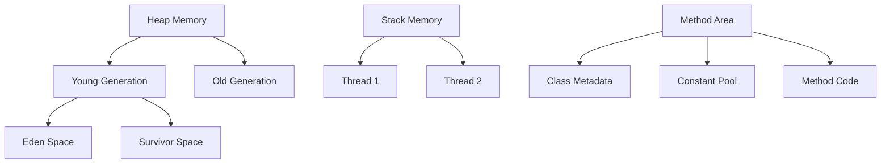
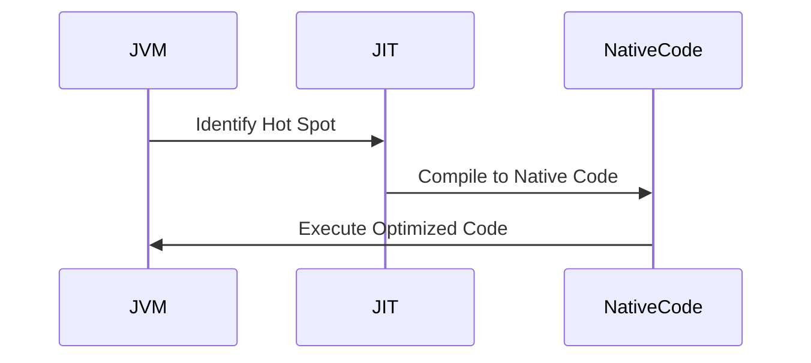

## 18.7.1 Understanding the JVM Performance Model

As experienced Java developers transitioning to Clojure, understanding the Java Virtual Machine (JVM) performance model is crucial. The JVM is the backbone of both Java and Clojure applications, and its performance characteristics significantly influence how Clojure applications behave. In this section, we'll delve into the JVM's memory management, just-in-time (JIT) compilation, and garbage collection processes, and explore how these elements impact Clojure applications.

### JVM Memory Management

The JVM's memory management is a cornerstone of its performance model. It involves the allocation and deallocation of memory for Java objects, which is crucial for both Java and Clojure applications.

#### Memory Areas in the JVM

The JVM divides its memory into several distinct areas, each serving a specific purpose:

1. **Heap Memory**: This is where all the objects are stored. The heap is divided into the young generation and the old generation. The young generation is further divided into the Eden space and two survivor spaces.

2. **Stack Memory**: Each thread has its own stack, which stores local variables and partial results. The stack is also where method calls are tracked.

3. **Method Area**: This area stores class structures, including metadata, the constant runtime pool, and the code for methods and constructors.

4. **Native Method Stack**: This is used for native methods written in languages like C or C++.

5. **Program Counter Register**: This holds the address of the JVM instruction currently being executed.

#### Clojure's Use of JVM Memory

Clojure, being a functional language, emphasizes immutability and persistent data structures. This means that Clojure applications often create more objects than typical Java applications, as each transformation of a data structure results in a new object. Understanding how these objects are managed in the JVM's heap is crucial for optimizing performance.

**Example: Clojure Data Structures and Memory**

```clojure
(defn transform-data [data]
  ;; Transforming data creates new objects
  (map inc data))

(def data (range 1000000))
(def transformed-data (transform-data data))
```

In this example, `transform-data` creates a new sequence, which involves allocating memory in the heap.

#### Memory Management Best Practices

- **Minimize Object Creation**: Use lazy sequences and transducers to reduce unnecessary object creation.
- **Optimize Data Structures**: Choose the right data structures for your use case to minimize memory usage.
- **Monitor Memory Usage**: Use tools like VisualVM to monitor heap usage and identify memory leaks.

### Just-In-Time (JIT) Compilation

The JVM's JIT compiler is a key component that enhances performance by compiling bytecode into native machine code at runtime. This process allows the JVM to optimize code execution based on actual usage patterns.

#### How JIT Works

1. **Interpretation**: Initially, the JVM interprets bytecode, which is slower than native execution.
2. **Compilation**: The JIT compiler identifies "hot spots" (frequently executed code) and compiles them into native code.
3. **Optimization**: The JIT applies various optimizations, such as inlining and loop unrolling, to improve performance.

#### Impact on Clojure Applications

Clojure's dynamic nature and use of higher-order functions can influence JIT compilation. The JIT compiler may need more time to optimize Clojure code due to its functional constructs and frequent use of anonymous functions.

**Example: JIT Compilation in Clojure**

```clojure
(defn compute-intensive-task [n]
  ;; A compute-intensive task that benefits from JIT optimization
  (reduce + (range n)))

(time (compute-intensive-task 1000000))
```

In this example, the `compute-intensive-task` function is a candidate for JIT optimization due to its repetitive nature.

#### JIT Compilation Best Practices

- **Warm Up the JVM**: Run your application for a while before measuring performance to allow the JIT to optimize.
- **Use Profiling Tools**: Tools like JITWatch can help you understand how the JIT is optimizing your code.

### Garbage Collection (GC)

Garbage collection is the process of automatically reclaiming memory by removing objects that are no longer in use. The JVM provides several garbage collectors, each with different performance characteristics.

#### Types of Garbage Collectors

1. **Serial GC**: A simple, single-threaded collector suitable for small applications.
2. **Parallel GC**: Uses multiple threads for garbage collection, improving throughput.
3. **CMS (Concurrent Mark-Sweep) GC**: Reduces pause times by performing most of the garbage collection concurrently with the application.
4. **G1 (Garbage-First) GC**: Aims to provide high throughput with low pause times, suitable for large applications.

#### Garbage Collection in Clojure

Clojure's emphasis on immutability and persistent data structures can lead to increased garbage collection activity. Understanding how different garbage collectors work can help you choose the right one for your application.

**Example: GC Impact on Clojure**

```clojure
(defn generate-data []
  ;; Generates a large amount of data, triggering garbage collection
  (vec (range 1000000)))

(def data (generate-data))
```

In this example, `generate-data` creates a large vector, which may trigger garbage collection.

#### Garbage Collection Best Practices

- **Choose the Right GC**: Select a garbage collector that balances throughput and pause times for your application.
- **Tune GC Parameters**: Adjust heap size and GC parameters to optimize performance.
- **Monitor GC Activity**: Use tools like GC logs and VisualVM to monitor garbage collection activity and identify bottlenecks.

### Comparing JVM Performance in Java and Clojure

While both Java and Clojure run on the JVM, their performance characteristics can differ due to language features and idioms.

#### Java vs. Clojure: Memory Usage

- **Java**: Typically uses mutable data structures, leading to fewer object allocations.
- **Clojure**: Emphasizes immutability, resulting in more frequent object creation and garbage collection.

#### Java vs. Clojure: JIT Optimization

- **Java**: Static typing and object-oriented design can lead to more predictable JIT optimizations.
- **Clojure**: Dynamic typing and functional constructs may require more JIT optimization time.

#### Java vs. Clojure: Garbage Collection

- **Java**: May have lower GC overhead due to mutable data structures.
- **Clojure**: Higher GC activity due to persistent data structures, but benefits from reduced synchronization overhead.

### Try It Yourself

Experiment with the following code snippets to observe the JVM performance model in action:

1. **Modify the `transform-data` function** to use different data structures and observe memory usage.
2. **Profile the `compute-intensive-task` function** using JITWatch to see how the JIT compiler optimizes it.
3. **Change the garbage collector** in your JVM settings and monitor the impact on the `generate-data` function.

### Diagrams and Visualizations

To better understand the JVM performance model, let's visualize some of these concepts.



*Diagram 1: JVM Memory Structure*

This diagram illustrates the different memory areas within the JVM, highlighting the heap, stack, and method area.



*Diagram 2: JIT Compilation Process*

This sequence diagram shows the process of JIT compilation, from identifying hot spots to executing optimized native code.

### Further Reading

For more in-depth information on the JVM performance model, consider exploring the following resources:

- [Official Clojure Documentation](https://clojure.org/)
- [Java Performance Tuning Guide](https://www.oracle.com/java/technologies/javase/performance.html)
- [JITWatch: Java JIT Compiler Visualization](https://github.com/AdoptOpenJDK/jitwatch)

### Exercises

1. **Memory Management**: Analyze a Clojure application to identify memory usage patterns and suggest optimizations.
2. **JIT Compilation**: Use JITWatch to profile a Clojure application and identify areas for optimization.
3. **Garbage Collection**: Experiment with different garbage collectors and GC parameters to optimize a Clojure application's performance.

### Key Takeaways

- The JVM's memory management, JIT compilation, and garbage collection are critical to understanding Clojure performance.
- Clojure's functional nature and use of persistent data structures influence how these JVM components behave.
- By understanding and optimizing these aspects, you can significantly improve the performance of your Clojure applications.

Now that we've explored the JVM performance model, let's apply these concepts to optimize your Clojure applications effectively.

## Quiz: Mastering JVM Performance for Clojure Applications



### What is the primary purpose of the JVM's heap memory?

- [x] To store objects
- [ ] To store local variables
- [ ] To execute native code
- [ ] To manage method calls

> **Explanation:** The heap memory is used to store objects in the JVM, which is crucial for both Java and Clojure applications.

### How does the JIT compiler improve performance?

- [x] By compiling bytecode into native code at runtime
- [ ] By interpreting bytecode faster
- [ ] By reducing memory usage
- [ ] By managing garbage collection

> **Explanation:** The JIT compiler improves performance by compiling frequently executed bytecode into native machine code at runtime.

### Which garbage collector is suitable for applications requiring low pause times?

- [ ] Serial GC
- [ ] Parallel GC
- [x] CMS GC
- [ ] G1 GC

> **Explanation:** The CMS (Concurrent Mark-Sweep) GC is designed to reduce pause times by performing most of the garbage collection concurrently with the application.

### What is a key characteristic of Clojure's data structures?

- [ ] They are mutable
- [x] They are immutable
- [ ] They are stored in the stack
- [ ] They require manual memory management

> **Explanation:** Clojure's data structures are immutable, meaning they cannot be changed once created, which affects memory usage and garbage collection.

### How can you monitor JVM memory usage?

- [x] Using VisualVM
- [ ] Using JITWatch
- [ ] Using a text editor
- [ ] Using a web browser

> **Explanation:** VisualVM is a tool that allows you to monitor JVM memory usage, including heap and garbage collection activity.

### What is the role of the JVM's method area?

- [ ] To store objects
- [ ] To execute native code
- [x] To store class structures and method code
- [ ] To manage garbage collection

> **Explanation:** The method area stores class structures, including metadata and method code, which is essential for executing Java and Clojure applications.

### Which JVM component is responsible for reclaiming unused memory?

- [ ] JIT Compiler
- [x] Garbage Collector
- [ ] Method Area
- [ ] Stack Memory

> **Explanation:** The garbage collector is responsible for reclaiming unused memory by removing objects that are no longer in use.

### How does Clojure's use of persistent data structures affect garbage collection?

- [x] It increases garbage collection activity
- [ ] It decreases garbage collection activity
- [ ] It has no effect on garbage collection
- [ ] It requires manual garbage collection

> **Explanation:** Clojure's persistent data structures lead to more frequent object creation, which increases garbage collection activity.

### What is a benefit of using lazy sequences in Clojure?

- [x] They reduce unnecessary object creation
- [ ] They increase memory usage
- [ ] They require more CPU resources
- [ ] They are faster to execute

> **Explanation:** Lazy sequences in Clojure help reduce unnecessary object creation by generating elements only when needed.

### True or False: The JVM's stack memory is shared among all threads.

- [ ] True
- [x] False

> **Explanation:** Each thread in the JVM has its own stack memory, which stores local variables and tracks method calls.


