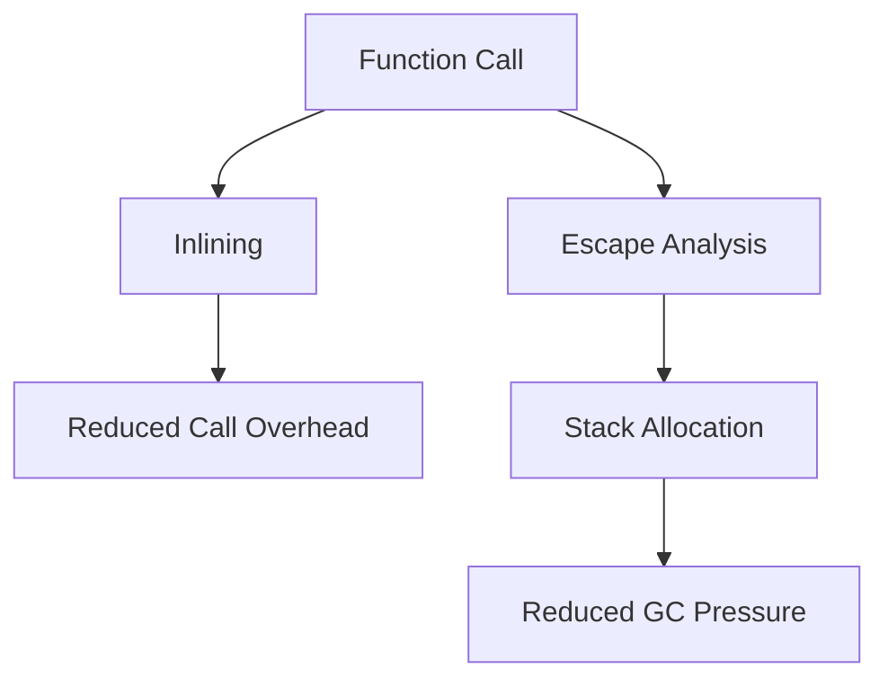

## 18.7.2 Exploiting JVM Optimizations

As experienced Java developers transitioning to Clojure, understanding how to exploit JVM optimizations can significantly enhance the performance of your Clojure applications. The Java Virtual Machine (JVM) is a powerful platform that provides numerous optimizations, such as Just-In-Time (JIT) compilation, garbage collection, and efficient memory management. In this section, we will explore how to write Clojure code that takes full advantage of these optimizations, focusing on avoiding dynamic code paths and leveraging polymorphism effectively.

### Understanding JVM Optimizations

The JVM is designed to execute Java bytecode efficiently, and it includes several optimizations that can be leveraged by Clojure code:

1. **Just-In-Time (JIT) Compilation**: Converts bytecode into native machine code at runtime, improving execution speed.
2. **Garbage Collection (GC)**: Automatically manages memory, freeing up unused objects and optimizing memory usage.
3. **HotSpot Optimizations**: Identifies frequently executed code paths (hot spots) and optimizes them for performance.
4. **Inlining**: Replaces method calls with the method body to reduce overhead.
5. **Escape Analysis**: Determines if an object can be allocated on the stack instead of the heap, reducing GC pressure.

### Avoiding Dynamic Code Paths

Dynamic code paths in Clojure can hinder JVM optimizations. Dynamic typing and reflection are powerful features of Clojure, but they can introduce performance overhead. Here are strategies to minimize dynamic code paths:

#### Use Type Hints

Type hints inform the Clojure compiler about the expected types of function arguments and return values, reducing the need for reflection. This can lead to significant performance improvements.

```clojure
(defn add [^long a ^long b]
  (+ a b))

;; Without type hints, the compiler uses reflection to determine types.
;; With type hints, the compiler generates optimized bytecode.
```

#### Avoid Reflection

Reflection is used when the type of an object is not known at compile time. It can be avoided by using type hints and ensuring that the types are known at compile time.

```clojure
;; Avoid reflection by using type hints
(defn get-length [^String s]
  (.length s))
```

#### Leverage Protocols and Records

Protocols and records provide a way to define polymorphic functions in Clojure, similar to interfaces in Java. They allow for efficient method dispatch without the overhead of dynamic typing.

```clojure
(defprotocol Shape
  (area [this]))

(defrecord Circle [radius]
  Shape
  (area [this]
    (* Math/PI (* radius radius))))

(defrecord Rectangle [width height]
  Shape
  (area [this]
    (* width height)))

;; Using protocols and records for polymorphism
(let [c (->Circle 5)
      r (->Rectangle 4 6)]
  (println "Circle area:" (area c))
  (println "Rectangle area:" (area r)))
```

### Leveraging Polymorphism Effectively

Polymorphism allows for flexible and reusable code. In Clojure, polymorphism can be achieved through protocols, multimethods, and records. Each has its own performance characteristics.

#### Protocols

Protocols provide a way to define a set of functions that can be implemented by different types. They offer fast method dispatch and are preferred for performance-critical code.

```clojure
(defprotocol Drawable
  (draw [this]))

(defrecord Line [start end]
  Drawable
  (draw [this]
    (println "Drawing line from" start "to" end)))

(defrecord Circle [center radius]
  Drawable
  (draw [this]
    (println "Drawing circle at" center "with radius" radius)))

;; Efficient polymorphism with protocols
(defn render [drawable]
  (draw drawable))

(render (->Line [0 0] [1 1]))
(render (->Circle [0 0] 5))
```

#### Multimethods

Multimethods provide a flexible way to define polymorphic functions based on arbitrary dispatch logic. They are more flexible than protocols but can be slower due to the dynamic dispatch mechanism.

```clojure
(defmulti draw-shape :type)

(defmethod draw-shape :line [shape]
  (println "Drawing line from" (:start shape) "to" (:end shape)))

(defmethod draw-shape :circle [shape]
  (println "Drawing circle at" (:center shape) "with radius" (:radius shape)))

;; Using multimethods for flexible polymorphism
(draw-shape {:type :line :start [0 0] :end [1 1]})
(draw-shape {:type :circle :center [0 0] :radius 5})
```

### Inlining and Escape Analysis

Inlining and escape analysis are JVM optimizations that can be leveraged by writing efficient Clojure code.

#### Inlining

Inlining replaces a method call with the method body, reducing the overhead of the call. This optimization is automatically performed by the JVM for small methods.

```clojure
;; Example of a small function that can be inlined
(defn square [x]
  (* x x))

;; The JVM may inline this function call
(defn calculate-area [side]
  (square side))
```

#### Escape Analysis

Escape analysis determines if an object can be allocated on the stack instead of the heap. This reduces garbage collection pressure and improves performance.

```clojure
;; Example where escape analysis can be applied
(defn create-point [x y]
  {:x x :y y})

;; If the point does not escape the method, it may be allocated on the stack
(defn distance-from-origin [point]
  (Math/sqrt (+ (Math/pow (:x point) 2) (Math/pow (:y point) 2))))
```

### Try It Yourself

To better understand these concepts, try modifying the code examples:

1. **Add Type Hints**: Experiment with adding type hints to functions and observe the performance impact.
2. **Use Protocols**: Implement a new protocol and record, and compare the performance with multimethods.
3. **Optimize with Inlining**: Create small functions and see if they are inlined by the JVM.
4. **Test Escape Analysis**: Write functions that create objects and test if they are allocated on the stack.

### Diagrams and Visualizations

To further illustrate these concepts, let's use diagrams to visualize the flow of data and optimizations:



*Diagram 1: JVM Optimizations Flowchart - This diagram illustrates how inlining and escape analysis optimize function calls and memory allocation.*

### Further Reading

For more information on JVM optimizations and Clojure performance, consider exploring the following resources:

- [Official Clojure Documentation](https://clojure.org/reference/documentation)
- [ClojureDocs](https://clojuredocs.org/)
- [Java Performance Tuning](https://www.oracle.com/java/technologies/javase/performance.html)

### Exercises

1. **Implement a Protocol**: Create a protocol for a geometric shape and implement it for different shapes. Measure the performance compared to using multimethods.
2. **Optimize a Function**: Write a function that performs a computation and optimize it using type hints and inlining.
3. **Analyze Escape Analysis**: Write a function that creates multiple objects and analyze if they are allocated on the stack or heap.

### Key Takeaways

- **Type Hints and Reflection**: Use type hints to avoid reflection and improve performance.
- **Protocols vs Multimethods**: Choose protocols for performance-critical code due to their efficient dispatch mechanism.
- **Inlining and Escape Analysis**: Write small functions and minimize object escape to leverage JVM optimizations.
- **Experiment and Measure**: Continuously experiment with different optimizations and measure their impact on performance.

By understanding and applying these JVM optimizations, you can write efficient Clojure code that performs well on the JVM, leveraging your existing Java knowledge to transition smoothly into the world of functional programming.

## Quiz: Mastering JVM Optimizations in Clojure



### What is the primary benefit of using type hints in Clojure?

- [x] Reducing the need for reflection
- [ ] Increasing code readability
- [ ] Simplifying syntax
- [ ] Enhancing error messages

> **Explanation:** Type hints help the Clojure compiler avoid reflection, which can improve performance by generating optimized bytecode.

### Which Clojure feature provides fast method dispatch similar to Java interfaces?

- [x] Protocols
- [ ] Multimethods
- [ ] Macros
- [ ] Atoms

> **Explanation:** Protocols in Clojure provide fast method dispatch, similar to interfaces in Java, making them suitable for performance-critical code.

### How does inlining improve performance in JVM?

- [x] By replacing method calls with the method body
- [ ] By reducing memory usage
- [ ] By simplifying code syntax
- [ ] By enhancing error handling

> **Explanation:** Inlining improves performance by replacing method calls with the method body, reducing the overhead of the call.

### What does escape analysis determine in JVM optimizations?

- [x] If an object can be allocated on the stack
- [ ] If a method can be inlined
- [ ] If a variable is mutable
- [ ] If a function is pure

> **Explanation:** Escape analysis determines if an object can be allocated on the stack instead of the heap, reducing garbage collection pressure.

### Which Clojure feature allows for flexible polymorphic functions based on arbitrary dispatch logic?

- [ ] Protocols
- [x] Multimethods
- [ ] Macros
- [ ] Agents

> **Explanation:** Multimethods provide flexible polymorphic functions based on arbitrary dispatch logic, allowing for dynamic dispatch.

### What is a potential downside of using dynamic code paths in Clojure?

- [x] Increased performance overhead
- [ ] Improved code readability
- [ ] Simplified error handling
- [ ] Enhanced flexibility

> **Explanation:** Dynamic code paths can introduce performance overhead due to the need for reflection and dynamic typing.

### How can you avoid reflection in Clojure code?

- [x] By using type hints
- [ ] By using macros
- [ ] By using atoms
- [ ] By using futures

> **Explanation:** Using type hints informs the compiler about expected types, reducing the need for reflection and improving performance.

### What is the role of garbage collection in JVM?

- [x] Automatically managing memory
- [ ] Enhancing code readability
- [ ] Simplifying syntax
- [ ] Improving error messages

> **Explanation:** Garbage collection automatically manages memory by freeing up unused objects and optimizing memory usage.

### Which optimization technique replaces method calls with the method body?

- [x] Inlining
- [ ] Escape analysis
- [ ] Reflection
- [ ] Type hinting

> **Explanation:** Inlining replaces method calls with the method body, reducing the overhead of the call and improving performance.

### True or False: Protocols in Clojure are slower than multimethods due to dynamic dispatch.

- [ ] True
- [x] False

> **Explanation:** Protocols in Clojure provide fast method dispatch and are generally faster than multimethods, which use dynamic dispatch.


