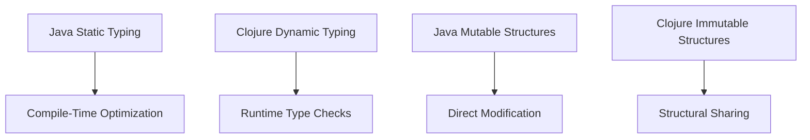
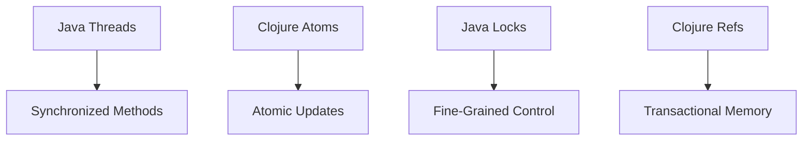

## 18.7.3 Comparing with Java Performance

As experienced Java developers transition to Clojure, understanding the performance implications of this shift is crucial. Both languages run on the Java Virtual Machine (JVM), but they have distinct characteristics that affect performance. In this section, we will delve into the performance differences between Clojure and Java, focusing on dynamic typing, immutability, and JVM optimizations. By the end of this article, you'll have a clear understanding of how Clojure's features can impact performance and how to leverage them effectively.

### Understanding the JVM: A Common Ground

Before diving into the specifics of Clojure and Java performance, it's essential to understand the JVM's role. The JVM provides a common platform for both languages, offering features like garbage collection, just-in-time (JIT) compilation, and a robust set of libraries. However, the way each language interacts with the JVM can lead to different performance characteristics.

#### Java's Strengths on the JVM

Java is a statically typed language, which allows the JVM to perform optimizations at compile time. This results in efficient bytecode that can be executed quickly. Java's performance benefits from:

- **Static Typing**: Enables early error detection and optimized memory usage.
- **JIT Compilation**: Converts bytecode into native machine code, improving execution speed.
- **Efficient Memory Management**: Java's garbage collector is optimized for long-running applications.

#### Clojure's Unique Approach

Clojure, a dynamically typed language, brings a different set of features to the JVM:

- **Dynamic Typing**: Offers flexibility but can introduce runtime overhead.
- **Immutability**: Simplifies concurrency but may impact performance due to persistent data structures.
- **Functional Paradigm**: Encourages concise and expressive code, potentially reducing the need for complex control structures.

### Dynamic Typing vs. Static Typing

One of the most significant differences between Clojure and Java is their typing systems. Let's explore how dynamic typing in Clojure compares to static typing in Java regarding performance.

#### Dynamic Typing in Clojure

Clojure's dynamic typing allows for more flexible code, but it comes with a cost. The lack of compile-time type checking means that type errors are caught at runtime, which can slow down execution. Additionally, dynamic typing requires more runtime type checks, adding overhead.

**Example: Dynamic Typing in Clojure**

```clojure
(defn add [a b]
  (+ a b))

;; Usage
(add 5 10) ; Returns 15
(add "Hello, " "World!") ; Returns "Hello, World!"
```

**Commentary**: In this example, the `add` function can accept any data type, showcasing Clojure's flexibility. However, this flexibility requires runtime type checks, which can affect performance.

#### Static Typing in Java

Java's static typing allows the compiler to optimize code by knowing the exact types of variables at compile time. This results in faster execution and fewer runtime errors.

**Example: Static Typing in Java**

```java
public int add(int a, int b) {
    return a + b;
}

// Usage
int result = add(5, 10); // Returns 15
```

**Commentary**: The Java example demonstrates how static typing enables the compiler to optimize the `add` method, resulting in efficient execution.

### Immutability and Persistent Data Structures

Immutability is a core concept in Clojure, offering benefits for concurrency and code simplicity. However, it also introduces performance considerations due to the use of persistent data structures.

#### Benefits of Immutability

- **Thread Safety**: Immutable data structures eliminate the need for locks, simplifying concurrent programming.
- **Predictability**: Functions that operate on immutable data are easier to reason about and test.

#### Performance Implications

While immutability offers significant advantages, it can also lead to performance overhead. Persistent data structures in Clojure are designed to be efficient, but they may not match the raw speed of mutable structures in Java.

**Example: Persistent Data Structures in Clojure**

```clojure
(def my-list (list 1 2 3))
(def new-list (conj my-list 4))

;; my-list remains unchanged
```

**Commentary**: In this example, `conj` creates a new list with the added element, leaving the original list unchanged. This operation is efficient due to structural sharing, but it may still be slower than modifying a mutable list in Java.

**Example: Mutable Data Structures in Java**

```java
List<Integer> myList = new ArrayList<>(Arrays.asList(1, 2, 3));
myList.add(4); // Modifies the original list
```

**Commentary**: Java's `ArrayList` allows direct modification, which can be faster but requires careful handling in concurrent environments.

### JVM Optimizations and Clojure

Clojure leverages JVM optimizations but also introduces unique challenges due to its dynamic nature and functional paradigm.

#### JIT Compilation and Clojure

The JVM's JIT compiler optimizes frequently executed code paths, benefiting both Java and Clojure. However, Clojure's dynamic features can complicate these optimizations.

- **Type Hinting**: Clojure developers can use type hints to guide the JIT compiler, reducing reflection overhead.
- **Inlining**: Clojure's use of higher-order functions can hinder inlining, but careful design can mitigate this issue.

**Example: Type Hinting in Clojure**

```clojure
(defn add ^long [^long a ^long b]
  (+ a b))
```

**Commentary**: Type hints in Clojure help the JIT compiler optimize the `add` function, reducing the overhead of dynamic typing.

### Concurrency Models: Clojure vs. Java

Concurrency is a critical aspect of modern applications, and both Clojure and Java offer robust models for handling concurrent tasks.

#### Clojure's Concurrency Primitives

Clojure provides several concurrency primitives, such as atoms, refs, and agents, which simplify state management in concurrent applications.

- **Atoms**: Provide a way to manage shared, mutable state with atomic updates.
- **Refs**: Use software transactional memory (STM) for coordinated state changes.
- **Agents**: Handle asynchronous updates to state.

**Example: Using Atoms in Clojure**

```clojure
(def counter (atom 0))

(defn increment-counter []
  (swap! counter inc))
```

**Commentary**: Atoms in Clojure allow for safe, atomic updates to shared state, simplifying concurrency.

#### Java's Concurrency Mechanisms

Java offers a wide range of concurrency tools, including threads, locks, and concurrent collections. These tools provide fine-grained control over concurrency but can be complex to manage.

**Example: Using Threads in Java**

```java
public class Counter {
    private int count = 0;

    public synchronized void increment() {
        count++;
    }
}
```

**Commentary**: Java's synchronized methods provide thread-safe access to shared state, but require careful management to avoid deadlocks and race conditions.

### Performance Benchmarks: Clojure vs. Java

To illustrate the performance differences between Clojure and Java, let's examine some benchmarks. These benchmarks highlight the impact of dynamic typing, immutability, and concurrency models on performance.

#### Benchmark: Looping and Iteration

**Clojure Example**

```clojure
(defn sum [n]
  (reduce + (range n)))

(time (sum 1000000))
```

**Java Example**

```java
public int sum(int n) {
    int total = 0;
    for (int i = 0; i < n; i++) {
        total += i;
    }
    return total;
}

long startTime = System.nanoTime();
sum(1000000);
long endTime = System.nanoTime();
System.out.println("Execution time: " + (endTime - startTime) + " ns");
```

**Analysis**: The Java loop is typically faster due to its imperative nature and static typing. However, Clojure's `reduce` function offers a more expressive and concise approach, which can be optimized with proper use of transducers.

#### Benchmark: Concurrency

**Clojure Example**

```clojure
(def counter (atom 0))

(defn increment-counter []
  (dotimes [_ 1000000]
    (swap! counter inc)))

(time (doall (pmap increment-counter (range 10))))
```

**Java Example**

```java
public class Counter {
    private AtomicInteger count = new AtomicInteger(0);

    public void increment() {
        for (int i = 0; i < 1000000; i++) {
            count.incrementAndGet();
        }
    }
}

long startTime = System.nanoTime();
ExecutorService executor = Executors.newFixedThreadPool(10);
for (int i = 0; i < 10; i++) {
    executor.submit(() -> new Counter().increment());
}
executor.shutdown();
executor.awaitTermination(1, TimeUnit.MINUTES);
long endTime = System.nanoTime();
System.out.println("Execution time: " + (endTime - startTime) + " ns");
```

**Analysis**: Both Clojure and Java handle concurrency efficiently, but Clojure's functional approach can simplify code and reduce the risk of concurrency-related bugs.

### Try It Yourself

To deepen your understanding of Clojure and Java performance, try modifying the code examples above. Experiment with different data structures, concurrency models, and JVM settings to observe their impact on performance.

### Diagrams and Visualizations

To further illustrate the concepts discussed, let's use some diagrams to visualize the flow of data and the impact of concurrency models.



**Diagram 1**: This diagram compares Java's static typing and mutable structures with Clojure's dynamic typing and immutable structures, highlighting their impact on performance.



**Diagram 2**: This diagram illustrates the concurrency models in Java and Clojure, showcasing the differences between synchronized methods and atomic updates.

### Key Takeaways

- **Dynamic Typing vs. Static Typing**: Clojure's dynamic typing offers flexibility but can introduce runtime overhead compared to Java's static typing.
- **Immutability**: Clojure's immutable data structures simplify concurrency but may impact performance compared to Java's mutable structures.
- **Concurrency Models**: Clojure's concurrency primitives provide a simpler and safer approach to managing state in concurrent applications.
- **JVM Optimizations**: Both languages benefit from JVM optimizations, but Clojure's dynamic features require careful design to maximize performance.

### Exercises

1. Modify the Clojure and Java examples to use different data structures and observe the impact on performance.
2. Implement a concurrent task in both Clojure and Java, comparing the complexity and performance of each approach.
3. Experiment with type hinting in Clojure to reduce reflection overhead and measure the performance improvements.

### Further Reading

- [Official Clojure Documentation](https://clojure.org/)
- [ClojureDocs](https://clojuredocs.org/)
- [Java Performance Tuning](https://www.oracle.com/java/technologies/javase/performance.html)

By understanding the performance characteristics of Clojure and Java, you can make informed decisions about when and how to use each language effectively. Embrace Clojure's unique features to build efficient, concurrent applications that leverage the power of the JVM.

## Quiz: Test Your Understanding of Clojure and Java Performance



### Which of the following is a benefit of static typing in Java?

- [x] Compile-time optimization
- [ ] Increased flexibility
- [ ] Runtime type checks
- [ ] Simplified concurrency

> **Explanation:** Static typing in Java allows for compile-time optimization, enabling the JVM to generate efficient bytecode.

### What is a potential downside of dynamic typing in Clojure?

- [x] Runtime overhead
- [ ] Compile-time errors
- [ ] Reduced flexibility
- [ ] Increased memory usage

> **Explanation:** Dynamic typing in Clojure can introduce runtime overhead due to the need for type checks during execution.

### How does Clojure's immutability benefit concurrency?

- [x] Eliminates the need for locks
- [ ] Increases memory usage
- [ ] Requires complex control structures
- [ ] Slows down execution

> **Explanation:** Immutability in Clojure eliminates the need for locks, simplifying concurrent programming and reducing the risk of race conditions.

### What is a key difference between Java's and Clojure's concurrency models?

- [x] Clojure uses atomic updates
- [ ] Java uses transactional memory
- [ ] Clojure requires synchronized methods
- [ ] Java eliminates the need for locks

> **Explanation:** Clojure's concurrency model uses atomic updates, such as atoms, to manage shared state safely.

### Which JVM feature benefits both Java and Clojure?

- [x] JIT Compilation
- [ ] Dynamic Typing
- [ ] Mutable Data Structures
- [ ] Synchronized Methods

> **Explanation:** JIT compilation is a JVM feature that optimizes frequently executed code paths, benefiting both Java and Clojure.

### What is the purpose of type hinting in Clojure?

- [x] Reduce reflection overhead
- [ ] Increase flexibility
- [ ] Simplify code
- [ ] Enable compile-time errors

> **Explanation:** Type hinting in Clojure helps the JIT compiler optimize code by reducing the overhead of reflection.

### How do persistent data structures in Clojure achieve efficiency?

- [x] Structural sharing
- [ ] Direct modification
- [ ] Mutable state
- [ ] Synchronized methods

> **Explanation:** Persistent data structures in Clojure achieve efficiency through structural sharing, allowing for efficient updates without modifying the original structure.

### What is a common use case for Clojure's refs?

- [x] Coordinated state changes
- [ ] Asynchronous updates
- [ ] Direct modification
- [ ] Compile-time optimization

> **Explanation:** Clojure's refs are used for coordinated state changes, leveraging software transactional memory (STM) to ensure consistency.

### Which of the following is a benefit of using Clojure's agents?

- [x] Asynchronous updates
- [ ] Synchronized methods
- [ ] Compile-time errors
- [ ] Direct modification

> **Explanation:** Clojure's agents provide a way to handle asynchronous updates to state, simplifying concurrent programming.

### True or False: Clojure's dynamic typing allows for compile-time optimization.

- [ ] True
- [x] False

> **Explanation:** Clojure's dynamic typing does not allow for compile-time optimization, as type checks are performed at runtime.


