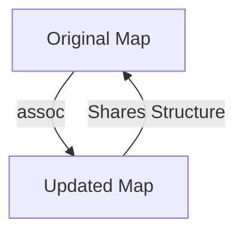
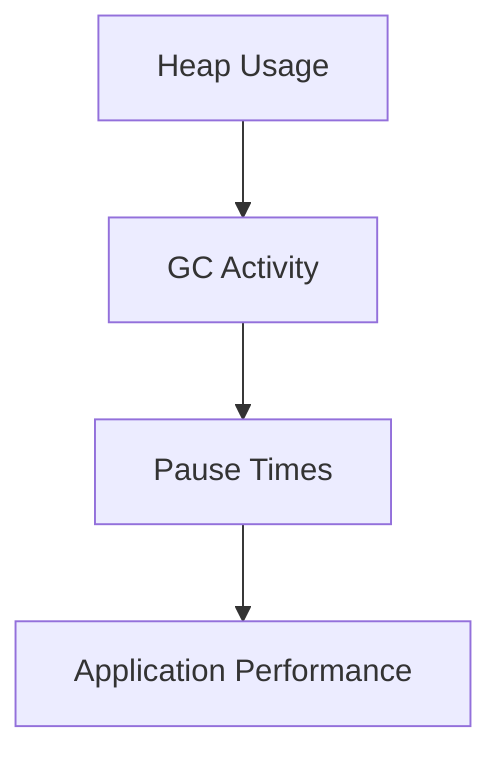

## 18.8.1 Understanding Garbage Collection

As experienced Java developers transitioning to Clojure, understanding garbage collection (GC) within the Java Virtual Machine (JVM) is crucial for optimizing performance and managing memory effectively. In this section, we will delve into the fundamentals of garbage collection, explore various GC algorithms, and examine their implications for Clojure applications.

### Introduction to Garbage Collection

Garbage collection is an automatic memory management feature of the JVM that identifies and reclaims memory occupied by objects that are no longer in use. This process is essential for preventing memory leaks and ensuring efficient memory utilization. In Clojure, as in Java, garbage collection is managed by the JVM, allowing developers to focus on application logic rather than manual memory management.

#### Key Concepts

- **Heap Memory**: The area of memory where objects are allocated. The heap is divided into generations: young, old, and sometimes permanent.
- **Generational Hypothesis**: Most objects die young, meaning they become unreachable shortly after allocation. This hypothesis underpins many GC algorithms.
- **Reachability**: An object is considered reachable if it can be accessed directly or indirectly from a root reference, such as a static field or a local variable on the stack.

### The Role of Garbage Collection in JVM

Garbage collection in the JVM is designed to automate memory management, reducing the risk of memory leaks and improving application stability. It operates by identifying objects that are no longer reachable and reclaiming their memory for future allocations. This process involves several key steps:

1. **Marking**: Identifying all reachable objects.
2. **Sweeping**: Reclaiming memory occupied by unreachable objects.
3. **Compacting**: Reducing fragmentation by moving objects to contiguous memory locations.

### Common Garbage Collection Algorithms

The JVM offers several garbage collection algorithms, each with its own strengths and trade-offs. Understanding these algorithms is vital for optimizing Clojure applications, especially those with specific performance requirements.

#### Serial Garbage Collector

The Serial GC is a simple, single-threaded collector suitable for small applications with modest memory requirements. It performs all GC operations in a single thread, pausing application execution during collection.

- **Pros**: Low overhead, simple implementation.
- **Cons**: Long pause times, not suitable for large applications.

#### Parallel Garbage Collector

The Parallel GC, also known as the throughput collector, uses multiple threads to perform garbage collection, reducing pause times and improving throughput for applications with high allocation rates.

- **Pros**: Better throughput than Serial GC, suitable for multi-core systems.
- **Cons**: Still experiences noticeable pause times.

#### Concurrent Mark-Sweep (CMS) Collector

The CMS collector aims to minimize pause times by performing most of its work concurrently with the application. It is well-suited for applications requiring low-latency performance.

- **Pros**: Low pause times, concurrent collection.
- **Cons**: Higher CPU usage, potential for fragmentation.

#### G1 Garbage Collector

The G1 GC is designed for applications with large heaps and aims to provide predictable pause times. It divides the heap into regions and collects them incrementally.

- **Pros**: Predictable pause times, handles large heaps efficiently.
- **Cons**: More complex tuning, higher overhead than simpler collectors.

#### Z Garbage Collector

The ZGC is a low-latency garbage collector introduced in more recent JVM versions. It is designed to handle large heaps with minimal pause times.

- **Pros**: Extremely low pause times, scalable to large heaps.
- **Cons**: Requires more memory, still evolving.

### Garbage Collection in Clojure

Clojure, being a JVM language, benefits from the JVM's garbage collection mechanisms. However, the functional nature of Clojure, with its emphasis on immutability and persistent data structures, can influence garbage collection behavior.

#### Immutability and Garbage Collection

Clojure's immutable data structures can lead to increased object creation, as new versions of data structures are created rather than modifying existing ones. While this can increase the load on the garbage collector, it also simplifies memory management by eliminating issues related to shared mutable state.

**Example: Persistent Data Structures**

```clojure
(defn update-map [m k v]
  ;; Creates a new map with the updated key-value pair
  (assoc m k v))

(let [original-map {:a 1 :b 2}
      updated-map (update-map original-map :c 3)]
  ;; original-map remains unchanged
  (println original-map)  ;; Output: {:a 1, :b 2}
  (println updated-map))  ;; Output: {:a 1, :b 2, :c 3}
```

In this example, `assoc` creates a new map with the updated key-value pair, leaving the original map unchanged. This immutability can lead to more frequent garbage collection but simplifies reasoning about code.

#### Impact of Persistent Data Structures

Persistent data structures in Clojure are designed to share structure between versions, reducing the need for full copies and minimizing memory usage. This structural sharing can mitigate some of the garbage collection overhead associated with immutability.

**Diagram: Structural Sharing in Persistent Data Structures**



*Caption: This diagram illustrates how persistent data structures in Clojure share structure between versions, reducing memory usage.*

### Tuning Garbage Collection for Clojure Applications

Optimizing garbage collection for Clojure applications involves selecting the appropriate GC algorithm and tuning its parameters to balance throughput, latency, and memory usage. Here are some strategies to consider:

#### Choosing the Right Garbage Collector

- **Application Type**: Consider the nature of your application. Low-latency applications may benefit from CMS or G1, while high-throughput applications might prefer Parallel GC.
- **Heap Size**: Larger heaps may require collectors like G1 or ZGC to manage memory efficiently.
- **Pause Time Requirements**: If your application has strict pause time requirements, prioritize collectors with low-latency characteristics.

#### Tuning GC Parameters

- **Heap Size**: Adjust the initial and maximum heap sizes to provide sufficient memory for your application while avoiding excessive GC activity.
- **GC Threads**: For parallel collectors, configure the number of GC threads to match your system's CPU capabilities.
- **Pause Time Goals**: Set pause time goals to guide the GC in balancing throughput and latency.

**Example: JVM Options for Tuning GC**

```shell
java -Xms512m -Xmx4g -XX:+UseG1GC -XX:MaxGCPauseMillis=200 -jar your-clojure-app.jar
```

In this example, we configure the JVM to use the G1 garbage collector with a maximum pause time goal of 200 milliseconds, an initial heap size of 512 MB, and a maximum heap size of 4 GB.

### Monitoring and Analyzing Garbage Collection

Effective garbage collection tuning requires monitoring and analyzing GC behavior to identify bottlenecks and optimize performance. Tools like VisualVM, JConsole, and GC logs can provide valuable insights into GC activity.

#### Analyzing GC Logs

GC logs can reveal information about pause times, heap usage, and collection frequency. Analyzing these logs can help identify patterns and guide tuning efforts.

**Example: Enabling GC Logging**

```shell
java -Xlog:gc*:file=gc.log -jar your-clojure-app.jar
```

This command enables detailed GC logging, directing output to a file named `gc.log`. Reviewing this log can help identify areas for improvement.

#### Using Monitoring Tools

Tools like VisualVM and JConsole provide real-time monitoring of JVM performance, including heap usage and GC activity. These tools can help visualize GC behavior and identify potential issues.

**Diagram: Visualizing GC Activity with VisualVM**



*Caption: This diagram illustrates how monitoring tools like VisualVM can help visualize GC activity and its impact on application performance.*

### Best Practices for Garbage Collection in Clojure

To optimize garbage collection in Clojure applications, consider the following best practices:

- **Profile Regularly**: Regularly profile your application to identify GC-related bottlenecks and optimize performance.
- **Use Appropriate Data Structures**: Leverage Clojure's persistent data structures to minimize memory usage and GC overhead.
- **Tune GC Parameters**: Experiment with different GC algorithms and parameters to find the optimal configuration for your application.
- **Monitor in Production**: Continuously monitor GC behavior in production environments to ensure optimal performance.

### Conclusion

Understanding garbage collection in the JVM is essential for optimizing Clojure applications. By selecting the appropriate GC algorithm, tuning parameters, and leveraging Clojure's immutable data structures, you can achieve efficient memory management and improve application performance. As you continue your journey with Clojure, remember to regularly profile and monitor your applications to ensure they run smoothly and efficiently.

### Further Reading

For more information on garbage collection and JVM performance tuning, consider exploring the following resources:

- [Official Clojure Documentation](https://clojure.org/)
- [Java Garbage Collection Tuning Guide](https://docs.oracle.com/javase/8/docs/technotes/guides/vm/gctuning/)
- [ClojureDocs](https://clojuredocs.org/)

### Exercises

1. Experiment with different GC algorithms in a sample Clojure application and observe the impact on performance.
2. Analyze GC logs from a Clojure application to identify potential bottlenecks and areas for improvement.
3. Implement a Clojure application using persistent data structures and monitor its memory usage and GC activity.

### Key Takeaways

- Garbage collection is a critical aspect of JVM memory management, impacting Clojure application performance.
- Understanding different GC algorithms and their trade-offs is essential for optimizing memory management.
- Clojure's immutable data structures influence garbage collection behavior, offering both challenges and benefits.
- Regular profiling and monitoring are crucial for identifying and addressing GC-related performance issues.

Now that we've explored garbage collection in the JVM, let's apply these concepts to optimize memory management in your Clojure applications.

## Quiz: Mastering Garbage Collection in JVM for Clojure



### What is the primary purpose of garbage collection in the JVM?

- [x] To automatically manage memory by reclaiming unused objects
- [ ] To manually allocate memory for new objects
- [ ] To optimize CPU usage
- [ ] To manage network connections

> **Explanation:** Garbage collection automatically manages memory by reclaiming memory occupied by objects that are no longer in use.

### Which garbage collector is known for providing low pause times and concurrent collection?

- [ ] Serial GC
- [ ] Parallel GC
- [x] Concurrent Mark-Sweep (CMS) Collector
- [ ] G1 Garbage Collector

> **Explanation:** The CMS collector is designed to minimize pause times by performing most of its work concurrently with the application.

### What is a key characteristic of Clojure's persistent data structures?

- [ ] They are mutable by default
- [x] They share structure between versions
- [ ] They require manual memory management
- [ ] They are not compatible with the JVM

> **Explanation:** Clojure's persistent data structures share structure between versions, reducing memory usage and minimizing garbage collection overhead.

### Which JVM option enables detailed garbage collection logging?

- [ ] -Xms
- [ ] -Xmx
- [x] -Xlog:gc*
- [ ] -XX:+UseG1GC

> **Explanation:** The `-Xlog:gc*` option enables detailed garbage collection logging, providing insights into GC activity.

### What is the Generational Hypothesis in garbage collection?

- [x] Most objects die young
- [ ] All objects live indefinitely
- [ ] Objects are never collected
- [ ] Objects are collected based on size

> **Explanation:** The Generational Hypothesis suggests that most objects become unreachable shortly after allocation, which influences many GC algorithms.

### Which garbage collector is designed for applications with large heaps and provides predictable pause times?

- [ ] Serial GC
- [ ] Parallel GC
- [ ] CMS Collector
- [x] G1 Garbage Collector

> **Explanation:** The G1 Garbage Collector is designed for applications with large heaps and aims to provide predictable pause times.

### What is a common strategy for tuning garbage collection in Clojure applications?

- [x] Adjusting heap size and GC parameters
- [ ] Disabling garbage collection
- [ ] Using mutable data structures
- [ ] Avoiding memory allocation

> **Explanation:** Tuning garbage collection involves adjusting heap size and GC parameters to balance throughput, latency, and memory usage.

### How do persistent data structures in Clojure affect garbage collection?

- [x] They increase object creation but simplify memory management
- [ ] They eliminate the need for garbage collection
- [ ] They require manual memory management
- [ ] They decrease object creation

> **Explanation:** Persistent data structures increase object creation due to immutability but simplify memory management by eliminating issues related to shared mutable state.

### What tool can be used for real-time monitoring of JVM performance, including garbage collection?

- [ ] Visual Studio Code
- [x] VisualVM
- [ ] IntelliJ IDEA
- [ ] Eclipse

> **Explanation:** VisualVM is a tool that provides real-time monitoring of JVM performance, including heap usage and garbage collection activity.

### True or False: Clojure's immutable data structures eliminate the need for garbage collection.

- [ ] True
- [x] False

> **Explanation:** While Clojure's immutable data structures simplify memory management, they do not eliminate the need for garbage collection, as objects still need to be reclaimed when they become unreachable.


