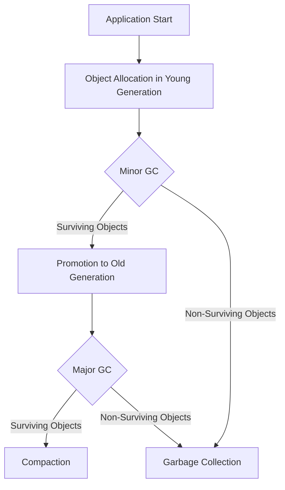

## 18.8.3 Tuning the Garbage Collector

As experienced Java developers transitioning to Clojure, understanding how to optimize the Java Virtual Machine (JVM) garbage collector (GC) is crucial for achieving optimal performance in your applications. Clojure, being a JVM language, inherits Java's garbage collection mechanisms, but the functional nature of Clojure can influence how memory is managed. In this section, we will explore how to tune the JVM's garbage collection settings specifically for Clojure applications, focusing on heap size adjustments and selecting appropriate GC algorithms.

### Understanding Garbage Collection in the JVM

Garbage collection in the JVM is responsible for automatically managing memory, freeing up space occupied by objects that are no longer in use. This process is crucial for preventing memory leaks and ensuring efficient memory utilization. However, improper GC tuning can lead to performance bottlenecks, such as long pause times or excessive CPU usage.

#### Key Concepts of JVM Garbage Collection

- **Heap Memory**: The area of memory where objects are allocated. It is divided into generations: Young Generation, Old Generation, and Permanent Generation (or Metaspace in Java 8 and later).
- **Young Generation**: Where new objects are allocated. It is further divided into Eden Space and Survivor Spaces.
- **Old Generation**: Where long-lived objects are moved after surviving several garbage collection cycles in the Young Generation.
- **GC Algorithms**: Different strategies for collecting garbage, each with its own trade-offs in terms of throughput, latency, and footprint.

### Tuning Heap Sizes

Heap size tuning is one of the most impactful ways to optimize garbage collection. The heap size determines how much memory is available for object allocation and can significantly affect the frequency and duration of garbage collection cycles.

#### Setting Initial and Maximum Heap Sizes

The JVM allows you to specify the initial and maximum heap sizes using the `-Xms` and `-Xmx` flags, respectively. It's important to set these values appropriately to balance memory usage and performance.

```bash
# Example: Setting initial and maximum heap sizes
java -Xms512m -Xmx2g -jar your-clojure-app.jar
```

- **Initial Heap Size (`-Xms`)**: The amount of memory allocated at startup. Setting this value too low can lead to frequent garbage collections as the JVM expands the heap.
- **Maximum Heap Size (`-Xmx`)**: The maximum amount of memory the JVM can use. Setting this too high can lead to inefficient memory usage and longer GC pause times.

**Best Practice**: Set `-Xms` and `-Xmx` to the same value to avoid heap resizing, which can cause performance overhead.

#### Monitoring Heap Usage

To effectively tune heap sizes, it's essential to monitor heap usage over time. Tools like VisualVM, JConsole, or Java Mission Control can provide insights into memory usage patterns and help identify optimal heap size settings.

### Selecting Garbage Collection Algorithms

The JVM offers several garbage collection algorithms, each with its own strengths and weaknesses. Choosing the right algorithm depends on your application's performance requirements and workload characteristics.

#### Common GC Algorithms

1. **Serial GC (`-XX:+UseSerialGC`)**: A simple, single-threaded collector suitable for small applications with low memory requirements.
2. **Parallel GC (`-XX:+UseParallelGC`)**: A multi-threaded collector that provides high throughput, ideal for applications with large datasets and multi-core processors.
3. **Concurrent Mark-Sweep (CMS) GC (`-XX:+UseConcMarkSweepGC`)**: A low-latency collector that minimizes pause times, suitable for applications requiring quick response times.
4. **G1 GC (`-XX:+UseG1GC`)**: A balanced collector that aims to provide both high throughput and low latency, making it a good choice for most applications.
5. **ZGC (`-XX:+UseZGC`)**: A scalable, low-latency collector designed for large heaps, available in Java 11 and later.

#### Choosing the Right GC Algorithm

When selecting a GC algorithm, consider the following factors:

- **Throughput**: The percentage of total time not spent in garbage collection. High throughput is desirable for batch processing applications.
- **Latency**: The time taken to pause application threads during garbage collection. Low latency is crucial for interactive applications.
- **Footprint**: The amount of memory used by the garbage collector itself. A smaller footprint is beneficial for memory-constrained environments.

**Example**: For a Clojure web application requiring low latency, the G1 GC or CMS GC might be appropriate choices.

### Fine-Tuning GC Parameters

Beyond selecting a GC algorithm, fine-tuning specific parameters can further optimize garbage collection performance.

#### Adjusting Young Generation Size

The size of the Young Generation can be adjusted using the `-XX:NewRatio` or `-XX:NewSize` and `-XX:MaxNewSize` flags. A larger Young Generation can reduce the frequency of minor GCs but may increase the duration of each collection.

```bash
# Example: Setting Young Generation size
java -XX:NewRatio=3 -jar your-clojure-app.jar
```

#### Configuring GC Threads

For multi-threaded collectors like Parallel GC and G1 GC, you can specify the number of threads used for garbage collection with the `-XX:ParallelGCThreads` flag. Increasing the number of threads can improve throughput but may also increase CPU usage.

```bash
# Example: Setting GC threads
java -XX:ParallelGCThreads=4 -jar your-clojure-app.jar
```

#### Tuning G1 GC Parameters

The G1 GC offers several parameters for fine-tuning, such as `-XX:MaxGCPauseMillis` to set a target maximum pause time and `-XX:G1HeapRegionSize` to specify the size of heap regions.

```bash
# Example: Tuning G1 GC
java -XX:+UseG1GC -XX:MaxGCPauseMillis=200 -XX:G1HeapRegionSize=16m -jar your-clojure-app.jar
```

### Comparing Clojure and Java GC Tuning

While the principles of garbage collection tuning are similar for both Clojure and Java applications, the functional nature of Clojure can lead to different memory usage patterns. Clojure's emphasis on immutability and persistent data structures can result in more frequent object allocations, impacting garbage collection behavior.

#### Clojure-Specific Considerations

- **Persistent Data Structures**: Clojure's use of persistent data structures can lead to increased memory usage compared to mutable structures in Java. This may require larger heap sizes or more frequent garbage collections.
- **Functional Programming Patterns**: The use of higher-order functions and lazy sequences can create temporary objects that are quickly collected, influencing GC performance.

### Practical Example: Tuning a Clojure Application

Let's consider a simple Clojure application that processes a large dataset. We'll explore how to tune the JVM garbage collector to optimize performance.

```clojure
(ns example.core
  (:require [clojure.java.io :as io]))

(defn process-data [file-path]
  ;; Read and process data from a file
  (with-open [reader (io/reader file-path)]
    (doall (map #(println %) (line-seq reader)))))

(defn -main [& args]
  ;; Entry point for the application
  (process-data "large-dataset.txt"))
```

**Tuning Steps**:

1. **Monitor Memory Usage**: Use VisualVM to observe heap usage and GC activity.
2. **Adjust Heap Sizes**: Set `-Xms` and `-Xmx` based on observed memory usage patterns.
3. **Select GC Algorithm**: Choose G1 GC for balanced throughput and latency.
4. **Fine-Tune Parameters**: Adjust `-XX:MaxGCPauseMillis` to meet latency requirements.

### Try It Yourself

Experiment with the provided Clojure application by modifying the GC settings and observing the impact on performance. Consider changing the heap sizes, GC algorithm, and fine-tuning parameters. Use tools like VisualVM to visualize the effects of your changes.

### Diagrams and Visualizations

To enhance understanding, let's visualize the flow of garbage collection in the JVM using a Mermaid.js diagram.



**Diagram Caption**: This diagram illustrates the flow of garbage collection in the JVM, showing how objects are allocated in the Young Generation and promoted to the Old Generation, with minor and major garbage collections occurring at different stages.

### Further Reading

For more in-depth information on JVM garbage collection and tuning, consider exploring the following resources:

- [Official Clojure Documentation](https://clojure.org/)
- [Java Performance Tuning Guide](https://www.oracle.com/java/technologies/javase/performance.html)
- [ClojureDocs](https://clojuredocs.org/)

### Exercises

1. **Heap Size Experimentation**: Adjust the initial and maximum heap sizes for a sample Clojure application and observe the impact on performance.
2. **GC Algorithm Comparison**: Compare the performance of different GC algorithms (e.g., Serial, Parallel, G1) for a Clojure application with varying workloads.
3. **Fine-Tuning Practice**: Experiment with fine-tuning parameters for the G1 GC and measure the effects on pause times and throughput.

### Key Takeaways

- Tuning the JVM garbage collector is essential for optimizing Clojure application performance.
- Heap size adjustments and GC algorithm selection are critical components of GC tuning.
- Monitoring tools like VisualVM can provide valuable insights into memory usage and GC behavior.
- Clojure's functional nature can influence memory usage patterns, requiring specific tuning considerations.

Now that we've explored how to tune the JVM garbage collector for Clojure applications, let's apply these concepts to enhance the performance of your own projects.

## Quiz: Mastering JVM Garbage Collection for Clojure



### What is the primary role of garbage collection in the JVM?

- [x] Automatically manage memory by freeing up space occupied by unused objects.
- [ ] Allocate memory for new objects.
- [ ] Optimize CPU usage.
- [ ] Manage network resources.

> **Explanation:** Garbage collection in the JVM is responsible for automatically managing memory by freeing up space occupied by objects that are no longer in use.

### Which JVM flag is used to set the initial heap size?

- [ ] -Xmx
- [x] -Xms
- [ ] -XX:NewRatio
- [ ] -XX:+UseG1GC

> **Explanation:** The `-Xms` flag is used to set the initial heap size for the JVM.

### What is the main advantage of setting the initial and maximum heap sizes to the same value?

- [x] Avoid heap resizing and reduce performance overhead.
- [ ] Increase the maximum memory available.
- [ ] Decrease garbage collection frequency.
- [ ] Improve CPU efficiency.

> **Explanation:** Setting the initial and maximum heap sizes to the same value avoids heap resizing, which can cause performance overhead.

### Which GC algorithm is known for providing low latency?

- [ ] Serial GC
- [ ] Parallel GC
- [x] Concurrent Mark-Sweep (CMS) GC
- [ ] ZGC

> **Explanation:** The Concurrent Mark-Sweep (CMS) GC is known for providing low latency by minimizing pause times.

### What is the purpose of the `-XX:MaxGCPauseMillis` parameter?

- [x] Set a target maximum pause time for garbage collection.
- [ ] Increase the heap size.
- [ ] Decrease CPU usage.
- [ ] Optimize network performance.

> **Explanation:** The `-XX:MaxGCPauseMillis` parameter is used to set a target maximum pause time for garbage collection.

### Which tool can be used to monitor heap usage and GC activity?

- [ ] Eclipse
- [ ] IntelliJ IDEA
- [x] VisualVM
- [ ] NetBeans

> **Explanation:** VisualVM is a tool that can be used to monitor heap usage and GC activity in JVM applications.

### What is a key consideration when selecting a GC algorithm for a Clojure application?

- [x] Application's performance requirements and workload characteristics.
- [ ] The number of developers on the team.
- [ ] The programming language used.
- [ ] The operating system.

> **Explanation:** When selecting a GC algorithm, it's important to consider the application's performance requirements and workload characteristics.

### How does Clojure's use of persistent data structures affect garbage collection?

- [x] It can lead to increased memory usage and more frequent garbage collections.
- [ ] It reduces memory usage.
- [ ] It eliminates the need for garbage collection.
- [ ] It improves CPU efficiency.

> **Explanation:** Clojure's use of persistent data structures can lead to increased memory usage compared to mutable structures, impacting garbage collection behavior.

### Which JVM flag is used to specify the number of threads for garbage collection?

- [ ] -Xms
- [ ] -Xmx
- [x] -XX:ParallelGCThreads
- [ ] -XX:+UseSerialGC

> **Explanation:** The `-XX:ParallelGCThreads` flag is used to specify the number of threads for garbage collection in multi-threaded collectors.

### True or False: The G1 GC is suitable for applications requiring both high throughput and low latency.

- [x] True
- [ ] False

> **Explanation:** The G1 GC is designed to provide a balance between high throughput and low latency, making it suitable for many applications.


