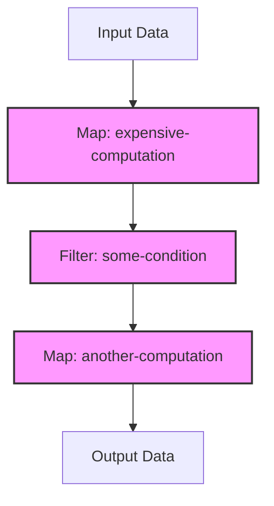

## 18.9.1 Performance Optimization in a Web Application

In this section, we will delve into a comprehensive case study of performance optimization in a Clojure web application. This guide is designed for experienced Java developers transitioning to Clojure, leveraging your existing knowledge to help you understand and apply performance optimization techniques effectively.

### Introduction

Performance optimization is a critical aspect of web application development. In Clojure, with its emphasis on immutability and functional programming, optimizing performance can involve different strategies compared to Java. We'll explore how to identify performance bottlenecks, use profiling tools, and implement optimizations in a Clojure web application.

### Understanding the Application

Let's consider a hypothetical Clojure web application designed to handle a high volume of user requests. This application provides real-time data processing and serves a RESTful API. The primary performance issues identified were high latency in response times and increased CPU usage under load.

### Profiling the Application

Profiling is the first step in performance optimization. It helps identify bottlenecks and understand where the application spends most of its time. In Clojure, we can use tools like [VisualVM](https://visualvm.github.io/) and [YourKit](https://www.yourkit.com/) for JVM-based profiling, alongside Clojure-specific tools like [Criterium](https://github.com/hugoduncan/criterium) for benchmarking.

#### Using VisualVM

VisualVM is a powerful tool for monitoring and profiling Java applications. It provides insights into CPU usage, memory consumption, and thread activity.

1. **Setup VisualVM**: Ensure your Clojure application is running on a JVM. Launch VisualVM and connect it to your application's JVM process.
2. **Monitor CPU and Memory**: Use the CPU and memory tabs to observe real-time usage. Look for spikes or unusual patterns.
3. **Profile CPU Usage**: Start a CPU profiling session to capture detailed information about method execution times.

#### Analyzing Profiling Data

After profiling, analyze the data to identify hotspots. In our case study, the following issues were identified:

- **High CPU Usage**: A significant amount of CPU time was spent in data transformation functions.
- **Memory Consumption**: Excessive memory usage due to large intermediate data structures.
- **Concurrency Bottlenecks**: Inefficient use of concurrency primitives leading to thread contention.

### Implementing Optimizations

Based on the profiling findings, we implemented several optimizations to improve performance.

#### Optimizing Data Transformations

Clojure's functional programming paradigm encourages the use of higher-order functions for data transformations. However, these can become performance bottlenecks if not used judiciously.

**Before Optimization**: The application used nested `map` and `filter` operations, leading to the creation of multiple intermediate collections.

```clojure
(defn process-data [data]
  (->> data
       (map expensive-computation)
       (filter some-condition)
       (map another-computation)))
```

**Optimization Strategy**: Use transducers to eliminate intermediate collections and improve performance.

```clojure
(defn process-data [data]
  (transduce
    (comp (map expensive-computation)
          (filter some-condition)
          (map another-computation))
    conj
    []
    data))
```

**Explanation**: Transducers allow us to compose transformation functions without creating intermediate collections, reducing memory usage and improving CPU efficiency.

#### Reducing Memory Footprint

Memory consumption was reduced by optimizing data structures and leveraging Clojure's persistent data structures.

**Before Optimization**: The application used large vectors for temporary data storage.

```clojure
(defn accumulate-data [data]
  (reduce conj [] data))
```

**Optimization Strategy**: Use `transient` data structures for temporary collections.

```clojure
(defn accumulate-data [data]
  (persistent!
    (reduce conj! (transient []) data)))
```

**Explanation**: Transient data structures provide a way to perform efficient, mutable operations on collections before converting them back to persistent structures.

#### Improving Concurrency

Concurrency issues were addressed by optimizing the use of Clojure's concurrency primitives.

**Before Optimization**: The application used `atom` for shared state, leading to contention under high load.

```clojure
(def shared-state (atom {}))

(defn update-state [key value]
  (swap! shared-state assoc key value))
```

**Optimization Strategy**: Use `agents` for asynchronous state updates, reducing contention.

```clojure
(def shared-state (agent {}))

(defn update-state [key value]
  (send shared-state assoc key value))
```

**Explanation**: Agents provide a way to manage state changes asynchronously, reducing contention and improving throughput.

### Comparing with Java

In Java, similar optimizations might involve using concurrent collections or optimizing thread management. Clojure's immutable data structures and functional paradigm offer unique advantages, such as transducers and agents, which can simplify these optimizations.

### Try It Yourself

Experiment with the provided code examples by:

- Modifying the data transformation functions to include additional steps.
- Testing the impact of using `transient` data structures on memory usage.
- Implementing a simple state management system using agents and comparing it with atoms.

### Diagrams and Visualizations

Below is a diagram illustrating the flow of data through transducers, highlighting the elimination of intermediate collections.



*Diagram 1: Data flow through transducers, showing the streamlined process without intermediate collections.*

### Key Takeaways

- **Profiling is Essential**: Use tools like VisualVM to identify performance bottlenecks.
- **Optimize Data Transformations**: Leverage transducers to reduce memory usage and improve CPU efficiency.
- **Manage Concurrency Effectively**: Use agents for asynchronous state updates to reduce contention.
- **Leverage Clojure's Features**: Utilize Clojure's immutable data structures and functional paradigm for efficient performance optimization.

### Exercises

1. **Profile a Clojure Application**: Use VisualVM to profile a simple Clojure application and identify potential bottlenecks.
2. **Implement Transducers**: Rewrite a data processing pipeline using transducers and measure the performance improvement.
3. **Concurrency Experiment**: Create a shared state management system using both atoms and agents. Compare their performance under load.

### Further Reading

- [Clojure Official Documentation](https://clojure.org/)
- [ClojureDocs](https://clojuredocs.org/)
- [YourKit Java Profiler](https://www.yourkit.com/)
- [VisualVM](https://visualvm.github.io/)

Now that we've explored performance optimization in a Clojure web application, you're equipped to tackle similar challenges in your projects. Remember, the key is to profile first, identify bottlenecks, and then apply targeted optimizations.

## Quiz: Test Your Knowledge on Performance Optimization in Clojure Web Applications



### What is the primary purpose of profiling a Clojure web application?

- [x] To identify performance bottlenecks
- [ ] To add new features
- [ ] To refactor code for readability
- [ ] To improve security

> **Explanation:** Profiling helps identify where the application spends most of its time, allowing developers to focus on optimizing those areas.

### Which tool is commonly used for JVM-based profiling?

- [x] VisualVM
- [ ] Eclipse
- [ ] IntelliJ IDEA
- [ ] NetBeans

> **Explanation:** VisualVM is a powerful tool for monitoring and profiling Java applications, including those running on the JVM.

### What is the advantage of using transducers in Clojure?

- [x] They eliminate intermediate collections
- [ ] They increase code complexity
- [ ] They reduce code readability
- [ ] They require more memory

> **Explanation:** Transducers allow for composing transformation functions without creating intermediate collections, reducing memory usage.

### How do agents improve concurrency in Clojure applications?

- [x] By managing state changes asynchronously
- [ ] By locking shared resources
- [ ] By increasing thread contention
- [ ] By using mutable data structures

> **Explanation:** Agents provide a way to manage state changes asynchronously, reducing contention and improving throughput.

### What is a common issue identified during profiling?

- [x] High CPU usage
- [ ] Low disk space
- [ ] Network latency
- [ ] User interface bugs

> **Explanation:** High CPU usage is a common performance issue that can be identified during profiling.

### Which Clojure data structure is used for temporary collections to reduce memory usage?

- [x] Transient
- [ ] Persistent
- [ ] Immutable
- [ ] Mutable

> **Explanation:** Transient data structures provide a way to perform efficient, mutable operations on collections before converting them back to persistent structures.

### What is a key benefit of using Clojure's immutable data structures?

- [x] They simplify concurrency
- [ ] They increase memory usage
- [ ] They complicate data transformations
- [ ] They require more CPU resources

> **Explanation:** Immutable data structures simplify concurrency by eliminating the need for locks and reducing the risk of race conditions.

### How can you reduce memory consumption in a Clojure application?

- [x] By using transient data structures
- [ ] By increasing the heap size
- [ ] By using more threads
- [ ] By adding more features

> **Explanation:** Transient data structures allow for efficient, mutable operations on collections, reducing memory consumption.

### What is the role of VisualVM in performance optimization?

- [x] It provides insights into CPU usage, memory consumption, and thread activity
- [ ] It is used for code refactoring
- [ ] It is a version control system
- [ ] It is a database management tool

> **Explanation:** VisualVM is used for monitoring and profiling Java applications, providing insights into CPU usage, memory consumption, and thread activity.

### True or False: Transducers in Clojure increase memory usage by creating multiple intermediate collections.

- [ ] True
- [x] False

> **Explanation:** Transducers reduce memory usage by eliminating intermediate collections during data transformations.


