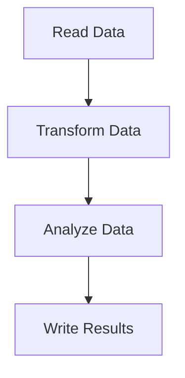

## 18.9.2 High-Performance Data Processing

In this section, we delve into the intricacies of optimizing data processing pipelines in Clojure. As experienced Java developers, you are already familiar with the challenges of handling large datasets efficiently. Clojure offers unique advantages in this domain, particularly through its functional programming paradigm, immutable data structures, and powerful concurrency primitives. We will explore a case study that demonstrates how to leverage these features to build high-performance data processing applications.

### Understanding the Data Processing Pipeline

Before we dive into the optimization techniques, let's first understand the typical structure of a data processing pipeline. A data processing pipeline generally involves the following stages:

1. **Data Ingestion**: Collecting data from various sources.
2. **Data Transformation**: Converting data into a desired format or structure.
3. **Data Analysis**: Extracting insights or performing computations on the data.
4. **Data Output**: Storing or presenting the processed data.

In Clojure, each of these stages can be implemented using functional programming constructs, which provide a clean and efficient way to handle data transformations.

### Case Study: Optimizing a Data Processing Pipeline

Let's consider a case study where we need to process a large dataset of user activity logs. Our goal is to transform these logs into a format suitable for analysis, perform some computations, and then store the results. We'll focus on optimizing the transformation and analysis stages.

#### Initial Implementation

Here's a simple implementation of the data processing pipeline in Clojure:

```clojure
(ns data-pipeline.core
  (:require [clojure.java.io :as io]
            [clojure.data.csv :as csv]))

(defn read-data [file-path]
  ;; Reads CSV data from a file
  (with-open [reader (io/reader file-path)]
    (doall
      (csv/read-csv reader))))

(defn transform-data [data]
  ;; Transforms raw data into a map with keys
  (map (fn [[timestamp user-id action]]
         {:timestamp timestamp
          :user-id user-id
          :action action})
       data))

(defn analyze-data [data]
  ;; Analyzes data to count actions per user
  (reduce (fn [acc {:keys [user-id action]}]
            (update-in acc [user-id action] (fnil inc 0)))
          {}
          data))

(defn write-results [results file-path]
  ;; Writes results to a CSV file
  (with-open [writer (io/writer file-path)]
    (csv/write-csv writer (map (fn [[user-id actions]]
                                 [user-id (pr-str actions)])
                               results))))

(defn process-data [input-file output-file]
  (-> (read-data input-file)
      transform-data
      analyze-data
      (write-results output-file)))

;; Example usage
(process-data "user-logs.csv" "results.csv")
```

**Explanation**: This code reads user activity logs from a CSV file, transforms them into a map format, analyzes the data to count actions per user, and writes the results to another CSV file.

#### Identifying Bottlenecks

To optimize this pipeline, we first need to identify potential bottlenecks. Common performance issues in data processing include:

- **Inefficient Data Structures**: Using data structures that are not optimal for the operations being performed.
- **Excessive Memory Usage**: Holding large datasets in memory unnecessarily.
- **Lack of Concurrency**: Not utilizing available CPU cores effectively.

Let's address these issues one by one.

### Optimizing Data Structures

Clojure's persistent data structures are designed for immutability and efficiency. However, choosing the right data structure for the task is crucial. In our case, we can optimize the `analyze-data` function by using a more efficient data structure for counting actions.

#### Using Transients for Local Mutability

Clojure provides transients, which allow for temporary mutability within a local scope. This can significantly improve performance when building up large collections.

```clojure
(defn analyze-data [data]
  ;; Optimized analysis using transients
  (persistent!
    (reduce (fn [acc {:keys [user-id action]}]
              (let [user-actions (get acc user-id (transient {}))]
                (assoc! acc user-id (assoc! user-actions action (inc (get user-actions action 0))))))
            (transient {})
            data)))
```

**Explanation**: By using transients, we can efficiently update the map of user actions without the overhead of creating new immutable maps at each step.

### Leveraging Concurrency

To fully utilize the available CPU cores, we can parallelize the data processing tasks. Clojure's `pmap` function allows us to apply a function in parallel across a collection.

#### Parallelizing Data Transformation

```clojure
(defn transform-data [data]
  ;; Parallel transformation using pmap
  (pmap (fn [[timestamp user-id action]]
          {:timestamp timestamp
           :user-id user-id
           :action action})
        data))
```

**Explanation**: By using `pmap`, we can transform each log entry in parallel, reducing the overall processing time.

### Efficient Data Transformation with Transducers

Transducers provide a way to compose data transformations without creating intermediate collections. This can lead to more efficient data processing.

```clojure
(defn transform-data [data]
  ;; Efficient transformation using transducers
  (into []
        (comp
          (map (fn [[timestamp user-id action]]
                 {:timestamp timestamp
                  :user-id user-id
                  :action action})))
        data))
```

**Explanation**: Using transducers, we can apply the transformation directly as data is being processed, minimizing memory usage.

### Try It Yourself

Experiment with the following modifications to the code:

- **Change the data structure** used in `analyze-data` to a vector and observe the performance impact.
- **Increase the size of the dataset** and measure the time taken for processing with and without concurrency.
- **Implement additional transformations** using transducers and compare memory usage.

### Visualizing Data Flow

To better understand the flow of data through our optimized pipeline, let's visualize it using a flowchart.



**Caption**: This flowchart illustrates the stages of our data processing pipeline, from reading data to writing results.

### Comparing with Java

In Java, achieving similar optimizations would typically involve using concurrent collections and manually managing thread pools. Clojure's functional approach and built-in concurrency primitives simplify this process significantly.

#### Java Example

Here's a simplified Java version of the data processing pipeline:

```java
import java.io.*;
import java.nio.file.*;
import java.util.*;
import java.util.concurrent.*;
import java.util.stream.*;

public class DataPipeline {

    public static List<String[]> readData(String filePath) throws IOException {
        try (BufferedReader reader = Files.newBufferedReader(Paths.get(filePath))) {
            return reader.lines()
                         .map(line -> line.split(","))
                         .collect(Collectors.toList());
        }
    }

    public static List<Map<String, String>> transformData(List<String[]> data) {
        return data.stream()
                   .map(entry -> Map.of("timestamp", entry[0], "user-id", entry[1], "action", entry[2]))
                   .collect(Collectors.toList());
    }

    public static Map<String, Map<String, Integer>> analyzeData(List<Map<String, String>> data) {
        Map<String, Map<String, Integer>> result = new ConcurrentHashMap<>();
        data.parallelStream().forEach(entry -> {
            String userId = entry.get("user-id");
            String action = entry.get("action");
            result.computeIfAbsent(userId, k -> new ConcurrentHashMap<>())
                  .merge(action, 1, Integer::sum);
        });
        return result;
    }

    public static void writeResults(Map<String, Map<String, Integer>> results, String filePath) throws IOException {
        try (BufferedWriter writer = Files.newBufferedWriter(Paths.get(filePath))) {
            for (var entry : results.entrySet()) {
                writer.write(entry.getKey() + "," + entry.getValue().toString());
                writer.newLine();
            }
        }
    }

    public static void processData(String inputFile, String outputFile) throws IOException {
        List<String[]> rawData = readData(inputFile);
        List<Map<String, String>> transformedData = transformData(rawData);
        Map<String, Map<String, Integer>> analyzedData = analyzeData(transformedData);
        writeResults(analyzedData, outputFile);
    }

    public static void main(String[] args) throws IOException {
        processData("user-logs.csv", "results.csv");
    }
}
```

**Explanation**: This Java code uses parallel streams and concurrent collections to achieve concurrency. While effective, it requires more boilerplate code compared to Clojure's concise and expressive syntax.

### Exercises and Practice Problems

1. **Implement a Filter Stage**: Add a filtering stage to the pipeline that removes logs with certain actions. Measure the performance impact.
2. **Benchmark Different Approaches**: Compare the performance of using `pmap` vs. transducers for data transformation.
3. **Extend the Pipeline**: Add a new stage that aggregates data by time intervals and analyze the performance.

### Key Takeaways

- **Clojure's Immutable Data Structures**: Provide safety and efficiency in concurrent environments.
- **Transients**: Offer a way to optimize performance by allowing local mutability.
- **Concurrency Primitives**: Such as `pmap` and transducers, enable efficient parallel processing.
- **Functional Programming**: Encourages clean and maintainable code, reducing the complexity of data processing pipelines.

By leveraging Clojure's unique features, we can build high-performance data processing applications that are both efficient and easy to maintain. Now that we've explored these optimization techniques, let's apply them to your own data processing challenges and see the improvements firsthand.

## Quiz: Mastering High-Performance Data Processing in Clojure



### Which Clojure feature allows temporary mutability for performance optimization?

- [x] Transients
- [ ] Atoms
- [ ] Refs
- [ ] Agents

> **Explanation:** Transients in Clojure allow for temporary mutability within a local scope, which can improve performance when building up large collections.


### What is the primary benefit of using transducers in Clojure?

- [x] They eliminate intermediate collections.
- [ ] They provide thread safety.
- [ ] They simplify syntax.
- [ ] They enhance error handling.

> **Explanation:** Transducers allow for composing data transformations without creating intermediate collections, leading to more efficient data processing.


### How does Clojure's `pmap` function enhance performance?

- [x] By applying a function in parallel across a collection.
- [ ] By reducing memory usage.
- [ ] By simplifying code syntax.
- [ ] By ensuring data immutability.

> **Explanation:** `pmap` in Clojure applies a function in parallel across a collection, utilizing multiple CPU cores to enhance performance.


### What is a common performance bottleneck in data processing pipelines?

- [x] Inefficient data structures
- [ ] Excessive logging
- [ ] Lack of comments
- [ ] Too many functions

> **Explanation:** Inefficient data structures can lead to performance bottlenecks by increasing memory usage and processing time.


### Which Java feature is used to achieve concurrency similar to Clojure's `pmap`?

- [x] Parallel streams
- [ ] Synchronized blocks
- [ ] Executors
- [ ] Volatile variables

> **Explanation:** Java's parallel streams allow for concurrent processing of collections, similar to Clojure's `pmap`.


### What is the role of the `analyze-data` function in the Clojure pipeline?

- [x] To count actions per user
- [ ] To read data from a file
- [ ] To transform data into a map
- [ ] To write results to a file

> **Explanation:** The `analyze-data` function in the Clojure pipeline is responsible for counting actions per user.


### Which Clojure construct is used to compose data transformations efficiently?

- [x] Transducers
- [ ] Agents
- [ ] Vars
- [ ] Futures

> **Explanation:** Transducers in Clojure are used to compose data transformations efficiently without creating intermediate collections.


### How can you visualize the flow of data in a processing pipeline?

- [x] Using a flowchart
- [ ] Writing detailed comments
- [ ] Creating a class diagram
- [ ] Using a sequence diagram

> **Explanation:** A flowchart is an effective way to visualize the flow of data through a processing pipeline.


### What is a key advantage of Clojure's functional programming paradigm in data processing?

- [x] Clean and maintainable code
- [ ] Faster compilation times
- [ ] Easier debugging
- [ ] More verbose syntax

> **Explanation:** Clojure's functional programming paradigm encourages clean and maintainable code, which is beneficial in data processing.


### True or False: Transients in Clojure are immutable.

- [ ] True
- [x] False

> **Explanation:** Transients in Clojure are not immutable; they allow for temporary mutability within a local scope to optimize performance.


