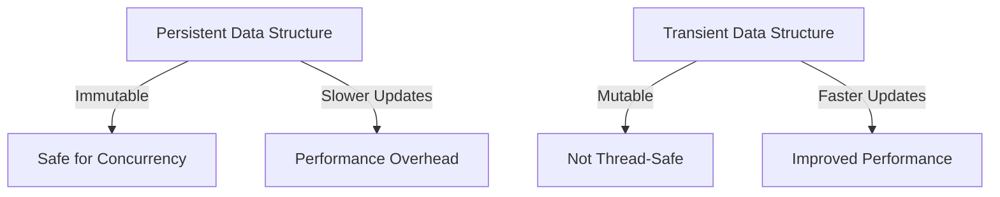
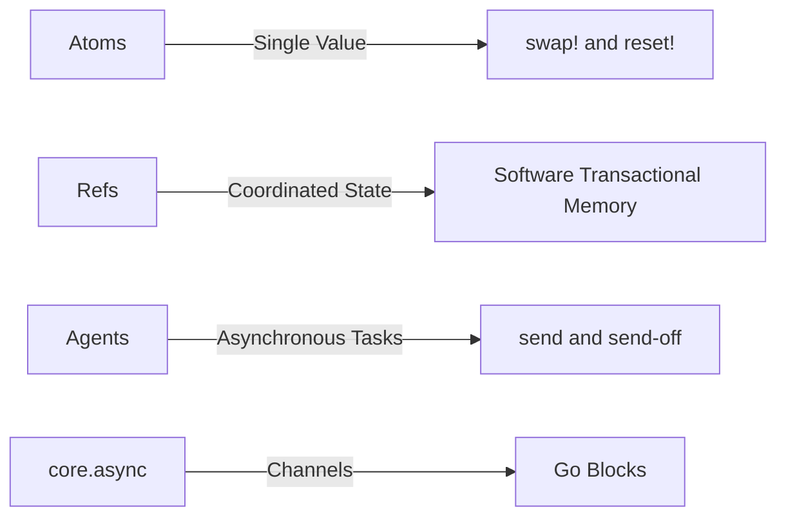

## 18.9.3 Lessons Learned

In this section, we distill the key lessons from our performance optimization case studies, focusing on the critical aspects of measuring performance, understanding the root causes of issues, and applying targeted optimizations. As experienced Java developers transitioning to Clojure, these insights will help you leverage Clojure's unique features to enhance application performance effectively.

### The Importance of Measurement

One of the most significant lessons learned is the paramount importance of measurement in performance optimization. Without accurate measurements, any optimization efforts are akin to shooting in the dark. In Clojure, as in Java, profiling tools and metrics are indispensable for identifying bottlenecks and understanding application behavior.

#### Profiling Tools and Techniques

Clojure developers can utilize a variety of profiling tools to gather performance data. Tools like [VisualVM](https://visualvm.github.io/) and [YourKit](https://www.yourkit.com/) provide insights into CPU and memory usage, helping to pinpoint inefficiencies.

```clojure
;; Example of using a simple timing function in Clojure
(defn time-execution [f & args]
  (let [start (System/nanoTime)
        result (apply f args)
        end (System/nanoTime)]
    (println "Execution time:" (/ (- end start) 1e6) "ms")
    result))

;; Usage
(time-execution (fn [x] (reduce + (range x))) 1000000)
```

**Try It Yourself:** Modify the `time-execution` function to measure the performance of different Clojure functions, such as `map`, `filter`, or custom algorithms.

### Understanding the Problem

Once measurements are in place, the next step is to thoroughly understand the problem. This involves analyzing the data collected to identify patterns and potential causes of performance issues. In Clojure, this often means examining how data structures and functions are used.

#### Data Structures and Immutability

Clojure's persistent data structures are a double-edged sword. While they provide immutability and thread safety, they can introduce overhead if not used judiciously. Understanding when to use persistent data structures versus transients can significantly impact performance.

```clojure
;; Example of using transient data structures for performance
(defn sum-transient [coll]
  (reduce + (persistent! (reduce conj! (transient []) coll))))

;; Usage
(sum-transient (range 1000000))
```

**Diagram: Persistent vs. Transient Data Structures**



*Caption:* This diagram illustrates the trade-offs between persistent and transient data structures in Clojure.

### Applying Targeted Optimizations

With a clear understanding of the problem, targeted optimizations can be applied. These optimizations should be specific to the identified bottlenecks and leverage Clojure's strengths, such as its concurrency primitives and functional programming paradigms.

#### Concurrency and Parallelism

Clojure's concurrency model, which includes atoms, refs, agents, and core.async, offers powerful tools for optimizing performance in multi-threaded environments. Understanding when and how to use these tools is crucial for effective optimization.

```clojure
;; Example of using pmap for parallel processing
(defn parallel-sum [coll]
  (reduce + (pmap #(* % %) coll)))

;; Usage
(parallel-sum (range 1000000))
```

**Diagram: Concurrency Primitives in Clojure**



*Caption:* This diagram outlines the concurrency primitives available in Clojure and their primary use cases.

### Comparing with Java

For Java developers, understanding the differences and similarities between Java and Clojure is essential for effective optimization. While Java provides robust concurrency mechanisms, Clojure's functional approach and immutability offer unique advantages.

#### Java vs. Clojure: Concurrency

In Java, concurrency is often managed through synchronized blocks and concurrent collections. Clojure, on the other hand, encourages a more declarative approach with its concurrency primitives, reducing the risk of common pitfalls like deadlocks and race conditions.

```java
// Java example of using synchronized blocks
public class Counter {
    private int count = 0;

    public synchronized void increment() {
        count++;
    }

    public synchronized int getCount() {
        return count;
    }
}
```

```clojure
;; Clojure example using an atom
(def counter (atom 0))

(defn increment-counter []
  (swap! counter inc))

(increment-counter)
@counter
```

**Try It Yourself:** Experiment with converting Java concurrency code to Clojure, using atoms, refs, or agents to manage state.

### Key Takeaways

- **Measure First:** Always start with accurate measurements to identify performance bottlenecks.
- **Understand the Problem:** Analyze data to understand the root causes of performance issues.
- **Targeted Optimizations:** Apply optimizations that leverage Clojure's strengths, such as immutability and concurrency primitives.
- **Compare and Contrast:** Use your Java knowledge to understand the differences and similarities, applying best practices from both languages.
- **Experiment and Iterate:** Continuously experiment with different approaches and iterate on your solutions.

### Exercises and Practice Problems

1. **Profiling Exercise:** Use a profiling tool to analyze a Clojure application and identify the top three performance bottlenecks.
2. **Data Structure Challenge:** Convert a Java program using mutable collections to Clojure, utilizing persistent data structures and transients where appropriate.
3. **Concurrency Task:** Implement a multi-threaded application in Clojure using agents and compare its performance with a Java equivalent using synchronized blocks.
4. **Optimization Project:** Take a small Clojure project and apply targeted optimizations, documenting the performance improvements achieved.

By applying these lessons, you can optimize Clojure applications effectively, leveraging its unique features to build high-performance systems. Now that we've explored these key insights, let's apply them to your projects and continue to refine your skills in Clojure performance optimization.

## Quiz: Mastering Performance Optimization in Clojure



### What is the first step in performance optimization?

- [x] Measure performance accurately
- [ ] Apply optimizations immediately
- [ ] Rewrite the entire codebase
- [ ] Use the latest hardware

> **Explanation:** Accurate measurement is crucial to identify performance bottlenecks before applying any optimizations.

### Which Clojure data structure is not thread-safe but offers faster updates?

- [ ] Persistent data structures
- [x] Transient data structures
- [ ] Atoms
- [ ] Refs

> **Explanation:** Transient data structures are mutable and offer faster updates but are not thread-safe.

### What is a key advantage of using Clojure's concurrency primitives over Java's synchronized blocks?

- [x] Reduced risk of deadlocks
- [ ] Easier to write
- [ ] Better integration with databases
- [ ] Faster execution

> **Explanation:** Clojure's concurrency primitives reduce the risk of deadlocks and race conditions by providing a more declarative approach.

### Which tool can be used for profiling Clojure applications?

- [x] VisualVM
- [ ] Eclipse
- [ ] NetBeans
- [ ] IntelliJ IDEA

> **Explanation:** VisualVM is a popular tool for profiling JVM applications, including those written in Clojure.

### What is the purpose of the `pmap` function in Clojure?

- [x] Parallel processing
- [ ] Sequential mapping
- [ ] Data serialization
- [ ] Error handling

> **Explanation:** `pmap` is used for parallel processing of collections in Clojure.

### Which Clojure feature helps manage state changes in a functional way?

- [ ] Mutable variables
- [x] Atoms
- [ ] Loops
- [ ] Classes

> **Explanation:** Atoms in Clojure provide a way to manage state changes functionally and safely.

### What is a common pitfall when optimizing without measurement?

- [x] Optimizing the wrong part of the code
- [ ] Improving performance significantly
- [ ] Reducing code complexity
- [ ] Enhancing readability

> **Explanation:** Without measurement, there's a risk of optimizing parts of the code that don't significantly impact performance.

### What is a benefit of using persistent data structures in Clojure?

- [x] Immutability and thread safety
- [ ] Faster updates
- [ ] Less memory usage
- [ ] Simpler syntax

> **Explanation:** Persistent data structures in Clojure are immutable and thread-safe, which is beneficial for concurrency.

### How does Clojure's `swap!` function work with atoms?

- [x] It applies a function to update the atom's value
- [ ] It resets the atom to a new value
- [ ] It locks the atom for exclusive access
- [ ] It deletes the atom

> **Explanation:** `swap!` applies a function to the current value of an atom to produce a new value.

### True or False: Transient data structures in Clojure are safe for concurrent use.

- [ ] True
- [x] False

> **Explanation:** Transient data structures are not thread-safe and should not be used in concurrent environments.


