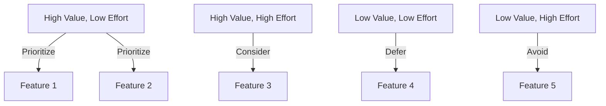
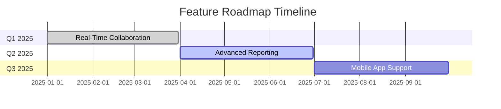

## 19.10.1 Feature Roadmap

In the dynamic world of software development, a well-defined feature roadmap is crucial for guiding the evolution of an application. This roadmap serves as a strategic plan that outlines potential new features and enhancements, prioritizing them based on user feedback, business value, and technical feasibility. For developers transitioning from Java to Clojure, understanding how to effectively plan and implement these features in a full-stack application is essential. In this section, we will explore the process of creating a feature roadmap for a Clojure-based application, drawing parallels to Java development where applicable.

### Understanding the Importance of a Feature Roadmap

A feature roadmap is more than just a list of desired features; it is a strategic tool that aligns the development team's efforts with the overall goals of the business. It helps in:

- **Prioritizing Features**: By evaluating features based on user feedback, business value, and technical feasibility, teams can focus on what truly matters.
- **Aligning Stakeholders**: A roadmap communicates the development plan to stakeholders, ensuring everyone is on the same page.
- **Guiding Development**: It provides a clear path for developers, helping them understand the sequence and dependencies of features.

### Gathering User Feedback

User feedback is a critical component in shaping the feature roadmap. It provides insights into what users find valuable, what challenges they face, and what improvements they desire. Here are some methods to gather user feedback:

- **Surveys and Questionnaires**: Collect quantitative data on user preferences and satisfaction.
- **User Interviews**: Gain qualitative insights through direct conversations with users.
- **Analytics Tools**: Use tools like Google Analytics to track user behavior and identify patterns.
- **Feedback Forms**: Implement feedback forms within the application to capture user suggestions.

### Evaluating Business Value

Each feature should be evaluated for its potential business value. This involves assessing how a feature can contribute to the organization's goals, such as increasing revenue, improving user retention, or enhancing brand reputation. Consider the following factors:

- **Market Demand**: Is there a high demand for this feature in the market?
- **Competitive Advantage**: Will this feature differentiate the application from competitors?
- **Revenue Potential**: Can this feature directly or indirectly increase revenue?

### Assessing Technical Feasibility

Technical feasibility involves evaluating whether a feature can be realistically implemented given the current technical constraints and resources. This includes:

- **Complexity**: How complex is the feature to implement?
- **Dependencies**: Are there any dependencies on other features or systems?
- **Resource Availability**: Do we have the necessary skills and resources to implement this feature?

### Prioritizing Features

Once user feedback, business value, and technical feasibility have been assessed, features can be prioritized. A common approach is to use a prioritization matrix, which plots features based on their value and effort required. Features that offer high value with low effort should be prioritized.



*Diagram: Prioritization Matrix for Feature Roadmap*

### Developing the Feature Roadmap

With prioritized features, the next step is to develop the feature roadmap. This roadmap should be a living document that evolves as new information becomes available. It typically includes:

- **Feature Descriptions**: A brief description of each feature.
- **Priority Level**: The priority level of each feature (e.g., high, medium, low).
- **Estimated Timeline**: An estimated timeline for when each feature will be implemented.
- **Dependencies**: Any dependencies that must be addressed before a feature can be implemented.

### Example Feature Roadmap for a Clojure-Based Application

Let's consider an example feature roadmap for a Clojure-based full-stack application. This application is a web-based project management tool that helps teams collaborate and manage tasks effectively.

#### Feature 1: Real-Time Collaboration

- **Description**: Enable real-time collaboration on tasks and projects, allowing multiple users to edit and comment simultaneously.
- **Priority Level**: High
- **Estimated Timeline**: Q1 2025
- **Dependencies**: Requires implementation of WebSockets for real-time communication.

**Clojure Code Example: Implementing WebSockets**

```clojure
(ns project-management.websocket
  (:require [org.httpkit.server :as http-kit]))

(defn websocket-handler [req]
  (http-kit/with-channel req channel
    (http-kit/on-receive channel
      (fn [message]
        ;; Broadcast message to all connected clients
        (doseq [client @clients]
          (http-kit/send! client message))))))

(def clients (atom #{}))

(defn start-server []
  (http-kit/run-server websocket-handler {:port 8080}))

(comment
  ;; Start the WebSocket server
  (start-server))
```

*Comment: This code sets up a simple WebSocket server using the `http-kit` library, allowing real-time communication between clients.*

#### Feature 2: Advanced Reporting and Analytics

- **Description**: Provide advanced reporting and analytics features to help teams track progress and identify bottlenecks.
- **Priority Level**: Medium
- **Estimated Timeline**: Q2 2025
- **Dependencies**: Integration with a data visualization library.

**Clojure Code Example: Generating Reports**

```clojure
(ns project-management.reports
  (:require [clojure.data.csv :as csv]
            [clojure.java.io :as io]))

(defn generate-report [data]
  (with-open [writer (io/writer "report.csv")]
    (csv/write-csv writer data)))

(comment
  ;; Example data
  (generate-report [["Task" "Status"]
                    ["Design" "Completed"]
                    ["Development" "In Progress"]]))
```

*Comment: This code generates a CSV report using the `clojure.data.csv` library, which can be used for further analysis.*

#### Feature 3: Mobile Application Support

- **Description**: Develop a mobile application to provide users with access to the tool on the go.
- **Priority Level**: High
- **Estimated Timeline**: Q3 2025
- **Dependencies**: Requires a RESTful API for mobile app integration.

**Clojure Code Example: Creating a RESTful API**

```clojure
(ns project-management.api
  (:require [compojure.core :refer :all]
            [ring.adapter.jetty :refer [run-jetty]]))

(defroutes app-routes
  (GET "/tasks" [] "List of tasks")
  (POST "/tasks" [] "Create a new task"))

(defn start-api []
  (run-jetty app-routes {:port 3000}))

(comment
  ;; Start the RESTful API server
  (start-api))
```

*Comment: This code sets up a basic RESTful API using the `compojure` library, which can be extended for mobile app integration.*

### Try It Yourself

To deepen your understanding, try modifying the code examples provided:

- **WebSockets**: Extend the WebSocket server to handle different types of messages, such as notifications or file uploads.
- **Reports**: Add functionality to filter and sort the report data before generating the CSV file.
- **RESTful API**: Implement additional endpoints for updating and deleting tasks, and test them using a tool like Postman.

### Visualizing the Roadmap

To effectively communicate the feature roadmap to stakeholders, consider using visual tools like Gantt charts or timelines. These tools can help illustrate the sequence and timing of feature implementations.



*Diagram: Gantt Chart Representing the Feature Roadmap Timeline*

### Challenges and Considerations

While developing a feature roadmap, several challenges may arise:

- **Changing Requirements**: User needs and business goals may evolve, requiring adjustments to the roadmap.
- **Resource Constraints**: Limited resources may impact the feasibility and timeline of feature implementations.
- **Technical Debt**: Accumulating technical debt can hinder the development of new features.

### Exercises and Practice Problems

1. **Feature Prioritization Exercise**: Given a list of potential features, use a prioritization matrix to determine their order of implementation.
2. **User Feedback Analysis**: Analyze a set of user feedback data to identify common themes and suggest feature improvements.
3. **Technical Feasibility Assessment**: Evaluate the technical feasibility of a proposed feature, considering complexity, dependencies, and resource availability.

### Key Takeaways

- A feature roadmap is a strategic tool that guides the development of an application by prioritizing features based on user feedback, business value, and technical feasibility.
- Gathering user feedback, evaluating business value, and assessing technical feasibility are crucial steps in developing a feature roadmap.
- Visual tools like prioritization matrices and Gantt charts can help communicate the roadmap to stakeholders.
- Regularly revisiting and updating the roadmap ensures it remains aligned with evolving user needs and business goals.

By understanding and applying these principles, developers can effectively plan and implement features in a Clojure-based full-stack application, leveraging their Java experience to navigate the transition smoothly.

## Quiz: Mastering Feature Roadmaps in Clojure Full-Stack Development



### What is the primary purpose of a feature roadmap?

- [x] To align development efforts with business goals
- [ ] To list all possible features without prioritization
- [ ] To replace user feedback with developer intuition
- [ ] To eliminate the need for stakeholder communication

> **Explanation:** A feature roadmap aligns development efforts with business goals by prioritizing features based on user feedback, business value, and technical feasibility.

### Which method is NOT typically used to gather user feedback?

- [ ] Surveys and Questionnaires
- [ ] User Interviews
- [ ] Analytics Tools
- [x] Developer Brainstorming Sessions

> **Explanation:** Developer brainstorming sessions are not a direct method for gathering user feedback; they are more about generating ideas internally.

### What is a key factor in evaluating the business value of a feature?

- [ ] Complexity
- [x] Market Demand
- [ ] Technical Dependencies
- [ ] Resource Availability

> **Explanation:** Market demand is a key factor in evaluating the business value of a feature, as it indicates the potential impact on the market and user base.

### What does technical feasibility NOT involve?

- [ ] Complexity
- [ ] Dependencies
- [ ] Resource Availability
- [x] User Satisfaction

> **Explanation:** Technical feasibility focuses on the complexity, dependencies, and resource availability for implementing a feature, not user satisfaction.

### In a prioritization matrix, which features should be prioritized?

- [x] High Value, Low Effort
- [ ] High Value, High Effort
- [ ] Low Value, Low Effort
- [ ] Low Value, High Effort

> **Explanation:** Features that offer high value with low effort should be prioritized, as they provide the most benefit for the least amount of work.

### What is a common challenge when developing a feature roadmap?

- [ ] User Feedback
- [ ] Business Value
- [x] Changing Requirements
- [ ] Technical Feasibility

> **Explanation:** Changing requirements can be a common challenge, as they may require adjustments to the roadmap to stay aligned with user needs and business goals.

### Which visual tool can help illustrate the sequence and timing of feature implementations?

- [ ] Bar Chart
- [ ] Pie Chart
- [x] Gantt Chart
- [ ] Line Graph

> **Explanation:** A Gantt chart is a visual tool that can help illustrate the sequence and timing of feature implementations in a roadmap.

### What is the role of a feature description in a roadmap?

- [x] To provide a brief overview of each feature
- [ ] To detail the technical implementation of each feature
- [ ] To list all potential issues with each feature
- [ ] To replace user feedback with developer intuition

> **Explanation:** A feature description provides a brief overview of each feature, helping stakeholders understand its purpose and scope.

### What should be regularly revisited and updated to ensure alignment with evolving needs?

- [ ] User Feedback
- [ ] Business Value
- [ ] Technical Feasibility
- [x] Feature Roadmap

> **Explanation:** Regularly revisiting and updating the feature roadmap ensures it remains aligned with evolving user needs and business goals.

### True or False: A feature roadmap eliminates the need for stakeholder communication.

- [ ] True
- [x] False

> **Explanation:** A feature roadmap does not eliminate the need for stakeholder communication; rather, it facilitates it by providing a clear plan for development.


