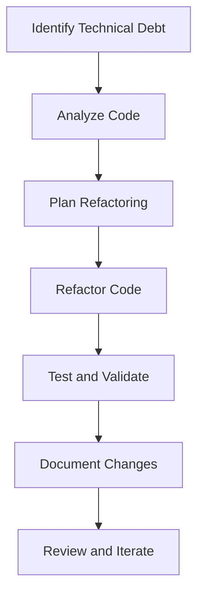

## 19.10.2 Technical Debt and Refactoring

As we delve into the world of Clojure, particularly in the context of building full-stack applications, it's crucial to address the inevitable accumulation of technical debt. This section will guide you through identifying, managing, and refactoring technical debt in Clojure applications, drawing parallels to Java where applicable. We'll explore how to improve code maintainability, performance, and scalability, ensuring that your Clojure projects remain robust and adaptable.

### Understanding Technical Debt

**Technical debt** refers to the implied cost of additional rework caused by choosing an easy solution now instead of using a better approach that would take longer. It's a concept familiar to Java developers, often arising from rushed development, lack of documentation, or evolving requirements.

#### Types of Technical Debt

1. **Deliberate Debt**: Decisions made to meet deadlines, with a plan to refactor later.
2. **Accidental Debt**: Unintentional, often due to lack of knowledge or oversight.
3. **Bit Rot**: Code that degrades over time due to changes in dependencies or technology.

### Identifying Technical Debt in Clojure

In Clojure, technical debt can manifest in several ways:

- **Complex Macros**: Overuse or misuse of macros can lead to hard-to-read code.
- **Inefficient Data Structures**: Using inappropriate data structures can degrade performance.
- **Poorly Designed APIs**: APIs that are difficult to use or extend.
- **Lack of Documentation**: Missing or outdated documentation makes maintenance challenging.

#### Code Smells in Clojure

Just as in Java, certain "code smells" can indicate technical debt in Clojure:

- **Excessive Use of `def`**: Overusing global definitions can lead to namespace pollution.
- **Nested Anonymous Functions**: Deeply nested functions can reduce readability.
- **Overuse of Dynamic Vars**: Can lead to unpredictable behavior and difficult debugging.

### Refactoring Strategies

Refactoring is the process of restructuring existing code without changing its external behavior. In Clojure, refactoring focuses on improving code readability, reducing complexity, and enhancing performance.

#### Refactoring Techniques

1. **Simplify Macros**: Ensure macros are necessary and simplify them where possible.
2. **Use Destructuring**: Leverage Clojure's destructuring to simplify function arguments.
3. **Leverage Higher-Order Functions**: Replace repetitive code with higher-order functions.
4. **Optimize Data Structures**: Use persistent data structures for efficiency.

#### Example: Refactoring a Clojure Function

Let's refactor a Clojure function to improve readability and performance.

**Before Refactoring:**

```clojure
(defn process-data [data]
  (let [result (map (fn [item]
                      (let [processed (do-something item)]
                        (if (valid? processed)
                          (transform processed)
                          nil)))
                    data)]
    (filter some? result)))
```

**After Refactoring:**

```clojure
(defn process-data [data]
  (->> data
       (map do-something)
       (filter valid?)
       (map transform)))
```

*Explanation*: We used the threading macro `->>` to streamline the data processing pipeline, improving readability and reducing nesting.

### Comparing Clojure and Java Refactoring

Java developers transitioning to Clojure will find some familiar refactoring concepts, but with a functional twist:

- **Immutability**: Unlike Java, Clojure's immutable data structures reduce the need for defensive copying.
- **Function Composition**: Clojure encourages composing small functions, akin to Java's method chaining.
- **Macros vs. Annotations**: Clojure's macros offer powerful metaprogramming capabilities, similar to Java annotations but more flexible.

### Managing Technical Debt

Managing technical debt involves regular assessment and prioritization. Here are some strategies:

1. **Code Reviews**: Regular reviews help identify potential debt early.
2. **Automated Testing**: Ensures refactoring doesn't introduce bugs.
3. **Documentation**: Keep documentation up-to-date to aid future refactoring efforts.
4. **Continuous Refactoring**: Integrate refactoring into the development process.

### Tools for Refactoring in Clojure

Several tools can assist in identifying and refactoring technical debt in Clojure:

- **Eastwood**: A lint tool for Clojure that identifies potential issues.
- **Kibit**: Suggests idiomatic Clojure code improvements.
- **CIDER**: An Emacs package that provides a powerful interactive development environment for Clojure.

### Try It Yourself: Refactor a Clojure Project

1. **Identify a Function**: Choose a function in your project that could be simplified.
2. **Apply Refactoring Techniques**: Use the strategies discussed to refactor the function.
3. **Test Your Changes**: Ensure the refactored function behaves as expected.

### Visualizing Refactoring with Diagrams

Below is a flowchart illustrating the refactoring process in Clojure:



*Diagram Description*: This flowchart outlines the steps in the refactoring process, from identifying technical debt to reviewing and iterating on changes.

### Further Reading and Resources

- [Official Clojure Documentation](https://clojure.org/reference/documentation)
- [ClojureDocs](https://clojuredocs.org/)
- [Refactoring: Improving the Design of Existing Code](https://martinfowler.com/books/refactoring.html) by Martin Fowler

### Exercises

1. **Refactor a Nested Function**: Choose a nested function in your codebase and refactor it using threading macros.
2. **Optimize Data Structures**: Identify a part of your application using inefficient data structures and refactor it for better performance.
3. **Simplify a Macro**: Find a complex macro and refactor it to improve readability and maintainability.

### Key Takeaways

- **Technical Debt** is an inevitable part of software development but can be managed effectively with regular refactoring.
- **Refactoring** in Clojure focuses on simplifying code, leveraging functional programming principles, and optimizing data structures.
- **Tools and Practices** such as code reviews, automated testing, and documentation are essential for managing technical debt.
- **Continuous Improvement** is key to maintaining a healthy codebase and ensuring long-term project success.

By embracing these strategies, you'll be well-equipped to manage technical debt in your Clojure projects, ensuring they remain maintainable, performant, and scalable.

## Quiz: Mastering Technical Debt and Refactoring in Clojure



### What is technical debt?

- [x] The implied cost of additional rework caused by choosing an easy solution now instead of a better approach that would take longer.
- [ ] The cost of purchasing new software tools.
- [ ] The financial debt incurred by a company.
- [ ] The cost of hiring new developers.

> **Explanation:** Technical debt refers to the implied cost of additional rework caused by choosing an easy solution now instead of a better approach that would take longer.

### Which of the following is a type of technical debt?

- [x] Deliberate Debt
- [ ] Financial Debt
- [ ] Unintentional Debt
- [ ] Accidental Debt

> **Explanation:** Deliberate debt is a type of technical debt where decisions are made to meet deadlines, with a plan to refactor later.

### What is a common code smell in Clojure?

- [x] Excessive Use of `def`
- [ ] Overuse of Classes
- [ ] Lack of Interfaces
- [ ] Too Many Annotations

> **Explanation:** Excessive use of `def` can lead to namespace pollution and is considered a code smell in Clojure.

### What is the purpose of refactoring?

- [x] To improve code readability, reduce complexity, and enhance performance.
- [ ] To add new features to the codebase.
- [ ] To increase the number of lines of code.
- [ ] To delete old code.

> **Explanation:** Refactoring is the process of restructuring existing code without changing its external behavior to improve readability, reduce complexity, and enhance performance.

### Which tool is used for linting in Clojure?

- [x] Eastwood
- [ ] Maven
- [ ] Gradle
- [ ] JUnit

> **Explanation:** Eastwood is a lint tool for Clojure that identifies potential issues in the code.

### What is a benefit of using threading macros in Clojure?

- [x] They improve readability by reducing nesting.
- [ ] They increase the execution speed of the code.
- [ ] They add more lines of code.
- [ ] They make the code harder to understand.

> **Explanation:** Threading macros improve readability by reducing nesting and making the code more linear and easier to follow.

### How can technical debt be managed effectively?

- [x] Through regular code reviews and continuous refactoring.
- [ ] By ignoring it until it becomes a problem.
- [ ] By adding more features to the codebase.
- [ ] By hiring more developers.

> **Explanation:** Technical debt can be managed effectively through regular code reviews and continuous refactoring to ensure the codebase remains maintainable.

### What is a common refactoring technique in Clojure?

- [x] Using higher-order functions to replace repetitive code.
- [ ] Adding more classes and interfaces.
- [ ] Increasing the number of global variables.
- [ ] Using more annotations.

> **Explanation:** Using higher-order functions to replace repetitive code is a common refactoring technique in Clojure.

### What is the role of documentation in managing technical debt?

- [x] It helps future refactoring efforts by keeping information up-to-date.
- [ ] It increases the complexity of the codebase.
- [ ] It is not necessary for managing technical debt.
- [ ] It only serves as a legal requirement.

> **Explanation:** Documentation helps future refactoring efforts by keeping information up-to-date and making the codebase easier to understand.

### True or False: Refactoring changes the external behavior of the code.

- [ ] True
- [x] False

> **Explanation:** Refactoring involves restructuring existing code without changing its external behavior.


